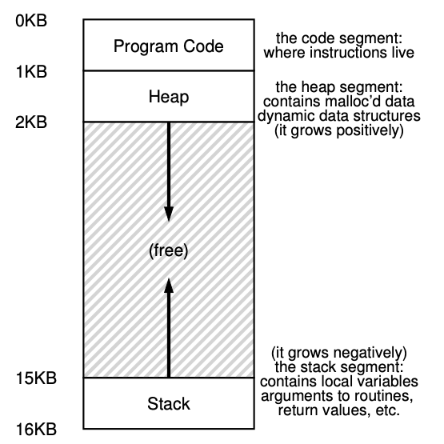
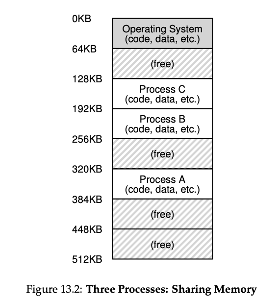

# Address Space

- Address space for a process
  - Contains
    - Code: the instructions
    - Stack
      - Grows due to function calls, etc.
      - The program, while it is running, uses a stack to keep track of where it is in the function call chain as well as to allocate local variables and pass parameters and return values to and from routines.
    - Heap: heap is used for dynamically-allocated, user-managed memory
  - Why placing the stack and heap like this?
    - Each wishes to grow
      - 
      - Stack: Local Variables, Function Call Information
      - Data: Global Variables, Static Variables
  - The heap thus starts just after the code (at 1KB) and grows downward (say when a ser requests more memory via `malloc()`); the stack starts at 16KB and grows upward (say when a user makes a procedure call).
- Goals:
  - The address space of a process contains all of the memory state of the running program.
  - Transparency
    - Should behave as if it has its own private physical memory
    - OS does multiplexing among different jobs
      - 

# Address Translation

- Virtualizing memory: **hardware-based address translation**

  - Hardware transforms each memory access (e.g. instruction fetch, load, or store), changing the **virtual address** provided by the instruction to a **physical address** where the desired information is actually located
- Dynamic (Hardware-based) Relocation, or Base and Bounds
  - PA = VA + base. VA + base has to compare with bounds. 
  - Need two hardware registers within each CPU
    - Hardware structures kept on the chip (one pair per CPU)
      - The part that helps with address translation: **memory management unit (MMU)**
    - **Base** register: Translation
    - **Bounds** (or limit) register
      - Protection: “size” of the address space, and physical address of the end of address space
    - **Base and bounds**
      - Place the address space anywhere we like in physical memory
      - While ensure each process can only access its own address space
  - Memory reference is translated by the processor in this manner: `physical address = virtual address + base`
  - CPU is able to generate exceptions when user program tries to access memory illegally —> arrange for OS exception handler to run
    - in this case, the CPU should stop executing the user program and arrange for the OS “out-of-bounds” exception handler to run.
    - Similarly, if a user program tries to change the values of the (privileged) base and bounds registers, the CPU should raise an exception and run the “tried to execute a privileged operation while in user mode” handler. These instructions require kernel (privileged) mode.
  - When a new process is created, the OS will have to search a data structure (often called a **free list**) to find room for the new address space and then mark it used.
  - The OS must save and restore the base-and-bounds pair when it switches between processes.
    - In per-process structure such as process control block (PCB).
    - To move a process’s address space, the OS first deschedules the process; then, the OS copies the address space from the current location to the new location; finally, the OS updates the saved base register (in the process structure) to point to the new location.
- Some inefficiency of base-and-bounds
  - **Internal fragmentation** (space inside the allocated unit is not all used)
    - Unallocated space between stack and heap. 
  - Slight generalization of base and bounds: segmentation (next)

# Segmentation

- Summary
  - Segmentation helps us build a more effective virtualization of memory
    - Enable code sharing (protection bits, later)
    - Better support sparse address spaces
  - Cons
    - External fragmentation: allocate variable-sized segments chop up free memory into odd-sized pieces
    - Not flexible enough to support fully generalized, sparse address space
      - if our model of how the address space is being used doesn’t match how the segmentation has been designed, segmentation doesn’t work very well
- Instead of having just one base and bounds pair in MMU, have a base-and-bound pair per **logical segment** of the address space
- Three logically-different segments: code, stack, and heap
- The term **segmentation fault** or violation arises from a memory access on a segmented machine to an illegal address.
- How is it better?
  - Allows OS to place each one of those segments in different parts in physical memory
  - Avoid filling physical memory with unused virtual address space
- Large address spaces with large amounts of unused address space (**sparse address spaces**) can be accommodated

## 1: Explicit approach: chop up addr space into segments based on top few bits of vaddr

- 3 segments —> 2 bits
- (01): which segment, bottom 12 bits: offset into the segment (easier for bound checking)
- Issues
  - One bit unused: some system also put code in the same segment as the heap (one bit)
  - Limits use of address space: each segment is limited to a maximum size
- The next 12 bits will be the offset into the segment.
- If a running program wishes to grow a segment (say the heap, or the stack) beyond that maximum, the program is out of luck.

## #2: Implicit approach: hardware determines the segment by noticing how the address was formed

- addr generated from PC (i.e. instruction fetch), then the addr is within code segment
- addr based off of the stack or base pointer, then it is in stack segment

### What about the stack under segmentation?

- stack grows backward (towards lower addresses)
- hardware support: a bit to know which way it grows

### Support for sharing

- Idea: share certain memory segments between address space (i.e. code sharing)
- hardware support: `protection bits`
  - few bits per segment: R/W/Execute permission

### Fine-grained v.s Coarse-grained Segmentation

- Coarse-grained: a few segments like code, stack, heap
- Fine-grained: early systems, large # of smaller segments
  - Need **segment table** of some kind stored in memory
  - OS Support
- Context switch?
  - Segment registers must be saved and restored
- OS interaction when segments grow and shrink?
  - Heap expansion: update segment size
- Managing free space in physical memory?
  - **External fragmentation**
    - Solution: compact physical memory by rearranging existing segments (i.e. stop process, copy data, change register value, etc.)
      - But this is expensive.
    - Solution: free-list management algorithm (e.x. best-fit, worst-fit, first-fit, buddy algorithm)
