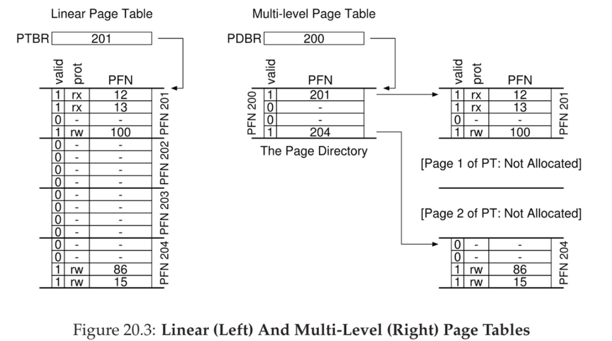
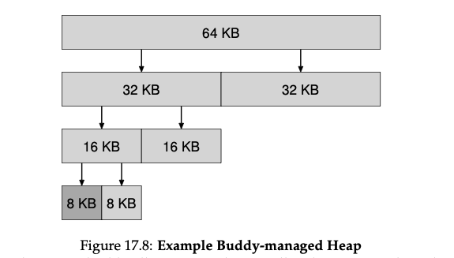

# Paging

* Paging: a new solution to virtualizing memory
  * Correspondingly, we view physical memory as an array of page frames; each of these frames can contain a single virtual-memory page.
  * Naive paging leads to huge space inefficiency when using PT on sparse address. 
* Pros
  * Does not lead to external fragmentation, as it divides memory into fixed-sized units
  * Quite flexible: enable sparse use of virtual addr space
* Cons
  * Slower machine: many extra memory accesses
  * Memory waste: memory filled with page tables instead of useful application data
* OS takes two approaches to deal with space-management
  * Variable-sized pieces: segmentation
    * Cons: space can become fragmented, allocation challenging
  * Fixed-sized pieces: paging
    * Fixed-size unit: **page**
    * Physical memory is an array of fixed-sized slots called **page frames**
* **Page table**
  * **Per-process data structure** to record where each virtual page of the address space is placed in physical memory.
  * **VPN:** virtual page number
  * **Offset:** within the page
  * **Page table register (PTBR)**: contain physical address of starting location of PT
  * Address of page table entry: PTE = PTBR + (VPN * sizeof(PTE))

## Kernel mode is needed!
* Modifying page table base, and segment descriptor tables. Have to transition into Kernel mode before you can change them!
* Also, all page-table pages must be mapped only in kernel mode. 

## Where are page tables stored?

* Page tables can be bigger than small segment tables or base / bounds pairs
* Too large, not store in on-chip hardware in the MMU
* Stored in memory instead
* MMU: stores the base and bound register; as well as TLB.

* **Linear page table**

  * Array
  * OS indexes the page by VPN, then lookup the page table entry (PTE) at that index to find the PFN
  * PTE
    * ***Valid bit:*** indicate whether the particular translation is valid
      * E.x. unused space in-between (code, heap, stack) is invalid, will generate a trap to the OS that likely terminate the process
    * ***Protection bit:*** whether page could be read from, written to, or executed from
      * Accessing a page in a way not allowed will trap
    * ***Present bit:*** whether this page is in physical memory or on disk (i.e. it has been swapped out)
      * E.x. swap parts of addr space to disk to support addr space larger than physical memory
      * Actually no separate valid and present bit, just valid bit
      * P = 0, might be valid or not, then OS use additional structure
    * ***Dirty bit:*** whether the page has been modified since it was brought to memory
    * ***Reference bit:*** track whether a page has been accessed
      * Useful in determine which pages are popular in page replacement
* we can now index our page table and find which physical frame virtual page 1 resides within. In the page table above the physical frame number (PFN) (also sometimes called the physical page number or PPN) is 7 (binary 111).
  * 
* Solution #2: **page + segments**
  * Problem: most of the page table unused, full of invalid entries (e.x. between stack and heap)
  * Approach: one page table per logical segment
    * E.x. code, heap, stack
    * Have base and bound registers in MMU
      * Base: holds physical address of page table
      * Bound: holds the end of page table
* The page directory, in a simple two-level table, contains one entry per page of the page table
  * Page directory entries (PDE)
    * Has a **valid bit** and a **page frame number**
    * Valid bit: if PDE is valid, it means that at least one of the pages of the page table that entry points to (via the PFN) is valid
* Page Fault
* ***Page fault handler***- **Page fault:** the HW looks in the PTE, it may find that page is *not present* in physical memory
  * Upon page fault, **OS is invoked with page-fault handler**
    * Find the page, do I/O from **swap space** (i.e. reserved space on the **disk** for moving pages back and forth)
      * **Swap Space**: reserved space on the **disk** for moving pages back and forth
        * Assume size of swap space is very large
      * The first thing we will need to do is to reserve some space on the disk for moving pages back and forth. In operating systems, **we generally refer to such space as swap space, because we swap pages out of memory to it and swap pages into memory from it.**
        * Thus, we will simply assume that the OS can read from and write to the swap space, in page-sized units. To do so, the OS will need to remember the disk address of a given page.
    * Update page table to mark page as present, record in memory location of the new-fetched page, retry
* Can TLB hit lead to page fault? No. 
  * When a page is swapped out, the TLB entry is invalidated. 

## Advanced

* Trade-off in time and space
* Memory-constrained system: small structures make sense
  * V.s. system with large memory and workloads that use large number of pages, bigger table that speeds up TLB misses might be the right choice
* Array-based (linear) page tables are too big, taking up too much memory on typical systems
* Problem: **internal fragmentation**
  * Bigger page leads to waste within each page
  * Most system use relatively small page size in common case: 4KB (as in x86), 8KB (as in SPARCv9)

### Multi-level Page Tables

* Turns the linear page table to something like a tree
* Many modern systems employ it
* Basic idea
  * Chop up the page table into page-sized units
  * If an entire page of page-table entries (PTEs) is invalid, don’t allocate that page of the page table at all
  * Use **page directory**: track whether a page of the page table is valid
    * Either tell you where a page of the page table is
    * Or that entire directory of the page table contains no valid page
* Pros
  * Only allocate page-table space in proportion to the amount of addr space you are using, generally compact
  * If carefully constructed, each portion of the page table fits neatly within a page, making it easier to manage memory
    * V.s. linear page table, page table reside contiguously in physical memory
    * Here
      * Add level of indirection through page directory, which points to pieces of page table
      * Allow us to place page-table pages wherever we like in physical memory
* Cons
  * On TLB miss, two loads from memory will be required to get the right translation info from page table
    * One to page directory, one to PTE
    * V.s. linear page table: one load
    * **Time-space trade-off**
      * I.e. we want smaller tables, but not for free
      * TLB miss suffers from higher cost with smaller table
  * Complexity
    * Page-table lookups more complicated in order to save valuable memory
* 

### Inverted Page Tables

* 
* Instead of having many page tables (one per process), keep a single page table that has an entry for each physical page in the system
  * Tell us which process is using the page, which virtual page of process maps to that physical page
* Finding the correct entry?
  * Linear scan: expensive
  * Hash table lookup

### Comparison

* 

### Linear Page Table vs. Multi-level Page Table

### TLB

***Translation-lookaside buffer (TLB)***- Part of the chip’s MMU

* Simply a hardware cache of popular **virtual-to-physical** address translation
* Maintain virtual-to-physical translations that are only valid for the current running process
  * Flush on context switches
* Can be software-managed or hardware-managed
  * Software-managed: HW raises exception on TLB miss, jumps to kernel trap handler
* **Hardware-managed TLBs**: hardware handles TLB miss entirely
* HW has to know where the page tables are located in memory (via a page table base register) and their exact format
  * On TLB miss, HW walks the page table, and update TLB with translation, then **retry**
  * If the page is valid and present in physical memory, the hardware extracts the PFN from the PTE, installs it in the TLB, and retries the instruction, this time generating a TLB hit; so far, so good.

* **Software-managed TLB**
  * E.x. RISC
  * On TLB miss, HW raises an exception, which pauses the current instruction stream, raises the privilege level to kernel mode, and jumps to a **trap handler**
  * Note
    * Return-from-trap different from syscall
      * Instead of resume execution at instruction after the trap
      * We want to resume execution at **instruction that caused the trap to retry**
      * HW must save a different PC to resume correctly
    * OS needs to be careful of infinite chain of TLB misses
      * Solution: TLB miss handlers in physical memory, or reserve some entires in the TLB for permanently-valid translations for the handler code
  * Pros
  * Flexibility
    * OS can use any data structure it wants to implement the page table without HW
  * Simplicity
    * HW doesn’t do much on a miss, just raise an exception and OS TLB miss handler do the rest
      * A typical TLB might have 32, 64, or 128 entries and be what is called fully associative. Basically, this just means that any given translation can be anywhere in the TLB, and that the hardware will **search the entire TLB in parallel** to find the desired translation. A TLB entry might look like this:
    * VPN | PFN | other | bits
    * To reduce this overhead, **some systems add hardware support to enable sharing of the TLB across context switches**. In particular, some hardware systems provide an address space identifier (ASID) field in the TLB. You can think of the ASID as a process identifier (PID), but usually it has fewer bits (e.g., 8 bits for the ASID versus 32 bits for a PID)

### NRU (Clock Algorithm)

* Approximate LRU with efficient implementation
* Clock algorithm: replace page that is “old enough”
  * Set of all pages in memory arranged in a circle
  * Single clock hand
  * Advances only on page fault!
  * Check for pages not used recently
  * Mark pages as not used recently.
  * Replace an old page, not the oldest page
* Hardware
  * Keep use (or reference) bit for each page frame
  * When page is referenced: set use bit
* Operating System (page replacement)
  * Keep pointer to last examined page frame
  * Traverse pages in circular buffer
  * Clear use bits as we search
  * Stop when find page with already cleared use bit, replace this page

### Belady's Anomaly

When you add memory the miss rate drops
(stack property)
* FIFO
* Second-chance algorithm.

**Conflict miss**: arise in hardware because of limits on where an item can be placed in a hardware cache, due to set-associativity. It does not arise in OS page cache because caches are always fully-associative (i.e. there are no restrictions on where in memory a page can be placed)
  * Suppose you have 32KB directly-mapped cache. You have 2 small 8k arrays, but unfortunately they are both aligned and map to the same sets. This means that while they could theoretically fit in the cache (if you fix your alignment), they will not utilize the full cache size and instead compete for the same group of sets and thrash each other. These are conflict misses, since the data could fit, but still collides due to organization. 
* OS decides when to bring a page into memory (i.e. page selection policy)
  * Most pages: demand paging, bring in on-demand
  * Demand paging is a technique used in virtual memory systems where pages enter main memory only when requested or needed by the CPU. In demand paging, the operating system loads only the necessary pages of a program into memory at runtime, instead of loading the entire program into memory at the start. A page fault occurred when the program needed to access a page that is not currently in memory.
  * Prefetching: i.e. page P is brought into memory, code P + 1 will likely soon be accessed
* OS decides how to write pages out to disk
  * One at a time v.s clustering (or grouping)

### VAX / VMS second-chance list

* Problem addressed:
  * no reference bit
  * memory hogs can happen (i.e. programs use a lot of memory and make it hard for other programs to run)

* Key features (approximate LRU):
  * Resident set size (RSS): each process allocated a fixed # of page frames, pages are managed in FIFO
  * Two second-chance list: before completely evicting a page from memory, it is put into two second chance list
  * 

* clean-page free list: hold pages that have not been modified since they were last loaded
  * One interesting approach that has been around for some time is the use of segregated lists. The basic idea is simple: if a particular application has one (or a few) popular-sized request that it makes, keep a separate list just to manage objects of that size; all other requests are forwarded to a more general memory allocator.
  * dirty-page list: modified

* When a process exceeds RSS:
  * the oldest page is taken from process’s FIFO list
  * if clean, placed at clean-page list, if dirty, go to dirty-page list

* When a process need to add a new page
  * first look at free page from clean list
  * if process faults on a page that was moved to one of the second-chance list, it can reclaim it, avoid disk access

– Intuition: First referenced long time ago, done with it now
– Advantages: Fair: All pages receive equal residency; Easy to implement
– Disadvantage: Some pages may always be needed

## Page Allocator

Buddy Managed Heap- 

* By using a buddy system, the allocator can quickly find a free block of memory of a given size, and can also quickly **coalesce** free blocks of memory when they are freed.
* You might have noticed that the interface to `free(void *ptr)` does not take a size parameter; thus it is assumed that given a pointer, the malloc library can quickly determine the size of the region of memory being freed and thus incorporate the space back into the free list.
* To accomplish this task, most allocators store a little bit of extra information in a header block which is kept in memory, usually just before the handed-out chunk of memory.
* the size of the free region is the size of the header plus the size of the space allocated to the user. Thus, when a user requests N bytes of memory, the library does not search for a free chunk of size N; rather, it searches for a free chunk of size N plus the size of the header.
  * Free list will point to the next chunk of free space, e.g.
* One particular allocator, the slab allocator by uber-engineer Jeff Bonwick (which was designed for use in the Solaris kernel), handles this issue in a rather nice way.
  * it allocates a number of object caches for kernel objects that are likely to be requested frequently (such as locks, file-system inodes, etc.); the object caches thus are each segregated free lists of a given size and serve memory allocation and free requests quickly.

## Others

* Common errors
  * Automatic memory management
    * A garbage collector runs and frees unused references
  * Errors
    * *Forget to allocate memory* —> segmentation fault
    * *Not allocating enough memory* —> buffer overflow
    * *Forgetting to initialize allocated memory*
      * Random
    * *Forgetting to free memory* —> memory leak
    * *Freeing memory before you are done* —> dangling pointer
    * *Freeing memory repeatedly* —> double free, undefined behavior
    * *Calling free() incorrectly* —> invalid frees
* malloc() and free(). The reason for this is simple: they are not system calls, but rather library calls.
  * `brk`, which is used to change the location of the program’s break: the location of the end of the heap.
  * `sbrk:` change the space of the currently allocated program.
  * By passing in the correct arguments, `mmap()` can create an anonymous memory region within your program — a region which is not associated with any particular file but rather with swap space,
  * Mmap can also map your file into memory. 

* Question: what should the OS do when memory is simply oversubscribed, and the memory demands of the set of running processes simply exceeds the available physical memory?
* In this case, the system will constantly be paging —> **thrashing**
* Approach: both detect and cope
  * E.x. **Admission control:** not run a subset of the process, and hope that the working set fit in memory
  * E.x. **Out-of-memory killer**: run this when memory is oversubscribed, the daemon choose a memory-intensive process and kill it

## Page Cache
* The page cache is used to improve the performance of file system operations. It caches pages of data that have been read from or written to disk files, allowing for faster access on subsequent requests.
  * When a file is read, the data is stored in the page cache. If the same data is requested again, it can be served from the cache instead of reading from the disk again.
* The Page Cache. The Linux page cache is unified, keeping pages in memory from three primary sources: memory-mapped files, file data and metadata from devices (usually accessed by directing read() and write() calls to the file system), and heap and stack pages that comprise each process (sometimes called anonymous memory, because there is no named file underneath of it, but rather **swap space**). These entities are kept in a page cache hash table, allowing for quick lookup when said data is needed.
* The page cache tracks if entries are clean (read but not updated) or dirty (a.k.a., modified). Dirty data is periodically written to the backing store (i.e., to a specific file for file data, or to **swap space** for anonymous regions) by background threads (called pdflush), thus ensuring that modified data eventually is written back to persistent storage.

### Kernel page-table isolation
* 

## Virtually-indexed vs. physically-indexed caches

* Caches map either VA or PA to data. 
* 
  * Additional reason for the latter is that in write through, we still have to walk the TLB and page table to write the data back to memory. 
  * Virtually-addressed caches need to be "shootdown" on context switch, similar to TLB. 