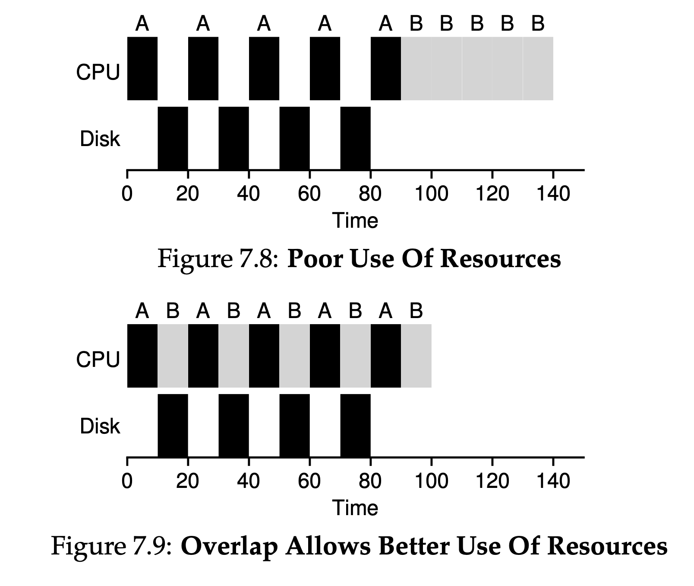
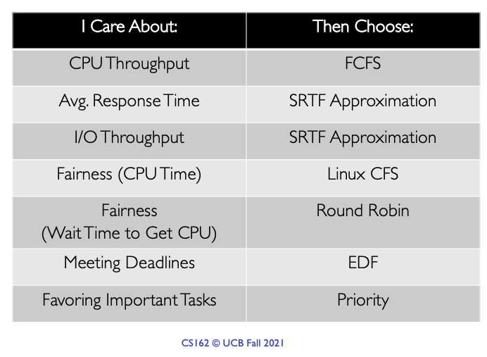

# Scheduling

- Scheduling metrics:
  - **Turnaround time**: the time at which the job completes
    - $T_{turnaround} = T_{completion} - T_{arrival}$
    - the time which the job arrived in the system
  - Another metric: fairness, e.g. Jain’s Fairness Index
  - Why is FIFO not great?
    - Convoy effect: # of relatively-short potential consumers of a resource get queued behind a heavyweight resource consumer
  - SJF: If all jobs arrive at the same time, SJF is an **optimal** scheduling algorithm
    - However, if jobs arrive at different time:
      - Same convey problem
  - FCFS:
    - First-come-first-serve. 
  - STCF:
    - If we do not requite all jobs to run to completion:
    - Add **preemption**
      - Any time a new job enters the system, the STCF scheduler determines which of the remaining jobs (including the new job) has the least time left, and schedules that one.
    - Better average turnaround time
      - Given the new assumptions, STCF is provably optimal
  - **Response time**: the time from when the job arrives in a system to the first time it is scheduled
    - $T_{response} = T_{firstrun} - T_{arrival} $
  - SJF and STCF:
    - Bad for response time
  - SRTF (Shortest Remaining Time First):
    - SJF/SRTF are the best you can do at minimizing average response
time
  - Round Robin (Good for response time.)
    - Runs the job for a time slice (or a scheduling quantum); switch to the next job in the run queue.
    - The shorter the time is, the better performance of RR under response time metric
    - Too short: cost of context switching dominates (i.e. CPU caches, TLBs, branch predictors, and other on-chip hardware)
    - Because turnaround time only cares about when jobs finish, RR is nearly pessimal, even worse than simple FIFO in many cases: RR is worse for turnaround time.
    - Any policy that is fair —> but perform poorly on metrics such as turnaround time
      - willing to be unfair —> run shorter jobs to completion, but at the cost of the response time
      - value fairness —> response time is lowered, but at the cost of the turnaround time
  - Incorperating I/O: overlapping leads to better use of resources.
    - currently-running job won’t be using the CPU during the I/O; it is blocked waiting for I/O completion.
    - The scheduler also has to make a decision when the I/O completes. When that occurs, an interrupt is raised, and the OS runs and moves the process that issued the I/O from blocked back to the ready state. Of course, it could even decide to run the job at that point.
  - 
  - *Work-conserving* scheduler is the one that does not leave the CPU idle when there is work to do. 
  - Starvation is not deadlock. (The former can be resolved under right condition, the latter cannot)
  - 

### MLFQ

- Problem: we want to optimize turnaround and minimize response. we don’t know anything about a process (i.e. job length, etc.)
- Idea:
  - Number of distinct queues with different priority level: higher priority given more CPU time, lower given less
  - Priority adjusted dynamically based on its behavior, use a feedback mechanism
  - Each queue is assigned a time slice determine how much CPU time a process in that queue is allowed to use before pre-empted and moved to a lower level queue
- Pros: more flexible, allow different process to move between priorities, prevent starvation by increasing process’s priority
- Cons: many tunable knobs: # of queues, time slice per queue, how often should priority be boosted, etc.

### EDF

- Assign priorities to the task according to the absolute deadline. The task whose deadline is closet gets the highest priority.
- Pros: efficient in real time system, dynamic
- Cons: priority inversion (i.e. a low-priority task can block a higher priority task from being executed, if blocking?)
  - LP task acquired a lock. 

### Proportional Share (Fair-Share) Scheduler

- Instead of optimizing for turnaround or response time, scheduler might instead try to guarantee that each job obtain a certain percentage of CPU time
  - Lottery Ticket: use tickets to represent the share of a resource that a process should receive
  - Lightweight, randomness
  - But occasionally not deliver right proportions
- Stride Scheduling: not use randomness
  - Stride: **inverse** in proportion to # of tickets it has
  - use the stride and pass to determine which process to run next; pick process to run that has the lowest pass value so far, when you run a process, increment its pass counter by stride

### Lottery Scheduling

- Instead of optimizing for turnaround or response time, scheduler might instead try to guarantee that each job obtain a certain percentage of CPU time
  - Fairness!
- Lottery scheduling
  - Every so often, hold a lottery to determine which process should get to run next
  - Processes that should run more often should be given more chances to win the lottery
- Basic Concept: Ticket Represent Your Share
  - E.x. A has 75 tickets, B has only 25 —> 75% and 25% of the CPU
- Randomness is good:
  - No worst case behavior
  - Lightweight
  - Random can be quite fast.
- Ticket Mechanisms
  - Ticket currency
    - allows user with a set of tickets to allocate tickets among their jobs in whatever currency they would like
    - system converts per-user currency into correct global value
  - Ticket transfer
    - A process can temporarily hand off its tickets to another process
    - E.x. client server setting, a client process sends a message to a server asking it to do some work on the client’s behalf
  - Ticket inflation
    - Temporarily raise or lower the # of tickets it owns
    - Can be applied when group of processes trust one another (doesn't make sense in a non-trusting scenario)
  - Ticket assignment problem remains open
  - 
    - We first have to pick a random number (the winner) from the total number of tickets (400). Let’s say we pick the number 300.
    - First, counter is incremented to 100 to account for A’s tickets; because 100 is less than 300, the loop continues. Then counter would be updated to 150 (B’s tickets), still less than 300 and thus again we continue. Finally, counter is updated to 400 (clearly greater than 300), and thus we break out of the loop with current pointing at C (the winner).

### Stride Scheduling
  - Deterministic fair-share scheduler
  - Get exactly right at the end of each scheduling cycle
  - Stride = **G / # of tickets**
  - Example
    - Process: A - 100 tickets, G = 10000, stride value for A = 100.
    - Keep track of each process’ **pass value** (every time process runs). Increment by its stride to track its global process.
    - Scheduler chooses process with **lowest** pass value
    - Increment chosen process’ pass value **by its stride**
  - Comparing lottery scheduling and stride scheduling, the benefit of lottery scheduling: no global state per process, we simply add a new process with whatever tickets it has, update the single global variable to track how many total tickets we have, and go from there. easier to incorporate new process

### Linux Completely Fair Scheduler (CFS)

- Linux CFS: highly efficient and scalable fair-share scheduler
- Goal: fairly divide CPU evenly among competing processes
- use virtual runtime (vruntime), weight with niceness to assign priorities
- As each process runs, it accumulates vruntime. In the most basic case, each process’s vruntime increases at the same rate, in proportion with physical (real) time. When a scheduling decision occurs, CFS will pick the process with the lowest vruntime to run next.
- if CFS switches too often, fairness is increased, as CFS will ensure that each process receives its share of CPU even over miniscule time windows, but at the cost of performance (too much context switching); if CFS switches less often, performance is increased (reduced context switching), but at the cost of near-term fairness.
- weighted round-robin with dynamic time slices
- **Priority donation / inheritance**
  - Problem: priority inversion
    - Higher-priority task blocked by lower priority task that holds a needed resource (i.e. lock)
  - Low priority task inherits the high priority of a task it is blocking
  - Here's a simple example:
    1. **Low-Priority Task (L)** owns a mutex.
    2. **High-Priority Task (H)** tries to acquire the same mutex but is blocked because it's owned by **L**.
    3. **Medium-Priority Task (M)** preempts **L** because **M** has a higher priority than **L** but lower than **H**.
    Now, **H** is waiting for **L** to release the mutex, but **L** itself is waiting for CPU time because it's preempted by **M**. This is priority inversion.
    In a system with Priority Donation/Inheritance:
    4. When **H** is blocked by **L**, the system temporarily elevates the priority of **L** to that of **H**.
    5. Now, **L** can preempt **M** because it has "inherited" the higher priority.
    6. **L** quickly finishes its work, releases the mutex.
    7. **H** can now acquire the mutex and proceed, and **L** returns to its original low priority.
  - Control parameters
    - `sched_latency`: determine how long one process should run before switch (fair-share), 48 ms
      - Period of time where CFS should be fair
      - CFS divide the `sched_latency` by `n` (number of processes)
      - E.x. `n = 4`, then each process runs 12 ms
    - `min_granularity`: around 6 ms; ensure that the time slot per proces is not too small.
  - CFS makes scheduling decision based on periodic time interrupts
    - Typically happens every 1 ms
  - CFS allows control over process priority, to give some process a higher share of the CPU; `nice` level of a process: weight, or priority
    - Positive: lower priority (too nice)
    - Negative: higher priority (less nice)
    - CFS maps the nice value (-20 to +19, negative weight implies a higher priority) of each process to a weight
    - Time slices are adjusted based on the weights and `sched_latency`
    - `vruntime` has to be adapted. scale actual runtime inversely by the weight of the process, by dividing the default weight by its weight.
      - $vruntime_i = vruntime_i + \frac{weight_0}{weight_i} runtime_i$
  - Use red-black trees
    - Keep only running (or runnable) processes in this structure
    - Most operations (e.x. insertion and deletion) are logarithmic in time
    - Quickly find the job with the least `vruntime`.
  - Dealing with I/O and sleeping processes
    - Problem: if a process goes sleeping for long time, then it will monopolize CPU while it catches up.
      - As its `vruntime` will be very far behind
        - Solution: altering the `vruntime` when it wakes up to the minimum value found in the tree; jobs that sleep for short periods of time frequently do not ever get their fair share of CPU

###  Multi-Level Feedback Queue

- Two problems:
  - It would like to optimize turnaround time
  - It would like to make a system feel responsive to interactive users, thus minimize response time
- the MLFQ has a number of distinct queues, each assigned a different priority level
- Two rules
  - Rule 1: If Priority(A) > Priority(B), A runs (B doesn't)
  - Rule 2: If Priority(A) = Priority(B), A \& B run in RR
- MLFQ varies the priority of a job based on its observed behavior
  - “learn” about processes as they run
  - use the “history” to predict “future” behavior
- **Job’s allotment**. The allotment is the **amount of time** a job can spend at a given priority level before the scheduler reduces its priority.
- Attempt 1: how to change priority
  - Rule 3: When a job enters the system, it is placed at the highest priority (the topmost queue)
  - Rule 4a: If a job uses up its allotment while running, its priority is reduced (i.e., it moves down one queue)
  - Rule 4b: If a job gives up the CPU before the allotment is up, it stays at the same priority level. (allotment is reset)
    - if an interactive job, for example, is doing a lot of I/O (say by waiting for user input from the keyboard or mouse), it will relinquish the CPU before its time slice is complete; in such case, we don’t wish to penalize the job and thus simply keep it at the same level.
  - Approximate SJF
  - Problem
    - Starvation: too many interactive jobs in the system, then combine to consume all CPU time; long-running job starves
    - Smart user: game the scheduler (e.x. before the time slice is over, issue an I/O operation). A job could monopolize the CPU.
    - A program might change its behavior over time. What was CPU bound may transition to a phase of interactivity.
- Attempt #2: Priority Boost
  - Rule 5: After some time period S, move all the jobs in the system to the topmost queue.
  - John Ousterhout, voo-doo constants (S): requring black magic to set the value correctly
    - S is too high: long-running jobs could starve
    - S is too low: interactive jobs may not get a proper share of the CPU
- Attempt #3: Better Accounting
  - How to prevent gaming of the scheduler?
  - Rule 4: Once a job uses up its time allotment at a given level (regardless of how many times it has given up the CPU), its priority is reduced (i.e., it moves down one queue).
- One big issue is parameterization: For example, how many queues should there be? How big should the time slice be per queue? The allotment? How often should priority be boosted in order to avoid starvation and account for changes in behavior?
- Most MLFQ variants allow for varying time-slice length across different queues.
- decay-usage algorithm: FreeBSD scheduler (version 4.3) uses a formula to calculate the current priority level of a job, basing it on how much CPU the process has used; in addition, usage is decayed over time, providing the desired priority boost in a different manner than described herein.
- Some systems also allow some user advice to help set priorities; for example, by using the command-line utility nice you can increase or decrease the priority of a job (somewhat)

# Multiprocessor Scheduling

- The difference between a single-CPU hardware and multi-CPU hardware: centers around the use of hardware caches, and exactly how data is shared across multiple processors
  
## Problem #1: Cache Coherence

- Multi-processor problem: cache coherence!
- Basic solution provided by the hardware (i.e. hardware protocol)
- Bus snooping: each cache pays attention to memory updates by observing the bus that connects them to main memory
  - When CPU see update for data item it holds in cache, notice the change
  - Then, either **invalidate** its copy (remove from cache) or **update** it (put new value in cache)
  - Write-back cache makes this more complicated!

## Problem #2: Synchronization

- OS still need to worry about stuff when they access shared data: concurrency!
  - Cross-CPU access shared data items or data structures
  - Use mutual exclusion primitives (such as locks) to guarantee correctness
    - But as # of CPUs grow, access to a synchronized shared data structure becomes quite slow
- Other approaches such as building **lock-free data structures**, are complex and only used on occasion; see the chapter on deadlock in the piece on concurrency for details

## Problem #3: Cache Affinity

- Notion: A process running on a particular CPU builds up a fair bit of state in caches (and TLBs) of the CPU
  - The next time the process runs, it is often advantageous to run this process on the same CPU again
  - As it will run faster if some of its state already present in caches on that CPU
  - Otherwise has to reload the state

## Building a scheduler for multiprocessor system

- 3.1 Single-Queue Multiprocessor Scheduling (**SQMS**)
  - Putting all jobs needed to be scheduled into a single queue
  - pros: simplicity
    - Does not require much work to take an existing policy that picks the best job to run next and adapt it to work on more than one CPU
  - Cons
    - **Scalability**
      - Need locking to ensure that when SQMS code access the single queue, to proper outcome arises
    - **Performance**
      - Lock reduces performance as # of CPUs grows
      - I.e. contention for a single lock increases, the system spends more time in lock overhead
    - **Cache affinity**
      - Each CPU simply picks the next job to run from globally shared queued, each job ended up **bouncing around from CPU to CPU**
  - most SQMS schedulers include some kind of **affinity mechanism** to try to make it more likely that process will continue to run on the same CPU if possible.
- 3.2 Multi-Queue Scheduling (MQMS)
  - Notion: multiple scheduling queues, one per CPU, scheduled independently
  - When a job enters the system, it is placed on exactly one scheduling queue, according to some heuristics (e.g., random, picking one with fewer jobs)
  - Avoid the problems of information sharing and synchronization in the single-queue approach
  - Pros
    - Inherently more **scalable**
      - As # of CPU grows, so does the number of queues
      - Lock and cache contention should not be a central problem
    - Intrinsically provide **cache affinity**
      - Jobs stay on the same CPU, reap the advantage of reusing cached contents again
  - Cons
    - Load imbalance
    - Dealing with load imbalance: **migrate** a job from one CPU to another
    - Continuous migration of one or more jobs.
      - Many possible strategies for migration.
    - Basic approach: **work stealing**
      - A (source) queue that is low on jobs will occasionally **peek** at another (target) queue, to see how full it is
      - If target queue is notably more full, then the source steal one or more jobs from the target to help balance load
      - If you look around at other queues too often, you will suffer from high overhead and have trouble scaling, which was the entire purpose of implementing the multiple queue scheduling in the first place!
      - Compared to job migraiton:
        - Decentralized approach;
        - Pull mechanism (local queue "pull")
- #3: Linux Multiprocessor Schedulers
  - Priority-based scheduler (similar to MLFQ)
    - Changing a process’s priority over time and schedule those with highest priority
    - Interactivity is the primary focus
  - Multi-queue
  - O(1) scheduler
    - multi-queue
    - Similar to MLFQ and priority-based

### Deadlock

- Deadlock is a specific condition where two or more processes are unable to proceed because each is waiting for the other to release a resource.
- Prevention
  - Resource allocation graph: use directed graph to represent resource allocation, avoid cycles
  - Timeout: set maximum time for acquiring resources
