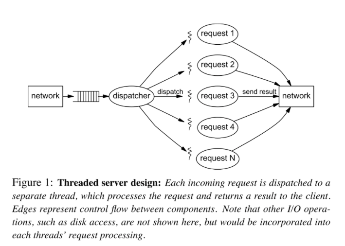
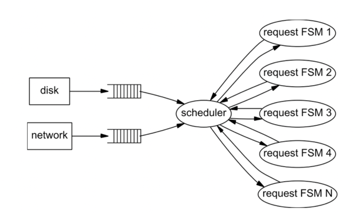
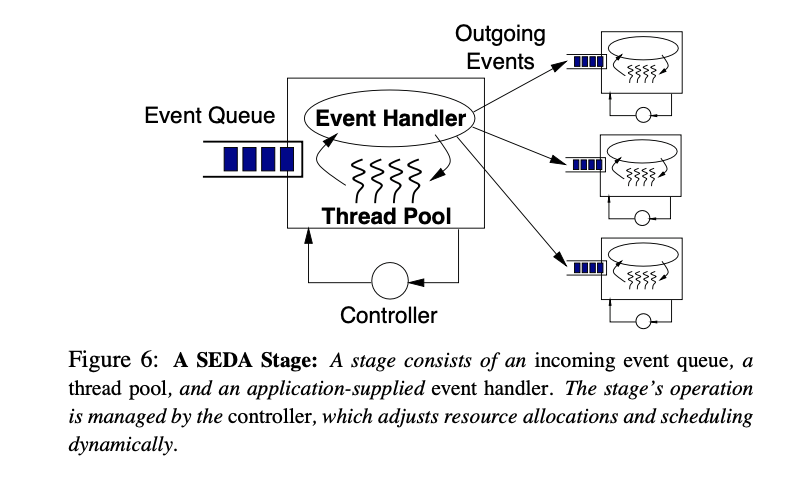
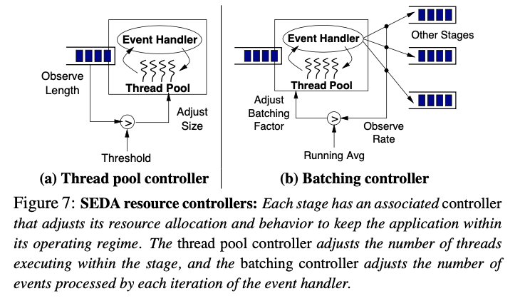

# SEDA: An Architecture for Well-Conditioned, Scalable Internet Services (2001)

Link: https://sosp.org/2001/papers/welsh.pdf

Read: June 16th, 10:41AM. 

- Staged event-driven architecture (SEDA), a new design for highly concurrent Internet services. 
- Key components:
    - **Stages**: The application is divided into multiple stages, each associated with an incoming event queue.
    - **Dynamic Resource Controllers**: Controllers dynamically adjust the number of threads and the batching sizes within each stage to adapt to workload changes.
    - **Explicit Queues**: Interconnect different stages to buffer and manage events.
    - **Asynchronous I/O Primitives**: Non-blocking I/O operations to keep the system responsive.

## Key Insight

### Motivation

- Internet: unprecedented ***scale***, millions of users demanding access
    - Services must be responsive, robust, and always responsible
- Three trends magnify the system challenge
    1. Services become more complex
        1. Static content replaced by dynamic content, extensive computation and I/O
    2. Service logic tends to change rapidly 
        1. Increase engineering complexity and deployment  
    3. Services increasingly hosted on general-purpose facilities 
        1. Rather than carefully-engineered platform

### Thread-based concurrency

- Each accepted request consumes a thread to process it, with sync operations protecting shared resources.
- **Pros:** ease-to-program
- **Cons**
    - Overhead with threading: cache and TLB misses, scheduling overhead, lock contention; context switching overhead and memory footprint. 
    - Overhead gets worse with large # of threads
    - Not adequate for the tremendous concurrency requirements of an Internet service.
- Other thread-based technique comparison
    - Giving application ability to specialize policy decisions made by kernel
        - E.x. Scheduler activations,
        - Cons
            - Still based on multiprogramming
            - Focus on safe and efficient resource virtualization rather than graceful management and high concurrency
    - Bounded thread pool
        - Bound size of thread pool associated with a service, additional connections not accepted
        - Cons: unfairness  to clients (i.e. client requests queue up in network)

### Event-based concurrency

- A server consists of a small # of threads (i.e. one per CPU) that loop continuously, processing events of different types from a queue
- Instead of blocking, the program registers a callback function that the event loop should call when the I/O operation is complete. While waiting for this to happen, the event loop can handle other tasks or events. When the I/O operation is finally complete, the event loop simply calls the previously registered callback function to process the data.
- Processing of each task is a **finite state machine (FSM)**
    - Transition between state in FSM are triggered by events
- E.x. used by web servers, Flash, Zeus
- **Pros:** robust to load
- **Cons**
    - Event-handling threads can block.
        -  e.x. interrupts, page faults, garbage collection
    - Additional challenges
        - Scheduling and ordering of events are hard for application
        - Modularity is difficult to achieve
            - Code implements each state must be trusted not to **block**
            - Or consume large # of resources that stall the event-handling thread

### Key Ideas

- Staged event-driven architecture (SEDA)
    - Combine threads and event-based programming model
    - Applications are constructed as network of *stages*
        - Each associated with *incoming event queue* (explicit)
        - Stage threads pull batch of events off the incoming event queue
        - And invoke application-supplied event handler
        - The event handler processes each batch of event, and dispatches 0 or more event by queueing them on event queues of other stages
        - A pool of threads for each stage, relies on the underlying OS for scheduling.
    - Use *dynamic resource throttling*
        - Each stage is managed by a controller that affects scheduling and thread allocation
- A Seda Stage (**thread pool, event handler**): 
  - 
- Seda resource controller
  - 

### Details

1. **Resource controllers**
    1. ***Thread pool controller***: adjust # of threads executing within each stage 
        1. Goal: enough thread to handle concurrency demands 
        2. Periodically sample input queue and add a thread when the queue length exceeds some threshold 
        3. Threads are removed when they are idle for a specified period of time 
    2. ***Batching controller***: **adjust # of events processed by each invocation of the event handler within a stage**
        1. Observes output rate of events from a stage (by maintaining moving average across samples), and decreases batching factor until throughput starts to degrade 
        2. Responds to sudden drops in load by resetting batching factor to max 

2. **Async I/O primitives** 
    1. Async network socket layer: make use of non-blocking I/O provided by OS (i.e. /dev/poll) 
        1. *readStage*: perform socket read whenever an I/O readiness event indicates that a socket has data available 
        2. *writeStage:* receives packet write requests from the user and enqueues them onto an internal queue associated with the particular socket 
        3. *listenStage*: accepts new TCP connections and responds to user requests to listen on a new port 

## Limitations

Rather this might be concerns over event-based system as well:
1. Difficult to understand the cause-effect relationship 
    1. I.e. when examining source code or debugging, event system invoke a method in another module by sending “call” event and waiting for a “return” event in response. Programmer needs to manually match these pairs in order to understand the application. 
2. Manually save and restore live state is a pain 
    1. V.s. thread-based system: each thread maintains its own stack, which simplify the state management