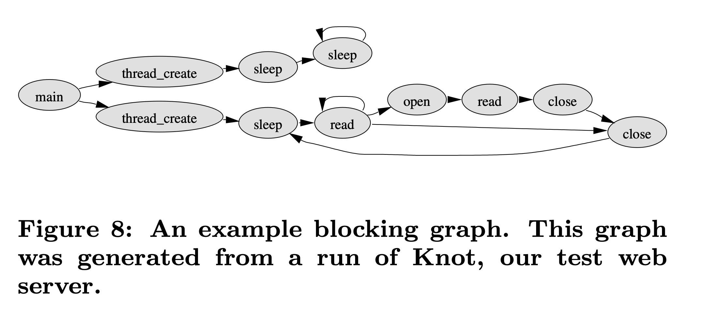

# Capriccio: Scalable Threads for Internet Services (2003) 

Read: June 16th, 10pm, 2024

Link: http://capriccio.cs.berkeley.edu/pubs/capriccio-sosp-2003.pdf

This paper proposes Capriccio, a scalable thread package for use with high-concurrency servers. The main proposal is to use **user-level threads** instead of event-based models (i.e. SEDA) to achieve high performance without sacrificing the ease of programming. 

Its approach is three-fold: 

1. **Scalability**: Capriccio uses user-level threads coupled with cooperative scheduling to manage many threads efficiently. User-level threads are preferred over kernel threads for their flexibility and performance advantages,

2. **Linked Stack**: Traditional stack allocation methods are not suitable for programs managing many threads. Capriccio uses a dynamic stack allocation technique that employs **linked chunks**, which are managed through compile-time analysis and runtime checks.

3. **Resource-aware Scheduler**: The scheduler views the application as a sequence of stages, separated by blocking points, forming a "**blocking graph**". This graph is used to make application-specific scheduling decisions to maximize resource utilization without reaching bottlenecks.

## Limitations 
* Does not completely eliminate kernel crossings.
* Performance not necessarily better than event-based systems.

## Key Insight

### Problem

Same motivation as SEDA: Internet services have ever-increasing scalability demands 

- Thousands of simultaneous connections
- We need a programming model to achieve efficient and robust servers with ease

### Baseline: Event-based Programming Model

- Handle requests through a pipeline of stages, each request represented by an event, and each stage is implemented as event handler
- E.x. SEDA
- Pros
    - More efficient
        - V.s. context switching and locking overheads with threads
    - Threads are hard to program (deadlocks, synchronization)
    - Poor thread support (portability, debugging)
- Cons
    - Many event systems invoke a method in another module by sending a "call" event and waiting for a "return" event in response
    - Readability is a huge thing!
        - Programmer has difficulty to understand cause-effect ("call", "return pairs) when examining source code and when debugging, and these "call" and "return" are in different parts of the code. 
    - Stack ripping
        - Creating these call/return pairs require the programmer to manually save and restore live state

### Main Proposal

> *“Any apparent advantages of events are better viewed as arguments for app-specific optimization and need for efficient thread runtime”*
> 

Just improve the thread runtime! 

Goals:

1. Allow high performance without high complexity 
2. Support existing thread’s API (POSIX)
3. Scalability to 100,000 threads
4. Flexibility to app-specific needs 
5. Little or no modification to the application itself 

## Key Approach

There are three parts:

1. Scalability
    1. User-level threads + cooperative scheduling 
2. Linked stack 
    1. Stack allocation for large # of threads
    2. Compile-time analysis + runtime checks 
3. Resource-aware scheduler 
    1. Application-specific scheduling based on predicted resource 

### #1: User-level Threads

- Why user-level threads?
    - Kernel threads: for enabling true concurrency via multiple devices, disk requests, CPUs
    - User threads: logical threads that provide a clean programming model
        - Pros
            - ***Flexibility***
                - Decouple from OS / kernel
                    - Allow faster innovations on both sides
                    - E.x. kernel async I/O mechanisms can be used without changing the applications
                - Address application-specific needs
                    - Increase flexibility of thread scheduler
                - Kernel threads cannot tailor the scheduling algorithm to fit a specific application. Instead, the user-level thread scheduler can be built along with the application.
            - ***Performance***
                - Greatly reduce overhead of thread synchronization
                    - E.x. single CPU, neither user threads nor thread scheduler can be interrupted during a critical section
                - **Do not require kernel crossings for mutex acquisition or release**
                    - V.s. kernel thread: kernel crossing for every sync operation
                - Memory management is more efficient
                    - V.s. kernel thread
                        - require data structure (TCB) that eat up kernel addr space
                        - decrease available space for I/O buffers, file descriptors, and other resources
        - Cons
            - Some times more kernel crossings
                - To retain control of processor when user-level thread executes a blocking I/O call, user-level thread package override blocking call with non-blocking equivalents
                - E.x. non-blocking network I/O `epoll` involves
                    - First polling sockets for I/O readiness
                    - Then performing actual I/O call
                - The actual I/O call is identical to the non-blocking version.
            - Must introduce a wrapper layer that translate blocking I/O to non-blocking ones, which leads to overhead
                - E.x. overhead significant for quick operations like in-cache reads
        - Benchmark: Benefits outweigh drawbacks
- Main thing
    - Cooperative scheduling
    - Async I/O
    - Efficient thread operations - O(1)

### #2: Linked Stack

- Problem: conservative stack allocation per thread are unsuitable for programs with many threads
    - Abstraction of unbounded call stack for each thread
    - While in reality stack bounds are chosen conservatively large
    - E.x. 1GB virtual memory with just 500 threads
      - For example, LinuxThreads allocates two megabytes per stack by default; 
- Most threads consume only a few kilobytes of stack space at any given time
  - Significantly reduce the size of virtual memory dedicated to stacks if we adopt a dynamic stack allocation policy wherein stack space is allocated to threads on demand in relatively small increments and is deallocated when the thread requires less stack space.
- Idea: dynamic stack allocation with linked chunks
    - Alleviates VM pressure and improve paging behavior
- Method: compile-time analysis and checkpoint injection
    - **Small non-contiguous stack chunks** grow and shrink at runtime
    - Compiler analysis and runtime checks
        - Goal: place a reasonable bound on stack space consumed by each thread
        - Generate a ***weight directed call graph***
    - Features
        - Each node is a call site annotated with max stack space for that call
        - Edges: function calls in-between nodes
        - Path: sequence of stack frame (length = sum of weights of all nodes)
        - Checkpoints are inserted at edges (call sites)
            - A checkpoint is a small piece of code that determines whether there is enough stack space left to reach the next checkpoint without causing stack overflow. 
            - If not enough space remains, a new stack chunk is allocated, and the stack pointer is adjusted to point to this new chunk. 
            - When the function call returns, the stack chunk is unlinked and returned to a free list.
            - Checkpoint placement
                - Break cycles (i.e. recursive frame)
                - Scan nodes to ensure path between checkpoints within desired bound (set as compile-time parameter)

### #3: Resource-aware Scheduler

- Propose: application-specific scheduling for thread-based applications
- Key abstraction: ***blocking graph***
    - 
    - Each node is a *location* in the program that is *blocked*. 
    - View applications as sequence of stages separated by blocking points
    - Generated at runtime
    - Nodes: program locations where threads block
    - Edges: consecutive blocking points
        - Annotated by
            - Average time taken to traverse an edge
            - Change in resource usage like memory, stack space, sockets
- General idea: schedule threads s.t. for each resource, utilization is increased until max throughput and then throttled back
    - Determine which resources are near their limits.
    - Predict the impact on resources if threads at a *particular node* were scheduled (since edges are annotated)
    - Prioritize nodes (and thus threads) based on resource needs and availability.
- Implement using separate run queues for each node
    - Periodically determine relative priorities of each node
    - Select a node by stride scheduling (i.e. decide which group of threads should be scheduled next)
    - Select threads within nodes by dequeueing from node’s run queues and scheduled for execution
- Pitfalls
    - Maximum capacity of particular resource is hard to determine
    - Thrashing not easily detectable
    - Non-yielding threads lead to unfairness and starvation in cooperative scheduling
    - Blocking graphs are expensive to maintain (i.e. 8% of execution time)

## Limitations

1. Some future works not addressed by the paper 
    1. Reduce kernel crossings with batching async network I/O 
    2. Disambiguate function pointers in stack allocation
    3. Improve resource-aware scheduling
        1. Better detection of thrashing 
        2. Tracking variance in resource usage 
2. Performance not comparable to event-based systems 
3. High overhead in stack tracing
4. Lack of sufficient multi-processor support