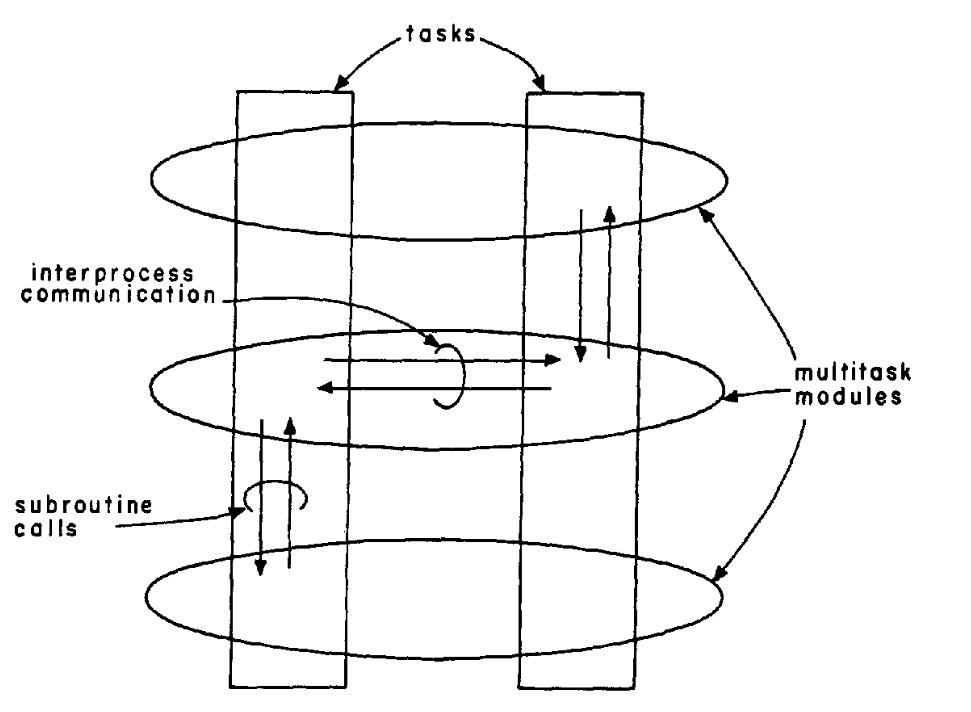

# The Structuring of Systems Using Upcalls (1985)

Read: June 17th, 2024.

Link: https://dl.acm.org/doi/pdf/10.1145/323627.323645

The paper introduces a mechanism allowing **control to be transferred from lower layer to upper layer**. By allowing synchronous calls between layers instead of using downcalls (i.e. async communication), performance can be greatly enhanced. 

## Baselines: Layer as Processes
- Each layer as a process: different address space, so no corruption
- Serious performance issue! (i.e. polling overhead, data buffering)
- Downcall-based socket 
    - Downcall: Create and bind a socket
    - Downcall: Receive data if possible
    - Downcall: Send data if possible
    - Downcall (**polling** or callbacks): Tell me when to send / receive more data on any of these sockets

### Insights: natural flow is not always downward

- E.x. in network environment, **most actions are initiated by the network (transport protocol) from below!**
- Currently, this is done through cumbersome and async mechanisms (i.e. IPC signal)
    - Procedure call is not allowed

### Examples 
1. Downcall (create and bind a socket): application tells the kernel to prepare a socket for network communication just like before, and tell the socket layer which procedures to use as upcalls
2. Upcall (for data and events): when packet comes, kernel can simply calls the **relevant function directly**; similarly when the kernel determines it's a good time to send data, make an upcall to the procedures
3. Downcall (optional, for additional data): the application can make a downcall to notify the kernel that it has more data to send
   
## Key Techniques 
* **Definition**: An **upcall** is a mechanism where a lower layer in a system can directly call a **function** or procedure in an upper layer.
* No tasks export an intertask communication interface. The only exported interfaces are **subroutine calls**.
* 
  * As the figure shows, **intertask communicatio**n only occurs in a horizontal direction, between the various tasks in a layer, while flow of control between layers is achieved between through subroutine calls, both up and down.
* Typically, the layer cannot upcall until its client has first downcalled. 
* Upcall is subroutine call (synchronous) rather than interprocess signal (asynchronous, using shared memroy, pipes, etc.). 

### Swift

1. Put the modules in a single address space 
    1. Calls between them are just procedure calls 
    2. Modules have to be multi-threaded

Allow kernel to make synchronous call into client: 
1. **Single Address Space**: all modules are kept within a single address space to allow for direct procedure calls between them.
   1. **Due to security concerns and isolation, this is not widely used today.**
2. **Multi-threading**: modules efficiently use upcalls and downcalls

### Pros
* **Simplicity**: eliminate code for data buffering, low level can ask upper level for "advice" (i.e. "piggybacking" in network, ack piggybacked on data going in opposite directions.) 
* **Usability**: programmers more familiar with subroutine interface than IPC, some thread design decisions can be delayed
* **Cleanup**: If a client fails, the system intervenes and upcalls the relevant cleanup procedures with the supplied argument. 

### Cons
* **Upward dependency and fault tolerance**: lower levels are often shared among different upper levels clients, failures may affect higher layers as well, poses challenges in releasing resources and corruption of state
* Solution
    * Separate shared data into **global** and **client-specific** variables 
    * Never upcall while holding a lock on global data
    * Never upcall in a thread you’re afraid to kill
* **Indirect recursion: rely programmer skills to properly handle recursive calls** 
    1. What if a layer downcalls in an upcall? 
        1. Downcall might change data in unexpected ways
        2. Or it might be just deadlock, if it tries to grab a lock held during the upcall 
    2. No one solution, but three good options 
        - #1: never hold locks during upcalls, reevaluate everything on return
            - Leads to clumsy and inefficient programs
            - Last-resort solution
        - **#2: prohibit most / all recursive downcalls**
            - Seems restrictive, but usually makes sense
            - Most upcalls ask simple questions and should return quickly anyway
            - We can change the interface to make it okay
        - #3: The lower level enqueues recursive requests for later
            - This adds a lot of complexity to the lower level
            - Doesn't make sense tbh. 

## Usage today 
1. Interrupt handling and event-driven programming: lower-level components (e.g. device driver) can notify higher-level components (e.g. applicaiton-handlers) of certain events
2. Not widely used: single address space (security concern and isolation) 

## Takeaways

- The thoughts around how service interact are still relevant in Internet and distributed system architecture today
- Performance advantages by using shared memory remain
