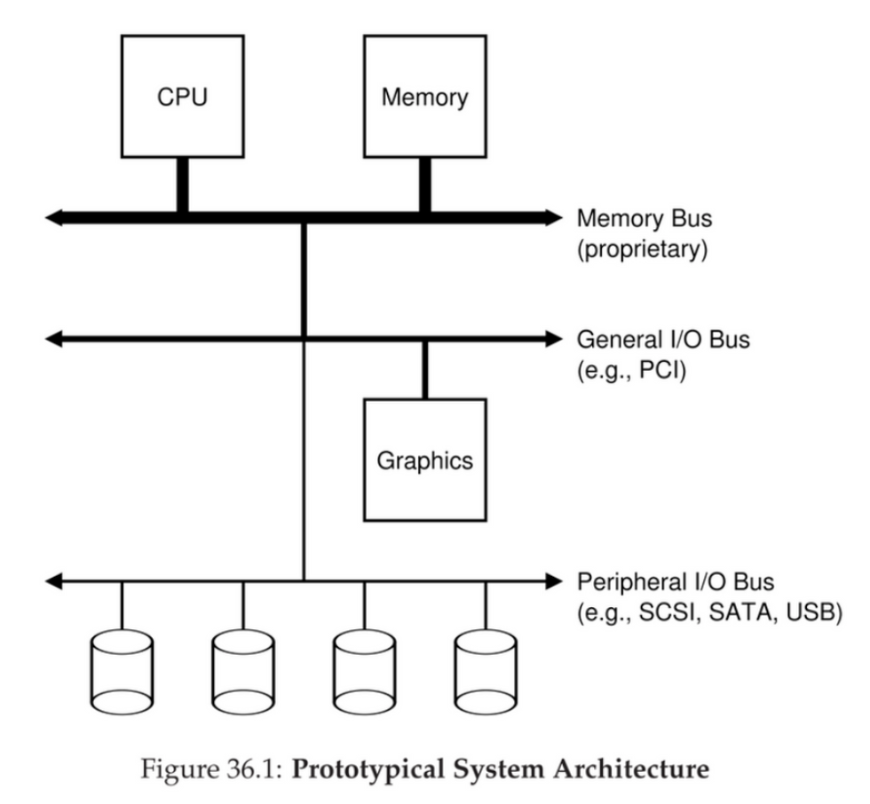
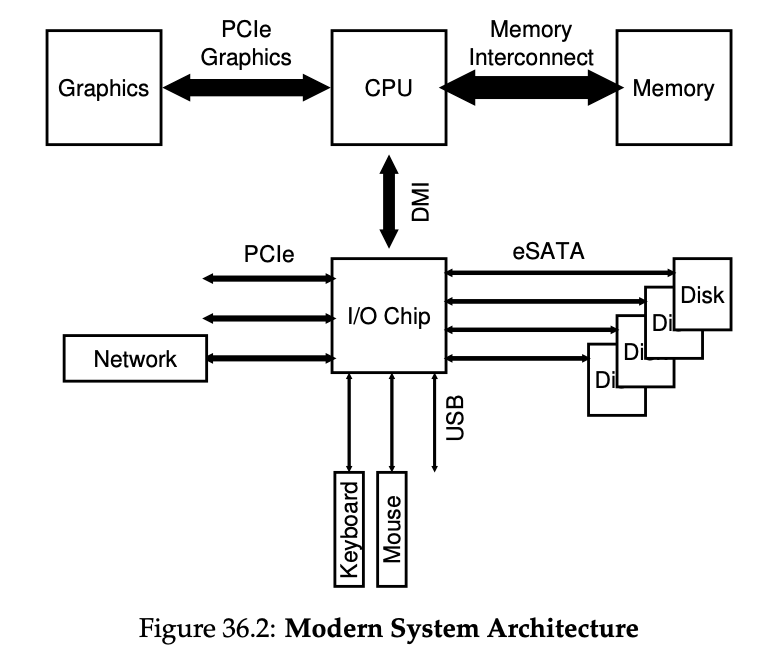
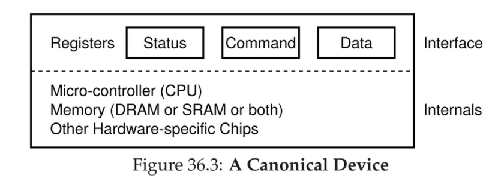

# Input/Output (I/O) and System Performance

## Buses, Controllers

General architecture:
- 
- Single CPU attached to main memory with **memory bus** or interconnect
- Some devices are connected to the system via a general **I/O bus** (e.g. PCI)
- **Peripheral bus** (e.g. USB, SCSI, SATA) connects **slow devices** to the system, including disks, mice, and keyboards
  
## Why this hierarchy? 

- Physics, and cost
- The faster the bus is, the shorter it must be
    - High-performance memory bus does not have much room to plug devices into it
- Components demand high performance (e.g. graphic card) are nearer the CPU
- Low performance components are further away
- CPU connects to an I/O chip via Intel’s proprietary DMI (Direct Media Interface)
- Rest of the devices connect to this chip via different interconnect
    - Hard drive: via eSATA interface
    - USB connections: enable a keyboard and mouse to be attached to the computer
    - Higher performance devices can be connected to the system via PCIe (Peripheral Component Interconnect Express)
        - Network interface
        - Or higher performance storage devices (i.e. NVMe persistent storage devices)
    - (Modern System Architecture)

- Device:
  - 
  - Registers 
    - Status register: read to see current status of the device 
    - Command register: tell the device to perform a certain task
    - Data register: pass data or get data to / from the device 

## Programmed IO protocol: Basic Steps of OS of doing I/O

1. Polling the device 
2. Sending data down to data register 
3. Writing a command to command register, let the device know that data is present and it should begin working
4. Waiting until the device to finish by polling it from a loop 

## Interrupts v.s. Polling

- Polling
    - OS check devices status with frequent polling
    - Pros: high CPU overhead
- Interrupts
    - When device finished operation, raise a hardware interrupt
    - CPU jump into the OS at predetermined **interrupt service routine (ISR)** or, **interrupt handler**
    - The handler (i.e. a piece of OS code) finishes the request and wakes the process waiting for I/O
    - Interrupts thus allow for overlap of computation and I/O, which is key for improved utilization. 
- Trade-offs
    - If device finishes quickly or in networks where there is huge stream of incoming packets
        - then interrupt overhead (context switching) is expensive, OS can even livelock, better to poll
    - Better to use a hybrid approach if speed of device unknown: polls for a while then interrupt. 
    -  Using an interrupt in this case will actually slow down the system: switching to another process, handling the interrupt, and switching back to the issuing process is expensive. Thus, if a device is fast, it may be best to poll; if it is slow, interrupts, which allow
    -  When a huge stream of incoming packets each generate an interrupt, it is possible for the OS to livelock, that is, find itself only processing interrupts and never allowing a user-level process to run and actually service the requests.

- **Coalescing**
    - A device which needs to raise an interrupt first waits before delivering interrupt to CPU
    - While waiting, other requests may soon complete
    - Multiple interrupts can be coalesced into a single interrupt delivery
  
## PIO v.s. DMA

- **PIO (programed I/O)**: CPU directly tells device what the data is
    - too much time moving data to and from device by hand
- Solution: **direct memory access (DMA)**
    - DMA: a very specific **device** within a system that can orchestrate transfer between devices and main memory without much CPU intervention
- To transfer data to device
    - OS program the DMA engine by telling it where data lives in memory, how much data to copy, and which device to send it to
    - OS is done with transfer and proceed with other work
    - DMA completes —> raise an interrupt, OS knows it complete

1. **Explicit I/O instructions** 
    1. Each device has a port
    2. E.x. X86, `in` and `out` instructions can be used to communicate with devices
        1. These are distinct instructions separate from regular load and store instructions that access memory 
        2. For example, to send data to a device, the caller specifies a register with the data in it, and a specific **port** which names the device. Executing the instruction leads to the desired behavior.
    3. These instructions are privileged, OS is the only entity that is able to directly communicate with them 
        1. Less flexible, less portable (to different HW that does not support these special instructions)

2. **Memory-mapped I/O**    
    1. **H/W maps registers into address space**  
        1. the hardware makes device registers available as if they were memory locations.
        2. Doesn’t differentiate memory address and device address 
        3. Underlying HW take care of routing instruction to the correct place (i.e. either memory or particular device) 
    2. **To access register** 
        1. OS issues a load (to read) or store (to write) the address 
        2. Hardware then routes the load / store to the device instead of main memory 
    3. Pros
        1. More flexible as you can use same set of instructions, portable (use standard memory instruction)

**Both approaches are being used**
- FS
    - completely oblivious to specifics on which disk class it is using
    - simply issue R/W request to the generic block layer
- Raw interface to device
    - Enables special applications (i.e. FS checker, disk fragmentation tool) to directly R/W blocks without the FS abstraction
- Downside of this
    - Specialized device, general interface
- Device driver
    - Protocol for talking with devices
    - Write device driver for each device
    - 70% of OS code in Linux kernel

