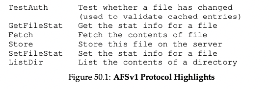

# Scale and Performance in a Distributed File System (AFS) (1988)  

# The Andrew File System (AFS)

Link: https://www.cs.cmu.edu/~coda/docdir/s11.pdf

Read: July 12th, 2024

## Introduction 

* How does it differ from NFS?
    * NFS is limited in scalability
        * E.x. frequent check if cache contents change (basically polling)
    * NFS cache consistency is hard to describe: depends on low-level implementation details
        * E.x. **client-side cache timeout intervals**
    * In AFS: when the file is opened, a client will generally receive the latest consistent copy from the server.
    * 

## AFSv1

* Details
    * Upon `open()` call
        * Client sends a *Fetch* protocol message to server with entire pathname (e.x. `/home/remzi/notes.txt`)
          * **Different from NFS, which asks for a file handle for each part of the file name.**
            * NFS will have a file handle for `/home`, then another for `remzi`, and another for `notes.txt`, and so on.
        * Server traverses the pathname, finds the desired file, and **ships the file** back to client
        * Client caches the file on local disk
            * Consecutive R/W: also uses local memory to cache blocks on its local disk
        * When finish
            * If modified, flush new version back to the server with *Store* protocol message

* Next-time file accessing
    * Client first contacts the server (with *TestAuth* protocol message)
        * Determine whether the file has changed
        * If not, use the local cache copy
    * Early version: only cache file contents; directories were only kept at the server

## Problem with V1

Scalability of AFS is largely limited: the server CPU became the bottleneck of the system, and each server could only service 20 clients. 

There are two main problems with AFSv1:

* **Path-traversal costs are too high**
    * *Fetch* / *Store* request: pass entire pathname 
    * **CPU time simply walking down directory paths when there’re too many clients**
    * **Server spends too much time traversing pathnames**
* **The client issues too many TestAuth protocol messages** 
    * Just like NFS problem 
* Additional problem 
    * **Load imbalance** across servers 
        * Sol: volumes (or FS) —> an administrator can move across servers to balance load 
    * Server used a single distinct process per **client** thus inducing **context switching** and other overheads 
        * Sol: building the server with threads instead of processes

* Venus: client workstation. Vice: set of storage servers. 

## AFSv2

### #1: Callback

* AFSv2 introduce **callback** to reduce # of client / server interactions, adding this **state** to the system
* Client assumes that the file is valid until server tells it (Invalidation)
* Analogy to: **pulling v.s interrupts**

### #2: FID

* Similar to NFS file handle; consists of
    * Volume identifier
    * File identifier
    * “Uniquifier”: to enable reuse of the volume and file IDs when a file is deleted
* Each Vice file or directory is now identified by a unique fixed-length Fid. Each entry in a directory maps a component of a pathname to a fid. 
* FID replaces pathnames to specify which file a client was interested in
    * Client walk the pathname, caching the results
    * Example
* Key difference from NFS
    * **With each fetch**, **AFS client would establish a callback with the server**
    * Benefit: second access as fast as accessing the file locally (no server interaction). **Basically whole file caching**. 

**Name resolution**: move the name resolution from server to client, client walks and maps the **pathname to Fid** (i.e. <vol identifier, file identifier, uniquifier>). 

* For example, if a client accessed the file /home/remzi/notes.txt, and home was the AFS directory mounted onto / (i.e., / was the local root directory, but home and its children were in AFS), the client would first Fetch the directory contents of home, put them in the local-disk cache, and set up a callback on home. Then, the client would Fetch the directory thus ensuring that the server would notify the client of a change in its cached state. 

### LWP

* User-level mechanism to support multiple nonpreemptive Lightweight Processes (LWPs) 
* An LWP is bound to a particular client only for the duration of a single server operation. A client thus has long-term state on a server but not a corresponding thread of control associated with it. 
  * This is different from the NFS stateless design. 

## Techniques

### Usability 
Storage representation: instead of pathname, access files by their inode. 

## Crash recovery 
Crash recovery is more involved than NFS with the callback mechanism (e.x. may miss callback recall messages during crash). When client recovers, it needs to check with server again. 

Server recovery is also harder, **as callbacks are kept in memory. Methods to deal with it can be having server sends message ("don't trust cache!") or client checks with server periodically with heartbeat**. NFS server recovery is immediate as it doesn't keep any states. 

## Performance 
**Whole-file caching in AFS**: good when large files are frequently re-read, as it can serve the files directly from the local disk cache and reduce server load and network latency. 
  * whole-file transfer approach contacts servers only on opens and closes. Read and write operations, which are far more numerous, are transparent to servers and cause no network traffic.
  * Main benefit is reduced network communication (when you have the whole file cached. )
  * Caching of entire files simplifies cache management. Venus only has to keep track of the tiles in its cache, not of their individual pages.
* This compares with NFS: NFS caches file blocks or chunks rather than entire files. When a client accesses a file, it fetches and caches the specific blocks it needs. Subsequent operations on those blocks can be served from the cache.
  * This is efficient for partial file access. 
* files reads usually went to the local disk cache (and potentially local memory) 

**Block-level caching in NFS**: better in use-cases where only a small subset of a large file is read or modified.
* NFS can fetch or update only the **necessary portions** of a file, making it more efficient for workloads involving random or partial file access.
* Also overwriting existing files is better in NFS, as it avoids the initial read operation that AFS requires to fetch the whole file before overwriting.

### Cache Consistency 

Two important cases:

* Consistency between processes on *different* machine 
    * AFS makes updates visible at the server and invalidates cached copies when the updated file is closed 
    * Server then “breaks” callbacks for any clients with cached copies
    * Concurrent write: **last writer wins** to the entire file 
        * V.s. NFS: final file could end up as mix of updates from clients 
* Consistency between processes on the *same* machine 
    * Write immediately visible to other local processes (i.e. not wait until file closed) 
    * Based upon typical UNIX semantics

## Other Improvements on AFS

* True global namespace to clients: all files were named the same way on all clients
    * V.s. NFS: allow each client to mount NFS server in any way
* Security mechanisms to authenticate users and ensure files private if user desired
    * V.s. NFS: primitive support for security
* Flexible user-managed access control (e.x. who exactly can access which files)
    * V.s. NFS: much less support for this type of sharing
* Tools to enable simpler management of servers for system admins
* Sadly, NFS dominates the market place and becomes an open standard. NFSv4 now also adds server state (e.g. an “open” protocol message).
* Because AFS has a large local disk cache, it will access the file from there when the file is accessed again. NFS, in contrast, only can cache blocks in client memory; as a result, if a large file (i.e., a file bigger than local memory) is re-read, the NFS client will have to re-fetch the entire file from the remote server
* NFS: flush on close consistency.

### Volume

* A Volume is a collection of files forming a partial subtree of the Vice name space.
* Quotas are implemented in this system on a per volume basis. Each user of the system is assigned a volume, and each volume is assigned a quota. 
* Volumes form the basis of the backup and restoration mechanism in our redesign. To backup a volume, a read-only clone is first made, thus creating a frozen snapshot of those files. 
