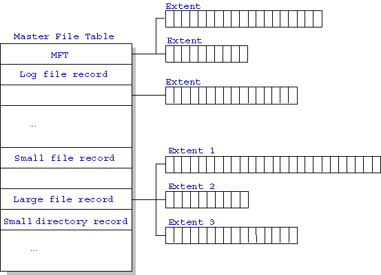

# NTFS

* Windows NTFS (New Technology File System). 
* Master File Table
  * Database with Flexible 1KB entries for metadata/data
  * Variable-sized attribute records (data or metadata)
  * Extend with variable depth tree (non-resident)
* Extents variable length contiguous regions
  * Block pointers cover runs of blocks
  * Similar approach in Linux (ext4)
  * File create can provide hint as to size of file
* 
* Small files: resident data files
* Large file record: point to other Master File Table (MFT). 

