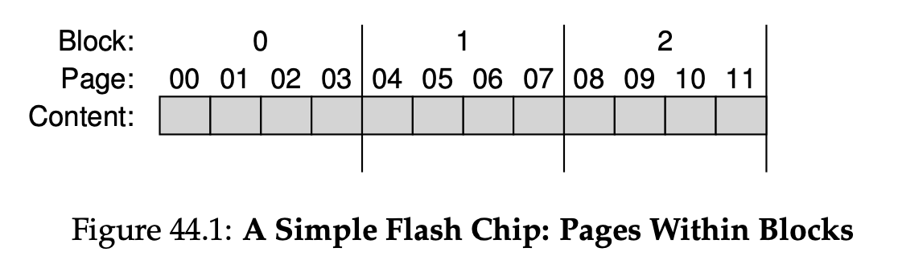
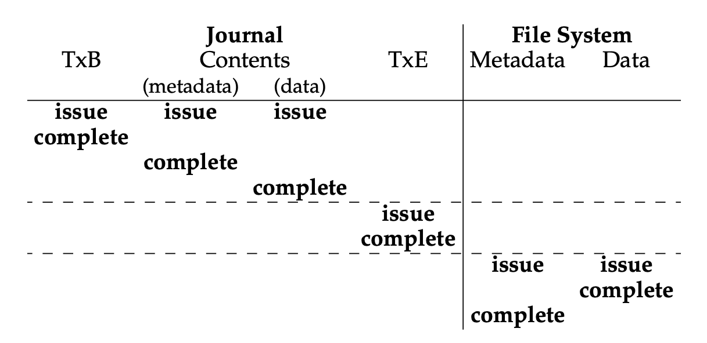
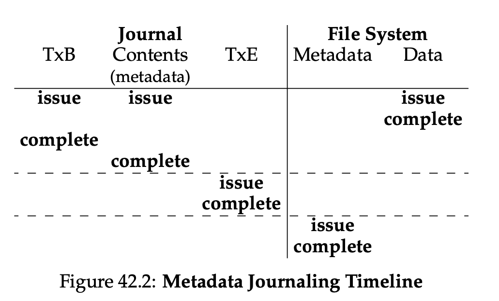
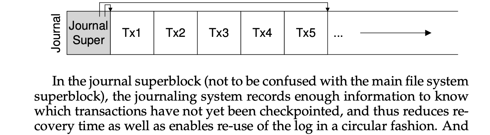

# Storage Systems

### HDDs

* Disk has a sector-addressable address space
    * Array of sectors, each typically 512 bytes (i.e. blocks)
    * Main operations: reads and writes to sectors
* Basic geometry
    * Platter: circular hard surface on which data is stored persistently by including magnetic change to it
        * 2 sides: each side is a **surface**
    * Spindle: platters bound together around spindle (i.e. rotations); Connect to a motor that spins the platters
    * Track: data encoded on each **surface** in concentric circles of sectors, one circle is a track
      * Stack of tracks (across platters): **cylinder**
    * Disk head (perform read and write) attached to a single disk arm
      * One such head per surface of the drive
      * Attached to a single **disk arm**, which moves across the surface to position the head over the desired track
* Performance
    * Read / write time = seek time (move from one track to another) + rotation (single track latency, move from one section to another) + transfer time
    * Mechanical and slow
    * Drives may cache both reads and writes (in addition to OS cache)

### SSDs

* Basics
    * A **flash chip** consists of many banks, each of which is organized into **blocks**
    * Each blocks is further subdivided into some number of **pages**
    * Blocks are large (128KB - 2MB) and contain many pages of small size (1-8KB)
    * 
* **Organizations**
    * Some number of flash chips (for persistent storage)
        * Use multiple flash chips in parallel.
        * reduce write amplifications (i.e. total write traffic issued to flash chips by FTL / total write traffic issued by the client) 
    * Some amount of volatile (i.e. non-persistent) memory (e.g. SRAM)  for caching
    * Control logic to orchestrate device operation: FTL (Flash Translation Layer)
        * Transform reads and writes from a client into reads, erases, and programs to underlying flash chips
* R/W
    * Read: issue read with an address and length
    * Write: client **erase the entire block**, then client **can program each page exactly once**
* Why not just erase and rewrite new version of entire 256KB block?
  * Erasure is very slow (milliseconds)
  * Each block has a finite lifetime, can only be erased and rewritten about 10K times
  * Heavily used blocks likely to wear out quickly
* Two systems approach (FTL)
  * Maintain a Flash Translation Layer (FTL) in SSD
    * Map virtual block numbers (which OS uses) to physical page numbers (which flash mem. controller uses)
    * Can now freely relocate data w/o OS knowing
  * Copy on Write
    * Don’t overwrite a page when OS updates its data (this is slow as we need to erase page first!)
    * Instead, write new version in a free page
    * Update FTL mapping to point to new location

* **Performance**
    * Read
        * ~10ms, regardless of location of device, super good read performance (i.e. random access device)
    * Write
        * Erase is expensive
        * `program` (a page)
            * Once a block has been erased, the program command can change some of the 1’s within a page to 0’s, and write the desired contents of a page to the flash
            * Less expensive than erasing a block
            * More costly than reading a page
            * ~100s ms on modern flash chips
            * 
            * **Cannot re-program a page!!**
* **Reliability**
    * Primary concern: wear out
        * Explain: if a block is erased and programmed too often, it becomes unusable
        * Extra charge builds up, difficult to differentiate between 0 and 1
        * Sol: *wear leveling*
            * FTL should try its best to spread that work across all the blocks of the device evenly
            * Sol: Log-structured FTL
                * Spread out the write load (v.s. overwriting the same block)
                * Garbage collection helps as well
                    * I.e. finding a block that contains garbage pages, read in live pages, write out those to log, reclaim entire block in writing
            * Another situation: long-lived data never got over-written, GC won’t collect it
              * FTL need to periodically read all the live data out of such blocks and re-write it somewhere else, making the block available for writing again
              * This process of wear leveling increases write amplification of SSD, decrease performance as extra I/O
  
    * Another issue: *disturbance*
        * When accessing a particular page, it is possible that some bits get flipped in neighboring pages
        * Sol: program pages within an erased block in order, from low page to high page
    * Problem of directly mapped
      * Read to logical page N is mapped to read a physical page N
      * Cons
          * Performance
              * Each write needs to read the entire block, erase it, then program it
              * Severe write amplification (prop. to # of pages in a block)
          * Reliability
              * Same block is erased and programmed over and over, wear out issue

# Flash-based SSDs 

* Flash is a technology by which data is stored while SSDs are a storage device. Not all SSDs use flash as their storage medium, but most currently on the market do.
* SSD is **solid-state storage device**
* Such devices have no mechanical or moving parts like hard drives
* They simply built out of transistors, much like memory and processors
* However, unlike typical DRAM, such SSD device retains information despite power lost
* Technology focusing on: **flash** (i.e. **NAND-based flash**), created in 1980s
    * To write a chunk (i.e. a **flash page**), have to erase a bigger chunk (i.e. **flash block**)
    * Writing too often to a page will cause it to **wear out**

## Log-structured FTL 
* Write logging
    * Upon write to a logical block N, the device appends the write to the next free spot in the currently-being-written-to block
* Mapping table
    * Store physical address of logical block in the system
    * Kept in memory, and persistent on the device
* Log based approach
    * Improve performance
        * Erase only being required once in a while
        * Costly read-modify-write of direct-mapped are avoided
    * Enhance reliability
    * Spread writes across pages
        * Wear leveling
        * Increase the lifetime of the device
* Garbage collection
    * Finding a block that contains one or more garbage pages, read in live pages from that block, write out those to log, reclaim the entire block for use in writing
    * Some SSDs over-provision the device to reduce GC costs
        * Increase internal bandwidth used for cleaning
        * Cleaning can be delayed and pushed to the background
* Mapping table size
    * With a large 1-TB SSD, for example, a single 4-byte entry per 4-KB page results in 1 GB of memory needed by the device, just for these mappings! Thus, this page-level FTL scheme is impractical.
    * Block-based mapping
        * Only keep a pointer per block of the device, instead of per page
        * Pros: reduce memory needed for translations
        * Cons: performance on small write (< physical block size)
    * **Hybrid mapping**
        * FTL keeps a few blocks erased and direct all writes to them (i.e. **log blocks**)
        * Keeps per-page mappings for these log blocks
            * Able to write any page to any location within the log block
        * Hybrid mapping: Two types of mapping
            * Per-page mapping: log table (**Good for small write**)
            * Per-block mapping: data table (**Good for saving space (due to block-level mapping)**)
        * Process
            * Consult the log table
            * If logical block is not found there, then consult the data table then access
        * Key: keeping the # of log blocks small (i.e. examine log blocks and switch them into blocks)
  
### SSD v.s. HDD comparisons

* Performance
    * Much better in **random reads and random writes** than HDD
    * **Sequential performance is less of a different**
    * SSD random read not as good as random write
        * Why unexpectedly good random write performance?
            * Due to log-structured design of many SSDs, which transform random writes into sequential ones to improve performance
    * **Still gaps in sequential and random access performance**
* Cost: per unit of capacity
    * Prevent usage of SSD
    * SSD: $150 for a 250GB drive, 60 cents per GB
    * HDD: $50 for 1TB, 5 cents per GB

## File System Structure

* **File:** an array of bytes which can be created, read, written, and deleted
    * i-number: a low-level name (i.e. a number) that refers to it uniquely
* **Directory:** a collection of tuples, each of which contains a human-readable name and low-level name in which it maps
    * Each entry refers to either another directory or to a file
    * Each directory has a low-level name (i-number) itself
    * Always have two special entries: `.` and `..`
* **Inode:** index node
    * Structure that holds the metadata for a given file (i.e. length, permissions, locations of its blocks)
* **Storage blocks**
    * Data structure of the file system to organize data and metadata
    * Arrays of blocks
    * Block: commonly 4KB
    * FS organization
        * Data region: region of disk used for user data
        * Metadata: keep track of information about each file
        * Allocation structure: whether inodes or data blocks are freed or allocated
        * Superblock: contain information about a specific fs
* **Free space management**
    * The system must track which inodes and data blocks are free s.t. when new file / directory is created, it is able to find space for it
    * Two bit maps
        * Inode bitmap: find an inode that is free, allocate it to a file, marked it as used
        * Data bitmap: find data block that is free, allocate it
* **Links**
    * **Hard link:** create another name in the directory you are creating the link to, and refer it to the same inode number (i.e. low-level name) of the original file
        * Data is not copied, just two names
        * Use reference counting: inode maintains counter that allow FS to check how many different file names have been linked to the nodes
        * Pros
            * Can’t create one to directory (i.e. fear of cycle in directory tree)
            * Can’t hard link to files in other disk partitions (**i.e. inode number only unique within a single FS**)
    * **Symbolic link:** a file itself that point to another file by name
        * I.e. holding the pathname of the linked-to file
        * Removing the original file causes the link to point to a pathname that no longer exists: dangling pointers
* **Buffer cache**, or page cache
    * Refer to an area of main memory (RAM) that temporarily holds copies of disk blocks (data blocks, inodes, imaps, etc.)
    * The use of a cache aims to reduce the # of slow disk I/O operations by keeping frequently accessed or recently used data in faster, but more limited, main memory
    * Buffers are associated with a specific block device, and cover caching of filesystem metadata as well as tracking in-flight pages. The cache only contains parked file data. That is, the buffers remember what's in directories, what file permissions are, and keep track of what memory is being written from or read to for a particular block device. The cache only contains the contents of the files themselves.
    * Buffer cache and page cache are unified later in Linux. 
      * Implemented entirely in software. 

## Case Study

### File Allocation Table (FAT)

* **How to design an inodes to point to data blocks?**
  * 
* File Allocation Table
    * In-memory table of link information instead of storing next pointers with the data blocks
    * Indexed by address of data block $D$
    * Content of entry: $D$’s next pointer (i.e. the address of next block in file which follows $D$)
        * Marker to indicate EOF and whether a particular block is free
    * Directory entries
        * No inode per se
        * Directory entries that store metadata about a file and refer directly to the first block of said file
* How does this compare with inode-based structure?
    * In memory mapping then eliminate the need of traversal
    * But not in-memory, then inode-structure has much better random read performance
        * And also inode-structure can have hard links

### Set associativity
* Direct Mapped
  * Memory address $\rightarrow$ [Tag, Index, Offset]
    * A cache block can only go in one spot in the cache. It makes a cache block very easy to find, but it‛s not very flexible about where to put the blocks.
    * **The index bits directly map to one of the sets in the cache without any hash function. This is a straightforward bit extraction.**
    * The tag part of the address is compared with the tags of **all** the blocks within the selected set.
* 2-Way Set Associative
  * This cache is made up of sets that can fit two blocks each. The index is now used to find the set, and the tag helps find the block within the set scanning.
* 4-Way Set Associative
  * Each set here fits four blocks, so there are fewer sets. As such, fewer index bits are needed.
* Fully Associative
  * No index is needed, since a cache block can go anywhere in the cache. Every tag must be compared when finding a block in the cache, but block placement is very flexible!

## Transactions as a means for reliability: journaling file systems and redo logging

* A transaction is an atomic sequence of reads and writes that takes the system from consistent state to another.
  * Transactions extend the concept of atomic updates from memory to persistent storage

# Crash Consistency: FSCK and Journaling 

* **Key problem:** how to update the disk despite crashes?
    * The system may crash or lose power between any two writes, the on-disk state may get partially updated
    * Example
        * Append operation
            * Open the file
            * `lseek()` to move the file offset to end of the file
            * Issue a 4KB write to the file before closing it
            * This needs to update
                * The inode (which must point to new block and record the new larger size due to append)
                * The new data block
                * A new version of the data bitmap
    * One single write succeeds
        * Just the **data block (Db)** is written to disk
            * Just data is on disk, no inode points to it, no bitmap says the block is allocated 
            * As if the write never occurs, no problem at all from FS crash consistency point! 
        * Just the **updated inode** is written to disk
            * We will read garbage data from the disk! 
            * New problem: **FS inconsistency** 
                * On-disk bitmap is telling us that data block has not been allocated, but inode saying that it has 
        * Just the **updated bitmap** is written to disk 
            * File system is inconsistent again 
            * Bitmap indicate that the block is allocated, but no inode points to it 
            * This write will result in **space leak**, as block 5 would never be used by FS
* **Crash consistency** problem
    * Ideally, move the file system from one consistent state (e.g., before the file got appended to) to another **atomically** (e.g., after the inode, bitmap, and new data block have been written to disk).
    * Unfortunately, we can’t do this easily because the disk only commits one write at a time, and crashes or power loss may occur between these updates. We call this problem **crash-consistency problem**.
  
### Solution #1: File System Checker (FSCK)

* Basic idea: let inconsistency happen, fix them later
* FSCK: a UNIX tool to check and repair a disk partition exist on different systems
    * Runs before the file system is mounted and made available
    * Once finished, should be consistent and made accessible
* Summary
    * Superblock: sanity check (i.e. FS size > # of blocks allocated)
    * Free blocks: scan inodes, indirect blocks, to understand which blocks are currently allocated within FS. Inconsistency between bitmaps and inodes are resolved by trusting **inodes**.
    * Inode state: checked for corruption, check valid type field
    * Inode links: scan through directory tree, build link counts for every file, if mismatch between new calculated count and inode, correct action by fixing count within inode
    * Duplicates: two inodes point to the same block
    * Bad blocks: if pointer points to something outside valid range (i.e. refer to block greater than partition size)
    * Directory checks: integrity check to make sure “.” and “..” are first entries, etc.
* Problem
    * Complicated knowledge about FS
    * Way too slow!!
        * search-the-entire-house-for-keys recovery algorithm

### Solution 2: Journal File Systems

* Journal File System
    * Basic idea: when updating the disk, before overwriting structures in place, first write down a little note (i.e. log) describing what you are about to do
    * Steps (data journaling)
        * **Journal write:** Write the contents of the transaction (including TxB, metadata, and data) to the log; wait for these writes to complete.
        * **Journal commit:** Write the transaction commit block (containing **TxE**) to the log; wait for write to complete; transaction is said to be **committed**.
        * **Checkpoint:** Write the contents of the update (metadata and data) to their final on-disk locations.
    * Steps (metadata journalling)
        * Problem behind **data** journaling is that we are writing data to disk twice, which is a heavy price to pay. 
        * **Data write:** Write data to final location; wait for completion (the wait is optional; see below for details).
        * **Journal metadata write:** Write the begin block and metadata to the log; wait for writes to complete.
        * **Journal commit:** Write the transaction commit block (containing TxE) to the log; wait for the write to complete; the transaction (including data) is now committed.
        * **Checkpoint metadata:** Write the contents of the metadata update to their final locations within the file system.
        * **Free:** Later, mark the transaction free in journal superblock.
    * 
      * (Data Journaling)
    * 
      * (Metadata Journaling)
    * The key about the above steps
        * Forcing data write to complete is not required for correctness
        * It will be fine to concurrently issue writes to data, the transaction begin log and journaled metadata
        * The real requirement: step 1 and 2 complete before issuing journal commit
            * rule of “**write the pointed-to object before the object that points to it**” (data before metadata) is at core of crash consistency
    * Recovery
        * After commit, before checkpoint completes: recover update by replay the log (i.e. **redo logging**)
            * It completes transactions that were committed but not yet checkpointed and ignores or rolls back incomplete transactions.

### 2.3 Batching log updates

* Buffer all updates in a global transaction
* E.g. Write two files in the same directory. 
* Avoid excessive write traffic

### 2.4 Making the log finite

* Log may become full
    * Larger log, longer recovery
    * When log is full, no further transactions can be committed to disk, making FS useless
* JFS: treat log as a circular data structure (i.e. circular log)
    * Journal superblock: record enough information to know which transactions have not yet been checkpoint, thus reduce recovery time and enable re-use of log in circular fashion
* 

### 2.6 Tricky Case: Block Reuse 
* Create, delete, and create the same file reusing the same block, the newly-written data in block 1000 is not journaled
* Crash occurs, with this log, reply
    * Write of directory data in block 1000, overwrite user data with old directory contents!
* Solution: **revoke**
    * Deleting the directory would cause a revoke record to be written to the journal
    * When replaying the journal, the system first scans for such revoke records
    * Any such revoked data is never replayed, thus avoiding the problem mentioned above

## Solution #3: other approaches
* **Copy-on-write (COW), like LFS** 
    * Technique: never overwrite files or directories in place 
    * Instead: places new updates to previous unused locations on disk 
    * After a number of updates completed, COW file system flips the root structure of the file system to include pointers to newly updated structures 
* **Backpointer-based consistency (BBC)**
    * No ordering is enforced between writes
    * Back pointer is added to every block in the system 
    * Determine consistency by checking if the forward pointer points to a block that refers back to it 
* **Optimistic crash consistency** 
    * Issues as many writes to disk as possible by using a generalized form of **transaction checksum**

# Hard Disk Drives

### 1) FIFO

First in first out, however seek + rotation overhead can be significant 

### 2) SSTF (Shortest Seek Time First)

Always choose request that requires least seek time (approximate total time with seek time) 

* Greedy algorithm (look for best NEXT decision)
* How to implement in OS?
    * Sort sector numbers
* Disadvantages?
    * Starvation of some sectors far away from the current location

### 3) Elevator (a.k.a. SCAN or C-SCAN)

Sweep back and forth, from one end of disk other, serving requests as pass that cylinder 

* Sorts by cylinder number, ignores rotation delays
* C-SCAN (circular scan): only sweep in one direction
    * A bit more fair to inner and outer tracks, as pure back-and-forth SCAN favors the middle track (i.e. middle track passed twice before coming back to outer track again)
* Also elevator algorithm
    * Elevator: 10 —> 1, somebody got on 3, and press 4, then the elevator will not go up to 4 because it is closer!
* Cons
    * Ignore rotation

### 4) SPTF (Shortest Positioning Time First) or SATF (Shortest Access Time First)

* Greedy algorithm taking into account both seek and rotation costs
* This is typically done inside the disk (OS has no idea about the zone, layout, etc.)

### Other stuff

* Disk scheduler would also perform **I/O merging**
* How long should the system wait before issuing an I/O to disk?
    * **Work-conserving**: immediately issue request to the disk, always try to do work if there’s work to be done
    * **Anticipatory disk scheduling**: wait a bit

## Time
* Read block from random place on disk:
  * – Seek (5ms) + Rot. Delay (4ms) + Transfer (0.082ms) = 9.082ms
* • Read block from random place in same cylinder:
  * – Rot. Delay (4ms) + Transfer (0.082ms) = 4.082ms 

### Delayed write
* Performance advantage: return to user quickly without writing to disk!
* Disk scheduler can efficiently order lots of requests
* Delay block allocation: 
* Some files never actually make it all the way to disk

