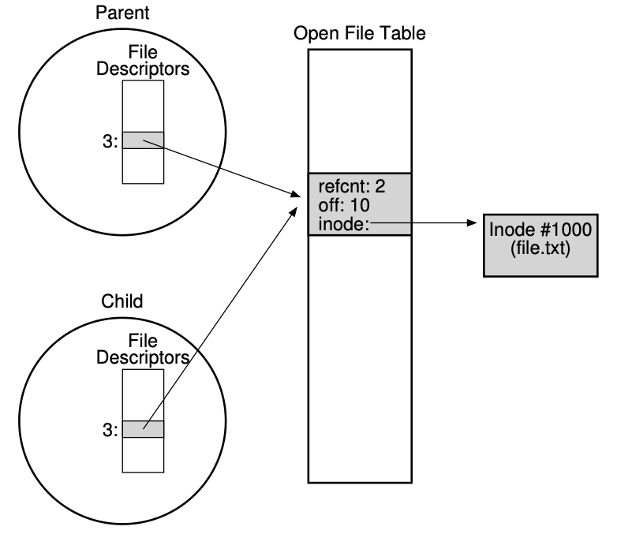

# Files and Directories

## Paths

* **Directory tree** instead of single root directory
* Store **path-to-inode mappings** in each directory
    * Reading for getting final inode is called “traversal”
* `open`, `read`, `write`, `close` system calls
* `ioctl` for custom configuration that doesn't quite fit. 

## File Descriptor (FD)

* `open()` returns: a file descriptor. A file descriptor is just an integer, **private per process**, and is used in UNIX systems to access files; thus, once a file is opened, you use the file descriptor to read or write the file, assuming you have permission to do so.
  * File descriptor is as a pointer to an object of type file
* Idea
    * Do expensive traversal once (open file)
    * Store inode in the file descriptor object (kept in memory)
* Each process: file descriptor table contains pointers to **open file descriptors**
* Integer used for file I/O are indexes to this table
    * stdin: 0, stdout: 1, stderr: 2
  * The subsequent file descriptors start from * 
```c
struct proc {
    ...
    struct file *ofile[NOFILE];
    ...
}
```
* the `file` array is indexed by the file descriptor. 
* Question: Why give user an integer instead of a pointer to the file description in kernel?
* Pointer is in the kernel space. User space process should not be able to access the file directly (kernel space address). 

## Interface
```c
int fd = open(char *path, int flags, mode_t mode);
read(int fd, void *buf, size_t nbyte);
write(int fd, void *buf, size_t nbyte);
close(int fd);
```
* If an attempted `read()` past the end of the file returns zero, it indicates to the process that it has read the file in its entirety.

## Other APIs

```c
char x = ‘c’;
FILE* f1 = fopen(“file.txt”, “wb”);
fwrite(“b”, sizeof(char), 1, f1);
fflush(f1);
FILE* f2 = fopen(“file.txt”, “rb”);
fread(&x, sizeof(char), 1, f2);
```

Note: 
* The first set of functions (open, read, write, and close) are part of the POSIX (Portable Operating System Interface) standard for low-level file I/O operations.
* The second set of functions (fopen, fwrite, fflush, fread) are part of the C standard library (stdio.h), providing a higher-level interface for file I/O operations. 

## High-level and low-level file operation

```c
printf("Beginning of line ");
sleep(10); // sleep for 10 seconds
printf("and end of line\n");
```
Print out everything at once. Write in the application buffer. 
```c
write(STDOUT_FILENO, "Beginning of line ", 18);
sleep(10);
write("and end of line \n", 16);
```
Outputs "Beginning of line" 10 seconds earlier than “and end of line”

* Why Buffer in Userspace? Overhead!
* Syscalls are 25x more expensive than function calls (~100 ns)

## Reading And Writing, But Not Sequentially
Reposition file offset within kernel (this is independent of any position held by high-level FILE descriptor for this file)!
```c
    off_t lseek(int fildes, off_t offset, int whence);
```
Values that `whence` can take: 
```
  If whence is SEEK_SET, the offset is set to offset bytes.
  If whence is SEEK_CUR, the offset is set to its current
    location plus offset bytes.
  If whence is SEEK_END, the offset is set to the size of
    the file plus offset bytes.
```
OS tracks a current `offset` for each file that it opens: `off` in the `struct file`. 
`read` and `write` also changes the current `offset`.

In `struct file`: 
```c
struct file {
  int ref;
  char readable;
  char writable;
  struct inode *ip;
  uint off; // Here
};
```
* Open file table. The xv6 kernel just keeps these as an array, with one lock for the entire table.
```c
struct {
  struct spinlock lock;
  struct file file[NFILE];
} ftable;
```

## Sharing files

* `fork`: increments the reference count. Parent and child shares the file.
* For example, if you create a number of processes that are cooperatively working on a task, they can write to the same output file without any extra coordination.
* 
* The `dup()` call allows a process to create a new file descriptor that refers to the same underlying open file as an existing descriptor.
* Open file description remains alive until no file descriptors in *any* process refer to it

## Should never call `fork` in a multi-threaded process.
* Other threads just vanish (what if these threads are holding a lock).
* It’s safe if you call `exec()` in the child
  * Replacing the entire address space

## Avoid mixing FILE* and File descriptor

```c
char x[10];
char y[10];
FILE* f = fopen(“foo.txt”, “rb”);
int fd = fileno(f);
fread(x, 10, 1, f); // read 10 bytes from f
read(fd, y, 10); // assumes that this returns data starting at offset 10
```
The `fread()` reads a big chunk of file into user-level buffer.
Might be all of the file.
* > If you want automatic buffering of input and output to reduce the number of system calls (which can be expensive), FILE * is the preferred choice.

## FSYNC: communicating requirements

* Most times when a program calls write(), it is just telling the file system: please write this data to persistent storage, **at some point in the future**.
* File system keeps newly written data in memory for a while
    * Write buffering improves performance
* If system crashes before buffers are flushed, then lose data
* `fsync(int fd)`
    * Forces buffer to flush to disk
    * Tells disk to flush its write cache
      * Many of the HDD and SSD have their own write cache. 
    * Makes data durable
* In the UNIX world, the interface provided to applications is known as `fsync(int fd)`. When a process calls `fsync()` for a particular file descriptor, the file system responds by forcing all dirty (i.e., not yet written) data to disk, for the file referred to by the specified file descriptor. The `fsync()` routine returns once all of these writes are complete.

## Getting information about a file

* `fstat`: contain information stored in places such as inode.
* Inode is a persistent data structure, but are cached in memory for performance reasons.
  * The inode number `d_ino` indexes a table of inodes on the file system. From the inode number, the kernel's file system driver can access the inode contents, including the location of the file, thereby allowing access to the file.

## Reading directories
* `opendir()`, `readdir()`, and `closedir()`
* `struct dirent` data structure
```c
struct dirent {
  char d_name[256]; // filename
  ino_t d_ino; // inode number
  off_t d_off; // offset to the next dirent
  unsigned short d_reclen; // length of this record
  unsigned char  d_type; // type of file
};
```

## Deleting Files

* There is no system call for deleting files!
  * It just calls `unlink()`.
* Inode (and associate file) is **garbage collected** when there are no references
    * Paths are deleted when `unlink()` is called
    * FDs are deleted when `close()` or process quits
* `link`: an old pathname and a new one; when you “link” a new file name to an old one, you essentially **create another way to refer to the same file**.
* The way `link()` works is that it simply creates another name in the directory you are creating the link to, and refers it to the same inode number (i.e., low-level name) of the original file. The file is not copied in any way;
* Hard link
  * `ln` command
    * Hard links are somewhat limited: you can’t create one to a directory (for fear that you will create a cycle in the directory tree); you can’t hard link to files in other disk partitions (because inode numbers are only unique within a particular file system, not across file systems); etc. Thus, a new type of link called the symbolic link was created
    * A hard link is essentially another name for an existing file on disk
        * All hard links to a file point to **the same inode**, and the same data blocks
* What `link` does:
  * First, you are making a structure (the inode) that will track virtually all relevant information about the file, including its size, where its blocks are on disk, and so forth. Second, you are linking a human-readable name to that file, and putting that link into a directory.
  * The reason this works is because when the file system unlinks file, it checks a reference count within the inode number. This reference count (sometimes called the link count) allows the file system to track how many different file names have been linked to this particular inode. 
    * only when the reference count reaches zero does the file system also free the inode and **related data blocks**, and thus truly “delete” the file.
    * **THis is all for safety**
* Soft link (symbolic link)
    * `ln -s`. 
    * Difference
        * A symbolic link is actually a file itself, of a different type
        * A symbolic link is a separate file that contains a reference to another file or directory in the form of an absolute or relative path to target
            * **Have their own inode numbers**
    * Potential problem
        * Dangling reference
        * Quite unlike hard links, removing the original file named file causes the link to point to a pathname that no longer exists

## Permission Bits and ACL

* UNIX: **permission bits**
    * Three groupings of permissions
        * What the **owner** of the file can do to it
        * What someone in a **group** can do to the file
        * What anyone (i.e. **other**) can do

* **Access control list (ACL)**
    * More complicated control to represent exactly who can access a given resource
    * Enable a user to create a specific list of who can and cannot read a set of files
        * V.s. limited owner / group / everyone model of permission bits

* Later: capability based system. 

## Making and Mounting FS

* Make a file system: `mkfs`
    * Give the tool, as input, a device (e.g. a disk partition), a file system type (e.g., ext3)
    * Write an empty file system, start with root directory, onto that disk partition
* To make a FS accessible within the **uniform file-system tree**: `mount`
    * Idea: take existing directory as a **target mount point** and essentially paste a new FS onto the directory tree at that point

# File System Implementation: Very Simple File System 

## Overall Organization 

* **block**: commonly 4KB
* **How to store it?**
    * **Data region**: the region of disk used for user data
    * **Metadata:** keep track of information about each file
        * the size of the file, its owner and access rights, access and modify times, and other similar kinds of information
        * File systems usually have a structure called an inode
        * This portion of the disk is the **inode table**
    * **Allocation structure:** track whether inodes or data blocks are freed or allocated
        * E.x. free list: points to the first free block, then the next
        * E.x. **bitmap: data bitmap (d), inode bitmap (i)  (0 for free, 1 for in-use)**
        * Chosen in the example below
    * **Superblock:** contains the information about the **particular file system**
        * E.x. how many inodes and data blocks are in the file system, where the inode table begins, identify the file system type, etc.
    * 
* E.x. when mounting a FS
    * OS will read the superblock first to initialize various parameters, then attach the volume to the file system tree
    * When files within the volume are accessed, the system will know exactly where to look for the needed on-disk structure

## File Organization: The Inode 

```c
#define N_DIRECT 12

typedef struct {
    mode_t file_type_and_permissions;  // File type and permissions
    uid_t uid;                         // Owner's user ID
    gid_t gid;                         // Owner's group ID
    time_t ctime;                      // Creation time
    time_t mtime;                      // Modification time
    time_t atime;                      // Access time
    size_t size;                       // Size of the file in bytes
    int link_count;                    // Number of hard links
    int direct_pointers[N_DIRECT];     // Direct pointers to data blocks
    int single_indirect_pointer;       // Pointer to a single indirect block
    int double_indirect_pointer;       // Pointer to a double indirect block
    int triple_indirect_pointer;       // Pointer to a triple indirect block
} inode;
```
* Inode: index node 
  * Used because these nodes where originally arranged in an array, and the array indexed into when accessing a particular node
  * Generic name used in FS to describe the structure that holds the metadata for a given file (i.e. length, permissions, location of its blocks)
  * referred to with i-number. 
    * I-number is used to index into an array of inodes. 
  * Each inode stores a bunch of pointers. 
* Information
    * Type: regular, directory, etc.
    * Size
    * Number of blocks allocated to it
    * Protection information (who owns the file, who can access it)
    * **Some time information (when the file was created, modified, last accessed)**
    * Where its data block reside on disk
        * How?
            * Direct pointers (disk addresses) inside each inode
              * **We need an direct pointer per data block.**
              * For a 36KB file, if each data block is 4KB, we need 9 data blocks. and 9 direct pointers to these 9 data blocks. 
                * Cons: limited, you want to have file really big (i.e. bigger than block size)?
                * **Multi-level index: indirect pointer**
                    * Instead of pointing to a block that contains the user data
                    * Points to a block that contains more pointers, each of which point to the user data
                    * An inode may have some fixed number of direct pointers, and a single indirect pointer
                    * Even larger file: **double indirect pointer**
                        * Refers to a block that contains pointers to indirect blocks
                        * Each of which contain pointers to data blocks
                    * E.x. Linux ext2, ext3, UNIX file system
                * Others use **extents** instead of pointers
                    * Akin to segments in virtual memory
                    * Simply a **disk pointer plus a length (in blocks)**
                    * Instead of requiring a pointer for every block of a file, all one needs is a pointer and a length to specify the on-disk location of a file
                    * Just a single extent is limiting, as one may have trouble finding a contiguous chunk of on-disk free space when allocating a file. Thus, extent-based file systems often allow for more than one extent, thus giving more freedom to the file system during file allocation
                * **Pointer v.s Extent**
                    * Pointer: more flexible but use large amount of metadata per file (particularly for large file)
                    * Extent: **less flexible but more compact**, work well when there is enough free space on the disk and files can be laid out **contiguously** (this is why it is less flexible, usually requiring laying out files contiguously). 
            * **A single indirect block** contains an array of pointers (typically 4 or 8 bytes each, depending on the architecture) that each point to a data block.
              * If each block is 4 KB and pointers are 4 bytes, a single indirect block can contain 1024 pointers, allowing it to address 4 MB of data.

## Directory Organization

* A directory basically just contains a list of (entry name, inode number) pairs
* For each file or directory in a given directory
    * There is a string and a number in the data block(s) of the directory
    * For each string, there may also be a length
* Each entry has an inode number, record length (the total bytes for the name plus any left over space), string length (the actual length of the name), and finally the name of the entry.
* 


## Free space management

* The system must track which inodes and data blocks are free, and which are not
* When a new file or directory is created, it is able to find the space for it
* **Free space management** with two bit maps
    * First, search through bitmap for an inode that is free, and allocate it to the file, marked it as used, and update the bitmap eventually
    * Update the data block similarly
* **Pre-allocation policy**: look for contiguous blocks
  * For example, some Linux file systems, such as ext2 and ext3, will look for a sequence of blocks (say 8) that are free when a new file is created and needs data blocks; by finding such a sequence of free blocks, and then allocating them to the newly-created file, the file system guarantees that a portion of the file will be contiguous on the disk, thus improving performance.

## Access paths: reading and writing 

### Reading

* The file system must **traverse** the pathname and thus located the desired node
* All traversals begin at the root of the file system, in the **root directory**
* The amount of I/O generated by the open **is proportional to the length of the pathname**
    * For each additional directory in the path, read its inode and data
* Open(`\foo\bar`): All traversals begin at the root.
  * Read the inode of the root directory (typically 2). 
  * Read block that contains inode number 2.
  * Look inside the block to find pointers to data blocks (content of the directory)
  * Read through the directory, looking for the entry for the next directory in the path (`foo`)
  * Find the inode number for foo (say 44).
  * Recursively traverse the pathname. 
  * The final step of open() is to read bar’s **inode** into memory; the FS then does a final permissions check, allocates a file descriptor for this process in the per-process open-file table (file descriptors), and returns it to the user.
