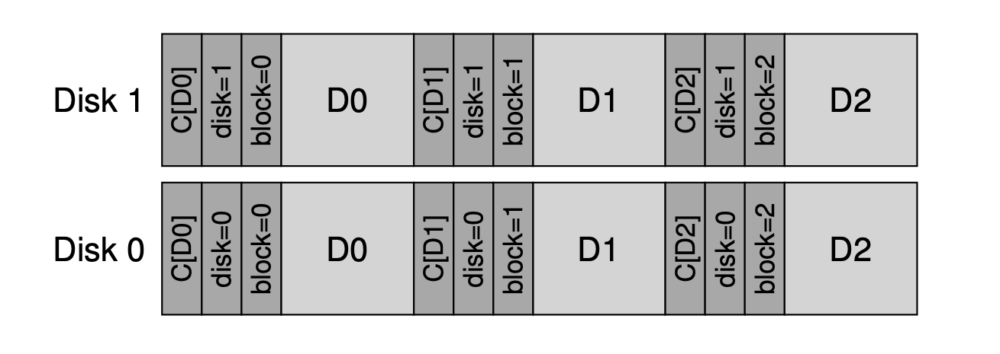

# Data Integrity and Protection

## Disk Failure Modes

* **Fail-stop:** either the entire disk is working, or it fails completely, and the detection of such failures is straightforward
    * E.x. in RAID
* Other modes
    * Seem to be mostly working but have trouble accessing one or more blocks: **fail-partial disk failure model**
        * **Latent-sector errors (LSEs)**
        * **Block corruption**

## Latent-sector Errors

### What it is

* Arise when a disk sector (or group of sectors) has been damaged in some way
* E.x. disk head damage the surface (head crash), making bits unreadable, or flip bits
* In-disk **error correcting codes (ECC**) are used by the drive
    * To determine whether on-disk bits in a block are good, and in some case, to fix them
    * If can’t fix, return error

### How to handle

* Latent sector errors are rather straightforward to handle, as they are by definition easily detected
* When storage system tries to access a block
    * The disk returns an error, the storage system should simply use whatever redundancy mechanism it has to return the correct data
    * E.x. mirror RAID: return alternate copy; RAID-4 or RAID-5: based on parity, reconstruct block from the other blocks
* RAID: both full-disk faults and LSEs arise
    * Reconstruction cannot successfully complete when both happens
    * Solution: extra degree of redundancy!
        * RAID-DP: two parity disk

## Block Corruption

### What it is

* A disk block becomes corrupt in a way not detectable by the disk itself (i.e. **silent faults**)
* E.x. buggy disk firmware write a block to wrong location
    * Disk ECC indicates block contents seem fine, but client’s perspective wrong block is returned
* E.x. block get corrupted when it is transferred from host to disk across a faulty bus

### Detecting corruption: the checksum

* Primary mechanism in modern storage system to preserve data integrity is called the **checksum**
* **Common checksum function:** vary in strength and speed
    * XOR: XOR’ing each chunk of the data block being checksumed, produce a single value that represents the XOR of the entire block
        * Cons: If, for example, two bits in the same position within each checksummed unit change, the checksum will not detect the corruption
    * Addition
        * Pros: fast, 2’s complement addition
        * It can detect many changes, but not good if the data, e.x., is shifted
* It is possible two data blocks with non-identical contents will have identical checksums, something referred to as a **collision**
    * We want to find one that minimize the chance of collisions
* How should checksum be stored in disk?
    * If disk can format drive with 520 byte sectors (512 bytes chunks + 8 bytes checksum), then put checksum close to data

## New Problem: Misdirected Writes

* Unusual failure modes
* **Misdirected Writes**
    * Arises in disk and RAID controllers which write the data to disk correctly, except in the **wrong location**
* **How to detect?**
    * Adding a physical identifier (physical ID) to each checksum
    * E.x. stored information contains the checksum and both the disk and block number of the block
* 

## One last problem: lost writes

* Occurs when the device informs the upper layer that a write has completed but in fact it never is persisted
* Thus, what remains is the old contents of the block rather than the updated new contents
* Detection?
    * Checksum and physical identity? The old block checksum will match the data, and the physical identify is also correct
    * Sol: **Write verify** or **read-after-write**
        * Immediately reading back the data after a write
        * Pros: slow approach, doubling the # of I/Os needed to complete a write
    * Sol: **checksum elsewhere** in the system to detect lost write
        * ZFS: include checksum in each FS inode and indirect block for every block included within a file
        * Even though write to data block itself is lost, the checksum within the inode will not match the old data
        * Only if writes to both inode and data are lost simultaneously will such a scheme fail

## Scrubbing

* Periodic disk scrubbling: reading through every block of the system and checking whether the checksum is still valid

## Checksum overheads

* **Space:** usually small
    * On-disk itself: takes up room
    * Memory: if checksums kept in memory (For an added level of protection against memory corruption)
* **Time**: **quite noticeable**
    * CPU overhead: CPU must compute checksum over each block, both when data is stored (to determine value of stored checksum), and when it is accessed (to compute and compare)
    * Approach: combine data copying and checksumming into streamlined activity
        * Copying is needed anyhow
    * I/O overhead
        * Checksums are stored distinctly from data (extra I/Os to access them)
        * Extra I/Os for background scrubbing