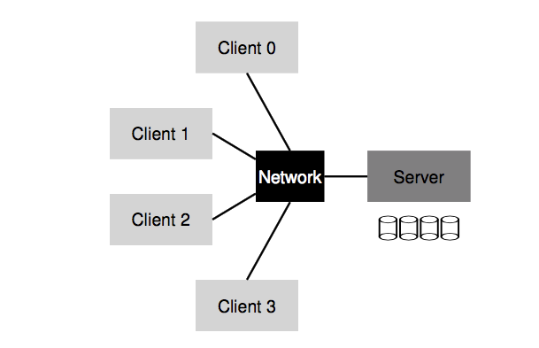
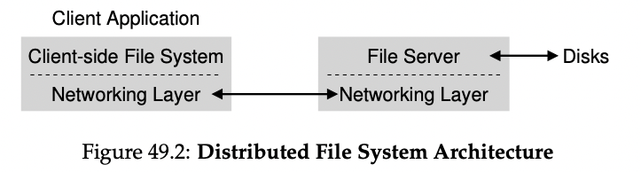

# Design and Implementation of the Sun Network Filesystem (NFS) (1985) 

Link: https://www.cs.ucf.edu/~eurip/papers/sandbergnfs.pdf

Read: June 25th, 2024.

NFS is a **distributed file system** designed to make sharing of filesystem resources in a network of non-homogeneous machines easier. Design goals are 

* Client-side FS: 
    * A client application issues system calls to the client-side FS (i.e. `open()`, `read()`, `write()`, `close()`, `mkdir()`)
    * Transparent access to files
* Server-side FS: reply to client request
* Benefits
    * Easy sharing of data across clients
    * Centralized administration (e.x. backing up files)
    * Security (e.x. secure servers)
    * 
* 

## Others

* Portable to other OS and machine architecture
* Implemented on top of RPC.
* the `mount` command was modified to take additional arguments including a filesystem type and options string.

## Goals
* **Crash recovery** (main goal): recover easily from server crashes
* Transparency and UNIX semantics: access remote files as local 
* **Reasonable performance**
* Machine & OS independence: being able to supply files to different types of clients 

## Techniques 
There are a few techniques used to achieve these goals 

### * Simple and fast recovery: _statelessness_
*  Stateless protocol: **server does not keep track of anything about client**
    *  most requests are **idempotent** (e.x. `LOOKUP`, `READ`, `WRITE`)   
    *  This also means that the server has to flush all modified data to disk before returning to the call.
*  Key structure: file handle (FD)
    *  <volume id, inode id, generation #>     
    *  * *Volume identifier* —> which FS the request refers to
       * NFS server can export more than one FS
   * *Inode identifier* —> which file within that volume the request is accessing
   * *Generation number* —> needed when reusing an inode number
       * Increment it whenever an inode number is reused
       * Ensure that a client with an old file handle can’t accidentally access the newly allocated file
   * New fhandles are returned by the lookup, create, and mkdir procedures which also take an fhandle as an argument.
     * Pathname traversal is done in the kernel by breaking the path into directory components and doing a lookup call through the vnode for each component.
     * In the NFS filesystem, passing whole pathnames would force the server to keep track of all of the mount points of its clients in order to determine where to break the pathname and this would violate server statelessness. 
        * Partly a reason that the file system can be mounted to any vnode. 
   * The root directory file handle is obtained with `MOUNT`.
*  Steps 
    *  Every client RCP call pass a **FD**
    *  server fails: client retires
*  * Stateful protocol
    * **Shared / distributed state complicates crash recovery**
      * A client that opens a file crashed.
    * Server maintain a file descriptor to actual file relationship

### * Transparency: mounting
*  use `MOUNT` to attach a *remote* file system to a directory
*  Hostname lookup and address binding once per FS

### * Performance: caching 

#### Server: buffer writes 
* Performance v.s durability: if server crash
    *  put in battery-backed mem, or use faster medium to write
 
### * Machine & OS independences: VFS / Vnode interface 
* *Virtual File System (VFS)*: **includes operations that are done to the entire file system**
    * E.x. mounting, unmounting, getting FS-wide statistics, forcing dirty writes to disk, etc.
* *Virtual node (Vnode)*: **includes all operations one can perform on a file**
    * E.x. open, close, reads, writes, etc.
* - To build a new FS, one just needs to define these “methods”
* The framework will handle the rest
    * connecting sys calls to particular FS implementations
    * performing generic functions common to all FS (e.g. caching)
    * and thus enabling multiple FS implementations to coexist in the same OS
 
## Problem 
* Security in early NFS implementation was lax: easy for any user on a client to masquerade as other users and gain access to virtually any file 
* Performance: though with caching, still a bunch of issues 

### Concurrent accesses
* In the local filesystem, file modifications are locked at the inode level. This prevents two processes writing to the same file from intermixing data on a single write.
* Since the NFS server maintains no locks between requests, and a write may span several RPC requests, two clients writing to the same remote file may get intermixed data on long writes.

### NFSv2 Protocol

* `LOOKUP`
    * Used to obtain a file handle
      * Input: directory file handle and name of a file to look up
      * Output: file handle (or directory) plus its attribute
      * Assume client already has file handle for root dir (`/`) (with **mount protocol**)
    * If a long pathname must be traversed (e.g., /home/remzi/foo.txt), the client would send three `LOOKUP`s.
    * **Third, each server request has all the information needed to complete the request in its entirety. Ensure stateless server.**
* `READ`
    * Input: file handle of the file, along with offset within the file and # of bytes to read
    * `WRITE` is handled similarly
* `GETATTR`
    * Given a file handle, it simply fetches the attributes of that file, including the last modified time. Important for caching

### Handling server failure with idempotent operations

* Server can fail to reply
    * 1) request lost
    * 2) server down
    * 3) reply lost on the way back from server
* Approach: client simply retries the request
* Property: most NFS requests are **idempotent**
    * **Def:** when the effect of performing the operation multiple times is equivalent to the effect of performing the operation a single time
    * E.x. `LOOKUP` and `READ`
    * E.x. `WRITE`
        * If, for example, a `WRITE` fails, the client can simply retry it. The WRITE message contains the data, the count, and (importantly) the exact offset to write the data to.
        * Thus, it can be repeated with the knowledge that the outcome of multiple writes is the same as the outcome of a single one
    * Some operations are hard to make idempotent
        * E.x. `MKDIR`

### Improving performance: client-side caching

* NFS client-side FS caches file data (and metadata) that it has read from the server in client memory
    * First access expensive, consecutive one fast
    * Cache: temporary buffer for writes
* **Cache consistency problem**
    * P1: update visibility - when do updates from one client become visible at other clients?
        * NFSv2 clients implement **flush-on-close** (a.k.a., **close-to-open**) consistency semantics
        * Problem: temporary file soon being deleted
    * P2: stale cache - e.x. C1
        * NFSv2 client first check to see whether a file has changed before using its cached contents with `GETATTR` request
        * If out-dated, then **client** **invalidates** the file and removing it from client cache
        * Problem: flooded with `GETATTR` request
        * Remedy: attribute cache was added to each client; attribute for a particular file were placed in cache when file was first accessed, then would timeout
        * **Attribute cache has low TTL.**

### Implication on server-side write buffering

* If NFS servers may NOT return success on a WRITE protocol request until the write has been forced to stable storage
    * This might cause problem if the server crash
* If NFS commit each write to stable storage before informing success
    * Write performance can be bottleneck
    * Some tricks
        * First put writes in a **battery-backed memory**
        * Second is to use a FS specifically designed to write to disk quickly

## Limitations

* The two remaining problem areas are getattr and write. 
* The reason is that stat-ing files causes one RPC call to the server for each file. In the local case the inodes for a whole directory end up in the buffer cache and then stat is just a memory reference. 
* The write operation is slow because it is synchronous on the server. Fortunately, the number of write calls in normal use is very small (about 5% of all calls to the server, see appendix 2) so it is not noticeable unless the client writes a large remote file.