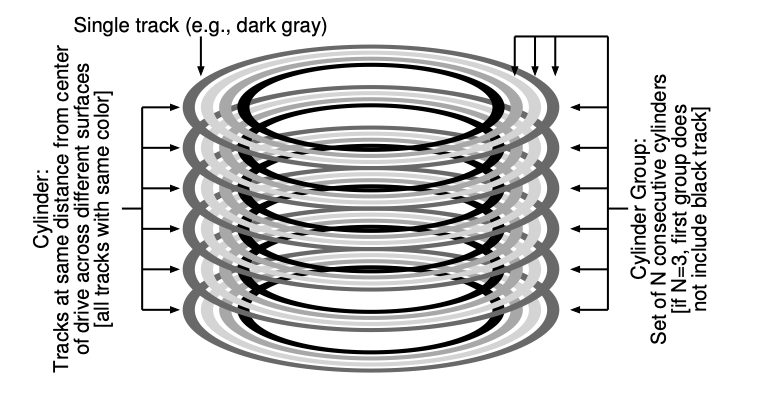

# Fast File System (1984) 

Link: https://dsf.berkeley.edu/cs262/FFS.pdf

Read: July 11th, 2024.

The old UNIX file structure consists of large chunks of super block, inode region, and data region: data was spread all over the place ignoring positioning cost, data blocks are often very far away from the inode. 

Problems: all about performance 
1) _The old FS only deliver 2% of the overall bandwidth_
   1) Applications care about high throughput, e.g. image processing and VLSI design. 
2) Fragmented FS
3) Original block size was too small, positioning overhead is huge

FFS is the first **disk-aware file system** that improves performance by changing FS structures and allocations policies. 

## Goal: performance 
Key optimizations:
* Improve locality of the data structures
  *   Use disk block _groups_ to keep files within consecutive blocks 
  *   File inodes allocate in the same group with directory
  *   Directory inodes allocated in new group with fewer used inodes than average group
  *   First data blocks allocated near inodes
  *   Other data blocks allocate near data blocks
  *  Reduce fragmentation of disk blocks by allocating contiguously from the bit maps
* Increase block size to inmprove performance
  *   To mitigate internal fragmentation, also uses sub-blocks
 
## Secondary goal: usability    
* Long file names
* Atomic rename
* Symbolic links
  *  hard link limited, can't point to directories, can't point to files across volumes    

# Locality and the Fast File System (FFS) 

The old UNIX file system data structures look like this:

- Superblock: information about the entire FS
- Inode region: contain all inodes for the file system
- Most disk is taken up by the data blocks
- 

## Problem

- **Performance**
    - FS only deliver 2% of the overall disk bandwidth!
    - Issue: old UNIX FS treated disk like it was random-access memory
        - Data was spread all over the place ignoring the positioning costs
        - Data blocks are often very far away from inode
- The file system get **fragmented**
    - Free space are not carefully managed.
    - A file is divided across multiples ranges of blocks. (due to freeing, etc.)
    - Free list ended up pointing to a bunch of blocks spread across the disk。
    - The result was that a logically contiguous file would be **accessed by going back and forth across the disk**, thus reducing performance dramatically. Disk seek is expensive. 
- Original block size was too small (i.e. 512 bytes)
    - Transferring data from disk was inherently inefficient
    - Smaller blocks were good to minimized **internal fragmentation** (i.e. waste space within the block), but bad for transfer as each block might require a positioning overhead to reach it

## FFS: Disk Awareness is the Solution

- A group at Berkeley decide to build a better, faster file system!
- Fast File System (FFS)
    - The idea was to design the file system structures and allocation policies to be “disk aware” and thus improve performance
    - Keep the same interface to the file system (i.e. same API)
    - But change the internal implementation

### Organizing structure: the cylinder group

- Cylinder: multiple tracks that are of the same distance.
- Cylinder group: multiple cylinders arranged in a group.
  - **Modern File System calls Cylinder Group as Block Group.**
  - Book-keeping information is kept at the start of the cylinder group.
    - Including superblock, inode bitmap, data bitmap.
    - After which we have inodes and data. 
      - Such that inodes and data blocks should be relatively close to each other. 
      - Files of the same directory are near each other. 
  - The placement of directories: find the cylinder group with a low number of allocated directories and a high number of free inodes. 
- modern drives do not export enough information for the file system to truly understand whether a particular cylinder is in use;
- instead organize the drive into block groups, each of which is just a consecutive portion of the disk’s address space. 
1. **Change the on-disk structures** 
    1. **Key idea:** keep inode close to data 
        1. Use group across disks
        2. Strategy: allocate inodes and data blocks in the same group 
    2. FFS: groups are ranges of cylinders called **cylinder groups**
        1. In ext2, ext3, ext4, groups are ranges of blocks, called block group 

### Policies: how to allocate files and directories

- Basic idea: *keep related stuff together (keep unrelated stuff far apart!)*

> Since data blocks for a file are typically accessed together, the policy routines try to place all data blocks for a file in the same cylinder group, preferably at rotationally optimal positions in the same cylinder. 

- Rules
    1. Put directory entries near directory inodes
    2. Put inodes near directory entries 
    3. Put data blocks near inodes 
- Problems: file system is one big tree, all directories and files have a common root
    - All data in same FS is related in some way!
- **Revised strategy**
    - File inodes: allocate in the same group with directory
    - Directory inodes: allocate in new group with fewer used inodes than average group
    - First data block: allocate near inodes
    - Other data blocks: allocate **near previous block**
- A per-group inode bitmap (ib) and data bitmap (db) serve this role for inodes and data blocks in each group. 
- Problem: large files, which can fill nearly all of a group, displace data for many small files
    - Assumption: most files are small! Better to do one seek for large file than one seek for each of many files
        - Define large file as requiring an indirect block
    - **Policy**
        - Large file data blocks: after 48KB, go to new group
        - Move to another group (w/ fewer than average blocks) every subsequent 4MB
        - Effectively, large files are divided into parts and placed in several groups. 
    - Without large-file exception:
      - 
    - With large file exception:
      - 

### Other FFS Features: usability

- **Sub-blocks** (which were 512-byte little blocks that the file system could allocate to files.)
  - Before 4KB blocks are good for transferring, but might lead to internal framgmentation.
  - As the file grew, the file syst em will continue allocating 512-byte blocks to it until it acquires a full 4KB of data. At that point, FFS will find a 4KB block, copy the sub-blocks into it, and free the sub-blocks for future use.
    - FFS can also modify the libc to buffer writes and then issue them in 4KB chunks to the file system. 
- Large blocks (with libc buffering / fragments)
> To be able to use large blocks without undue waste, small files must be stored in a more efficient way. The new file system accomplishes this goal by allowing the division of a single file system block into one or more fragments. 

- Long file names
- Atomic rename
    - `rename` operation for renaming files
- Hard links and symbolic links. 
- Problem: 
  - FFS would first issue a read to block 0; by the time the read was complete, and FFS issued a read to block 1, it was too late: block 1 had rotated under the head and now the read to block 1 would incur a full rotation.
  - FFS was smart enough to figure out for a particular disk how many blocks it should skip in doing layout in order to avoid the extra rotations; this technique was called parameterization, as FFS would figure out the specific performance parameters of the disk and use those to decide on the exact staggered layout scheme.
  - Fortunately, modern disks are much smarter: they internally read the entire track in and buffer it in an internal disk cache (often called a track buffer for this very reason). Then, on subsequent reads to the track, the disk will just return the desired data from its cache.
