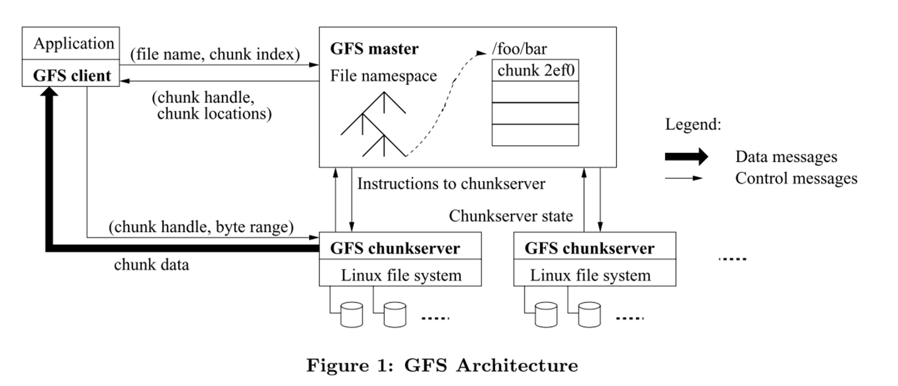
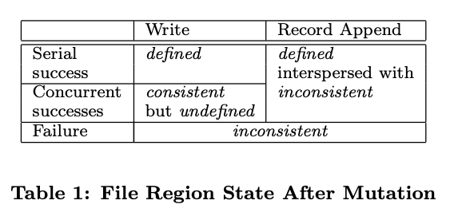

# The Google File System (2003) 

Link: https://static.googleusercontent.com/media/research.google.com/en//archive/gfs-sosp2003.pdf
Useful notes: https://pages.cs.wisc.edu/~thanhdo/qual-notes/fs/fs4-gfs.txt

Read: Dec 25th, 202* 

GFS is a scalable distributed file system for large distributed data-intensive applications. It provides **fault tolerance** running on inexpensive commodity hardware, and it delivers high aggregate performance to large number of clients. 

## Motivation 
* Component failures are norm, not exception
* Large files
   *  **multi-GB, TB**
   *  Untenable to manage billions of smaller files, even when the FS can support it. 
   *  v.s. LFS: lots of small files
* Workloads: append-only 
   *  e.x. log collections, web search, archival storage. 
   *  Random accesses are practically non-existent
   *  large streaming reads, small random reads
   *  many large, **sequential** writes; none random writes

* Requirements: multiple clients concurrently append to the same file. Our files are often used as producer-consumer queues or for many-way merging.
   * Hundreds of producers, running one per machine, will concurrently append to the same file.
   * Atomicity with minimal synchronization overhead is essential. 

## Architecture 

* Control plane: single **master**
    *  **Store metadata: namespace mapping**
    *  Stores all chunk metadata, 
    *  Control: garbage collection, chunk migration, chunkserver states 
    *  The master periodically communicates with each chunkserver in **HeartBeat** messages to give it instructions and collect its state. 
* Data plane: multiple **chunk servers**
    * Files are divided into fixed sized chunks. 
      * Idnentified by **chunk handles** (globally unique) assigned by the master at the time of **chunk creation**. 
    *  Store chunks on local disks as Linux files.
       *  Read and write via **chunk handle** and byte range. 
*  GFS has snapshot and record append operations.
*  Neither the client nor the chunk server caches file data. The data is too large to be cached, or stream through the files. 
      
## Fault tolerance & scalability: Replication 
**Chunks**: are replicated **3-way** to handle faults
* Use large chunk size (64MB) 
    * Handle lots of operations on a given chunks
    * Reduce size of **metadata** stored on server and network communication in-between
    * Beneficial for sequential writes
    * **Reason**: clients can easily cache all the chunk location information for a multi-TB working set. 
    * A **persistent TCP** to chunk server since the clients can operate more on the chunk for an extended period of time. 
* Lease: maintain a consistent mutation order across replicas
* **Chunk lease to one replica for each chunk (i.e. primary replica), which decides serial order for all mutations to the chunk**
* Check data integrity using checksum blocks in each chunkserver
* Data forwarding is pipelined for efficiency, and is also network-aware

**Master**: 
* replicated logs and checkpoints, has a shadow master 
* Operation log of all metadata changes. 
* Store metadata in memory, does not keep a persistent record of which chunkservers has a replica of a given chunk. It simply polls upon startup. 
* A single master simplifies the design; however, we must minimize its involvement in read and write so it doesn't become a bottleneck. 
* Client asks master which chunk server it should contact. 
* Client caches this information from the master, and interacts with the chunk server directly for many subsequent operations. 
  * Using the fixed chunk size, the client translates the file name and byte offset specified by the application into a **chunk index** within the file. Then, it sends the master a request containing the file name and chunk index. The master replies with the corresponding chunk handle and locations of the replicas.
  * The request includes chunk handle and **byte offset within that chunk**.

## Relaxed consistency 

* 
* **Consistency**: A file region is consistent if all clients will always see the same data, regardless of which replicas they read from.
* **Defined**: A region is defined after a file data mutation if it is consistent and clients will see what the **mutation writes in its entirety**. 
* Concurrent successful mutations (write to a specific offset) leave the region undefined but consistent: all clients see the same data, but it may not reflect what any one mutation has written.
  * Basically, contains mingle fragments of multiple mutations.
* GFS deploys a relaxed consistency model: data is appended **_atomically_ _at least once_** even in the presence of concurrent mutations, but at an offset of GFS' choosing. 
  * Concurrent writes only specify the data, and not the offset!
* Stale replicas will never be involved in a mutation or given to clients asking the master for chunk locations. They are garbage collected at earliest opportunity. 

* GFS may insert padding or record duplicates in between. GFS assumes that client applications can handle the inconsistent state: i.e. filter out occasional padding and duplicate using checksums (or unique IDs in the records). This also helps improving performance. 

* As a result, replicas of the same chunk may contain different data possibly including duplicates of the same record in whole or in part. GFS does not guarantee that all replicas are bytewise identical. It only guarantees that the data is written **at least once** (the reason why it is defined but interspersed with inconsistent) as an atomic unit.

* This property follows readily from the simple observation that for the operation to report success, the data must have been written at the same offset on all replicas of some chunk.

Just use a future / higher record if the past one fails. 
* In terms of our consistency guarantees, the regions in which successful record append operations have written their data are defined (hence consistent), whereas intervening regions are inconsistent (hence undefined).

## Replication Order
* Thus, the global mutation order is defined first by the lease grant order chosen by the master, and within a lease by the serial numbers assigned by the primary.
* Primary is the replica that is granted the chunk lease. 
* Primary does serialization; it applies the mutations to its own local state in serial number order. The primary forwards the write request to all secondary replicas. **The secondary replica applies mutations in the same serial order assigned by the primary**. 
* GFS does not guarantee that all replicas are bytewise identical. It only guarantees that the data is written at least once as an atomic unit. [I don't fully understand this.]

## Decoupling control flow with data flow

* While control flows from the client to the primary and then to all secondaries, **data is pushed linearly along a carefully picked chain of chunkservers in a pipelined fashion.** Our goals are to fully utilize each machine’s network bandwidth, avoid network bottlenecks and high-latency links, and minimize the latency to push through all the data.
* The data is pushed linearly along a chain of chunkservers rather than distributed in some other topology (e.g., tree).
* Each machine forwards the data to the closest machine in the network topology that has not received it. 

## Limitations 
* Only one GFS master might become the single point of bottleneck for metadata operations. 

## Snapshot 
Use standard copy on write mechanism. 
* Our users use it to quickly create branch copies of huge data sets (and often copies of those copies, recursively)
* Checkpoint the current state before experimenting with changes that can later be committed or rolled back easily.
* When the master receives snapshot requests, it revokes outstanding lease on the chunks that is about to snapshot. Any subsequent write to that chunk requires an interaction with the master.
* Master logs the snapshot operation to disk. 
* Upon a new write, copy the replica on the same chunkserver, and then update the metadata with the new chunk handle. 

## Stale replica
* Detect stale replica with version number.
* When master grants a lease, it increments the version number of the primary replica.

## Data integrity.
* Each chunk server maintains **checksums** to verify the integrity of its own copy of data. 
* **Checksums have to be compared for every read** before returning any data to the requestor. 
* Checksums have little performance impact. (1) Reads span at least a few blocks. (2) Checksums are done with I/O.

* Separation of control plane (namespace) and data plane (chunk servers) allows for scalability.
* **contact closest servers to propagate data**.
* primary propagate order. (after data is propagated)
* Clients push data to closest replicas (can be secondary replica A, primary replica, then secondary replica B). 

## Pipelining writes
* Why pipeline write?
	- Fully utilize each machine's bandwidth
		+ each machine's full bandwidth is used to transfer the data as fast
		  as possible, rather than divided among multiple recipient
	- Avoid network bottlenecks and high-latency links
		+ each machine forwards the data to the "closest" machine in the 
		  network topology that has not received it
	- Minimize latency:
		+ pipelining the data transfer over TPC connections
		+ once a chunkserver receives some data, it starts forwarding right away
  

## Questions:
* Data consistency is unclear. 
* Concurrent *successful* mutations leave the region undefined but consistent: all clients see the same data, but it may not reflect what any one mutation has written.
  * WHY IS THAT successful?
* A failed mutation makes the region inconsistent (hence also undefined): different clients may see different data at different times.