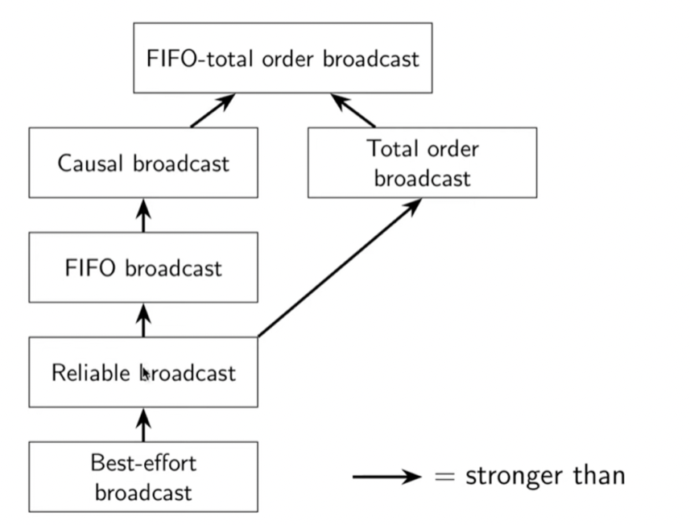
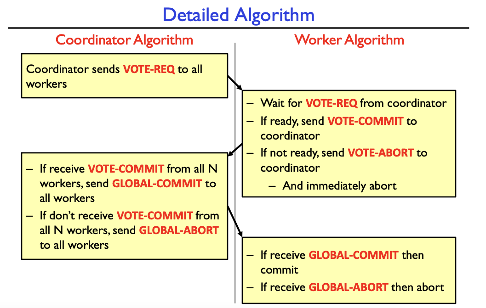
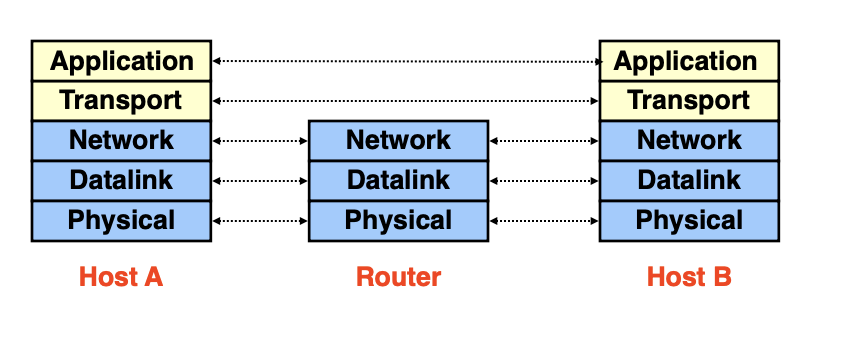
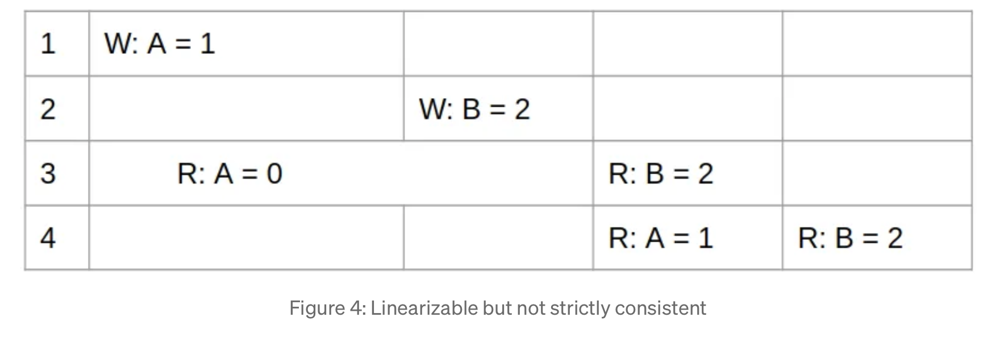
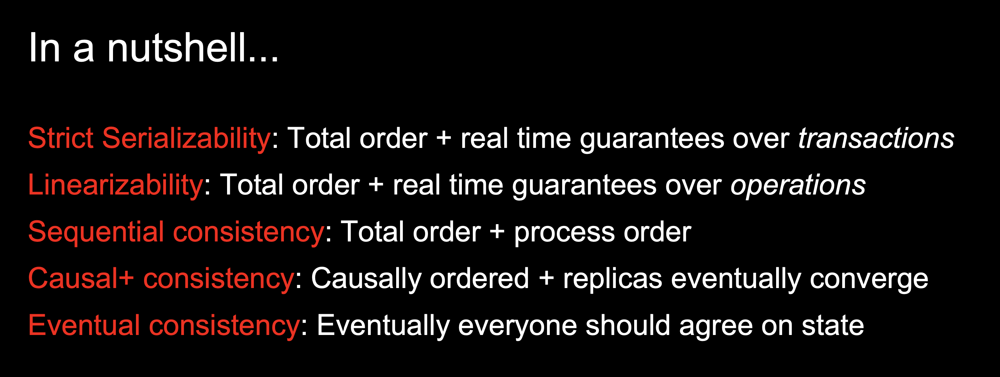
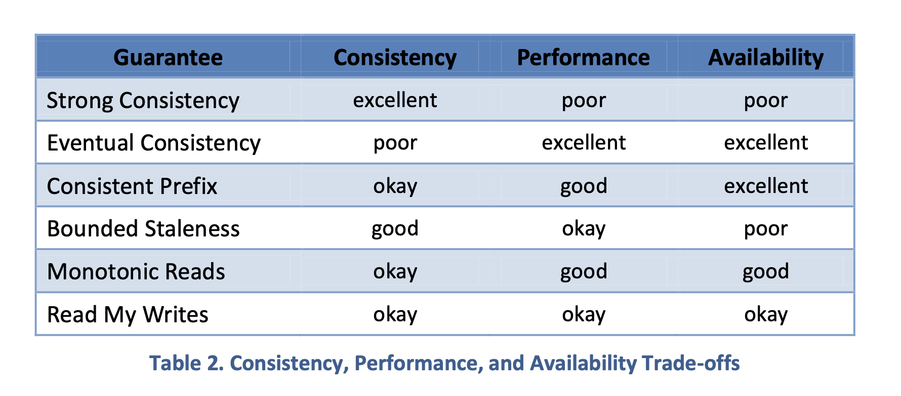
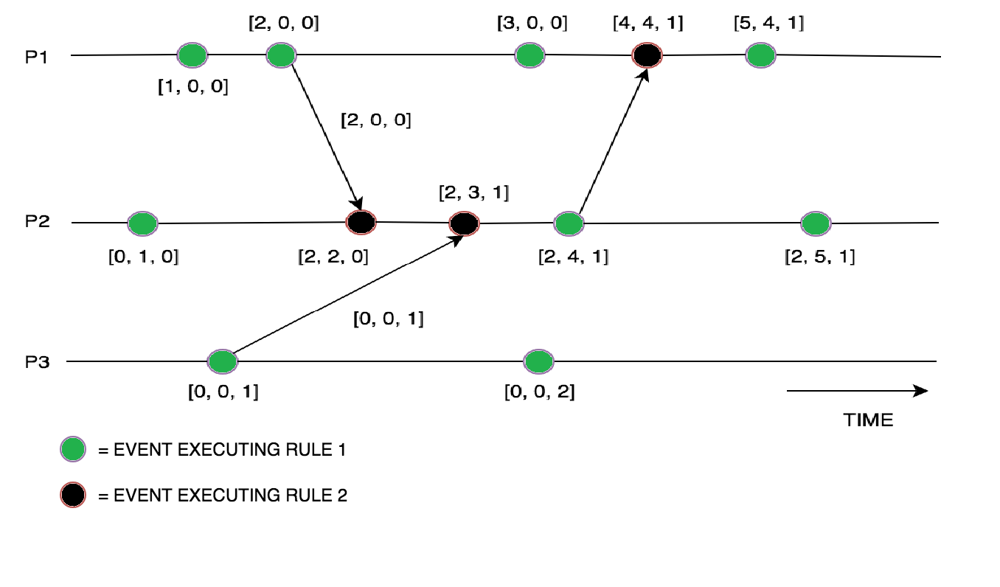

# Distributed Systems

## DSM

- Distributed shared memory (DSM) systems enable processes on different machines to share a large, virtual address space
  - Through virtual memory system of the OS 
  - Not widely used because
    - Failure handling is hard
      - machine fails, data structure unavailable, addr space missing, etc. 
    - Performance: remote fetching 

## RPC

### Stub Generator
  - The input to such a compiler is simply the set of calls a server wishes to export to clients. Conceptually, it could be something as simple as this:

```c
interface {
  int func1(int arg1);
  int func2(int arg1, int arg2);
};
```
  - For the client, a client stub is generated, which contains each of the functions specified in the interface; a client program wishing to use this RPC service would link with client stub and call into it in order to make RPCs.
  - To the client, the code just appears as a function call (e.g., the client calls `func1(x)`); internally, the code in the client stub for `func1()` does:
    - Create a message buffer. A message buffer is usually just a contiguous array of bytes of some size.
    - Pack the needed information into the message buffer: marshaling of arguments or the serialization of the message.
    - Send the message to the destination RPC server.
    - Wait for the reply. Because function calls are usually synchronous, the call will wait for its completion.
    - Unpack return code and other arguments. This step is also known as unmarshaling or deserialization.
    - Return to the caller. Finally, just return from the client stub back into the client code.

### Run-time library

- The run-time must also handle procedure calls with large arguments, larger than what can fit into a single packet. Some lower-level network protocols provide such sender-side fragmentation (of larger packets into a set of smaller ones) and receiver-side reassembly (of smaller parts into one larger logical whole).
- One issue: byte ordering. 
  - Big endian ordering vs. little endian ordering. 
  - Big endian stores bytes (say, of an integer) from most significant to least significant bits, much like Arabic numerals; little endian does the opposite. 
- Server uses thread pool to manage concurrency. 
    1. Threads are created when server starts
    2. When message arrives, dispatched to one of the worker threads 
    3. Main thread keeps receiving data 


### Reliable Transport: UDP v.s TCP

1. **UDP (User Datagram Protocol) - Unreliable Communication Layer** 
    1. API
        1. Reads and writes over socket API (FDs) 
        2. Messages sent from / to ports to target a process on machine 
    2. Provide minimal reliability features 
        1. Messages may be lost, reordered, duplicated. 
        2. Only protection: checksums to ensure data not corrupted (i.e. for integrity) 
2. **TCP (Transmission Control Protocol) - Reliable Communication Layer** 
    1. Use software to build reliable logical connections over unreliable physical connections 
        1. No duplicates, message received exactly once 
    2. Scheme
        1. ACKS: Receiver send ack upon receiving messages 
        2. TIMEOUT: Sender timeout when not receiving ack, and retry 
            1. Adaptive timeouts 
        3. SEQUENCE COUNTER 
            1. Senders give each message an increasing unique sequence number
            2. Receiver knows it has seen all messages before $N$ 
            3. Suppose message $K$  is received 
                1. If $K <= N,$ Msg $K$  is already delivered, ignore it 
                2. If $K = N +1$, first time seeing this message 
                3. If $K > N+1$, buffer this message so arrive in order 


## System Model

### Network 
1. Reliable: Assumes all messages will be successfully delivered.
2. Fair-loss: Assumes messages may be lost but will eventually get through.
3. Arbitrary: No assumptions about message delivery.
### Nodes 
1. Crash: Nodes will stop and not recover.
   1. Similar to fail-stop. However, in a fail-stop scenario, the node intentionally halts its execution due to a detected error or by following a protocol for shutting down.
2. Crash-recovery: Nodes can recover after a crash.
3. Byzantine: Nodes can act arbitrarily, including maliciously.
- **Timing:** synchronous, partially synchronous, or asynchronous
    - Synchronous: message latency no greater than a known upper bound
    - Partial synchronous: async for some finite (but unknown) period of time, sync otherwise
      - Since the algorithm relies on predictable communication to detect and replace faulty primaries, intermittent synchrony (as in the case with partial synchrony) can lead to prolonged periods of inactivity or stalled consensus.
    - > In one version of partial synchrony, fixed bounds Δ and Φ exist, but they are not known a priori. The problem is to design protocols that work correctly in the partially synchronous system regardless of the actual values of the bounds Δ and Φ. In another version of partial synchrony, the bounds are known, but are only guaranteed to hold starting at some unknown time T, and protocols must be designed to work correctly regardless of when time T occurs.
    - Eventual synchrony: Starts asynchronous but eventually becomes and **remains** synchronous.
    - Async: messages can be delayed arbitrarily, nodes can pause execution arbitrarily, no timing guarantees at all
  - Paxos and Raft assumes partially synchronous networks. PBFT assumes eventual synchrony for liveness, and asynchrony for safety. 

- **Happens before relation**
    - An event is something happening at one node (sending, or receiving message, or local execution step)
    - We says event $a$ happens before event $b$ (written $a \rightarrow b$) iff
        - $a$ and $b$ occurred at the same node, and $a$ occurred before $b$ in that node’s local execution order
        - Or event $a$ is sending some message $m$, and event $b$ is receiving that same mesage $m$ (assuming sent messages are unique)
        - There exists some event $c$ such that $a \rightarrow c$ and $c \rightarrow b$
        - Partial order: it is possible that $a \rightarrow b$ nor $b \rightarrow a$, in that case $a$ and $b$ are concurrent (i.e. $a || b)$
- **Causality**
    - Taking from physics (relativity)
        - When $a \rightarrow b$, then $a$ **might have caused** $b$
        - When $a || b$, we know that $a$ **cannot have caused** $b$
    - Happens before relation encodes **potential causality**

- 
  - FIFO broadcast extends reliable boadcast with the FIFO ordering guarantee. 
  - Causal broadcast ensures that messages are delivered respecting their causal dependencies, based on the happened-before relationship defined by Lamport.
    - Since the happened-before relationship includes the order in which messages are sent by a single process, causal broadcast naturally enforces FIFO ordering for messages from the same sender.
  - Total order broadcast (also known as atomic broadcast) ensures that all messages are delivered to all processes in the same total order.
    - **This allows for multiple senders**
  - FIFO Total Order Broadcast: Combines FIFO and total order guarantees, ensuring that messages from the same sender are delivered **in order** and all messages are delivered **in the same total order** across all processes.

- Choice of retry semantics
    - **At-most-once**: send request, don’t retry, update may not happen
    - **At-least-once**: retry request until ed ACK, may repeat update
    - **Exactly-once**: retry + idempotence or deduplication

## State machine replication

- Broadcast protocol to do replication!
- Total order broadcast: every node delivers the **same messages** in **same order**
- **State machine replication (SMR)**
    - **FIFO-total order** broadcast
    - Replica delivers update message: apply it to own state
    - Applying an update is deterministic
        - Each replica is state machine, state is all data it’s stored
            - Go through same sequence of state transitions in the same order
            - Ended up in the same state

### Consensus system models

- Paxos, Raft, etc. assume a **partially synchronous, crash-recovery** system model
  - It can be designed for crash-stop, but needs additional care for state persistence and quorum adjustments. 
- Why not async?
    - **FLP result**: there is no deterministic consensus algorithm that is guaranteed to terminate in an async crash-stop system model
    - Paxos, Raft, etc. use clocks only used for timeouts / failure detector to ensure progress. Safety (correctness) does not depend on timing.

### Leader election

- Multi-paxos, Raft, etc. use a leader to sequence messages
    - Use a **failure detector** (timeout) to determine suspected crash or unavailability of leader
    - On suspected leader crash, **elect a new one**
    - Prevent **two leaders at the same time** (”split-brain”)!

## SSL / TLS: a protocol, not a software package

- Standard method of communicating between processes in modern system is socket
- Secure Socket Layer (SSL)
    - Formally is insecure
    - Move encrypted data through an ordinary socket
    - I.e. set up a socket, set up a special structure to perform crypto, then hook the output of that structure to the input of the socket, reverse the process on the other end
    - Steps
        - Start negotiation between client and server
        - End in both sides finding some acceptable **set of ciphers and techniques** that balance between performance and security
            - I.e. Diffie-Hellman key exchange to create the key
- Transport Layer Security (TLS)
    - Use this
    - Evolved from SSL.
    - It should be noted that TLS does not secure data on end systems. It simply ensures the secure delivery of data over the Internet, avoiding possible eavesdropping and/or alteration of the content.
    - TLS is normally implemented on top of TCP in order to encrypt Application Layer protocols such as HTTP, FTP, SMTP and IMAP, although it can also be implemented on UDP, DCCP and SCTP as well 
    - However, SSL is an older technology that contains some security flaws. Transport Layer Security (TLS) is the upgraded version of SSL that fixes existing SSL vulnerabilities.

### Two Phased commits



### Layering



– Physical: send bits
– Datalink: Connect two hosts on same physical media
– Network: Connect two hosts in a wide area network
– Transport: Connect two processes on (remote) hosts
– Applications: Enable applications running on remote hosts to interact

* TCP Flow control
  * – Avoid the sender over-flowing the receiver buffer
  * – Receiver only reads in-sequence data, and acks with the next sequence number is waiting for
  * – Sender never sends more data than the receiver can hold in its buffer 

### Consistency

Link: https://www.cs.princeton.edu/courses/archive/fall18/cos418/docs/p8-consistency.pdf


#### Linearizability / Atomic Consistency / Strict Consisntecy
* In essence, linearizability is a more stringent requirement that includes the guarantees of sequential consistency plus the real-time ordering of operations.
* Strict Consistency requires events to be ordered in the same real-time sequence in which they occurred. In other words, “an earlier write always has to be seen before a later write.” This is almost impossible to implement in distributed systems. Hence it remains in the realm of theoretical discussions.

```
Real-Time:   ---A1---A2---B1---B2---
Lineariz:    ---A1---A2---B1---B2---  (valid)
             ---A1---B1---A2---B2---  (valid)
             ---B1---A1---B2---A2---  (invalid, A1 < A2 in real-time)
```
* Importantly, linearizability acknowledges that there’s some time gap between when an operation is submitted to the system and when the system acknowledges it.
  * Only non-overlapping writes need to be ordered in a real-time sequence.
  * Not for writes/reads that overlap with each other. 
* **Some text suggests that strict consistency = linearizability.** Likely true, also as mentioned by ChatGPT. 
* 

* Strict serializability: 
* * **Preserves real-time ordering**: Any transaction A that completes before transaction B begins, occurs before B in the total order.
* Strict serializability is a combination of serializability and linearizability
* Strict serializability ensures that the result of concurrently executing transactions is not only equivalent to some serial execution but also respects the real-time order of the transactions. This means that the system's behavior adheres to both the logical consistency of serializability and the real-time ordering guarantees of linearizability.

**IMPORTANT**
* Strict serializability: any transaction A that occurs after B.
* Linearizability: any operation A that occurs after B.
* In Linearizability, clients only have consistency guarantees for operations, where strict serializability allows clients to use transactions.

#### Serializability vs. Linearizability

**IMPORTANT**: serializability is NOT **strict serializability**. 
  * The first one is for ordering transactions in logical order. 
* **Serializability** is a global property; a property of an entire history of operations/transactions. 
  * Serializability mainly through 2PL. 
  * Conflict serializability:  requires that transactions do not have conflicting accesses to the same data item
  * View serializability only requires that transactions produce the same final result as a serial schedule.
* **Linearizability** is a local property; a property of a single operation/transaction. Another distinction is that linearizability includes a notion of real-time, which serializability does not

In Plain English
* Under linearizability, writes should appear to be instantaneous. Imprecisely, once a write completes, all later reads (where “later” is defined by wall-clock start time) should return the value of that write or the value of a later write. Once a read returns a particular value, all later reads should return that value or the value of a later write.
* Serializability is a guarantee about transactions, or groups of one or more operations over one or more objects. It guarantees that the execution of a set of transactions (usually containing read and write operations) over multiple items is equivalent to some serial execution (total ordering) of the transactions.

* 

#### Sequential Consistency
* **Order Maintenance**: The order of operations within each individual process is preserved.
* **Global Sequence**: There is a single global sequence of operations that all processes agree on, but it does not necessarily reflect the real-time order of operations.
* Sequential consistency: Preserves process ordering: All of a process’ operations appear in that order in the total order.
* Difference from linearizability? Sequence of ops across processes not determined by real-time


#### Causal Consistency
* Causal Consistency: Causal Consistency requires only related operations to have a global ordering between them. Two operations can be related because they acted on the same data item, or because they originated from the same thread.
* **Causal+ Consistency**: +: Replicas eventually converge

#### Consistency Prefix
* By requesting a consistent prefix, a reader is guaranteed to observe an ordered sequence of writes starting with
the first write to a data object.
* In other words, the reader sees a version of the data store that existed at the master at some time in the past. This is similar to the “snapshot isolation” consistency offered by many database management systems.

#### Bounded staleness
* Time-bounded staleness
* The storage system guarantees that a read operation will return any values written more than T minutes ago or more recently written values

#### Monotonic Reads
* With monotonic reads, a client can read arbitrarily stale data, as with eventual consistency, but is guaranteed to observe a data store that is increasingly up-to-date over time. In particular, if the client issues a read operation and then later issues another read to the same object(s), the second read will return the same value(s) or the results of later writes.

#### Read-my-writes
* A sequence of operations performed by a single client. 
* It guarantees that the effects of all writes that were performed by the client are visible to the client’s subsequent
reads.

* 


### Lamport Clock

* Each node maintains a counter that increments with each event. When nodes communicate, they update their counters based on the maximum value seen, ensuring a consistent order of events.
* Algorithm of Lamport Clocks:
  * Initialization: Each node initializes its clock LLL to 0.
  * Internal Event: When a node performs an internal event, it increments its clock LLL.
  * Send Message: When a node sends a message, it increments its clock LLL and includes this value in the message.
  * Receive Message: When a node receives a message with timestamp T: It sets L=max⁡(L,T)+1
* Advantages of Lamport Clocks:
  * Simple to implement and understand.
  * Ensures total ordering of events.

### Vector Clock

* Vector Clock is an algorithm that generates partial ordering of events and detects causality violations in a distributed system.
* Capture causal relationship
* This algorithm helps us label every process with a vector (a list of integers) with an integer for each local clock of every process within the system. So for N given processes, there will be vector/ array of size N. 
* How does the vector clock algorithm work: 
  * Initially, all the clocks are set to zero.
  * Every time, an Internal event occurs in a process, the value of the processes’s logical clock in the vector is incremented by 1
  * Also, every time a process sends a message, the value of the processes’s logical clock in the vector is incremented by 1.
  * Every time, a process receives a message, the value of the processes’s logical clock in the vector is incremented by 1, and moreover, each element is updated by taking the maximum of the value in its own vector clock and the value in the vector in the received message (for every element). 
* 
* To sum up, Vector clocks algorithms are used in distributed systems to provide a causally consistent ordering of events but the entire Vector is sent to each process for every message sent, in order to keep the vector clocks in sync.
* Advantages of Vector Clocks:
  * Accurately captures causality and concurrency.
  * Detects concurrent events, which Lamport clocks cannot do.

### Matrix Clock
* Matrix clocks extend vector clocks by maintaining a matrix where each entry captures the history of vector clocks. This allows for more detailed tracking of causality relationships.

#### Components

* **Matrix Representation**: A matrix clock for a system with $n$ processes is represented as an $n \times n$ matrix. Let's denote this matrix for process $P_i$ as $MC_i$, where $MC_i[j, k]$ indicates the latest known clock value of process $P_k$ according to process $P_j$.

* **Row Representation**: Each row in the matrix corresponds to a vector clock for a process, and each column corresponds to the clock value known by a process for other processes.

## Rules for Maintenance

* **Local Event (Internal Event)**:
  - When process $P_i$ experiences an internal event, it increments its own clock value: $MC_i[i, i] += 1$.

* **Message Sending**:
  - When process $P_i$ sends a message to $P_j$, it includes its current matrix clock $MC_i$ in the message.

* **Message Receiving**:
  - When process $P_j$ receives a message from $P_i$ with the matrix clock $MC_i$, it updates its own matrix clock $MC_j$ as follows:
    - For each process $P_k$, update $MC_j[j, k]$ to be the maximum of $MC_j[j, k]$ and $MC_i[i, k]$.
    - Additionally, for the sender $P_i$, update $MC_j[i, i]$ to be the maximum of $MC_j[i, i]$ and $MC_i[i, i] + 1$.

