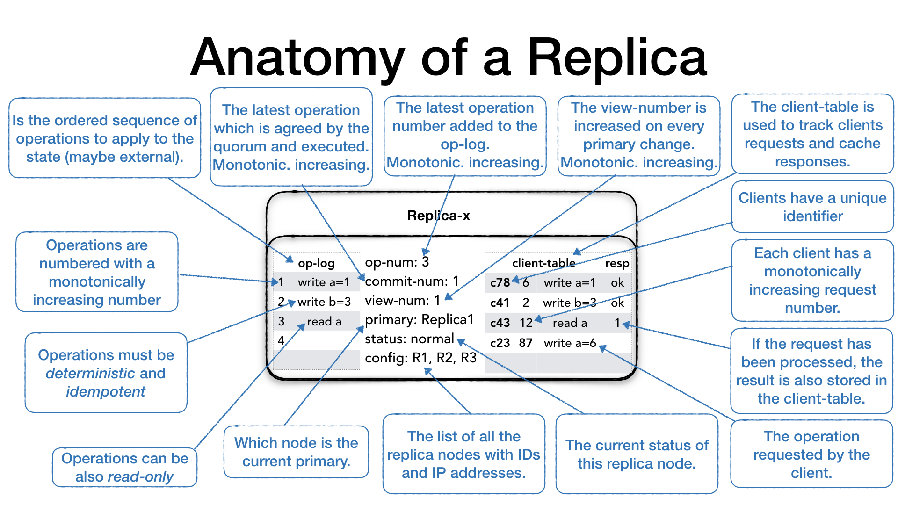

# Viewstamp Replication 

Deep dive: https://blog.brunobonacci.com/2018/07/15/viewstamped-replication-explained/#fn:3

Paper: https://pmg.csail.mit.edu/papers/vr.pdf

Read: July 3rd. 

Viewstamp Replication is a replication protocol developed in 1980's to handle failures in which nodes fail by crashing. 

## Goals of VR design 
* _Availability_: user unaware of replicated service
* _Consistency_: state machine replication
    * Clients can run general operations to observe and modify the service state
    * _Main Challenge_: ensure ops executed in the same order at all replicas despite failures

## Assumptions 
* **Crash faults**: crash-stop or crash-recovery
* **Partially synchronous**: message would eventually be delivered

## Protocol Basics 
### Replica Group 
Replica group of size **$2f+1$**
*   Able to carry request without $f$ replicas participating
*   But worst case, $f$ can just be slow
*   Need $f+1$ other replicas to ensure at least one executed request and didn't fail subsequently 
*   A quorum is $f+1$ nodes. It is not possible to have a quorum with less than 3 nodes. 
*   

### Requirements 
* Every op executed by the replica group survices into the future in spite of up to $f$ failures 
* Handle concurrent client operation with some global order

### Approach 
* Primary: decide order for client requests
    * Execute and return results to client after $f+1$ (self-includedd) replicas know about the request
* Client: 
    * **Only communicates with the primary.**
    * monitor primary failures, initiate _view_ change if needed
    *  **view**: one of the replicas is selected to be the primary
    *  Goal (view-change): if primary fails, need to elect new replica to be primary 

_Reasoning_:
* Primary deciding order satisfieds requirement #2.
* Primary execute after hear back from $f+1$ ensures that even if $f$ replicas fail, the protocol continues to execute.
* However, primary itself can fail. So the view change protocol is for masking the failures of the primary. 

### #1: Normal Operation Protocol 

* Client sends `<REQUEST, client-id, request #, op>` to primary
* Primary advances op-num (with the new op) and adds request to end of the _log_, then it sends `<PREPARE, view-num, op-num, commit-num, message (client request itself)>` to other replicas
* Non-primary replicas process `PREPARE` message in order. It will check its `view-num` to see if it itself is up-to-date, or the other replica is not up-to-date. It will wait until it has all eariler requests in its _log_ (otherwise enter recovery state). 
   * If everything is fine, it will increment its `op-num`, appends the operation to the `op-log`, and update the client table.
   * Send `<PREPARE-OK, view-num, op-num, replica-identity>` to primary
   * Since there is no gap, sending a `PREPARE-OK` means all previous operations have been prepared. 
* Primary waits for $f+1$ (including itself) PREPARE_OK message from different replicas, at which point it knows that a **quorum** of nodes know about the operation, it's considered as committed. 
   * Performs the client operation.
   * Primary increment its `commit-num`.
   * Update the client table with the operation results.
   * **Primary executes this request until all previous requests are executed** and send `<REPLY, view-num, request-num, response>` to the client
* Primary inform other replicas about commit either through piggy-backed information or send directly, secondary then commits in order. 
   * E.g. piggypack on the next `PREPARE` message. 
   * Alternatively, a `<COMMIT, view-num, commit-num>`. 
   * In either case, a replica will execute all operation in their op-log between the last `commit-num` and the `commit-num` in the `<COMMIT>` message strictly following the order of operations and advance its `commit-num` as well.
* Heartbeat:
   * `<PREPARE>` and `<COMMIT>` act as heartbeat for the primary. 

### #2: View Change Protocol 
* The view change protocol is used when **one of the replicas** detects that the current primary is unavailable and it proceeds to inform the rest of the ensemble. 
  * Detected as there is no heartbeat -> triggers timeout. 
* Uses a sorted list of `IPs` to determine who is the next primary node, in a *round-robin* fashion.
* In each **view** one of the replicas is selected to be the primary
* View change protocol must obtain information from logs of at least $f+1$ replica
    * Ensure all **committed** operations will be known (i.e. recorded in at least one of these logs)
* **Viewstamps: < _view-number_, _op-number_>** 
    *  ensure operations that are "preparing" but not committed will not get lost
    *  i.e. a new leader may assign a previous used op-number to different operation, causing inconsistency
*  Once a node advances `view-number` it no longer accepts messages from old view, instead it informs senders about **new view**
 
Steps:
* Replica $i$ suspects primary is faulty, advances its _view-number_, set its status to _view-change_, and send `<START-VIEW-CHANGE, view-number, idenity >` to the new **primary**
   *  Not accept any `PREPARE` message from old primary
* When the other replicas receive a `<START-VIEW-CHANGE>` message with a `view-num` bigger than the one they have, they set their status to `view-change` and set the `view-num` to the view number in the message and reply with `<START-VIEW-CHANGE>` to **all replicas**. 
* When new primary receives $f+1$ messages
   *  Set new log = the _most recent_ of those messages (i.e. with the largest viewstamp), and the largest log. 
   *  Set `op-number` to latest entry in new _log_
   *  Change status to _normal_
   *  Inform other replicas completion of view change by sending `<START_VIEW, view-num, op-log, op-num, commit-num>`
       *  $l$ is the new log and $k$ is the _op-number_ of latest committed request
* The new primary execute (in order) any committed operations that it hadn't executed previously and send replies to clients, start accepting client request
* Other replicas receiving `STARTVIEW` will
   *  **replace their log with the new log**, set their `op-number`, `view-num`, and change their status to `normal`.
   *  send $PREPAREOK$ messages for uncommitted ops 
   *  Some similarity with Raft. 

### #3: Recovery Protocol 
* Replica $i$ sends a `<GET_STATE, view-num, op-num, commit-num, identity>` nessage to any of other replicas. 
   * The values are current values. 
* If view number is different, replica $i$ replies `<NEW_STATE, view-num, commit-num, op-num, portions of log between the commit-num in GET_STATE and its op-num>` 
   * only when its status is $normal$ and its _view-number_ is greater than $v$, and is primary of its view.
* Replica waits to receive response, then update its state. And send `PREPARE-OK` message for uncommitted ops. 

### Optimizations

* Sending log content can be inefficient. 
   * Storing the internal replica state into a durable storage can speed up the recovery in the event the process is crashed or restarted.
* Primary and client can be cut in the same partition, whereas other replicas have moved on to the new views. 
   * **The "old primary" can serve stale data.**
   * Solution is to use lease. 
* If the clients can accept stale reads, then read-only requests can be made directly to the follower replicas.
   * For example the client is connecting to the primary and ask for a write operation such as a registry increment (write a = a + 1), the primary will process the request as usual, but along with the response it will communicate the operation number (op-num) for this request. The client records the op-num and it uses to make subsequent requests to the follower replicas for a read-only request. The replica, if it hasn’t processed the operation in the client request op-num it will have to wait until it the primary communicate that it is safe to do so and then reply.
