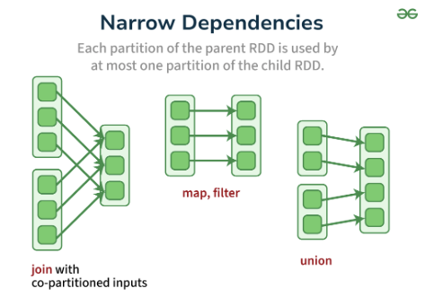
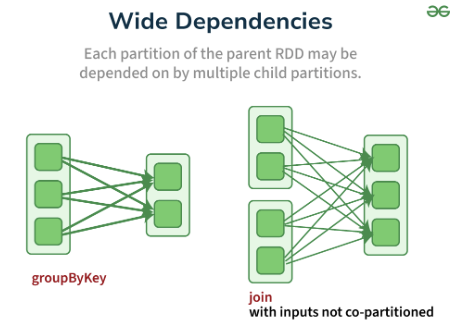

# Resilient Distributed Datasets: A Fault-Tolerant Abstraction for In-Memory Cluster Computing

Link: https://www.usenix.org/system/files/conference/nsdi12/nsdi12-final138.pdf

Another Link: https://www.usenix.org/legacy/event/hotcloud10/tech/full_papers/Zaharia.pdf

Read: April 14th, 2024

* Those that reuse intermediate results (or working sets) across multiple computations. **Data reuse is common in many iterative machine learning and graph algorithm**. 
  * Unfortunately, in most current frameworks, the only way to reuse data between computations (e.g., between two MapReduce jobs) is to write it to an external stable storage system, e.g., a distributed file system.
* Resilient Distributed Datasets (RDDs), a distributed memory abstraction that lets programmers perform in-memory computations on large clusters in a fault-tolerant manner.
* RDDs are motivated by two types of applications that current computing frameworks handle inefficiently: **iterative algorithms and interactive data mining tools**.
* RDDs provide an interface based on coarse-grained transformations (e.g., map, filter and join) that apply the same operation to many data items. This allows them to efficiently **provide fault tolerance by logging the transformations used to build a dataset (its lineage)** rather than the actual data.
* Partition. **Dataset is partitioned (default size of 128MB.) for parallelism. The number of tasks equals the number of partitions.** 
  * **Narrow transformations**: These are transformations in which data in each partition does not require access to data in other partitions in order to be fully executed. For example, functions like map, filter, and union are narrow transformations.
  * **Wide transformations**: These are transformations in which data in each partition is not independent, requiring data from other partitions in order to be fully executed. For example, functions like reduceByKey, groupByKey, and join are wide transformations.
    * Wide transformation requies a shuffle. This is a rather expensive operation. 
  * Recommended number of partitions: you have ~3x the number of partitions than available cores in cluster, to maximize parallelism along side with the overhead of spinning more executors. 
* Spark RDD contains the partition information. This can be retrieved just with `getNumPartitions`. 
  * RDD represents an immutable, **partitioned** collection of elements that can be operated on in parallel

## RDD

* RDD is read-only, can be derived from other RDDs or data on stable storage.
* Resilient distributed dataset (RDD): a read-only collection of objects partitioned across a set of machines that can be rebuilt if a partition is lost.
* Transformations: `map` , `filter`, and `join`. 
* RDD has enough information about how it was derived from other datasets (**lineage**)
* The user can specify the storage medium for the RDD (memory or disk), and partitioning across machines given a key.
* Users can explicitly cache an RDD in memory across machines and reuse it in multiple MapReduce-like parallel operations.

* RDD can be constructed in four ways
  * From a file in a shared file system, such as the Hadoop Distributed File System (HDFS).
  * By “parallelizing” a Scala collection (e.g., an array) in the driver program, which means dividing it into a number of slices that will be sent to multiple nodes.
  * By transforming an existing RDD. `flatmap` (`map` on all elements of the RDD, then flattening the results), `map`, `filter`. 
  * By altering the persistence of an existing RDD.
    * The cache action leaves the dataset lazy, but hints that it should be kept in memory after the first time it is computed, because it will be reused.
      * We note that our cache action is only a hint: if there is not enough memory in the cluster to cache all partitions of a dataset, Spark will recompute them when they are used.
    * The save action evaluates the dataset and writes it to a distributed filesystem such as HDFS. The saved version is used in future operations on it.

## Parallel Operations

* *reduce*: Combines dataset elements using an associative function to produce a result at the driver program.
* *collect*: Sends all elements of the dataset to the driver program. For example, an easy way to update an array in parallel is to parallelize, map and collect the array.
* *foreach*: Passes each element through a user provided function. 

## Broadcast variables

* Broadcast variables allow the programmer to keep a read-only variable cached on each machine rather than shipping a copy of it with tasks. 

## Accumulators
* Accumulators are variables that can only be added to through an associative operation and can only be read by the driver program.

## Closures
* closures — constructs like loops or locally defined methods, should not be used to mutate some global state. Spark does not define or guarantee the behavior of mutations to objects referenced from outside of closures.
* Use accumulators instead. 

## Comparison to DSM

* DSM is general: applications read and write to arbitrary locations in a global address space. 
  * Complicates fault tolerance.
* RDDs can only be created with coarse-grained transformations.
  * Do not incur the overhead of checkpointing as RDD can be recovered with lineage. 
  * RDD can be recomputed in parallel on different nodes. 
  * Mitigate slow nodes by running backup copies on different machines. 

## Applications not suitable for RDDs

* RDDs would be less suitable for applications that make **asynchronous** updates to shared states, such as storage system for web application or incremental web crawler. 

## System architecture

* A driver program connected to a cluster of workers.
* 
* RDD themselves are statically typed objects. 

## Narrow vs. Wide Dependencies
<!-- * Narrow dependencies: each partition of the child RDD depends on a small number of partitions of the parent RDD. -->
<!-- * Wide dependencies: each partition of the child RDD depends on multiple partitions of the parent RDD. This requires data to be shuffled across the nodes. -->
* Narrow dependencies, where each partition of the parent RDD is used by at most one partition of the child RDD
  * 
* Wide dependencies, where multiple child partitions may depend on it. 
  * 
* Narrow dependencies allow for pipelined execution on one cluster node. 
  * e.g. One can apply a *map* followed by a *filter* on an element-by-element basis. 
  * In contrast, wide dependencies require data from all parent partitions to be available and to be shuffled across the nodes using a MapReduce-like operation.
* Second, recovery after a node failure is more efficient with a narrow dependency, as only the lost parent partitions need to be recomputed, and they can be recomputed in parallel on different nodes. In contrast, in a lineage graph with wide dependencies, a single failed node might cause the loss of some partition from all the ancestors of an RDD, requiring a complete re-execution.
* 

## Comparison to DSM

* Spark’s resilient distributed datasets can be viewed as an abstraction for distributed shared memory (DSM), which has been studied extensively
* First, RDDs provide a much more restricted programming model, but one that lets datasets be rebuilt efficiently if cluster nodes fail. This means that only the lost partitions need to be recomputed, and that they can be recomputed in parallel on different nodes, without requiring the program to revert to a checkpoint (How to recover data in DSM). In addition, there is no overhead if no nodes fail.
* RDDs push computation to the data as in MapReduce [11], rather than letting arbitrary nodes access a global address space.

## RDD vs. Hadoop Datasets

* How are RDDs different from traditional datasets in Hadoop MapReduce?

  * Immutability: RDDs are immutable, which means once created, they cannot be changed.
  * Resilience: RDDs can be reconstructed if a node fails, thanks to lineage information.
  * In-Memory: Spark can keep RDDs in memory, reducing disk I/O, which is a significant performance boost over Hadoop's disk-based approach.
  * Lazy Evaluation: Transformations on RDDs are not computed immediately but are executed when an action is called. => Helps with interactive applications. 

## What are the actions you can perform on RDD.

* Transformations: Operations that create a new RDD from an existing one, like map, filter, flatMap, etc.
* Actions: Operations that return a value to the driver program or write data to external storage, like collect, count, saveAsTextFile, etc.

## Spark can also do joins.

* `join(otherDataset, numPartitions=None)`: Performs an inner join across two RDDs.

## Describe the process of checkpointing in Spark. Why is it useful?

* Process: Checkpointing involves saving the lineage of an RDD to a reliable storage system. This can be done using `rdd.checkpoint()` followed by an action to trigger the checkpoint.
* Why is it useful?
  * `Performance`: Reduces the lineage graph size, which can become large for complex operations, thus speeding up subsequent operations.
  * `Fault Tolerance`: If a node fails, Spark can recompute from the checkpoint rather than from the original data, reducing computation time.
  * `Long Lineage`: For long-running jobs or iterative algorithms, checkpointing can prevent lineage graphs from becoming too large, which might otherwise lead to stack overflows or performance degradation.

## How does Spark handle data locality

* Data Locality: Spark tries to schedule tasks on nodes where the data resides to minimize data transfer over the network:
  * Process: Spark's scheduler uses information about data location to decide where to run tasks.
  * Levels: Spark has different levels of data locality like `PROCESS_LOCAL`, `NODE_LOCAL`, `RACK_LOCAL`, and `ANY` (no locality).
  * Optimization: If data is not local, Spark might wait for a short period for a better locality match or run the task on a less optimal node if waiting would cause significant delay.