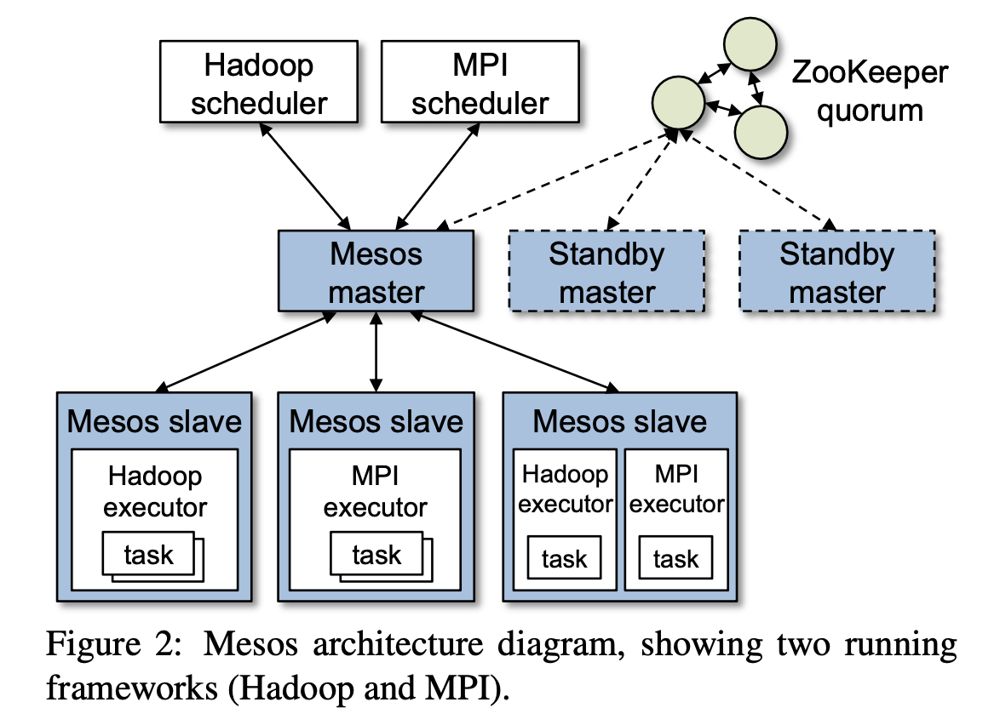

# Mesos: A Platform for Fine-Grained Resource Sharing in the Data Center

Link: https://people.eecs.berkeley.edu/~alig/papers/mesos.pdf

* It seems clear that new cluster computing frameworks will continue to emerge, and that no framework will be optimal for all applications. Therefore, organizations will want to run **multiple frameworks** in the same cluster, picking the best one for each application.
  * Multiplexing a cluster between frameworks

## Summary

* Enables fine-grained sharing across diverse cluster computing frameworks, by giving frameworks a common interface for accessing cluster resources.
* **Mesos decides how many resources to offer to each framework, while framework decides which resources to accept and which computation to run on them.** 

## Challenges

* Each framework will have different scheduling needs, based on its programming model, commuication patterns, task dependencies and data placements.
* The scheduling system must scale to tens of thousands of nodes and support millions of tasks.
* All applications depend on Mesos, the system must be fault-tolerant and highly available. 

## Architecture

* 
* Each framework running on Mesos consists of two components: a scheduler that registers with the master to be offered resources, and an executor process that is launched on slave nodes to run the framework’s tasks
* While the master determines how many resources to offer to each framework, the frameworks’ schedulers select which of the offered resources to use.
* When a framework accepts offered resources, it passes Mesos a description of the tasks it wants to launch on them.
* *mesos* gives frameworks filters and whitelists. 
* Second, because a framework may take time to re- spond to an offer, Mesos counts resources offered to a framework towards its allocation of the cluster. This is a strong incentive for frameworks to respond to offers quickly and to filter resources that they cannot use.
* Third, if a framework has not responded to an offer for a sufficiently long time, Mesos rescinds the offer and re-offers the resources to other frameworks.

## Design

* Delegating control over scheduling to the frameworks.
* Resource offer. 
* Mesos decides how many resources to offer each framework, based on an organizational policy such as fair sharing, while frameworks decide which resources to accept and which tasks to run on them.
* decentralized scheduling model may not always lead to globally optimal scheduling, we have found that it performs surprisingly well in practice, allowing frameworks to meet goals such as data locality nearly perfectly.

## Mesos vs. Kubernetes
* Kubernetes is one framework that can be run on Mesos.