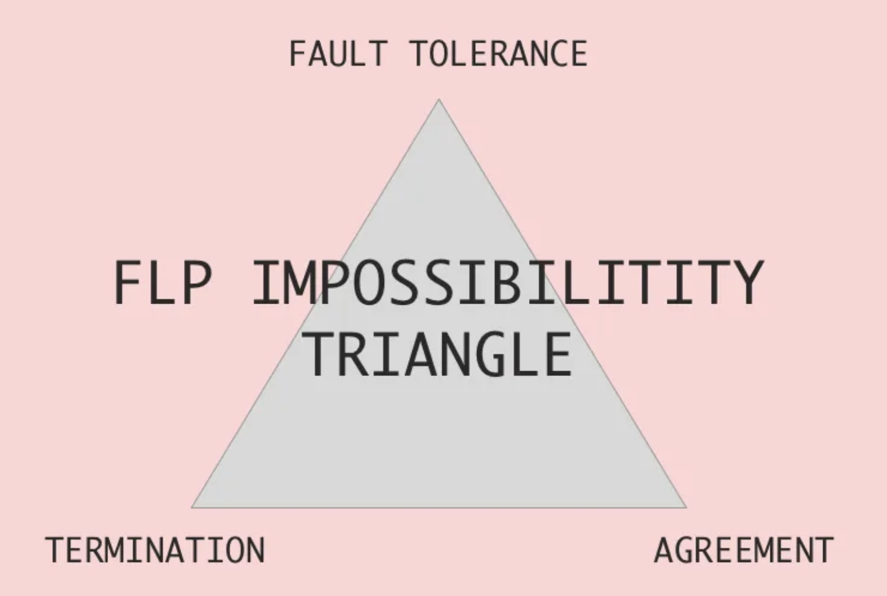
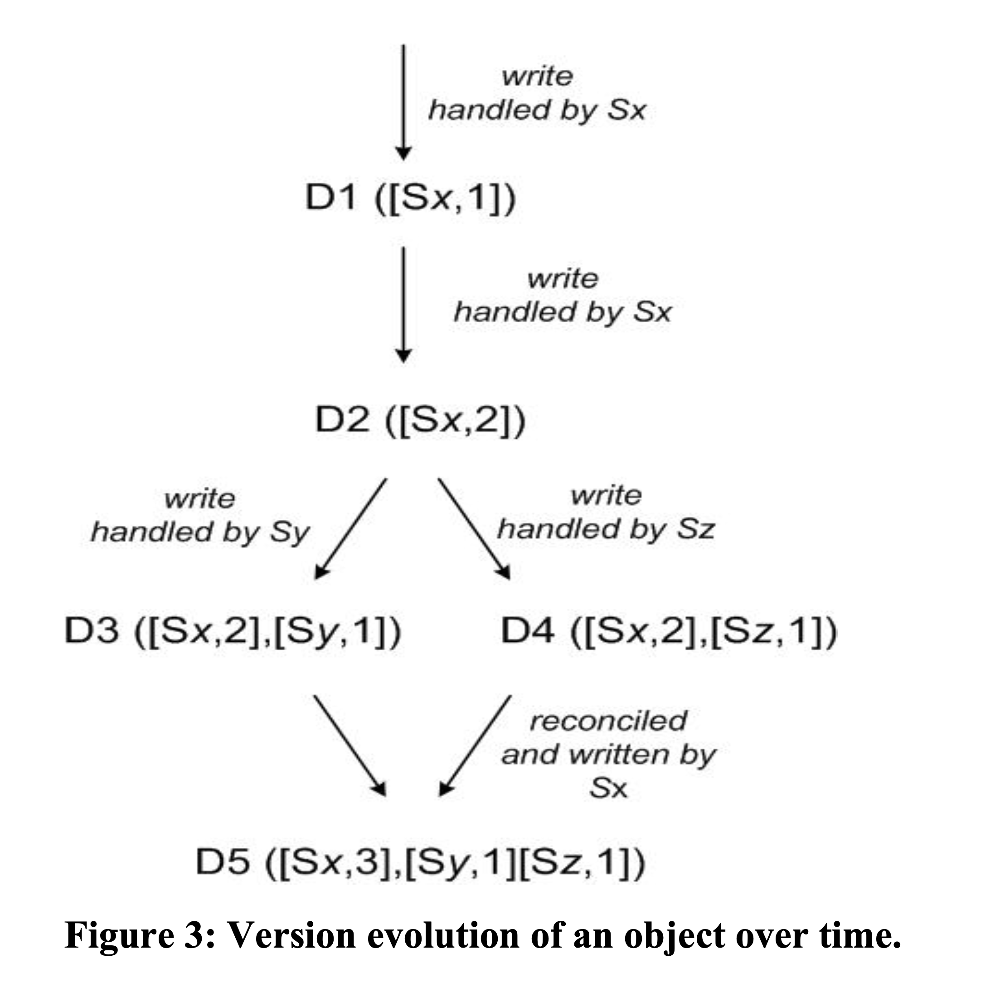

# Dynamo: Amazon's Highly Available Key-Value Store

Link: https://www.allthingsdistributed.com/files/amazon-dynamo-sosp2007.pdf

* Highly available key-value store. 
* Treat failure handling as the normal case without impacting availability or performance. 
* Applications that only require primary key access. 
* Data is partitioned and replicated using consistent hashing, and consistency is facilitated by object versioning. 
* Dynamo is a completely decentralized system where storage nodes can be added and removed from Dynamo without requiring any manual partitioning or redistribution. 
* Dynamo targets applications that operate with weaker consistency if it can provide high availability.
* Dyanmo is designed to be an eventually consistent data store: all updates reach all replicas eventually. 
* Push the burden of conflict resolution to the reads in order to ensure that writes are never rejected. 

## Interesting requirements: always writable, latency sensitive (cannot use multi-hop systems such as Chord or Pastry)

* CAP: 
  * **Consistency (C)**: All nodes see the same data at the same time. In other words, every read receives the most recent write or an error.
  * **Availability (A)**: Every request receives a response (success or failure) without the guarantee that it contains the most recent write.
  * **Partition Tolerance (P)**: The system continues to operate despite an arbitrary number of messages being dropped (or delayed) by the network between nodes.
  * You can have at most 2. 
* FLP: 
  * the impossibility of achieving consensus in an asynchronous distributed system where processes can fail. 
    * 
    * Termination (Liveness): All nodes (that have not failed) eventually decide.
    * Agreement (Safety): All nodes (even nodes that have failed after deciding) that decide should decide on the same value. If all nodes have the same initial input, that value should be the only possible decision value.
    * Fault Tolerance: All nodes require that a protocol must also effective in case of node failures.
  * Raft and Paxos assumes partial synchrony. 
  * Understanding: synchronous models allow failures to be detected by waiting one entire step length for a reply from a processor, and presuming that it has crashed if no reply is received.
  * This kind of failure detection is impossible in an asynchronous setting, where there are no bounds on the amount of time a processor might take to complete its work and then respond with a message. Therefore it’s not possible to say whether a processor has crashed or is simply taking a long time to respond.
* Synchrony
  * There exists some finite time bound. For any message sent, the message can be delayed by at most that time bound.
* Partial synchrony
  * GST (Global Stablization Time). The system behaves asynchronously before GST and synchronously after GST. 
* Asynchrony
  * Each message must be eventually delivered. There is no bound. 

## Consistent hashing:

* Each node is assigned to multiple virtual nodes in the system. 
  * Benefit: if a node becomes unavailable, the load handled by this node is evenly dispersed across remaining available nodes.
  * When a node becomes available, the newly available node accepts a roughly equivalent amount of load from each of the other nodes.
* In addition to locally storing each key within its range, the coordinator replicates these keys at the N-1 clockwise successor nodes in the ring.

## Eventual Consistency

* When a customer wants to add an item to (or remove item from) a shopping cart and theb latest version is not available, the item is added to (or removed from) the older version and the divergent versions are reconciled later. 

## Vector clock

* Dynamo uses vector clocks in order to capture causality between different versions of the same object. 
* 

## Use Merkel Trees to detect inconsistencies

* A Merkle tree is a hash tree where leaves are hashes of the values of individual keys. Parent nodes higher in the tree are hashes of their respective children. The principal advantage of Merkle tree is that each branch of the tree can be checked independently without requiring nodes to download the entire tree or the entire data set.

## Hinted handoff

* Node Unavailability: If one of the nodes where the data should be replicated is temporarily unavailable, the coordinator node doesn't wait or retry indefinitely.
* Store Hint: Instead, it writes a "hint" to another available node. This hint contains:
  * The data that was supposed to be written.
  * The key of the data.
  * The intended recipient node (the one that was unavailable).
* Handoff: When the previously unavailable node comes back online, it requests any hints stored for it. The node that stored the hint then transfers this data to the now available node.

## Sloppy Quorum

* Write quorum (W): The number of nodes that must participate in a successful write operation.
* Read quorum (R): The number of nodes that must participate in a successful read operation.
* Sloppy Quorum: 
  * $R+W>N$: Ensures strong consistency where N is the number of nodes the data is replicated to.
  * $R+W=N$: Provides a balance between consistency and availability.
  * $R+W<N$: Provides high availability but weak consistency.