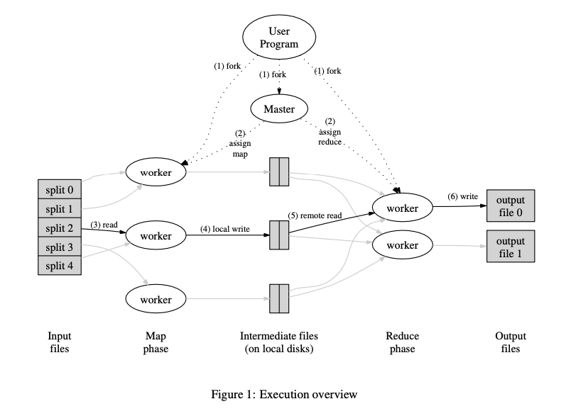

# MapReduce 

Link: https://static.googleusercontent.com/media/research.google.com/en//archive/mapreduce-osdi04.pdf

Read: April 16th, 202* 

Map Reduce is a simple data-parallel programming model designed for **scalability and fault-tolerance**. It provides a limited but general functional API including map, reduce, and sort, and it requires no other synchronization and communication. It achieve fault recovery, and straggler mitigation through retries. 

## Key Motivation 
* Background: MPI (message passing interface)
    * **Expressive** programming model, more general (v.s. MR: limited)
    * Not inherently fault tolerance: if a node fails, can cause entire app crash
    * Fine-grained synchronization and communication
* Motivation: build google web search (i.e. crawl documents, build inverted indexes, etc.), need for
    * Automatic parallelization
    * Network, disk optimization
    * Handling of machine **failures**

### Assumptions & Design Goals

* Failures are norm
* Local storage is cheap
* Commodity networking, less bisection bandwidth 
* Distributed FS 

## Key Techniques
* Data type: each record is (key, value)
* Map function: $(K_{in}, V_{in}) ->list(K_{inter}, V_{inter})$
    * Take one input KV pair and output a set of intermediate KV pairs
* Shuffle phase
    * Data exchange step between Map and Reduce tasks
    * After Map tasks finish processing, intermediate results ($K_{inter}, V_{inter}$) are re-partitioned, grouped by key, and transferred to Reducers
    * Potential problems
        * Data skew: one key with large # of values, overload single Reducer.
        * Network bandwidth: too much intermediate data transferred over the network
        * Disk I/O: might be the bottleneck
    * Not always needed
        * I.e. no reduce phase, the application doesn’t require grouping by key, then shuffle might be skipped
        * Applications without shuffle: grep, or simple transformation on the data, data sampling
* Reduce function: $(K_{inter}, list(V_{inter}))->list(V_{out})$
    * Accept one key and all the values for that key and merges the values together
 
## Map task

* A worker who is assigned a map task reads the contents of the corresponding input split. It parses key/value pairs out of the input data and passes each pair to the user-defined Map function.
* The intermediate key/value pairs produced by the Map function are buffered in memory.
* Periodically, the buffered pairs are written to **local** disk, partitioned into **R regions by the partitioning function.** 
  * This ensures that the workload is distributed across $R$ reduce workers. Avoiding bottlenecks. 
  * The partitioning function is usually simple: $hash(key) \mod R$
* The locations of these buffered pairs on the local disk are passed back to the master, who is responsible for forwarding these locations to the reduce workers.

## Reduce task
* When a reduce worker is notified by the master about these locations, it uses **remote procedure calls** to read the buffered data from the local disks of the map workers. When a reduce worker has read all intermediate data, it sorts it by the intermediate keys so that all occurrences of the same key are grouped together.
* The reduce worker iterates over the sorted intermediate data and for each unique intermediate key encountered, it passes the key and the corresponding set of intermediate values to the user’s Reduce function. The output of the Reduce function is appended to a final output file for this reduce partition.

* Each in-progress task writes its output to private temporary files. A reduce task produces one such file, and a map task produces R such files (one per reduce task)
* We guarantee that within a given partition, the intermediate key/value pairs are processed in increasing key order. Each output partition is sorted by keys. 

## Combiner functions
* Example: a lot of $<the, 1>$. 
* The Combiner function is executed on each machine that performs a map task. 
* Typically, combiner function is the same as the reduce function.

### Sorting ensures that occurrences of the same keys are grouped together. 

### Why is sorting needed?

## Fault Tolerance 
* **If a task crashes**
    * Retry on another node (note: inputs can still be read because of replication)
    * If the same task repeatedly fails, end the job
* **If a node crashes**
    * Detect failure via periodic heartbeats
    * Relaunch its current tasks on other nodes
    * What about task inputs? File system replication
* **If master failures**
    * Checkpoints and retry the job
    * Probability of master failing is low
* **If a task is going slowly**
    * Straggler: a machine takes an unusually long time to complete one of the last few map or reduce task in the computation
    * Launch **second copy** of task on another node
    * Take the output of whoever finishes first

## Failure

* Abort MapReduce function if the master fails. 
* Author comments that this is unlikley.
* If a node fails during a MapReduce job, the master detects the failure and reschedules the tasks that were assigned to the failed node. Map tasks are re-executed on other available nodes using the same input data, while reduce tasks can be re-executed using the intermediate data stored on the distributed file system. This fault tolerance ensures that the job can complete successfully despite node failures.

## Limitations 
* Not every program can be expressed via this model (i.e. **iterative**, **low-latency chained events** like PageRank, conjugate gradient, etc.)
  * Not as expressive.
* Failures of master aborts the computation, up to the client app to issue the retry
* **Disk and too much traffic over the network**. 

## Data Locality

* The MapReduce master takes the location information of the input files into account and attempts to schedule a map task on a machine that contains a replica of the corresponding input data. 
* Failing that, it attempts to schedule a map task near a replica of that task’s input data (e.g., on a worker machine that is on the same network switch as the machine containing the data)

## Data skew

* Custom partitioning / dynamic partitioning
* Using combiners. 