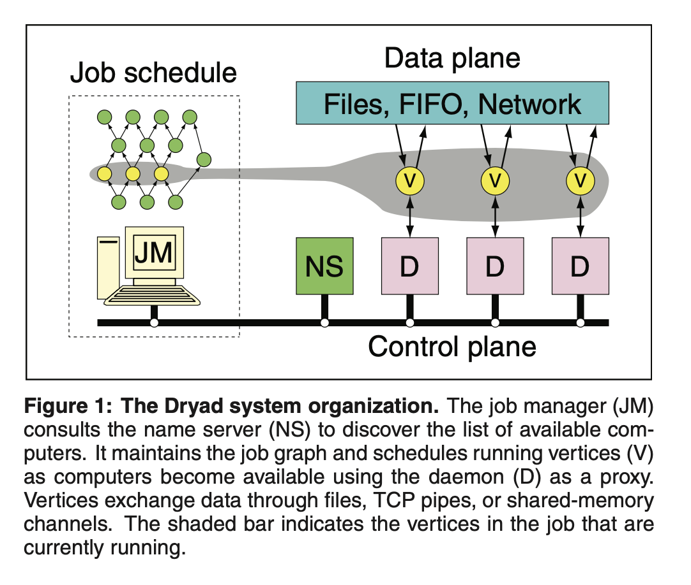
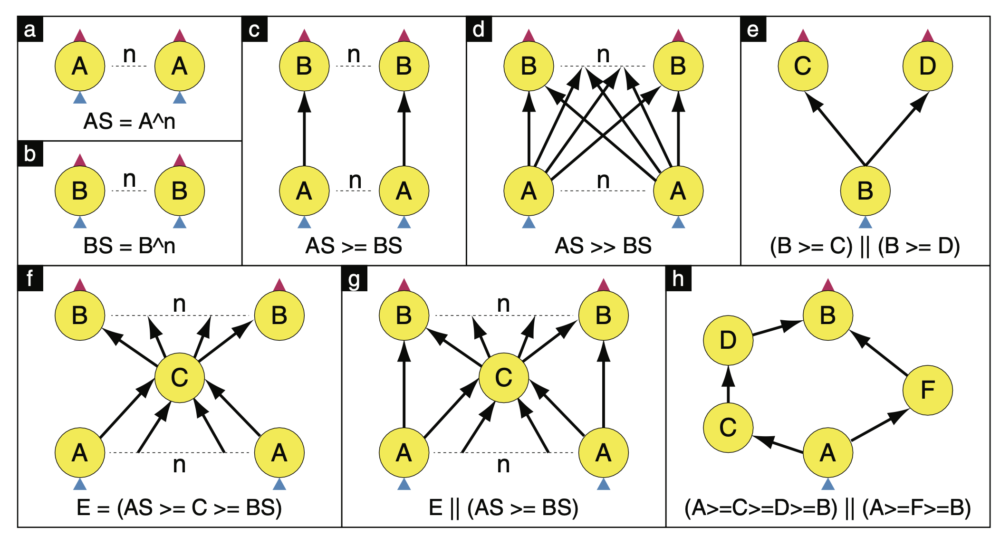

# Dryad: Distributed Data-Parallel Programs from Sequential Building Blocks

Link: http://www.michaelisard.com/pubs/eurosys07.pdf
Youtube: https://www.youtube.com/watch?v=WPhE5JCP2Ak&t=8s

Read: July 3rd, 2024

After the developer considers the data parallelism of the computation into graphs, the systems deal with the hardest distributed computing problems, resource allocation, scheduling, and the transient or permanent failure of a subset of components in a system. 

> By contrast, the Dryad system allows the developer fine control over the communication graph as well as the subrou- tines that live at its vertices.

> This direct specification of the graph also gives the developer greater flexibility to easily compose basic common opera tions, leading to a distributed analogue of “piping” together traditional Unix utilities such as grep, sort and head.

Dryad is notable for allowing graph vertices (and computations in general) to use an arbitrary number of inputs and outputs. MapReduce restricts all computations to take a single input set and generate a single output set.

Dryad is designed to allow developers to build distributed data-parallel programs as **directed acyclic graphs (DAGs)**, and the runtime dynamically optimizes execution plans based on available resources and other factors. 
* For coarse-grain data-parallel applications. 
* It achieve similar goals as MapReduce, but with different design. Computations in Dryad expressed as a graph
* "A more flexible version of MapReduce". 

> The Dryad project addresses a long-standing problem: how can we make it easier for developers to write efficient parallel and distributed applications?
* Prioritize throughput than latency (real-time response). 
* Nice thing about graphs is that you can just have a scheduler that doesn't need to know application semantics; just graphs. 

* "Uniform" opeartions/stage aren't really uniform
* It's not just one stage at a time.
* Once we after dynamic optimization, the actual things that get executed flow more irregular. 

* Graphs should be modifiable at runtime. 
* 
* We use a distributed storage system, not described here, that shares with the Google File System the property that large files can be broken into small pieces that are replicated and distributed across the local disks of the cluster comput- ers.

### Stages
- Useful for reporting aggregate statistics;
- Get callbacks on interesting events. 
- Link any pairs of stages.
- Get callback on interesting events in upstream stages. 
  - How dynamic optimizations are implemented. 

## Summary:

- A job in Dryad is a DAG where each vertex is an executable program and **edges represent data channels** (e.g. files, TCP pipes, and shared memory FIFOs.). 
- The job manager contains the application-specific code to construct the job’s communication graph along with library code to schedule the work across the available resources. 
- To discover available resources, each computer in the cluster has a proxy daemon running, and they are registered into a central name server, the job manager queries the name server to get available computers.

- Authors designed a **simple graph description language** that empowers the developer with explicit graph construction and refinement to fully take advantage of the rich features of the Dryad execution engine. 
  - Multi-graph: multiple vertices between the vertices. 

- Another important design in Dryad is that each vertex belongs to a "stage", and each stage has a **stage manager** that receives a callback on every state transition of a vertex execution in that stage.

- In Dryad, a scheduler inside **job manager** tracks states of each vertex. The vertices **report status and errors** to the Job manager, and the progress of channels is automatically monitored. When a vertex execution fails for any reason, the vertex will be re-ran, but with different version numbers.

- The DryadLINQ system automatically and transparently translates the data-parallel portions of the program into a distributed execution plan which is passed to the Dryad execution platform.

### Job Manager (JM)

* Centralized coordinating process
* Use user applications to construct graphs
* Linked with Dryad libraries for executing vertices

### Vertex Executable

* Dryad libraries to communicate with JM 
* User application sees channels in/out
* Arbitrary application code. 

### Graph Description Language

### Name Server

* Discover available resources

### Channel implementation

Sequence of structured (typed) items. 
* Temporary disk file
  * Items are serialized in buffers
* TCP pipe
  * Items are serialized in buffers
* Shared-memory FIFO
  * Pass pointers to items directly.
  * Don't have to worry about serialization.

### Fault tolerance

* Fault tolerance is simpler. 
* Especially when vertices are deterministic. 
* When inputs disappear, re-run upstream vertices.

## Note:

- Partitioned distributed files: Input file expands to set of vertices, where each partition is one virtual vertex. 
- Why no cycles: Making scheduling easier! Vertex can run anywhere once all its inputs are ready and Directed-Acyclic means there is no deadlock. 
  -  Making fault-tolerance easier (with deterministic code): If A fails, run it again. If A's inputs are gone, run upstream vertices again. If A is slow, run another copy elsewhere and use output from whichever finishes first.

## Mapreduce versus Dryad: 
- I think we can view Dryad as a general version of Mapreduce. First, computations in Dryad are not limited to just map and reduce but are expressed as DAGs. Second, Dryad allows communication between stages to happen over not just files stored in disk: it allows for **files, TCP pipes and shared memory**. Lastly, in Dryad, each vertex can take $n$ inputs and produce $n$ outputs, but, in Mapreduce, map only takes one input and generate one output.
- In general, Dryad has a number of benefits: more efficient communication, the ability to chain together multiple stages, and express more complicated computation.

## Dynamic graph refinement. 
- The added intermediate computation stages are usually not known beforehand. Therefore, dynamic refinement is often more efficient than attempting a static grouping in advance.

## Limitations:

- I think it's not so simple to write programs in Dryad as you have to learn a new domain-specific language. 
  - > In order to get the best performance from a native Dryad application, the developer must understand the structure of the computation and the organization and properties of the system resources.
- No cycles are allowed in Dryad computation. 
- As a final note, programmers aren't really meant to write program to interact with Dryad directly, but instead they are supposed to use things like **DryadLINQ**. This is also true for Mapreduce. FlumeJava has been heavily used at Google as an internal tool. Hive, Pig and Mahout are popular tools built on top of Hadoop. 