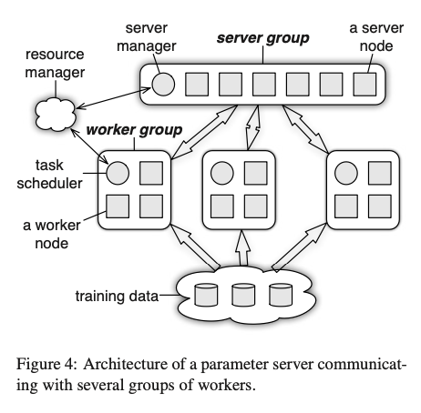

# Parameter Server

Link: https://www.usenix.org/system/files/conference/osdi14/osdi14-paper-li_mu.pdf

Read: July 3rd 2024. 

## Challenges

* Accessing the parameters requires an enormous amount of network bandwidth.
* Many machine learning algorithms are **sequential**. The resulting barriers hurt performance when the cost of synchronization and machine latency is high.
* At scale, fault tolerance is critical. Learning tasks are often performed in a cloud environment where machines can be unreliable and jobs can be preempted

## Designs

* Efficient communication: The asynchronous communication model does not block computation (unless requested).
* Flexible consistency models: Relaxed consistency further hides synchronization cost and latency.
  * Allowing applications to choose between {sequential, eventual, bounded delay} consistency given its algorithm. 
* Elastic Scalability: New nodes can be added without restarting the running framework.
* Fault Tolerance and Durability: Recovery from and repair of non-catastrophic machine failures within 1s, without interrupting computation. 
* Ease of Use: The globally shared parameters are represented as (potentially sparse) vectors and matrices to facilitate development of machine learning applications. 

## Architecture

* Server Group
  * A server node in the server group maintains a partition of the globally shared parameters.
  * A server manager node maintains a consistent view of the metadata of the servers, such as node liveness and the assignment of parameter partitions.
* Worker group
  * Each worker group runs an application. 
  * A worker stores locally a portion of the training data to communicate local statistics such as gradients. 
  * Worker only communicates with server nodes (not among themselves), updating and retrieivng shared parameters. 
* The parameter server supports independent parameter namespaces. This allows a worker group to isolate its set of shared parameters from others.

## Range push and pull

* Data is sent between nodes using push and pull operations. 
  * In one algorithm, each worker **pushes** its entire local gradient into the servers, and then pulls the updated weight back. 
  * The more advanced algorithm uses the same pattern, except that only a range of keys is communicated each time.

## UDF

* The server node can execute user-defined functions. 
  * E.g. server nodes evaluate subgradients of the regularizer $Ω$ in order to update $w$.

## Strong Points

- The trade-off between the system efficiency and algorithm convergence rate depends on: algorithm’s sensitivity to data inconsistency, feature correlation in training data, capacity difference of hardware components, and many other factors. 
  
- Discussed three models of consistency: sequential, eventual, bounded delay. 

- **Parameter server is able to cover orders of magnitude more data on orders of magnitude more processors than any other published system**. It simplifies the development of distributed machine learning applications. It enabled LDA (Latent Dirichlet Allocation) models with 10s of billions of parameters to be inferred from billions of documents, using up to thousands of machines

- Natural but also clear division of BOTH: the input data and the parameters (in the form of key, value pairs) between many worker nodes and parameter server nodes, respectively. 
  - This approach allows them to scale the computing resources, the data used for training machine learning models and the models themselves (with billions of parameters).

- Both key/parameter caching and data compressing system-level optimization are generalized to user-defined filters.

## Fault tolerance

* The servers store the parameters (key-value pairs) using consistent hashing (Sec. 4.3). For fault tolerance, entries are replicated using chain replication
* What is continuous fault tolereance? 

## Weak Points:

- Do not offer higher-level general-purpose building blocks such as model partitioning strategies, scheduling, managed communication that are key to simplifying the adoption of a wide range of ML methods. 

- They used the traditional techniques from distributed systems with some small improvements (vectors clocks compressed taking into account that not many vector clocks diverge), snappy compression applied on messages - to compress zeros as user-defined filters may zero out large fraction of the parameters.

## Implementation

* Given the potentially complex task dependency graph and the need for fast recovery, each (key,value) pair is associated with a vector clock
  * Range push; range vector clocks. 
* A message consists of a list of (key,value) pairs in the key range R and the associated range vector clock
* message compression is desirable. Snappy compression -> removes zeros.
* Receiver caches the list of KV's. Sender sends the hash of the key next time.
* Partitions keys much as a conventional distributed hash table would.
* Each server node stores a replica of the k counterclock- wise neighbor key ranges relative to the one it owns. We refer to nodes holding copies as slaves of the appropriate key range.
  * $k=2$: server 1 replicates the key ranges owned by server 2 and server 3.
  * Only need to replicate the aggregate. E.g. two workers push $x$ and $y$ to the server respectively. The server first aggregates the push by $x+y$, then applies the modification $f(x+y)$ and finally performs the replication.
* Modifications to data are pushed synchronously to the slaves. 
* Losing a small amount of training data during optimization typically affects the model only a little. Hence the algorithm designer may prefer to continue without replacing a failed worker. It may even be desirable to terminate the slowest workers.
