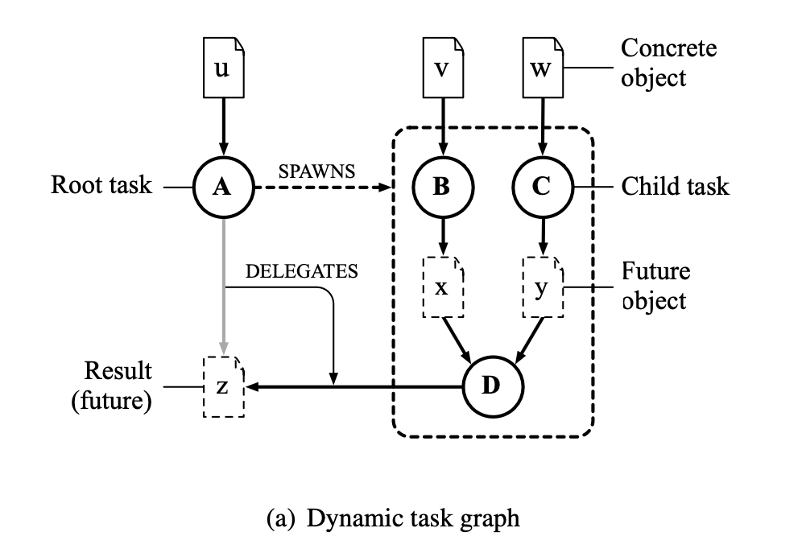
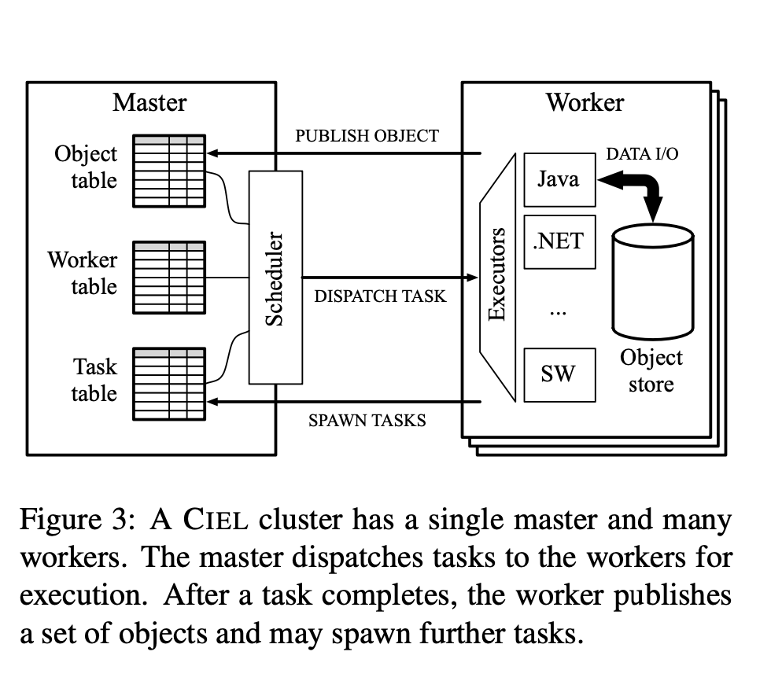

# Ciel: A Universal Execution Engine for Distributed Data-Flow Computing

Link: https://www.usenix.org/legacy/event/nsdi11/tech/full_papers/Murray.pdf

Read: June 30th, 202* 

* Ciel introduces **dynamic** task graphs which are extended at runtime, as opposed to static graphs in earlier models (e.x. MapReduce, Dryad). 
  * **Data-dependent or recursive applications.**

## Limitations of prior systems
* MapReduce and Dryad are for batch-oriented jobs. 
* Designed to maximize throughput, rather than minimizing job latency.
  * Job latency is important for iterative computations
* **No data-dependent control flow**, so the work in each computation must be statically pre-determined. 
* CIEL is designed for coarse-grained parallelism across large data sets, as are MapReduce and Dryad. For fine-grained tasks, a work-stealing scheme is more appropriate 

### Dynamic Task Graph

* It allows for more adaptive and flexible task execution. This dynamic approach, coupled with a runtime that can adjust execution strategies based on current conditions, makes it possible to support a wider range of applications efficiently. 
* Examples of usecases include iterative, low-latency chained events like k-means, E-M, PageRank, and so on. 

* **SkyWriting: a scripting language** that allows the straightforward expression of iterative and recursive task-parallel algorithms using imperative and functional language syntax.
  * However CIEL extends previous models by **dynamically building the DAG** as tasks execute. As we will show, this conceptually simple extension allowing tasks to create further tasks—enables CIEL to support data-dependent iterative or recursive algorithms
* In MapReduce, the data flow is limited to a **bipartite** graph parameterised by the number of map and reduce tasks; Dryad allows data flow to follow a more general directed acyclic graph (DAG), but it must be fully specified before starting the job. 
* In general, to support iterative or recursive algorithms within a single job, we need **data-dependent control flow** — i.e. the ability to create more work dynamically, based on the results of previous computations. 
* At the same time, we wish to retain the existing benefits of task-level parallelism: transparent fault tolerance, locality-based scheduling and transparent scaling.
* Having **data-dependent control flow** means that each computation doesn't need to be pre-determined. 
* **Primitives**:
  * **Objects**: Goal of a CIEL job is to produce one or more output objects. An object is an unstructured, finite-length sequence of bytes.
    * Unique name. 
  * **References**: A reference comprises a name and a set of locations (e.g. host name-port pairs) where the object with that name is stored. The set of locations may be empty: in that case, the reference is a **future reference** to an object that has not yet been produced. Otherwise, it is a **concrete** reference, which may be consumed.
  * **Tasks**:  A CIEL job makes progress by executing tasks. **A task is a non-blocking atomic computation** that executes completely **on a single machine**. The task becomes runnable when all of its dependencies become **concrete**. 
    * Task has one or more dependencies. 
    * A task can **publish one or more objects**, by creating a **concrete reference** **for those objects.** In particular, the task can publish objects for its expected outputs, which may cause other tasks to become runnable if they depend on those outputs.
    * To support data-dependent control flow, however, a task may also **spawn new tasks** that perform additional computation.
    * > CIEL requires that all tasks compute a deterministic function of their dependencies.
    * > A task also has one or more expected outputs, which are the names of objects that the task will either create or delegate another task to create.
  * Prevent deadlock by preventing circles in the dependency graphs. 
  * 
    * Single master: 
      * keeps record of **obj** and task tables
      * Dispatch tasks to workers
      * Persistent logging of tables. 
    * Multiple workers:
      * Heartbeat messages for availability to master
      * Update master with spawn/publish
    * Since task inputs and outputs may be very large (on the order of gigabytes per task), all bulk data is stored on the workers themselves.

## SkyWriting
* However, we do not expect programmers to construct dynamic task graphs manually, and instead we provide the Skywriting script language for generating these graphs programmaticall

  * Skywriting is a language for expressing task-level parallelism that runs on top of CIEL. Skywriting is Turing-complete, and can express arbitrary data-dependent control flow using constructs such as while loops and recursive functions. 

  * Skywriting functions are pure: functions cannot have side-effects, and all arguments are passed by value. 
  *  **The dereference (unary-) operator can be applied * to any reference**; it loads the referenced data into the **Skywriting** execution context, and evaluates to the resulting data structure.
  *  A Skywriting task has a single output, which is the value of the expression in the return statement. On termination, the runtime stores the output in the local object store, publishes a **concrete reference** to the object, and sends a list of spawned tasks to the master, in order of creation.
  *  `spwawn`, `execute` `spawn_exec` . The results of `spawn` and `spawn_exec` are first-class futures. A Skywriting task can pass the references in its return value or in a subsequent call to the task-creation functions.

## Continuation

* The `spawn()` function creates a **new task to run the given Skywriting function**. To do this, the Skywriting runtime first creates a data object that contains the new task’s environment, including the text of the function to be executed and the values of any arguments passed to the function. This object is called a Skywriting continuation, because it encapsulates the state of a computation.
* If the task attempts to dereference an object that has not yet been created—for example, the result of a call to `spawn()`—the current task must block.
  * To resolve this contradiction, the runtime implicitly creates a continuation task that depends on the dereferenced object and the current continuation (i.e. the current Skywriting execution stack).
* A Skywriting task has a single output, which is the value of the expression in the return statement. On termination, the runtime stores the output in the local object store, publishes a concrete reference to the object, and sends a list of spawned tasks to the master, in order of creation

## Memoization

* If a new task’s outputs have already been produced by a previous task, the new task need not be executed at all. Hence, as a result of deterministic naming, CIEL memoises task results, which can improve the performance of jobs that perform repetitive tasks.

## Fault Tolerance

* Worker fault tolerance is similar to Dryad. Heartbeat messags.
* In CIEL, all master state can be derived from the set of active jobs. At a minimum, persistently storing the root task of each active job allows a new master to be created and resume execution immediately. 
  * When a new job is created, the master creates a log file for the job, and synchronously writes its root task descriptor to the log. By default, it writes the log to a log directory on local secondary storage, but it can also write to a networked file system or distributed storage service. As new tasks are created, their descriptors are appended asynchronously to the log file, and periodically flushed to disk. 
  * For those jobs, it replays the log, rebuilding the dynamic task graph, and ignoring the final record if it is truncated. 
  * In addition, the secondary records the address of every worker that registers with the primary, so that it can contact the workers in a fail-over scenario.

## Streaming

* If the producing task has streamable outputs, it sends a pre-publish message to the master, containing stream references for each streamable output. These references are used to update the object table, and may unblock other tasks: the stream consumers. A stream consumer executes as before, but the executed code reads its input from a named pipe rather than a local file. 

## Eager Evaluation

* Since the task dependencies form a DAG, at least one task must have only concrete dependencies. Start by executing the tasks with only concrete dependencies; subsequently execute tasks when all of their dependencies become concrete.

## Lazy Evaluation

* To evaluate an object, identify the task, T , that is expected to produce the object. If T has only concrete dependencies, execute it immediately; otherwise, block T and recursively evaluate all of its unfulfilled dependencies using the same procedure.

## Limitations

* Ciel: Relies on persistent storage to store intermediate results
