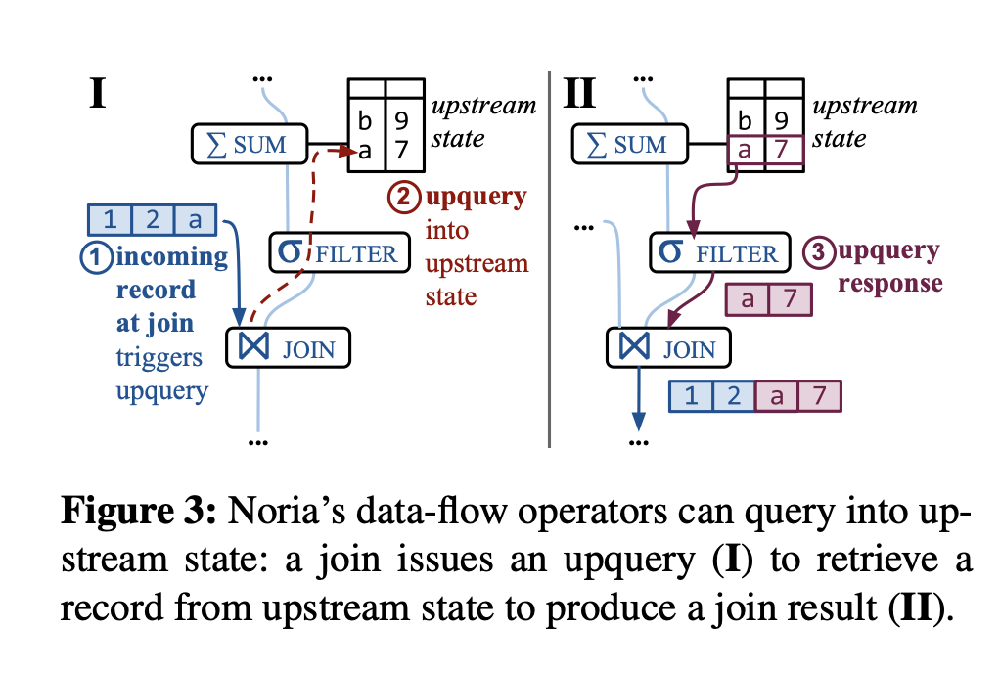
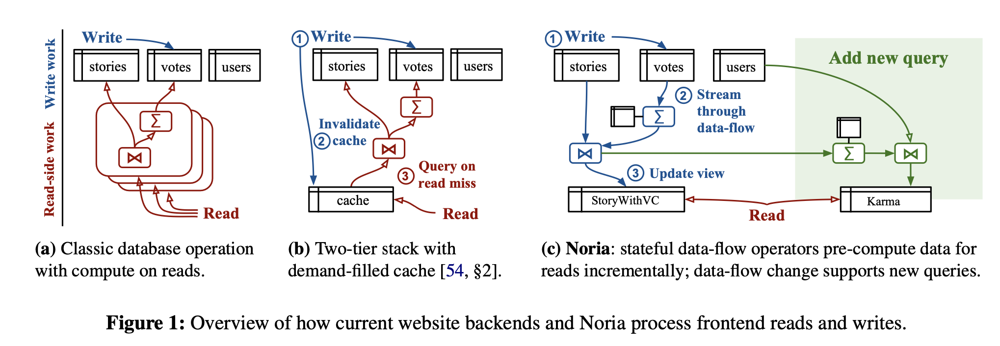

# Noria: dynamic, partially-stateful data-flow for high-performance web applications

Link: https://www.usenix.org/system/files/osdi18-gjengset.pdf

Read: June 22th, 2024.

Note: this paper has been mentioned by NetSys people a billion times. THought I include it here.

- A Noria application supplies a relational schema and a set of parameterized queries, which Noria compiles into a data-flow program that pre-computes results for reads and incrementally applies writes. 
- Partial statefulness helps Noria limit its in-memory state
- Unlike prior data-flow systems, Noria also shares state and computation across related queries, eliminating duplicate work.
- Without complex-to-maintain caching layer. 

- Noria answers complex natural queries by answering with pre-computed results whenever possible. Each write to Noria streams through a joint data-flow graph for the current queries and incrementally updates the cached eventually-consistent internal state and query results.
- Noria demonstrates that, contrary to conventional wisdom, maintaining materialized views for all application queries is feasible. This is possible because partially-stateful operators can evict rarely-used state, and discard writes for that state, which reduces state size and write load.
- 
- Limitations of stream processing system (where queries over re-excution over all past data is infesasible. ) One major problem for these systems is that they must maintain states at some operators, such as aggregations. Existing systems `window` the state: limiting it to the most recent records. 
- A noria deployment stores both the base tables and derived views. Roughly, base tables contain the data typically stored persistently, and derived views hold data an application might choose to cache.
- Noria optimizes the memory footprint of materialized views: by materializing records that are only read, and by evicting infrequently-accessed data. 
- Upquery: 
  
- Noria’s data-flow is a directed acyclic graph of relational operators such as aggregations, joins, and filters.
- Some operators are stateful, and Noria adds indexes based on indexing obligations imposed by operator semantics; for example, an operator that aggregates votes by user ID requires a user ID index to process new votes efficiently.
- Partially-stateful data flow model: let operators only maintain a subset of their states. 
- Each operator totally orders all updates and upquery requests it re- ceives for an entry. Thus, if the operator orders update u1 before u2, then every downstream consumer likewise processes updates derived from u1 before those derived from u2