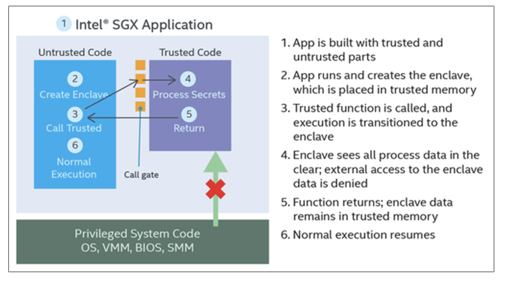
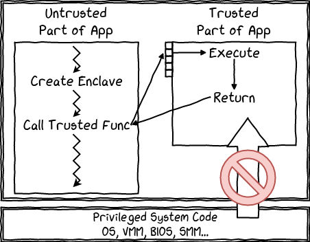
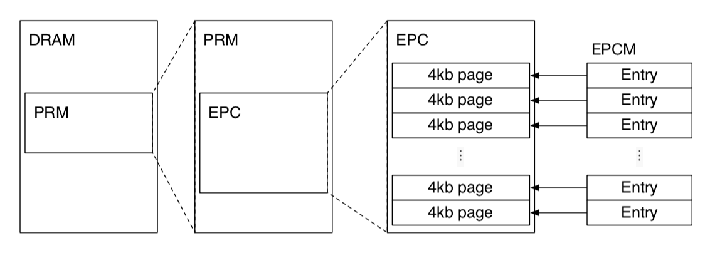
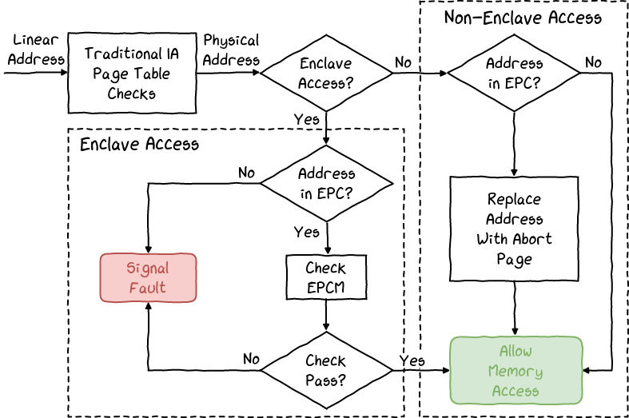

# Secure enclave and edge computing 

Reference: 
* https://opaque.co/what-are-secure-enclaves/
* https://www.trentonsystems.com/blog/what-is-intel-sgx
* https://blog.quarkslab.com/overview-of-intel-sgx-part-1-sgx-internals.html
  
## Why secure enclave? 
_Purpose_: Create a secure environment for data processing where you don't have to **trust service providers**.

## Secure Enclave 
_definition_: a specialized area in computing that's **isolated** from everything else, including the operating system and users with high-level access.

*  Ensures that **not even users with root access** can see or interfere with the data or code in the enclave

### Comparisons with traditional encryption 
* Data protection types 
  * Data-at-rest: stored data (e.g. hard drives) 
  * Data-in-motion: data being transferred (e.g. over internet) 
  * Data-in-use: data being actively used or processed
* _Current state_: most systems protect data-at-rest and data-in-motion with encryption technologies like SSL/TLS
* _Problem_: *data-in-use* is vulnerable, **you must trust the application and the platform it runs on**
    *  Access control: suspectible for human error, does not protect against info leakage
    *  Homomorphic encryption (HE): allow compute on encrypted data, but too slow  

## Intel's SGX 
Intel's Software Guard Extensions (SGX) offers **hardware-based** security. 
* SGX is a **security instruction set** baked into many of Intel's x86-based **CPUs**. 
* Memory protection: create a "safe box" or **enclaves** within your computer's memory that's encrypted and accessible to only specific **code** (running within the enclave)
* Computing environment: where code to be executed is protected, even the OS cannot access it.
  * So in case when **OS, BIOS, VMM are compromised**, sensitive data is still placed within an isolated, encrypted portion of memory. 
* At runtime, SGX builds an encrypted area in memory. **Code and data** can freely operate inside this area but are **encrypted when stored or moved outside it**, preventing unauthorized access.
   

>At runtime, Intel SGX instructions build and execute the enclave into **a special encrypted memory region** with **restricted entry/exit location** defined by the developer.

To use SGX, BIOS needs to enable it. 

* The secure execution environment is part of the host process, which means that:
  * the application contains its own code, data, and the enclave;
  * the enclave contains its own code and its own data too;
  * SGX protects the confidentiality and integrity of the enclave code and data;
  * enclave entry points **are pre-defined** during **compilation**;
  * multi-threading is supported (but not trivial to implement properly);
  * an enclave can access its application's memory, but not the other way around.
* 
* Processor Reserved Memory (PRM)
  * **A subset of DRAM that cannot be directly accessed by other software**
* Enclave code and data are placed in a special memory area called the **Enclave Page Cache** (EPC). 
  * This memory area is encrypted using the Memory Encryption Engine (MEE), a new and dedicated chip.
  * External reads on the memory bus can only observe encrypted data. 
  * **Pages are only decrypted when inside the physical processor core. Keys are generated at boot-time and are stored within the CPU.**
  * EPC is split into 4KB pages that can be assigned to different enclaves, enabling multi-processing. 
  * **Non-enclave software** cannot directly access the EPC, as it is contained in the **PRM**. 
* **Enclave Page Cache Map (EPCM)**
  * SGX design expects the software to allocate EPC pages to enclaves. Since the system software is not trusted, SGX processors have to check the correctness of system software's allocation decisions with EPCM (e.g. assigning a EPC to two enclaves). 
  * The traditional page check is extended to prevent external accesses to EPC pages. 
  * The Enclave Page Cache Map (EPCM) structure is used to store the pages state. 
  * It is located inside the protected memory and its size limits the size of the EPC (set by the BIOS, 128MB maximum). 
  * It contains the configuration, permissions and type of each page.
  * EPCM tracks the owner enclave of the EPC pages, so that one enclave cannot access pages from another enclave. 
  * 

* SGX Enclave Control Structure (SECS)
  * Each SECS is stored in a dedicated **EPC** page with the page type `PT_SECS`.
  * Given that SGX instructions use SECS addresses to identify enclaves, the system software must create entries in its page tables pointing to the SECS of the enclaves it manages.
  * The first step in bringing an enclave to life allocates an EPC page to serve as the enclave’s SECS, and the last step in destroying an enclave deallocates the page holding its SECS. 
  * Enclave code cannot access SECS pages. SECS pages are not mapped into enclaves' virtual address space. 
* Thread Control Structure (TCS)
  * Each enclave is associated with at least a TCS structure, which indicates an execution point into the enclave. As SGX supports multi-threading, an enclave can as many active threads as it has TCS. Like the SGX Enclave Control Structure (SECS) structure, it is only accessible by the processor, and is also immutable.

## Use cases 
* With a secure enclave environment, parties can finally efficiently collaborate by contributing individual data for some larger computation without other parties or any third parties ever learning any private data. 

This is suitable for 
* Runtime applications, protected through execution with SGX
* Securing IoT edge device communication between cloud and client
* Collaborative computing, financial services, healthcare, manufacturing, etc. 

Example steps
* _Initial Communication_: User communicates with the cloud service via **SSL/TLS** to establish a secure channel.
* _Remote Attestation_: Intel SGX enclave on the cloud server can provide a proof of its legitimacy through remote attestation. This ensures the user that they are communicating with a genuine, secure enclave. Decryption key is provisioned to the enclave by a trusted external entity through a secure channel (TLS).
* _Encrypting the Images_: User uses a symmetric (asymmetric) encryption algorithm to encrypt the sensitive medical images. 
* _Transmitting the Encrypted Images and Key_: The encrypted images and encryption key are sent to the cloud server over secure channel.
* _Enclave Processing_: The enclave decrypts and subsequently processes the images, maintaining the confidentiality and integrity of the sensitive data.
* _Storing Encrypted Images_: storing and receiving encrypted data outside enclave does not expose sensitive information

### How SGX works: 

* At runtime, your application is split into two parts: a secure portion and a non-secure portion.
* When the application launches, the enclave is created, and that enclave is placed into the protected portion.
* When an enclave function is called, only the code within the enclave can see its data. External accesses are always denied. When it returns, enclave data stays in the protected memory.
* At runtime, Intel SGX instructions build and execute the enclave into a special encrypted memory region with restricted entry/exit location defined by the developer. This helps prevent data leakage. Enclave code and data inside the CPU perimeter runs in the clear, and enclave data written to memory is encrypted and its integrity checked, helping provide some assurance that no unauthorized access or memory snooping of the enclave occurs.
### Overhead:

* Security checks when allocating chunks of memory, including being measured using a 256-bit SHA-2 secure hash function.
* Secure enclave is limited to CPUs, with limited support to GPUs and other PCI devices. 
* **Secure enclave implementations, such as Intel SGX, require rewriting applications by partitioning the code into secure and insecure parts. Any code that lives outside of TCB is only able to interact with enclave code via a narrow interface**. 
* Introduce latency for the clients due to post-verification. 
* Enclave Page Cache (EPC) in Intel processors have been limited to 256MB. 
* Recently, several side-channel vulnerabilities have been found for hardware-based enclaves. 
* Using secure enclaves lock you to a specific cloud. Some clouds only support specific implementations.

However: homomorphic encryption (HE) is still too slow for practical use and violate data integrity.
* Homomorphic encryption: An attacker with access to the encrypted data cannot decrypt the underlying data (unless they posses a decryption key), but they could transform and replace the data without detection, hence violating data integrity. 