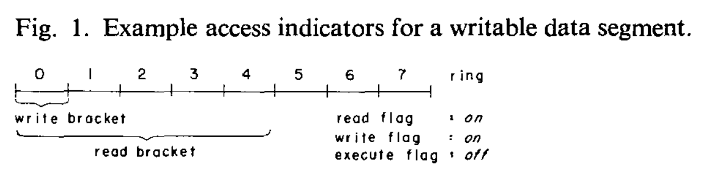

# A Hardware Architecture for Implementing Protection Rings (1972) 

Link: https://dl.acm.org/doi/pdf/10.1145/361268.361275

Read: July 4th, 202* 

The paper discusses protection of segment-based virtual memory as found in Multics. Read, write, and execute permissions are set based on the access level of the process and recorded in segment descriptor words. **Flags corresponding to these permissions are checked by hardware upon each reference.**

* Before, protection rings are in **software**. 
* Protection rings are nuanced protection modes beyond user/supervisor
* Ring 0 is most priviledged
* Multics segment descriptors indicate the highest ring that is allowed to read or write the segment
* Rings with less privilege of the system do not have execute permissions 

## Segment and Words. 
* A two-part address ($s$, $w$) identifies word $w$ of the segment numbered $s$.
* sDw: segment descriptor words. The collection of segments in the virtual memory is defined by a descriptor segment containing an array of segment descriptor words (sDw). Each sDw can describe a single segment in the virtual memory. 
  * sDw contains the absolute address of the beginning of the corresponding segment in memory.  
*  Each processor contains logic for automatically translating two-part addresses into the corresponding absolute addresses. Address translation, done with an indexed retrieval of the appropriate sDw from the descriptor segment, occurs each time a word in the virtual memory is referenced.

## Protection rings 
* Hierarchical levels of security that help to define the privileges and access rights that different processes or programs have when interacting with the system. 

* Associated with each process are a fixed number of domains called protection rings. These r rings are named by the integers 0 through $r-1$. The access capabilities included in ring $m$ are constrained to be a subset of those in ring $n$ whenever $m > n$. Put another way, the sets of access capabilities represented by the various rings of a process form a collection of nested subsets, with ring $0$ the largest set and ring $r - 1$ the smallest set in the collection. Thus, a process has the greatest access privilege when executing in ring $0$, and the least access privilege when executing in ring $r - 1$. 

* A register is added to the processor to record the current ring of execution of the process. The processor can then validate each reference to a segment by making the obvious comparisons when the SDW (Segment Descriptor Words) for the segment during address translation.

### Implementation in this paper 

* The users that are permitted to access each segment are named by an access control list associated with each segment.

* The name of the user associated with a process must match some entry on the access control list of a segment before the supervisor will add that segment to the the virtual memory of the process.

* The hardware does not implement upward calls and downward returns without software intervention. 