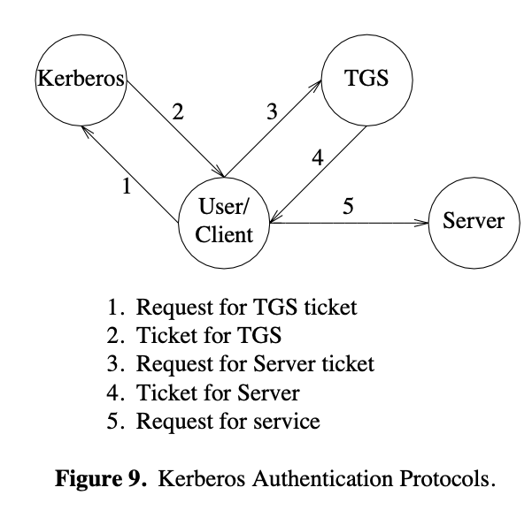

# Kerberos: An Authentication Service for Open Network Systems (1998) 

Link: https://www3.nd.edu/~dthain/courses/cse66771/summer2014/papers/kerberos.pdf

Read on: June 26th, 2024

- Kerberos is an authentication network protocol developed by MIT to provide robust and **secure authentication system in an open network** where **users at workstations** wish to access **services on network servers**. Open networks are susceptible to various kinds of attacks, such as eavesdropping, replay attacks, and impersonation. 

- The protocol is based on generating tickets 🎫.

- The authentication server provides a properly authenticated user with a way to prove her/his identity to servers scattered across the network.

- Kerberos keeps a database of its clients and their private keys. The private key is a large number known only to Kerberos and the client it belongs to. In the case that the client is a user, it is an encrypted password.

- A Kerberos ticket is only good for a single named server. As such, a separate ticket is required to gain access to different instances of the same service.

## Goal
* Security: To protect sensitive data in open networks.
* Transparency: To facilitate straightforward authentication for users without the cumbersome need for repeated logins.

* There are three phases to authentication through Kerberos . In the first phase, the user obtains credentials to be used to request access to other services. In the second phase, the user requests authentication for a specific service. In the final phase, the user presents those credentials to the end server.

## Key Techniques: Ticket  
There are three components in Kerberos transactions: 
* **KDC (key distribution center)**
  *  Store a copy of all keys (i.e. client keys, service key, and TGS keys) for encryption and decryption purposes
  *  **Authentication server (AS)**: Validates users when they log in
  *  **Ticket granting server (TGS)**: Issues tickets for users to access different services
* **Client**: The user who wants to access a service.
* **Service**: The network resources like files servers or databases that the client wants to access.
 
## Protocol Simple Explain 
1. **Initial Authentication**:
    * Client sends login details to Authentication Server (AS)
    * The user is prompted for her/his username. Once it has been entered, a request is sent to the authentication server containing the user’s name and the name of a special service known as the ticket-granting service.
    * AS replies with two messages
       * Ticket Granting Ticket (TGT) encrypted with TGS secret key
       * M1: TGS **session** key encrypted with client's secret key
2. **Request for Service Ticket**:
    * Decrypt M1 with client secret key
      * Once the response has been received by the client, the user is asked for her/his password. The password is converted to a DES key and used to decrypt the response from the authentication server. 
    * Request access ot a service by taking to TGS
        * Send back TGT
        * Encrypt user authentication (authenticator?) with TGS session key
        * M2: <service ID, request lifetime>
        * In order to gain access to the server, the application builds an authenticator containing the client’s name and IP address, and the current time. The authenticator is then encrypted in the session key that was received with the ticket for the server. The client then sends the authenticator along with the ticket to the server in a manner defined by the individual application.
    * TGS receives
        * check service is valid
        * decrypt TGT with session key, and decrypt user authentication
    * TGS sends back
        * M3: Service session key encrypted by TGS session key
        * Service ticket (ST): encrypted by TGS secret key
    * It is assumed that clocks are synchronized to within several minutes. If the time in the request is too far in the future or the past, the server treats the request as an attempt to replay a previous request.
3. **Accessing the service**:
    * User decrypt M3 and get servie session key
    * Use it to encrypt user authentication and send back service ticket
4. **Verification**
    * Service decrypt ST to get session key and decrypt user auth
    * If matches, send back service authenticator encrypted by TGS session key
    * Confirming authentication success and establish secure session

5. 

* KDBM Server
  *  The KDBM server accepts requests to add principals to the database or change the passwords for existing principals. This service is unique in that the ticket-granting service will not issue tickets for it. Instead, the authentication service itself must be used (the same service that is used to get a ticket-granting ticket).
     *  Otherwise: if an administrator left her/his workstation unguarded, a passerby could change any password in the sys- tem.

## Notes 
Trust is incrementally built through a series of encrypted ticket exchanges, and authentication is validated at several stages through encrypted, timestamped tickets

1. Mutual Trust via Third Party: The AS and TGS act as trusted third parties. The mutual trust between a user and a service is established indirectly via trust in these servers.

2. Scalability: Because users don't interact directly with service servers for authentication (but go through TGS instead), **the system is more scalable**. Each service doesn’t need to implement its authentication logic; it just needs to be able to decrypt a message from the TGS.
