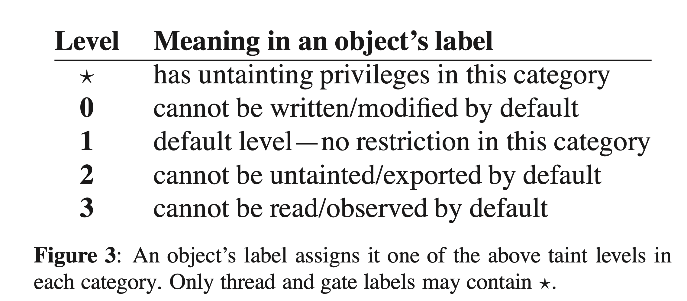

# Making Information Flow Explicit in HiStar (2006)  

Link: http://www.scs.stanford.edu/~nickolai/papers/zeldovich-histar.pdf

Slides: https://ucbrise.github.io/cs262a-spring2018/notes/25-histar.pdf

Read: July 11th, 2024.

HiStar is a new Operating System designed to minimize the amount of code that needs to be trusted and secure OS by **restricting information flow**. The system has no notion of superusesr and no fully trusted code other than the kernle. Private user data is marked as "**tainted**" and thus is restricted from leaving the computer. Thus data cannot leak from the computer. Only a small core of code needs be verified.

Currently OSes have too many aspects that need to be secured. HiStar offers a minimalistic kernel that exposes information flow. 

We have labeled files with private user data as *tainted*. Tainting a file restricts the flow of its content to any untainted components, **including the network**. A file can be labeled with arbitrarily many categories of taint. Whoever allocates a category has the exclusive ability to untaint. 

E.g. the scanner has to taint itself to read user data (which is tainted). 

There are six objects in the kernel, including: 
* Segment
* Thread
* Address space
* Device (network)
* Gate (IPC)
* Container ("directory"). Each object has a **label** (categories / colors), information flow controlled between objects. 
  * Think of the label as tainted bits.
* **Tainted processes can only talk to other tainted processes.**
* While conventional operating systems can either permit or prohibit read access to an object such as a file, HiStar allows a third option: permit a thread to read an object so long as it does not untaint the data or export it from the machine.
* These categories matter for whether objects in that category has **untainting** priviledges. 
* 
* A third option: HiStar permits a thread to read an object so long it does not untaint the data or export it from the machine.
* Label that has untainting priviledges: **we say T owns c**, where that thread $T$ can bypass flow information restrictions in $c$. 

* An untainting priviledge:
  * When T reads an object, **⋆** should be treated as high (greater than any numeric level) to allow observation of arbitrarily tainted information. Conversely, when T writes an object, ⋆ should be treated as low (less than any numeric level) so that information can flow from T to objects at any taint level in the category.

## High-level idea: 
* Subjects and Objects given a level, e.g. 1...4 (unclassified...top secret)
* **No read up**:
  * Subject at level i cannot read object at level j when i < j
* **No write down**:
  * Subject at level i cannot write object at level j when i > j
* Unix channels are made explicit, in terms of the HiStar mechanism.
* Use **a (micro)small kernel that controls information flow**
  * Explicit access checks on information flows can prevent data leaks
* HiStar associate a label with the data, where label follows data when it moves around and determine what you can do with the data. HiStar will only allow kernel objects to interact (information to flow) if two kernel obejcts have "**consistent**" labels. 

## Labels and categories

* **Every Kernel Object has a label**
* Label tells you the security property of the information inside an object
* Since an object (e.g. Thread) might contain multiple types of information, labels contain multiple Categories (think of a category as a color)
* HiStar will only allow kernel objects to interact (information to flow) if two kernel objects have “consistent” labels