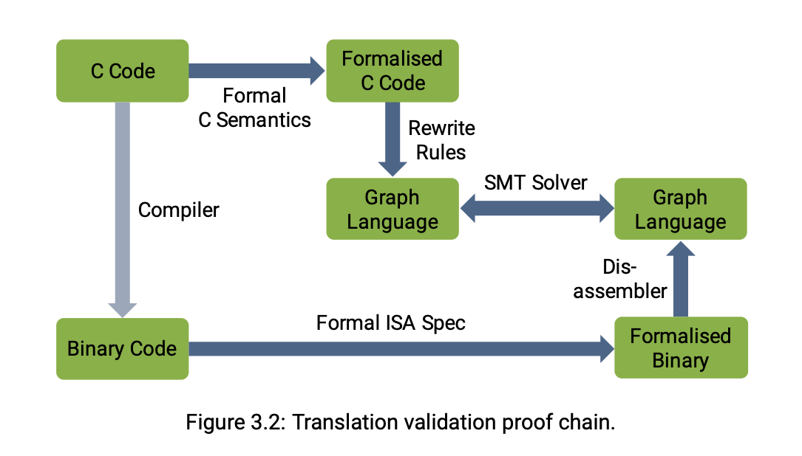

# seL4: Formal Verification of an OS Kernel (2009) 

Link: http://web1.cs.columbia.edu/~junfeng/09fa-e6998/papers/sel4.pdf

Resources: https://sel4.systems/About/seL4-whitepaper.pdf

Read: June 29th, 202* 

SeL4 is a microkernel: 

SeL4 now can even be a hypervisor, running VMs like Linux mainstream OS.

* 

* The core of seL4’s verification is the functional correctness proof. More precisely, there is a formal specification of the kernel’s functionality, expressed in a mathematical language called **higher-order logic (HOL)**. This is represented by the box labelled **Abstract Model** in the figure. The functional correctness proof then says that the **C Implementation** is a refinement of the **Abstract Model**, meaning the possible behaviours of the C code are a subset of those allowed by the abstract model.

* How do we show that the compiler is fine? SeL4 also checks a representation of the binary with the that of the C Code. 

* In a capability-based system, such as seL4, invoking a capability is the one and only way of performing an operation on a system object.

* This paper presents the experience in performing the formal, machine-checked verification of the seL4 microkernel from an abstract specification down to its C implementation. This is the first formal proof of functional correctness of a complete, general-purpose operating-system kernel; assuming the correctness of the compiler, assembly code, boot code, managements of caches, and the hardware. 

* As observed above, capabilities provide fine-grained access control, in line with the security principle of least privilege (also called principle of least authority, short POLA). This is in contrast to the more traditional access-control model of access-control lists (ACLs), which are used in mainstream systems such as Linux or Windows. 

* This is a very coarse-grain form of access control, and is a fundamental limitation on what security policies can be enforced. A typical scenario is that a user wants to **run an untrusted program (downloaded from the internet) to process a particular file but wants to prevent the program from accessing any other files the user has access.** This is called a **confinement scenario**, and there is no clean way to do this in Linux, which is the reason people came up with heavyweight workarounds (I like to call them hacks) such as “chroot jails”, containers etc.

* With capabilities, this problem is straightforward to solve, as capabilities provide an object-oriented form of access control. Specifically, the kernel will allow an operation to go ahead if and only if the subject that requests the operation presents a capability that empowers it to perform the operation. In the confinement scenario, the untrusted app can only access files to which it has been given a capability. 
* **Denomination** (the reference to the file) and **authority** (the right to perform operations on the file) must be coupled.

### Summary

* Complete formal verification is the only known way to guarantee that a system is free of programming errors
* 

This paper presents the experience in performing the formal, machine-checked verification of the seL4 microkernel from an abstract specification down to its C implementation. This is the first formal proof of functional correctness of a complete, general-purpose operating-system kernel; assuming the correctness of the compiler, assembly code, boot code, managements of caches, and the hardware.

### Insights

* Microkernels are so small so that they can be formally verified!

### Kernel Design Process. 

* OS developers tend to take a bottom-up approach to kernel design
  * Formal methods practitioners tend toward top-down design
* Use functional programming language Haskell to provide a programming language for OS developers, while at the same time can be translated into theorem proving tool
* Re-implement it in C
    * Haskell runtime is significant body of code, relies on GC that is unsuitable for real-time environments

* Abstract specification
    * Isabelle / **HOL** (Higher Order Logic) code
    * Describes what the system does without saying how it is done, like functional behavior of kernel operations
    * Make use of non-determinism in order to leave implementation choices to lower levels

* Executable specification
    * Generated from Haskell into the theorem prover and fills in the details left open at the abstract level, and to specify how the kernel works as opposed to what it does
    * Deterministic; the only non-determinism left is the underlying machine
* C implementation
    * The most detailed layer in the verification
    * The translation from C into Isabelle is correctness-critical and model the semantics of C subset precisely and foundationally
* Machine model
    * Programming in C is not sufficient for implementing a kernel, like assembly
    * The basis of this formal model of the machine is the internal state of the relevant devices, collected in one record `machine_state`.

Proof 

Use a refinement proof. 
* A refinement proof establishes a correspondence between a high-level (abstract) and a low-level (concrete, or refined) representation of a system.

* Prove by showing formal refinement
* To show that a concrete state machine $M_2$ refines an abstract one $M_1$, it is sufficient to show that for each transition in $M_2$ that may lead from an initial state $s$  to a set of states $s',$ there exists a corresponding transition on the abstract side from an abstract state $\sigma$ to a set $\sigma'$
* The transitions correspond if there exists a relation $R$   between the states $s$ and $\sigma$ such that for each concrete state in $s'$ there is an abstract one in $\sigma'$ that makes $R$   hold between them again
* Let
    * machine $M_A$ denote the system framework instantiated with the abstract specification
    * machine $M_E$  represent the framework instantiated with the executable specification
    * machine $M_c$  stand for the framework instantiated with the C program read into the theorem prover
* Theorem 1: $M_E$ refines $M_A$
* Theorem 2: $M_C$ refines $M_E$
* Theorem 3: $M_C$  refines $M_A$
