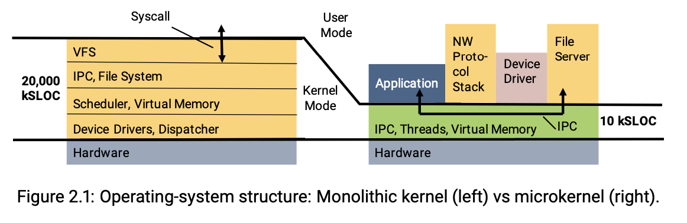

# OS Concept 

* **Types of kernel**
    * **Monolithic kernel: speed!**
        * E.x. Unix, Linux, BSD, Multics
        * All OS services operate in kernel space
            * Provides scheduling, file management through sys calls
        * Pros
            * **Performance**: communication between components is fast and efficient!
              * Generally faster in terms of performance because system calls and inter-process communication (IPC) do not require context switching between user space and kernel space. Direct function calls within the kernel are quicker than message passing used in microkernels.
        * Cons
            * Complexity: huge
            * Poor maintainability: hard to debug and maintain
            * Poor reliability: if any service fails, system failure. **A bug in one component can crash the whole system.**

* **Microkernel**: **modularity and reliability**
    * E.x. L4
    * Minimalistic approach
        * Kernel only keep: **basic IPC, virtual memory, scheduling**
          * **Exokernel**: only exposes resources.
          * Microkernel: mostly consists of **IPC (Interprocess communication)**
            * **Services (like FS, Processes, even user progrmas) communicates to the microkernel through IPC.** **Require context switching**. 
              * IPC: communication channel, or shared memory. 
              * **Context switching:**
                * Linux being monolithic, all its kernel components (device drivers, scheduler, VM manager) run at ring 0. Therefore, no context switch is necessary when performing system calls and handling interrupts.
                * Contrast microkernels, where components like device drivers and IPC providers run in user space, outside of ring 0. Therefore, this architecture requires additional context switches when performing system calls (because the performing module might reside in user space) and handling interrupts (to relay the interrupts to the device drivers).
        * Put other services run in user space
            * Libraries running on user space
            * E.x. device drivers, networking, file system, etc.
        * Communication between components is provided by IPC (i.e. applications R/W through IPC)
          * **IPC is slower than function calls in monolithic kernel.**
    * Pros
        * Scalability: kernel smaller, separation of services at separate layers
        * Extensibility: new services can be easily added
        * Easy maintenance and debugging
        * More secure and reliable: a single service faults not lead to failures
    * Cons
        * Bad performance: lots of system calls (i.e. IPC) and context switches
    * 

* **Hybrid kernel**
    * E.x. Windows, Android
        * MacOS (BSD Unix + Mach): monolithic on top of microkernel. Hybrid kernel. 
    * Combine best of both worlds
        * Speed and simple design of a monolithic kernel
        * Modularity and stability of a microkernel
        * User-mode services: Some components, such as  subsystems (e.g., user-mode drivers and environment subsystems like the Windows Subsystem for Linux), run in user space. This separation helps improve system robustness and security.
    * Pros: still similar to monolithic kernel
        * With disadvantages similar

* **Exokernel**
    * Follow end-to-end principals
        * Extremely minimal: extreme version of microkernel
        * Fewest hardware abstractions as possible
        * Just allocates **physical resources** to apps
    * Pros: minimal and simple
    * Cons
        * More work for application developer
        * Poor isolation: each application implements own LibOS
            * Libraries accessing directly the HW, don’t have isolations
        * Hardware compatibility: need to change LibOS depending on HW interfaces
    * What kind of applications:  Many operating systems in 1995 didn't give enough low-level access to virtual memory mappings to implement such techniques, but the exokernel did. The exokernel authors wrote a later paper (in SOSP 1997) that describes some examples in much more depth, including a web server that uses a customized file system layout to provide very high performance.
    * Unikernel: IPC; Exokernel: library OS linked to processes. 
    * The exokernel exposes some data structures (e.g. the page table) directly to the application, in read-only form, so that sometimes the application can avoid a system call altogether.
    * Web server can get very high performance with a customized file system disk layout. 

* **Unikernel** = Exokernel + Containers
    * Goal: link application with just enough OS functionality to allow it to execute
        * Instead of OS on top of VMM, use simple library kernel that get's optimized into a application specific binary
        * **Dead code elimination** so code size is smaller and simpler
        * Strongly typed library OS leads to fewer bugs and increased security
        * Faster overall since system calls become procedure calls over the VMM abstraction
          * **Instead of invoking a system call that switches to kernel mode, the application directly calls the corresponding function in the unikernel.** No context switching. 
        * Single address space. 
        * Result: faster OS with less code and 50ms boot times
    * Key idea: run one application per VM, one process per application
        * Everything compiled into a VM image
    * Pros
        * extremely lightweight (~MB), tailored to perform just one specific application
        * customizable
        * better isolation
    * Cons
        * Recompile, and each libraries are untrusted
