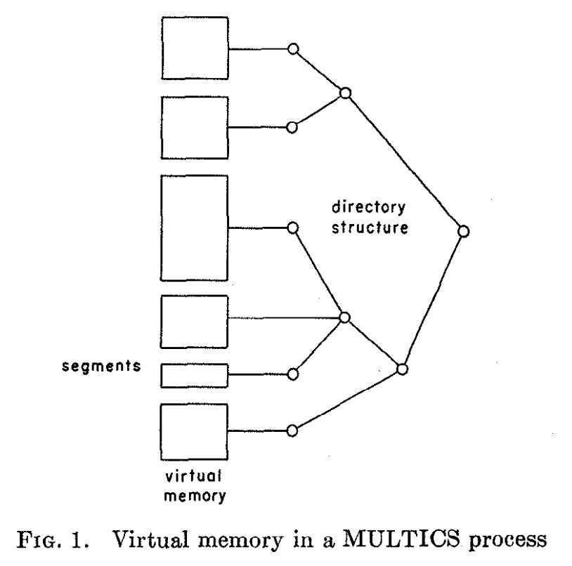
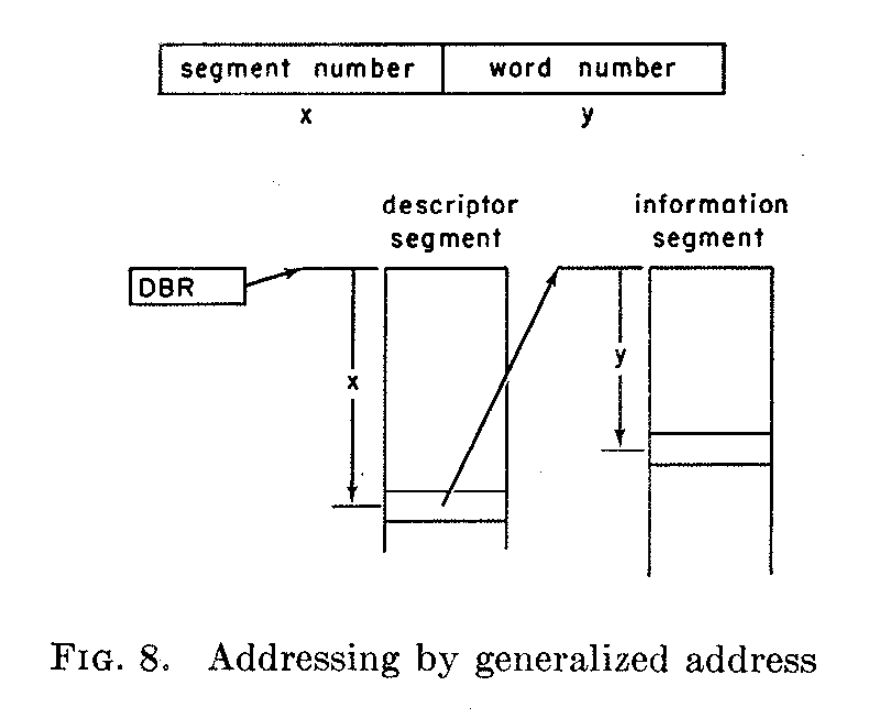
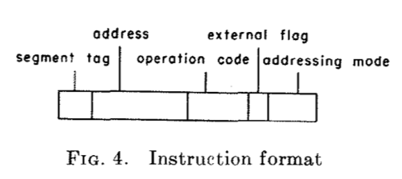

# Virtual Memory, Processes, and Sharing in MULTICS (1967) 

Link: https://www.andrew.cmu.edu/course/15-440/assets/READINGS/daley1968.pdf

Read: July 9th, 2024

This paper presents the design of MULTICS, including its concepts of processes, address space, and virtual memory, and the use of **paging** and **segmentation**. It talks about how users may share procedures and data, and the mechanisms to dynamically transform symbolic references into VM address. 

* Process: Each process runs in its own address space, which is established independently of other address spaces.
  * The address space consists of a large number ($2^{14}$) of segments, each consisting of as many as 2^18 36-bit words.
  * Each segment is a logically distinct unit of information having attributes of length and access privilege and may grow or shrink independently of other segments in the system. For present purposes, we consider two segment types: (1) data, and (2) procedure. A segment is treated as procedure if it is intended to be accessed for instruction fetch by a processor. Other segments (including, e.g., a source program file) are considered to be data.
  * Directory structure is a hierarchical arrangement of directories that associate at least one symbolic name with each segment.
  * 
* Complete generalized address (segment number + word number)

* Addressing by generalized address
  * 
  * **36 bits in total**: divided among segment number and word number. 
  * The descriptor base register is used by the processor to locate the descriptor segment of the process in execution.
  * Switching a processor from one process to another involves little more than swapping processor register status and substituting a new descriptor base. 
  * Some segments will be identified with different segment numbers in different processes. 
    * Since segment number is per-process, we additionally have a segment reference name. 
* Paging and page tables. 
<!-- * Linkage segment
  * Linking. From segment P to segment D you need $L_\alpha$, where $\alpha$ is the process. 
  * Honestly too complicated. 
  * When process $α$, in executing procedure $P$, transfers control to procedure $Q$, the value of linkage pointer must be changed to the generalized address of the linkage section for procedure $Q$.  -->

* Instruction format
  * 
  * **Addressing Mode** (Last 2 bits): pick among {Argument Pointer, Base Pointer, Linkage Pointer, Stack Pointer}. 
  * The *address* will get turn into the generalized address.
  * Segment number comes from the segment tag. 
  * Only program that can set the segment number has to be run in ring 0. 
  * Switching a process only requires changing the segment number.  

## Problem 
Before MULTICS there were no existing OS capable of providing users with a large machine-independent virtual memory. So the objectives of MULTICS are 
1. Provide user with ***large machine-independent virtual memory*** 
    1. I.e. responsibility of managing physical storage is now the system software 
2. Permit programming ***generality*** 
    1. One procedure can use another procedure only knowing its name, not the storage requirement 
3. Permit ***sharing of procedures and data*** among users subject only to proper authorization
