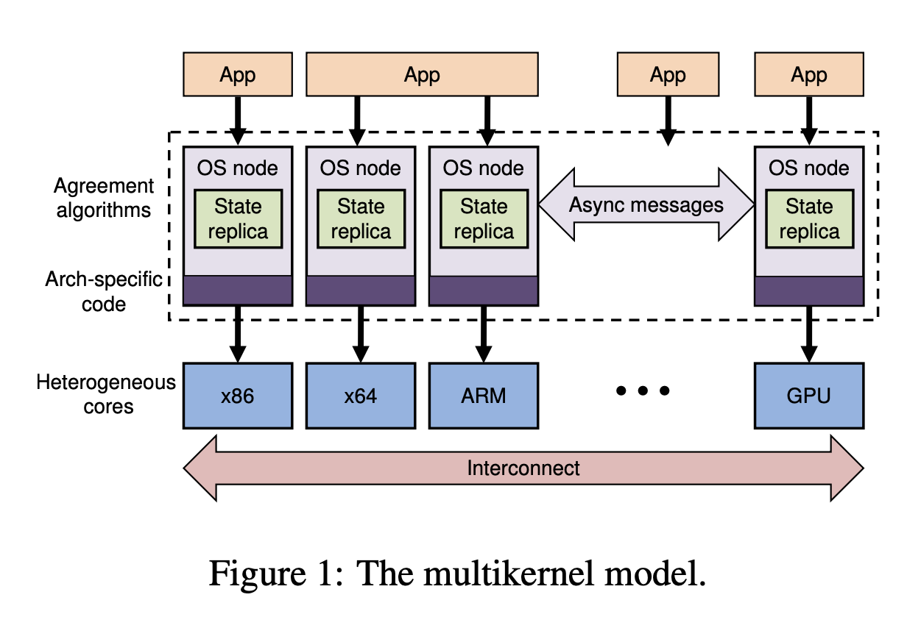
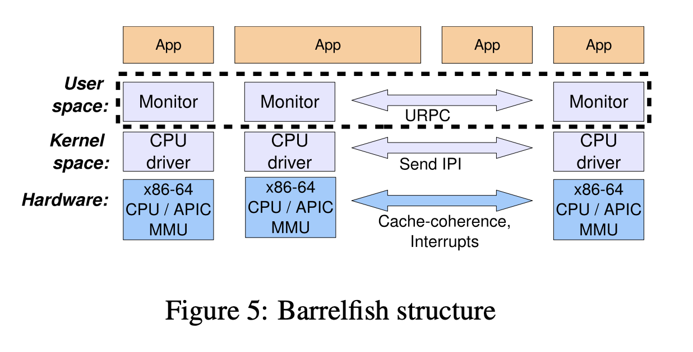

# The Multikernel: A New OS Architecture for Scalable Multicore Systems (2009)

Link: https://www.sigops.org/s/conferences/sosp/2009/papers/baumann-sosp09.pdf

June 29th, 2024

Increasing heterogenity and scalability in hardware (i.e. CPU cores) motivates modeling multicore systems as distributed systems. Three principles guide multikernel design 

* Challenges:
  * Scale to more cores
  * Hardware Heterogeneity (things that scale well on one architecture won't on another architecture. Interconnect is also diverse; different typologies. Core heterogeneity on a single chip, e.g. small number of power-hungry cores. )

* make all inter-core communication explicit via **message passing**
  * Machine as a network of *independent* cores.
  * No inter-core sharing.

* Make all OS structure **hardware-neutral** via separating OS structure from the hardware

* **Replicate state** across cores instead of sharing state. Look like local replicas. 
  * Note that this does not preclude applications sharing memory between cores (see Section 4.8), only that the OS design itself does not rely on it.

* Protocol: think of multi-core as a distributed system.

  * Message passing is good for non-coherent interconnect (PCIe) and hetereogenous cores (arm-offload process).

* instead of sequentially manipulating shared data structures, which is limited by the latency of remote data access, the ability to **pipeline and batch messages encoding remote operations** allows a single core to achieve greater throughput. 
* This is the paper on **Barrelfish**
  * 
    * IPI: Inter-process Interrupt 
      * In Linux and Windows, **inter-processor interrupts (IPIs)** are used: a core that wishes to change a page mapping writes the operation to a well-known location and sends an interrupt to every core that might have the mapping in its TLB. Each core takes the trap, acknowl- edges the IPI by writing to a shared variable, invalidates the TLB entry, and resumes.
    * CPU drivers handle **traps and exceptions**, while monitor is responsible for mediating on local operations on global states, executing the replica maintenance protocols. 
    * Barrelfish at present therefore uses a variant of **user-level RPC (URPC)** [10] between cores: a region of shared memory is used as a channel to transfer cache-line-sized messages point-to-point between single writer and reader cores.
* Core heterogeneity means cores can no longer share a single OS kernel instance, either because the performance tradeoffs vary, or because the ISA is simply different.
* Shared memory model has an inherent lack of scalability: 
  * **Although a single core can perform the update operation in under 30 cycles, when 16 cores are modifying the same data it takes almost 12,000 extra cycles to perform each update.** All of these extra cycles are spent with the core stalled on cache misses and therefore unable to do useful work while waiting for an update to occur.
* Message passing has two issues:
  * There are two principal concerns, the first to do with not being able to access shared data, and the second to do with the event-driven programming style that results from asynchronous messaging.
* design and reason about the OS as a distributed, non-shared system, and then employ sharing to optimize the model where appropriate.
  * We propose an OS architecture positioned at the extreme right of the spectrum, where all state is **replicated by default and consistency is maintained using agreement protocols**.
* Message passing allows operations that might require communication to be **split-phase**, by which we mean that the operation sends a request and immediately continues, with the expectation that a reply will arrive at some time in the future.

## Message passing v.s shared memory 
* Ousterhout describes that core speed is increasing faster than disk and memory latency. So operating systems still block on memory and disk. **Message passing is more efficient than shared memory at scale. So the multikernel embraces message passing (much like Mach).**
  * Message passing - copying message out of a buffer. When a process sends a message, the message is **copied** from the sender’s address space into a buffer managed by the kernel or IPC service. The receiving process retrieves the message by **reading** it from this buffer.

* Consider a set of cores that are row updating a shared array, the cache coherence protocol of the processor has to migrate the cachelines between all the cores performing the updates. The overall updates is limited by the latency of fetching cachelines. 

* However, the drawback of a idealist message-passing abstraction here is that certain platform-specific performance optimizations may be sacrificed, such as making use of a **shared L2 cache** between cores.

* Not only that, the model supports multiple implementations of the agreement protocols used to maintain consistency. This increases the burden on the developer who must understand the consistency requirements for the data, but on the other hand, can also precisely control the degree of consistency.

* We factor the OS instance on each core into a **privileged-mode CPU driver and a distinguished user-mode monitor process**. CPU drivers are purely local to a core, and **all inter-core coordination is performed by monitors**. The distributed system of monitors and their associated CPU drivers encapsulate the functionality found in a typical monolithic microkernel: scheduling, communication, and low-level resource allocation.

* Device interrupts are routed in hardware to the appropriate core, demultiplexed by that core’s CPU driver, and delivered to the driver process as a message.

* a **CPU driver abstracts very little** but performs dispatch and fast local messaging between processes on the core. It also delivers hardware interrupts to user-space drivers, and **locally time-slices user-space processes**. The CPU driver is invoked via standard system call instructions with a cost comparable to Linux on the same hardware.

* Monitors collectively coordinate system-wide state, and encapsulate much of the mechanism and policy that would be found in the kernel of a traditional OS. The monitors are single-core, user-space processes and therefore schedulable. Hence they are well suited to the split-phase, message-oriented inter-core communication of the multikernel model, in particular handling queues of messages, and long-running remote operations.

* Barrelfish at present therefore uses a variant of user-level RPC (URPC) [10] between cores: a region of shared memory is used as a channel to transfer **cache-line-sized messages point-to-point** between single writer and reader cores.  At present, dispatchers poll incoming channels for a predetermined time before blocking, however this can be improved by adaptive strategies similar to those used in deciding how long to spin on a shared-memory spinlock.

* All virtual memory management, including allocation and manipulation of page tables, is performed entirely by user-level code
Question: In a multikernel OS like Barrelfish, how is the concept of "hardware neutrality" implemented, and what benefits does this offer?
Answer: Barrelfish's hardware neutrality is achieved by isolating the OS from direct hardware interactions through a layer of abstraction where each core runs its own kernel instance. This abstraction allows the OS to be easily ported across different hardware architectures without significant changes, promoting flexibility and reducing the need for hardware-specific optimizations in the kernel code.

# Barrelfish Architecture Components

## CPU Driver
- **Role:** Interface between the OS and physical CPU.
- **Functions:**
  - **Context Switching:** Manages transitions between tasks, saving and restoring CPU state.
  - **Interrupt Handling:** Processes hardware interrupts, directing them to appropriate software components.
  - **Power Management:** Handles CPU power states, though this might be abstracted at higher levels.

## Monitor
- **Role:** Acts as a hypervisor or privileged kernel component for system oversight.
- **Functions:**
  - **Resource Management:** Allocates CPU time, memory, and other resources to system components.
  - **Isolation:** Ensures different applications or services run in isolated environments for security and stability.
  - **Security:** Enforces policies, manages hardware access, and handles privileged operations.
  - **Inter-Component Communication:** Facilitates communication via message passing or shared memory.

## Hardware
- **Role:** Physical components like CPUs, memory, and I/O devices that Barrelfish interacts with through drivers and the monitor.
- **Interaction with Barrelfish:**
  - **CPU:** Executes OS instructions for scheduling, interrupt management, and system calls.
  - **Memory:** Managed for allocation, protection, and virtual memory mapping.
  - **I/O Devices:** Drivers facilitate interaction with peripherals like network cards and storage devices.

### Key Points:
- **Decentralized Control:** Each core can run its own kernel instance, reducing contention and enhancing scalability.
- **Microkernel Design:** The monitor provides minimal essential services, with most OS functionality as user-level services.

In Barrelfish, these components work together to maximize performance and scalability, particularly in multi-core environments, by minimizing bottlenecks and enhancing parallel processing capabilities.
