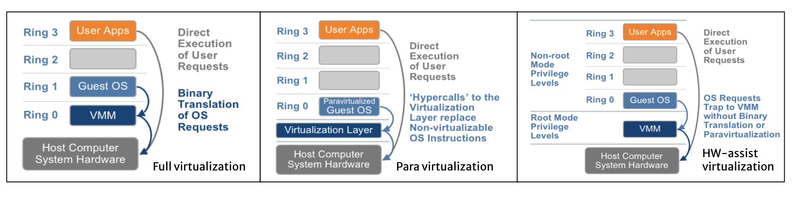
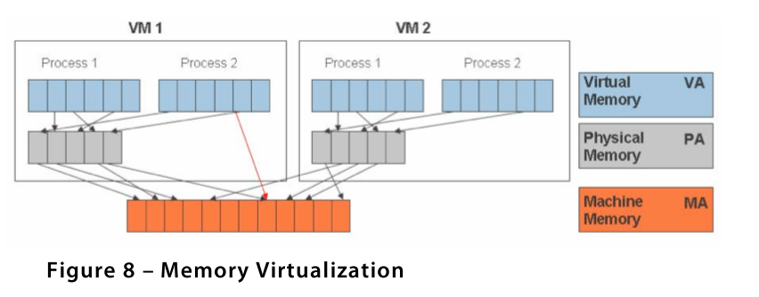
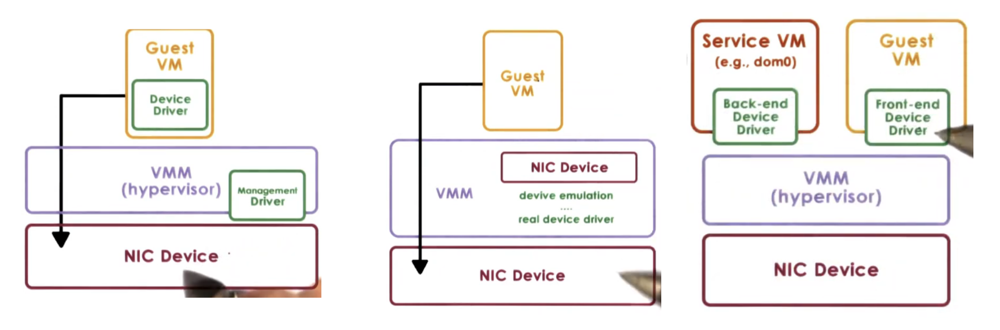

# Virtualization 
Virtualization allows multiple guest OSes (and their applications) to share the hardware resources of a single physical server. 

## Hosted vs. Hypervisor architecture

* Virtualization approaches use either a hosted or a hypervisor architecture. 
  * A **hosted architecture** installs and runs the virtualization layer as an application on top of an operating system and supports the broadest range of hardware configurations
  * In contrast, a **hypervisor** (bare-metal) architecture installs the virtualization layer directly on a clean x86-based system. Since it has direct access to the hardware resources rather than going through an operating system, a hypervisor is more efficient than a hosted architecture and delivers greater scalability, robustness and performance.

## Bare metal servers

* Bare metal servers are physical servers that are dedicated entirely to a single tenant or customer. Unlike virtualized environments where multiple virtual machines (VMs) share the same physical hardware, bare metal servers offer full access to all of the server's resources. 
* When you get a VM on AWS, it is not a bare metal server. Instead, it is a virtualized instance running on top of AWS's physical infrastructure, which is shared among many customers.
* AWS does offer bare metal instances (such as the i3.metal, m5.metal, and r5.metal instance types) where you have direct access to the physical hardware without a hypervisor.

## Challenges: trap-and-emulate 
* Guest instructions executed directly by hardware
    * Non-privileged operations: hardware speed
    * Privileged operations: **trap to hypervisor**
* Hypervisor determines what needs to be done
    * **Emulates** the behavior the guest OS expects from the hardware
    * Followed by "Return from Trap" (`rtt`)

* Commodity hardware has more than 2 protection levels. E.g. **X86 has 2 protection levels (rings) and 2 protection modes (root and non-root) recently.**

For X86 pre 2005, if trap-and-emulate: 
* 4 rings, hypervisor in ring 0, guest OS in ring 1 
* Problem: certain privileged instructions that can only be executed in Ring 0
   *  **17 privileged instructions do not trap, fail silently!**
   * E.x. enable / disable interrupt bit in privileged register from ring 1 fail silently 
* Hypervisor does not know, will not emulate the behaviors, assume changes was successful 

## CPU Virtualization

### Full virtualization: binary translation and direct execution
*  Goal: full virtualization == guest OS not modified
*  **Main idea: rewrite VM binrary to never issue those 17 instructions**
*  Approach: dynamic binary translation
    1) hypervisor inspects code to be executed by the guest OS 
    2) translates kernel code to replace nonvirtualizable instructions with new sequences of instructions that have the intended effect on the virtual hardware.
    3) if needed, translate to alternative instruction sequence
       * e.g. to emulate desired behavior, possibly even avoiding trap
    4) otherwise, run at hardware speeds
       * cache translated blocks to amortize translation costs 
*  Pros: best isolation and security, excellent compatibility
*  **Cons: performance** (trap to hypervisor)

### Paravirtualization: hypercalls
*  Goal: performance, give up on unmodified guest
*  Replace non-virtualizable instructions with **hypercalls**
*  The open-source Xen project is an example of paravirtualization. 
*  Approach: **paravirtualization** == **modify guest OS so that**
     * **it knows it's running virtualized**
     * **it makes explicit calls to the hypervisor (hypercalls)**
*  Hypercalls (~system calls)
     * package context info
     * specify desired hypercall
     * trap to VMM 
*  Pros: lower virtualization overhead
*  Cons: poor compatibility, requires OS kernel modifications 

### Hardware-assisted virtualization: root / non-root  
*  New hardwares (e.g. Intel VT-x and AMD's AMD-V) allows VMM to run in new root mode below ring 0
   *  **Privileged calls are set to automatically trap to hypervisor**
   *  Removing the need for either binary translation or paravirtualization. 
   *  E.x. Intel-VT (~2005) 
*  Pros: excellent compatibility
*  Cons: some performance issues
*  Rigid programming model: leaves little room for software flexibility in managing either the frequency or the cost of hypervisor to guest transitions. 

## Memory Virtualization 

* 

### Full virtualization 
The guests expect contiguous physical memory, start at 0 (just like it owns the machine). We should distinguish virtual v.s physical v.s machine addresses and page frame numbers, and still leverages hardware MMU and TLB. 
* Binary translation. the Host program would scan the guest binary for such instructions and replace them with either a call to hypervisor or some dummy opcode (which will cause a trap). 
  * In the case of para-virtualization, the source code has already been modified. Such an image directly calls hypervisor APIs. In the case of Binary translation, the native OS must first scan the guest OS instruction stream and make modifications to the stream as needed. Thus between the two, Para-Virtualization incurs lower overhead. 

**Option 1:**: expensive on every single memory reference 
* guest page table: VA => PA
* hypervisor: PA => MA 

**Option 2:**
* guest page table: VA => PA
* hypervisor shadow PT: VA => MA
  * VMM uses TLB hardware to map the virtual memory directly to the machine memory to avoid the two levels of translation on every access. 
* hypervisor maintains consistency between guest PT and hypervisor shadow PT 
  * When the guest OS changes the virtual memory to physical memory mapping, the VMM updates the shadow page tables to enable a direct lookup.
  * e.g. invalidate on context switch

### Paravirtualization
The guest is aware of virtualization, and there is no longer strict requirement on contiguous physical memory starting at 0. 

**The guest can *explicitly* registers page tables with the hypervisor. Every update to the page table will cause a trap to the hypervisor, but we can do tricks like "batch" page table updates and issue a single hypercall. Other optimizations can be useful.**

## Device and I/O virtualization 
When we look at CPU and memory, there is a significant level of standardization of interface at ISA-level and less diversity. We don't care much about the lower differences about the hardware. 

For devices, there is higher diversity, and there is lack of specificaiton of device interface and behavior. There are three key models for device virtualization (prior to virtualization even exists). 

* Passthrough model: VMM-level driver configures device access permissions
     *  Pros
         *  VM provided with *exclusive* access to device
         *  VM can directly access the device (**VMM-bypass**)
     *  Cons
         *  device sharing difficult
         *  VMM must have exact type of device as what VM expects
         *  VM migration tricky (i.e. device-specific states)
* Hypervisor-direct model: VMM intercepts all device accesses
     *   Emulate device operation
           *  translate generic I/O operation
           *  traverse VMM-resident I/O stack
           *  invoke VMM-resident driver
     *   Pros
         *  VM decoupled from physical device
         *  sharing, migration, dealing with device specifics
     *   Cons
         *  latency of device operations
         *  device driver ecosystem complexities in hypervisor
* Split-device driver model: device access control split between
     *  front-end driver in guest VM (device API)
     *  back-end driver in service VM (or host)
     *  modified guest drivers
         *  i.e. limited to **paravirtualized** guests
     *  Pros
         *  eliminate emulation overhead, explicitly tell what guest VM requires
         *  allow for better management of shared devices     

## List of Questions 
* What is virtualization? how are they used today?
   * how do you virtualize hardware (cpu, memory, device)?
   * what is the design goal of Xen? and how does it accomplish it? 
* What is container? how are they used today?
   * how do you implement containerization?
   * should we use centralized or decentralized schedulers to handle containers 
   * what are some problems associated with containers? 
* What are the trade-offs between virtulization and container?
* How does exokernel compared to hypervisors?

## Containers 
* Containers are lightweight, encapsulated environments that run applications and their dependencies.
* Unlike virtual machines, **containers share the host system’s kernel**, rather than needing their own operating system.
* Mechanisms: kernel featurers like namespace and cgroups 
    *  Namespacing: isolates process trees, networking user IDs, and mounts
    *  Cgroups: limit and prioritize CPU, memory, block I/Os, and network resources
*  Used in microservices
*  Pros: lightweight, fast, and portable 
*  Cons: weaker isolation and security guarantees 

## Virtualization v.s Containers
* VM: virtualize hardware
* Containers: virtualize OS, contains only the application and its libraries and dependencies
* LightVM paper discusses the trade-offs between containers and VMs in terms of performance and security (isolation) guarantees

## Isolation and Fault tolerance 
It is important for fault tolerance because:
* Prevent a single point of failure from bringing down the entire system
* Limit the spread of security vulnerabilities
* Make it easier to identify and fix issues with modules

For example, UNIX provides isolation:
* Process isolation: each process runs in its own address space
* User and group permissions: file and process access control based on user and group permissions
* Namespace: used to isolate different system resources like network, PID, and mounts
   *  i.e. containers  

## Takeaways

* Full Virtualization with Binary Translation is the Most Established Technology Today
* Hardware Assist is the Future of Virtualization, but the Real Gains Have Yet to Arrive
* Xen’s CPU Paravirtualization Delivers Performance Benefits with Maintenance Costs

## Type I Virtualization vs. Type II Virtualization

* Type 1 hypervisor
  * A type 1 hypervisor, or a bare metal hypervisor, interacts directly with the underlying machine hardware. A bare metal hypervisor is installed directly on the host machine’s physical hardware, not through an operating system. In some cases, a type 1 hypervisor is embedded in the machine’s firmware.
  * The type 1 hypervisor negotiates directly with server hardware to allocate dedicated resources to VMs. It can also flexibly share resources, depending on various VM requests.
* Type 2 hypervisor
  * A type 2 hypervisor, or hosted hypervisor, interacts with the underlying host machine hardware through the host machine’s operating system. You install it on the machine, where it runs as an application.
  * The type 2 hypervisor negotiates with the operating system to obtain underlying system resources. However, the host operating system prioritizes its own functions and applications over the virtual workloads.