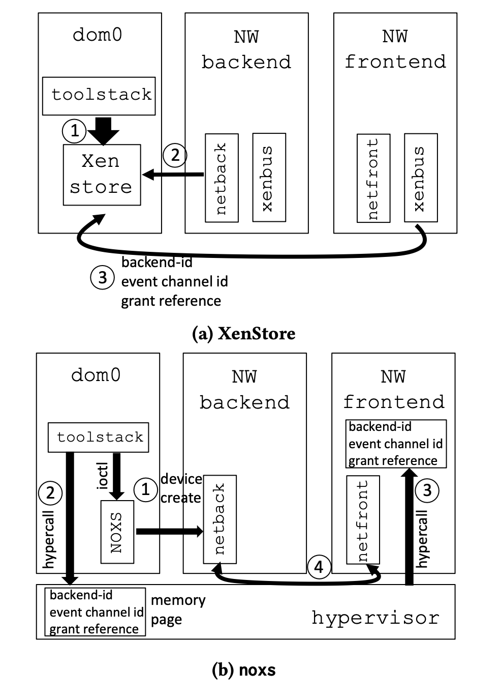
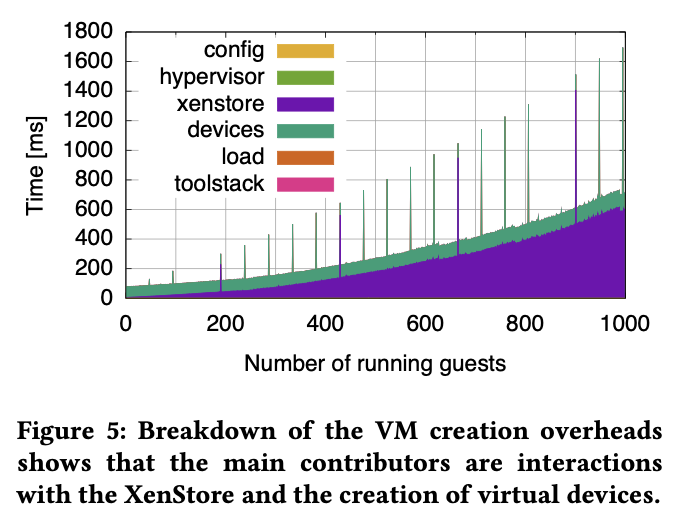

# My VM is Lighter (and Safer) than your Container (2017)

Link: https://dl.acm.org/doi/pdf/10.1145/3132747.3132763

Read: July 10th, 2024.

The paper addresses the trade-off between isolation and efficiency in Virtual Machines (VMs) and containers. While containers are lightweight, they lack the security guarantees that VMs provide. The paper proposes techniques **LightVM** based on Xen to make VMs as efficient as containers without compromising on security.

Lightweight VMs use **unikernels**.
* A unikernel is a machine image that contains everything necessary for application execution, including the operating system component. This property makes unikernels completely self-sufficient and able to run independently on top of a bare metal hypervisor.

## Tradeoffs 
Containers are lightweight but less secure, while VMs offer strong isolation at the expense of being resource-heavy and slow to boot.
  * Secure many syscalls.
  * To complicate matters, any container that can monopolize or exhaust system resources (e.g., memory, file descriptors, user IDs, forkbombs) will cause a DoS attack on all other containers on that host
*  Why is container less secured?
    *  shared kernel 
    *  containers use large # of syscall APIs to interact with HostOS, larger attack surface 
Downside of VM:
* Size:  for instance, both the on-disk image size as well as the running memory footprint are on the order of hundreds of megabytes to several gigabytes for most Linux distributions. 

## Requirements
* Fast instantiation
* High instance density
* Pause/unpause

## Key technique 
* **Unikernels**: create minimalistic VMs where a pared-down OS is directly linked to the application.
* Unikernels: tiny virtual machines where a minimalistic operating system (such as MiniOS) is linked directly with the target application.
* **Tinyx**: an automatic build system that we have built to create a tiny Linux distribution around a specified application.
  * The **Tinyx** build system takes two inputs: an **application** to build the image for (e.g., **nginx**) and the **platform** the image will be running on (e.g., a **Xen VM**).
  * A middle path between a highly specialized unikernel, requiring porting applications to a minimalistic OS, and a full-fledged general purpose OS VM that supports a large number of applications out of the box but incurs performance overhead. 
* An image that are **a few MBs** in size.
* Insight: typically a VM runs one application, and that application is only using a small subset of libraries and services. (We can shrink the size of the VM to only those services and libraries
* The time to get unikernel to work is quite staggering. 

- Xen runs the special VM `dom0` that is in charge of managing the machine. 
- XenStore is talked to by all VMs, and used to store configuration data and synchronize virtual machines. 

1. Lightweight guest: TinyX 
   *  automate **creations of trimmed-down Linux VMs** just enough to run the applications
   *  take standard Linux Distro and make it smaller.
   *  Fast instantiation, destruction and migration, 10s of milliseconds or less.  
2. Re-architect toolstack
   *  re-architect Xen's toostack (i.e. control plane)
       *  **get rid of Xenstore**: store data, guest comm, sync
          *  `noxs`, or no XenStore. 
       *  use shared memory and event channel for communication     
       *  using instead a lean driver called **noxs** that addresses the scalability problems of the XenStore by enabling direct communication between the frontend and backend drivers via **shared memory** instead of relaying messages through the XenStore
          *  Shared memory reduces the number of software interrupts and domain crossing for VM operations.
          *  Shared memory used to store data and commuicate between guests. Synchronized using Xen event channels. 
       *  Separate VM creation functionality into a prepare and execute phase.
          *  The insight for the prepare phase is that: first few steps (hypervisor reservation, compute allocation, memory reservation, memory preparation) are common to all VMs. 
          *  VM creation calls are done by this split toolstack. 
          *  run a VM just becomes starting an empty shell. 
   *  optimized to offer fast boot-times that scale to large # of VMs  =
   *  Hypervisor **creates special device memory pages** for each VM. Only `Dom0` can request modifications. 
   *  **Hypercall to write to and read from this memory page.**
   *  When a VM create command is issued, it does not actually need to run a VM at VM creation time.
      *  A lot of code is common to all VMs.
      *  VMs can be pre-executed and off-loaded from the creation process (having the hypervisor generates an ID, allocating CPU resources.)
      *  Execute
         *  Asking for shell fitting the VM. Loading the kenrel image into memory. Finalizing device initialization.
         *  On this shell, the remaining VM-specific operations, such as loading the kernel image into memory and finalizing the device initialization, are executed to create the VM, which is then booted. 

### Xenstore becomes the bottleneck

* Protocol is expensive. Each operation requires sending a message and receiving an acknowledgement; each triggers a software interrupts. 
  * When the toolstack wants to talk to backend (`dom0`) or the front end VM, it needs to cross the Xen Hypervisor. 
* As we increase the number of VMs, so does the load on this protocol. 
* one fundamental problem with the XenStore is its centralized, filesystem-like API which is simply too slow for use during VM creation and boot, requiring tens of inter- rupts and privilege domain crossings.

> The insight here is that the hypervisor already acts as a sort of centralized store, so we can extend its functionality to implement our noxs (no XenStore) mechanism.

## LightVM

LightVM does not use the XenStore for VM creation or boot anymore, using instead a lean driver called noxs that addresses the scalability problems of the XenStore by enabling direct communication between the frontend and backend drivers via shared memory instead of relaying messages through the XenStore. Because noxs does not rely on a message passing protocol but rather on shared pages mapped in the guest’s address space, reducing the number of software interrupts and domain crossings needed for VM operations (create/save/resume/migrate/destroy). 

- Chaos: provides a toolstack optimized for paravirtualized guests. 

## Use cases 
JIT service instantiation in mobile edge computing, lightweight compute services like AWS Lambda 

LightVM exposes a clear trade-off between performance and portability/usability. Unikernels provide the best performance, but require non-negligible development time and manual tweaking to get an image to compile against a target application. Further, debugging and extracting the best performance out of them is not always trivial since they do not come with the rich set of tools that OSes such as Linux have

The use cases we presented show that there is a real need for lightweight virtualization, and that it is possible to si- multaneously achieve both good isolation and performance on par or better than containers. However, there is a development price to be paid: unikernels offer best performance but require significant engineering effort which is useful for highly popular apps (such as TLS termination) but likely too much for many other applications. Instead, we have proposed Tinyx as a midway point: creating Tinyx images is streamlined and (almost) as simple as creating containers, and performance is on par with that of Docker containers