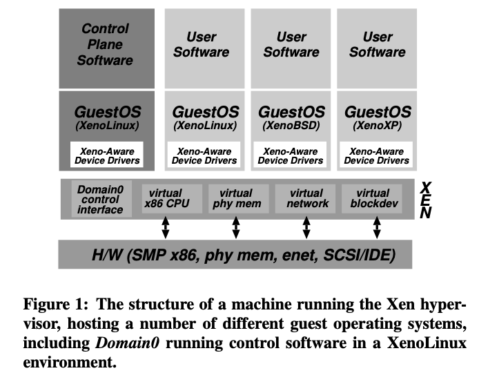

# Xen and the Art of Virtualization (2003) 

Link: https://www.cl.cam.ac.uk/research/srg/netos/papers/2003-xensosp.pdf

Helpful Youtube: https://www.youtube.com/watch?v=2moUsgMOie4

Read: July 10th, 2024.

This paper proposes a practical design for **paravirtualized** virtual machine. The main goal of the design is performance. Avoid the full hardware emulation in full virtualizaiton. 

## Motivation: inefficiency of full virtualization 

* This paper presents Xen, an x86 virtual machine monitor which allows multiple commodity operating systems to share conventional hardware in a safe and resource managed fashion, but without sacrificing either performance or functionality. 

* Requirements
  * Isolation
  * Wide variety of OS
  * Performance penalty should be low. 

* To support correct virtualization, **certain supervisor instructions must be handled by the hypervisor (VMM)**, but executing this with insufficient privilege fails silently rather than causing a trap. **Full virtualization** techniques (e.x. VMWare's ESX) dynamically rewrites portion of the guest machine code to insert traps whenever VMM intervention is required. For example, ESX implements shadow versions of system structure such as **page tables and maintain consistency with the virtual tables by trapping every update attempt.**

* This technique is **complex** and has **high performance cost** particularly for update-intensive operations (i.e. trap every update to maintain consistency with virtual tables). Also, **sometimes it is desirable for guest OS to see real resources** (e.g. TCP message out, VM gets descheduled, message gets queued, VM gets re-scheduled, how to tell the time. Virtual time stops when not using the CPUs. ): i.e. real and virtual time (virtual time is useful for scheduling threads on guest OS! ), expose real machine addresses to improve performance. 

* There are situations in which it is desirable for the hosted operating systems to see real as well as virtual resources: providing both real and virtual time allows a guest OS to better support time-sensitive tasks, and to correctly handle TCP timeouts and RTT estimates. 

* In Denali, applications are linked explicitly against an instance of the Ilwaco guest OS in a manner rather reminiscent of a libOS in the Exokernel. Each virtual machine essentially hosts a single-user single-application un-protected “operating system”. In Xen, by contrast, a single virtual machine hosts a real operating system which may itself securely multiplex thousands of unmodified user-level processes.

## Interface 
* Domain
   * A running virtual machine within which a guest OS executes. 
* Memory 
   *  guests have read access to PT but must update them through VMM. In other words, when the guest VM registers the Page table with Xen, it relinquishes direct write privileges to the PT memory; all subsequent updates must be **validated** by Xen. 
   *  The guest OS Hypercall to ask Xen to change the PT can do batching of updates to lower overhead. 
   *  Challenge: x86 does not have software-managed TLB; instead, TLB misses are serviced automatically by the processor by walking the page table structure in hardware. 
   *  Xen allows guest OS to read its PT, but has to go through Xen to modify the PT. 
   *  Software-managed TLB. Don't have to flush at every transition. 
   *  The top 64MB region of each address space, which is reserved for Xen, is not accessible or remappable by guest OSes. This avoids a TLB flush when entering and leaving the hypervisor. 
   *  They load Xen, the entire hypervisor is under 64MB, into the address space of **every guest VM**.
      *  When I make hypercalls, I don't have to flush the TLBs! I can allow TLB entries to coexist with the OS itself. 
      *  Guest OS doesn't have access to these addresses. 
* CPU
   *  replaces nonvirtualizable instructions with **hypercalls** that communicate directly with the VMM
      * **Hypercall** vs. **Systems call**. 
      * **Making hypercall is expensive, at least a context switch.**
   *  x86 has four protection rings, but typically only two are used. Nobody uses them before Xen. 
   *  Guest OS uses Ring 1, Xen uses Ring 0. Guest OS needs to run at lower priviledge levels. 
      *  Guest OS (on Ring 1) is prevented from directly executing privileged instructions.
   *  Guest **registers a descriptor table for exception handling with VMM**. 
   *  Guests are aware of virtual and real time
   *  Xen improves the performance of system calls by allowing **each guest OS to register a ‘fast’ exception handler** which is accessed directly by the processor without indirecting via ring 0 (i.e. such fast exception handler does not need to interact with Xen); this handler is **validated** before installing it in the **hardware exception table**. **This system call can be handled just in the guest OS!**
* I/O
   *  I/O data is transferred to and from each domain (of the guest OS) via Xen, using shared-memory, asynchronous buffer- descriptor rings.
   *  Xen supports a lightweight event-delivery mechanism which is used for sending asynchronous notifications to a domain.
      *  **The event mechanism replaces hardware interrupt for notifications.**
   *  These notifications are made by updating a bitmap of pending event types and, optionally, by calling an event handler specified by the guest OS. 
      *  The callbacks can be 'held off' at the discretion of the guest OS - to avoid extra costs of frequent interruptions. 
*  
   *  Control plane software is running as one guest VM. 
   *  Guests have been modified that run Xeno-aware device drivers. 
   *  There are no host OS, but hypervisor. 

## Problem 
Bad portability and maintenance cost **because of the need to modify guest OS.**

Luckily, it does not require changes to the application binary interface (ABI). No need to change source code **and the binary!**

## Type I vs. Type II.

* Xen is a Type I hypervisor, which means it runs directly on the hardware.
  * Better performance and security. 
* Type II hypervisors run on a conventional operating system just like other computer programs.

## I/O rings
* Shared memory ring buffer. 
* I/O rings is a circular queue of descriptors allocated by a domain but accessible from within Xen. 
* Access to each ring is based around two pairs of producer-consumer pointers: domains place requests on a ring, advancing a request producer pointer, and Xen removes these requests for handling, advancing an associated request consumer pointer. Responses are placed back on the ring similarly, save with Xen as the producer and the guest OS as the consumer.
* Producer-consumer model: DomU acts as a producer, placing I/O requests into the ring, and Dom0 acts as a consumer, processing these requests. After processing, Dom0 places responses back into the ring for DomU to consume.
* Grant Tables: Used for sharing memory between domains. A grant table entry allows a domain to grant another domain access to a page of its memory, which is crucial for setting up the I/O rings.
Event Channels: These are used to notify domains when there's new data in the I/O ring, allowing for asynchronous I/O operations.

## Domain:

Xen uses a concept called "domains." Domain 0 (Dom0) is the first domain to start, which has direct access to hardware and manages other domains (DomU). Each DomU runs a guest OS, and resources like CPU, memory, and I/O devices are managed through Xen's hypervisor, which ensures isolation and fair resource distribution.

* Domain U: 
* I/O data is transferred to and from each domain via Xen, using shared-memory, asynchronous buffer- descriptor rings.

## Compared to KVM

* KVM is Linux's default hypervisor. runs inside the kernel. Type 1 hypervisor.
* Full virtualization. Binary translation has overhead. 

## Page Table

* Full virtualization requires shadow page tables. 
* Although full virtualization forces the use of shadow page tables, to give the illusion of contiguous physical memory, Xen is not so constrained. Indeed, Xen need only be involved in page table updates, to prevent guest OSes from making unacceptable changes.
* Guest OS registers updates to page tables through hypercalls. The requests are validated by Xen. 

## Paging:
* **Guest OS has direct read access to hardware page tables, but updates are batched and validated by the hypervisor. A domain may be allocated discontiguous machine pages.**

## Exception handler:
* Guest OS registers a descriptor table for execption handling with Xen. 
* Guest OS can install a fast handler for system calls, allowing direct calls from an application into its guest OS and avoiding indirecting through Xen on every calls. 