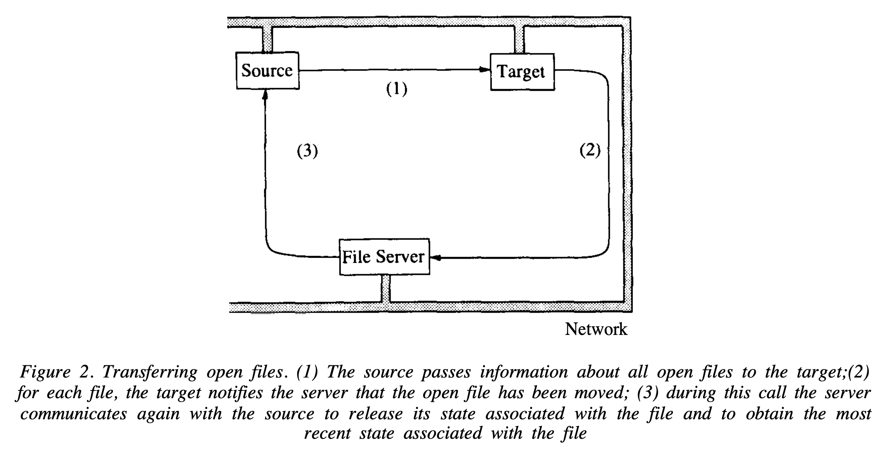

# Transparent Process Migration: Design Alternatives and the Sprite Implementation (1991)  

Link: https://citeseerx.ist.psu.edu/document?repid=rep1&type=pdf&doi=fe17a38a8174a93c3b85cf752d789723ba2a5177

Read: June 29th, 2024.

* The paper talks about design of process migration in the Sprite OS. The objective is to utilize idle workstations in a network by migrating processes from busy to idle machines, without disrupting user experience. The authors balance four key factors: **transparency**, residual dependencies, performance, and complexity.

* A remote process will just appear as a local process to the user, with the same process ID, appears in process listings on the home machine, file descriptors, and memory contents. 

* All the hosts on the network share a common high-performance file system.

* Four design aspects:
  * Idle hosts are plentiful.
  * Users 'own' their workstations. 
  * Sprite uses kernel calls -- how to handle the transparent issue?
  * Existing network support. Network wide space of process identifiers. reuse the kernel-to-kernel remote procedure calls. 

* `rsh` Remote invocation. Take a name of the machine and a command, and causes the given command to be executed on the remote machine.

* Compared to remote invocation and checkpointing
  * Process migration offers greater flexibility; as checkpointing is not always feasible (e.g., a process that interacts with other process); and user has to decide whether to checkpoint or not.
  * Migration is only moderately more complicated than transparent remote invocation.

* States:
  * Virtual memory
  * Open files
  * Message channels (in message-based OS like Mach, this will be file-like channels for interprocess communication. )
  * Execution states (register values and condition codes)
  * Other kernel states (user identifier, current working directory.)

* Some states cannot be transferred:
  * Frame buffer associated with a display **(stay with source device)**
  * I/O device (OS can arrange for output requests to be passed back from the process to device)
  * Message channel (require changing sender and receiver addresses)

* An approach based entirely on forwarding kenrel calls or forwarding messages does not work.
  * Some services must be necessarily provided on the machine where a process is executing: e.g., page table
  * Cost. If a service is availabile locally on the *remote machine*, that's much faster. 

* Two challenges of virtual memory transfer:
  * Take seconds. Process cannot execute on local or remote machine
  * Monolithic virtual memory transfer results in wasted work when some portions of the virtual memory is not used.

* V system allows pre-copying: rather than freezing the process at the beginning, **allowing the process to continue to execute while its address space is transferred.**

* Sprite disallows shared writable shared memory. The overhead of a process on local machine and remote machine accessing shared writable pages is too much.

* State migration for files is trickier:
  * File reference
    * Closes a file on the source and reopens on target will cause the file to temporarily not be available
  * Caching information
    * Consistent access to cached shared data.
    * When an open file is transferred during migration, **the file cache on the source machine may contain modified blocks for the file.**
    * These blocks are flushed to the file’s server machine during migration, so that after migration the target machine can retrieve the blocks from the file server without involving the source.
  * Access position
    * **the access position** for a file may be shared between two or more processes.
    * Disable caching approach.
    * if an access position becomes shared between machines, then neither machine stores the access position (nor do they cache the file); instead, the file’s server maintains the access position and all operations on the file are forwarded to the server.

* Key techniques
  * Global State Maintenance: all machine in the same network see the same namespace
  * State Transfer: Virtual memory, open files, process IDs, etc., are transferred from the source to the target machine
  * Forward Kernel Calls: Certain kernel calls, like `gettimeofday()`, are forwarded to the home machine for execution

Examples
* Migrating Virtual Memory: The paper uses a variant of lazy-copying the pages, flushing the dirty pages to the server first and then starting the process on the target with no resident pages.
* Migrating Open Files: The paper transfers file references, caching information, and access positions between the source and target machines to maintain file state consistency.
* Process Control Block. Home machine maintains a PCB for the process. the PCB on the home machine serves primarily to locate the process and most of its fields are unused.

* Sprite does keep residual dependencies (e.g. process opens a device); this is because Sprite prioritizes transparency over reliability

* Deciding how to migrate: 
  * Each Sprite machine runs a background process called the load-average daemon, which monitors the usage of that machine. When the workstation appears to be idle, the load-average daemon notifies the central migration server that the machine is ready to accept migrated processes
  * Switched from a single file in the file system to shared database in a server approach.
  * `mig`, which takes as argument a shell command. Mig will select an idle machine using the mechanism described above and use process migration to execute the given command on that machine.
* Make performs its compilations and other actions serially; in contrast, `pmake` uses process migration to invoke as many commands in parallel as there are idle hosts available

## Compared with VMs or containers 
### Similarities 
* Goal: improve resource utilization, provide transparency 
* State transfer: migration involves transfer state like memory contents and file descriptors
    *  VM migration: entire memory state, CPU, and device state
    *  container migration: container's FS, process states, network connections
*  Lazy copy: modern hypervisors also deploy similar techniques
    *  only necessary parts of memory are transferred initially
    *  rest are paged / transferred on demand
*  Global namespace maintenance: Sprite's idea of single-system image is similar to container orchestration system like K8s, where there is an abstraction layer over individual node 

### Differences 
* Forward kernel call: not a standard practice due to better networking and API solutions 
* VM and Containers: more coarse-grained, moving the entire VM or container applications (often grouped into Pods in K9s), the goal is to manage and move them effectively as a unit
   * Why? consistency, performance, and isolation 
