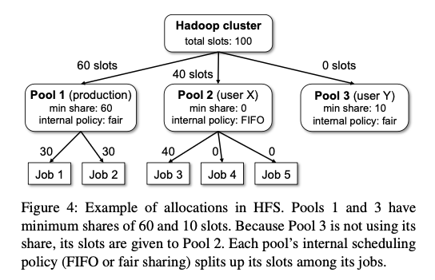

# Delay Scheduling: A Simple Technique for Achieving Locality and Fairness in Cluster Scheduling

Link: https://people.eecs.berkeley.edu/~matei/papers/2010/eurosys_delay_scheduling.pdf
Read: August 4th, 2024

* In this paper, we explore the problem of sharing a cluster between users while preserving the efficiency of systems like MapReduce – specifically, preserving data locality, the placement of computation near its input data.

* Today’s workload is far more diverse:
  * Many users want to share a cluster
  * Vast majority of jobs are short
  * Response time is critical

* Hadoop default scheduler (FIFO)
  * Problem: short jobs get stuck behind long ones.

* How about using separate clusters
  * Problem 1: poor utilization
  * Problem 2: costly data replication
    * Full replication across clusters nearly infeasible at Facebook/Yahoo! scale
    * Partial replication prevents cross-dataset queries

# Hadoop Fair Scheduler

* Fair sharing: divide resources using max-min fair sharing to achieve statistical multiplexing. 
* Data locality: place computations near their input data, to maximize system throughput. 
  * Strictly following any job queuing policy hurts locality: job picked by policy may not have data on free nodes

* **Relax queueing policy for limited time to achieve data locality.**

* Two approaches:
  * Kill running tasks to make room for the new job.
    * Wasting the work of killed tasks.
  * Wait for running tasks to finish.
    * Negatively impact fairness. 

* Our principal result in this paper is that, counterintuitively, an algorithm based on waiting can achieve both high fairness and high data locality. 

* Tasks finish at such a high rate that resources can be reassigned to new jobs on a timescale much smaller than job durations
* Delay scheduling, in which a job waits for a limited amount of time for a scheduling opportunity on a node that has data for it. 
* We show that a very small amount of waiting is enough to bring locality close to 100%. Delay scheduling performs well in typical Hadoop workloads because Hadoop tasks are short relative to jobs, and because there are multiple locations where a task can run to access each data block.

## Hadoop

* Job scheduling in Hadoop is performed by a master, which manages a number of slaves. Each slave has a fixed number of map slots and reduce slots in which it can run tasks.
* Hadoop's default scheduler runs in FIFO, with five priority levels.
  * It scans through jobs in order of priority and submit time to find one with a task of the required type.

## Node vs. rack locality
* Running on a node that contains the data (node locality) is most efficient, but when this is not possible, running on the same rack (rack locality) is faster than running off-rack. 

## Head-of-line scheduling

* The problem is that whenever a job reaches the head of the sorted list in Algorithm 1 (i.e. has the fewest running tasks), one of its tasks is launched on the next slot that becomes free, no matter which node this slot is on. If the head-of-line job is small, it is unlikely to have data on the node that is given to it. For example, a job with data on 10% of nodes will only achieve 10% locality.
* Happens to small jobs. 

## Sticky Slots
* Algorithm 1 assigns the slot on node n to job j again. Consequently, in steady state, jobs never leave their original slots. This leads to poor data locality because input files are striped across the cluster, so each job needs to run some tasks on each machine.

## The key insight behind delay scheduling is that although the first slot we consider giving to a job is unlikely to have data for it, tasks finish so quickly that some slot with data for it will free up in the next few seconds.

## Analysis of Delay Scheduling

* How maximum skip count D affects locality and response times
  * Non-locality decreases exponentially with $D$
  * The amount of waiting required to achieve a given level of locality is a fraction of the average task length and decreases linearly with the number of slots per node $L$.

## Hotspot

* Some nodes may be of interest to many jobs. We call these nodes hotspots. For example, multiple jobs may be trying to read the same small input file.

## Rack

* Networks in large clusters are typically organized in a multilevel hierarchy, where nodes are grouped into racks of 20-80 nodes at the lowest level, and one or more levels of aggregation switches connects the racks 
* Usually, bandwidth per node within a rack is much higher than bandwidth per node between racks. 
* Therefore, when a task cannot be placed on a node that contains its data, it is preferable to place it on a rack that contains the data.

* Each job begins at a “locality level” of 0, where it can only launch node-local tasks. If it waits at least $W1$ seconds, it goes to locality level 1 and may launch rack-local tasks. If it waits a further $W2$ seconds, it goes to level 2 and may launch off-rack tasks.

## Illustration

* 