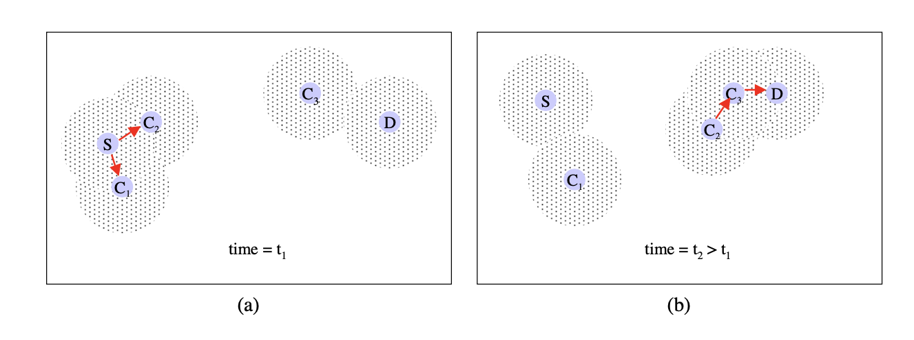

# Epidemic Routing for Partially-Connected Ad Hoc Network (2000) 

Link: http://issg.cs.duke.edu/epidemic/epidemic.pdf

Read: June 28th, 2024

The paper proposes Epidemic Routing, a routing protocol designed for ad hoc networks where connectivity is intermittent.

The goals of Epidemic Routing are to: i) maximize message delivery rate, ii) minimize message latency, and iii) minimize the total resources consumed in message delivery.

The goal is to develop techniques for delivering application data with high probability even when there is never a fully connected path between source and destination. Thus, it makes minimal assumptions about the connectivity of the underlying ad hoc network: i) the sender is never in range of any base stations, ii) the sender does not know where the receiver is currently located or the best “route” to follow, iii) the receiver may also be a roaming wireless host, and iv) pairs of hosts (not necessarily the sender and receiver) periodically and randomly come into communication range of one another through node mobility.

## Insights

- E.x. mobile sensor networks, nodes can be spread over wide geographical distances, it is unlikely that a connected path can always be discovered
- Goals: maximize message delivery rate, minimize message latency while also minimizing total resources (e.g. memory and network bandwidth) consumed in message delivery

## Design

- Each host maintains a buffer consisting of messages s messages that it is buffering on behalf of other hosts. For efficiency, a hash ages, keyed by a unique identifier associated with each message.

- Each host summary vector that indicates which entries in their local hash tables are set. Bloom filter” [4, 12] would substantially reduce the space overhead associated. 

- During anti-entropy, the two hosts exchange their summary vectors to determine which messages stored remotely have not been seen by the local host. In turn, each host then requests copies of messages that it has not yet seen. Each host may decide whether it can be the carrier for a particular message.

- Given that messages are delivered probabilistically in epidemic routing, certain applications may require acknowledgments of message delivery. The ack request field signals the destination of a message to provide an acknowledgment of message delivery. These acknowledgments are modeled as simple return messages from receiver back to the sender. Of course, the acknowledgment can also be piggybacked with any other message destined back to the sender after the message is successfully delivered. As future work, we intend to experiment with supplementing **anti-entropy** with the exchange of a “message delivered” vector. This vector can act as both both message acknowledgment and as a capability to free the buffer space associated with messages that have been previously delivered.

- Each host sets a maximum buffer size that it is willing to allocate for epidemic message distribution. The buffer size limits the amount of memory and network resources consumed through Epidemic Routing.

## Techniques
- Each host maintains 
    - a buffer of messages (i.e. hash table)
    - a summary vector: which entries in their local hash tables are set
- Two-host communication
    - Host with the smaller identifier initiates an anti-entropy session
    - During anti-entropy session, two hosts exchange summary vectors to determine which messages stored remotely have not been seen
    - Then each host requires copies of messages that it has not yet seen
- Each message: a unique message identifier, a hop count, and an optional ack request
    - Hop: determines max # of epidemic exchanges that a particular message is subject to
    - Also limit per-node buffer space
      
## Limitations
- this protocol inherently relies on the randomness of node meetings to gradually spread messages through the network, it is non-deterministic and can potentially have high latency for message delivery 
