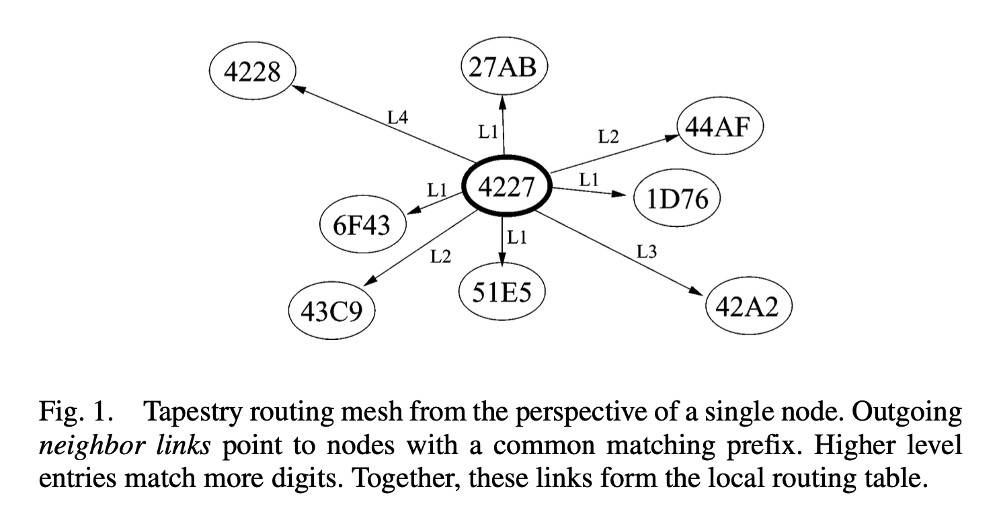

# Kubi's Paper

## Tapestry

* Routing in the overlay network. 
* Locality-aware
* Chord does not take into location account. 
* Tapestry focuses on efficiency and minimizing message latency. This is achieved since Tapestry constructs locally optimal routing tables from initialization and maintains them in order to reduce routing stretch. Furthermore, Tapestry allows object distribution determination according to the needs of a given application. 
* 
  * Tapestry uses local tables at each node, called neighbor maps, to route overlay messages to the destination ID digit by digit. 
* The challenge in a dynamic network environment is to continue to route reliably even when intermediate links are changing or faulty. We exploit **network path diversity** in the form of redundant routing paths. 

### DOLR Networking API

* Tapestry nodes participate in the overlay and are assigned `nodeIDs` uniformaly at random from a large distribution space.
* Application-specific endpoints are assigned globally unique identifiers (GUIDs). 
* `PublishObject`
* `UnPublishObject`
* `RouteToObject`
* `RouteToNode`. 

### Object Publication

* A node sends a publish message towards the root of the object. 
* At each hop, nodes store pointers to the source node.
* Pointers are sorted in proximity. 

### Takeaway:
* The closer (in network distance) a client is to an object, the sooner its queries will likely cross path with the object's publish path, and the faster they will reach theb object. 

## Oceanstore

* OceanStore is an Internet-scale, cooperative file system to provide high durability and universal availability to its users through a two-tiered storage system. 
* Any computer can join the infrastructure, contributing storage or providing local user access in exchange for economic compensation. Users need only subscribe to a single OceanStore service provider, although they may consume storage and bandwidth from many different providers
* The upper tier consists of powerful, well-connected hosts which serialize changes and archive results. The lower tier consists of less powerful hosts – mainly provides storage resources to the system. 
* OceanStore uses Tapestry
* Uses erasure coding and spread over hundreds or thousands of servers. 
* The reason why Oceanstore uses Tapestry is:
  * Locality-aware routing.  
  * OceanStore's object location scheme needs two qualities
    * Should be free to place objects near their access points.
    * Finding a local object should be a local operation. 

## Global Data Plane

* The Global Data Plane (GDP) is a distributed data storage system that provides a global namespace for data objects.
* The GDP is built on top of the OceanStore system and uses Tapestry for routing.
* The GDP is designed to provide a global namespace for data objects, allowing clients to access data objects by name, regardless of their physical location.
* Secure publish-subscribe paradigm;
* Federated architecture. 
* Its foundation is the concept of a single-writer append-only log, coupled with location-independent routing, overlay multicast and higher level interfaces such as common access APIs 
  * Logs in the GDP are lightweight, durable, and they support multiple simultaneous readers—either through random access (pull-based) or subscription (push- based). Logs have no fixed location but rather are mi- grated as necessary to meet locality, privacy, or QoS needs of applications.
* Each sensor or computational element of and IoT application has its own unique output log in the GDP and writes timestamped entries to this log. 
  * For each log, the current design exposes `append`, `read`, and `subscribe` operations.
* The GDP places logs within the infrastructure and advertises the location of these logs to the underlying routing layer. 
* Access control is based on cryptography.  Write (append) access control is based on valid writers signing the message, with the GDP itself holding the public keys of authorized writers for verification.  Read/Subscribe access control actually does not exist; the privacy of the data depends on the data being encrypted.

## Tessellation
* Link: https://www.usenix.org/legacy/event/hotpar09/tech/full_papers/liu/liu_html/index.html
* A spatial partition (or ``partition'' for short) is an isolated unit containing a subset of physical machine resources such as cores, cache, memory, guaranteed fractions of memory or network bandwidth, and energy budget. Space-time partitioning virtualizes spatial partitions by time-multiplexing whole partitions onto available hardware, but at a coarse-enough granularity to allow efficient user-level scheduling within a partition.

### Inter-partition channels
* Our current model of inter-partition communication is via message passing. 
  
### Cross-partition Quality of Service
* Consequently, monitoring and restricting the flow of messages provides an important mechanism for enforcing QoS.

### Partition Virtualization
* Partitions can be virtualized and multiplexed on physical hardware by a global partition manager. 

