# Questions

## Question 1 Storing Objects
* 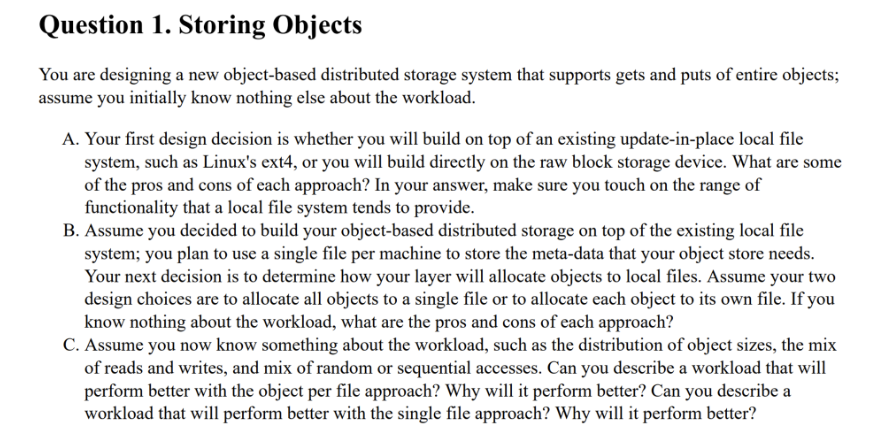

### ext4 vs. raw block storage device
* A. ext4:
* pros
    * good functionality supported: journaling for crash consistency
    * compatibility: with existing tool and software
    * easier debugging and maintenance
* cons
    * **small write problem**: **one logical write** leads to multiple physical writes
    * overhead: with journaling
    * limited customization and complexity

* raw block storage device:

* pros
    * **complete control to optimize data layouts**, indexing structures according to your need
    * efficiency: design your own storage formats based on workloads
    * direct access: simpler abstraction
* cons
    * increased complexity
    * maintenance challenges

### single large file v.s many small files what are the pros and cons 

* Single large file
    * Pros
        * Less metadata to maintain
        * Buffering
            * Sequential reads and writes will be faster
        * Access control easier to manage
    * Cons
        * Lower concurrency: small reads and writes to the objects needs locking and dealing with write conflicts
        * File size limitations
        * Data corruptions: could make entire file unusable
* Many small files
    * Pros
        * High concurrency writes on small objects, low latency
        * Isolation: corruption or loss of one file doesn’t affect the others
            * Access control can be more fine-grained
        * Scalability: easier to distribute across multiple disks or nodes
    * Cons
        * More metadata to maintain
        * might be too many files

### Workload that works best with object per file approach 

* Object per file approach
  * Small file sizes, random access (read and write), high rate of concurrent access to different objects
  * Why better?
    * Granularity: small individual files can be quickly and easily read or written to, benefit random access
    * Isolation: different processes can concurrently read / write without contention since each object has its own file
    * Benefits from caching and prefetching for sequential access
* Single file approach
    * Generally large objects, mostly sequential reads and writes, low to moderate need for concurrent access to different objects
    * E.x. GFS: large, sequential writes

## Question 2: The Fast File System

* 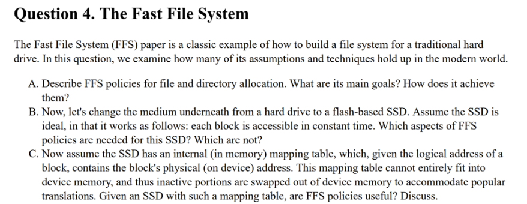

### A. policies 

* Notion of cylinder group, i.e. spatial locality
* Files inodes are allocated near directories
* Directories inodes are placed in group where there is less than average inodes for load balancing
* First data block is kept near file inodes
* Consecutive data blocks are kept near previous data blocks
* Main goal: performance (v.s. previously a single write, inode and data put too far away)

### B.Needed aspect

* Keep metadata close to data to reduce I/O operation
  * Reduce write amplification. 
* Not needed
    * Cylinder group management: SSD doesn’t have cylinder group
    * Block contiguity (when allocating blocks addressed by direct and indirect pointers): SSD can access any block in constant time (very good random read performance), so contiguous block allocation not too critical for performance

### C. mapping table 

* In this case, FFS policies may still offer some benefits in terms of reducing the total IO operations by keeping related data close together. However, the main objectives of FFS are not directly translatable to SSDs with such a mapping table.
* Load balancing: Allocating directory inodes in groups with fewer used inodes could still be useful for load balancing, although the load here refers to wear leveling for SSDs.
* If the SSD uses an internal mapping table that doesn't entirely fit in device memory, the spatial locality of keeping related items near each other could reduce thrashing of this mapping table, improving performance.

## Question 3: Consistent Hashing

* 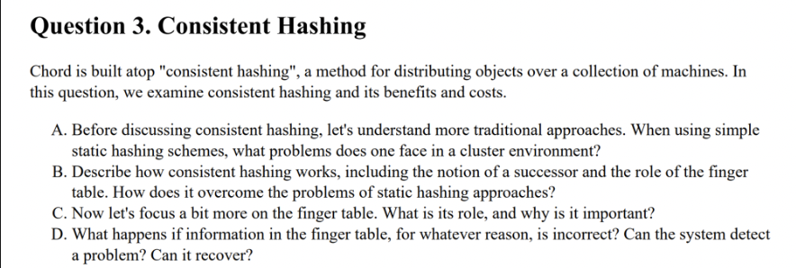

### Simple Static Hashing Schemes in Cluster Environments: Problems

* **Scalability**: Adding or removing nodes requires rehashing all keys, leading to significant overhead and downtime.
* **Load Imbalance**: It's challenging to distribute data uniformly across all nodes. Some nodes might get more data than others.
* **Single Point of Failure**: If a node goes down, the keys mapped to that node are not accessible until the node is restored or the data is rehashed.
* **Lack of Dynamic Adjustment**: Static hashing does not adapt well to changes in workload.

### Consistent Hashing

* In consistent hashing, the key space and nodes are mapped onto a circle (the "hash ring"). Each node is responsible for a specific segment of this ring.
* Successor: Given a key, the node that is closest to the key in the clockwise direction is its "successor" and is responsible for storing that key.
* Finger Table: Each node maintains a "finger table" which is a sorted list of nodes that are s-distance away, where s is a power of 2. This helps in quickly locating the successor for a given key.

### Overcoming Problems

* Scalability: Adding/removing nodes only affects the keys that are directly adjacent in the hash ring, minimizing the number of keys that need to be remapped.
* Load Balancing: Because each node is responsible for a segment of the hash ring, the data is more uniformly distributed.

### Finger Table

* The finger table plays a critical role in optimizing the lookup process. By keeping pointers to nodes at exponentially increasing distances, a node can find the successor of a key in O(log N) time, where N is the number of nodes. It greatly speeds up the time complexity of finding the correct node for a key from O(N) to O(log N).

### Outdated Finger Table information

* Detection: Errors can manifest as failed lookups or incorrect data retrieval. Some implementations might include mechanisms like heartbeats or version numbers to detect inconsistencies.
* Recovery: The system can recover by updating the finger table. Since each node knows its immediate predecessor and successor, they can rebuild their finger tables based on this fundamental information. **Even with an incorrect finger table, the system would eventually find the correct node by traversing the ring but at the cost of efficiency.**
* Consistent hashing, thus, provides a robust and scalable method for distributing keys in a cluster, and the finger table serves as a crucial element for optimizing key lookups.

## GFS

* 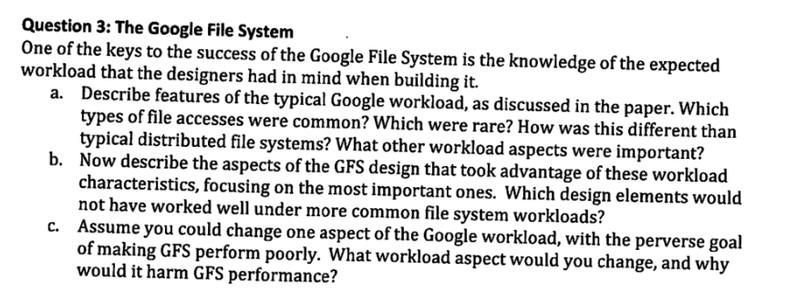

### Workload

* Large files.
* Sequential access.
* Write-once, multiple reads
* Common operations:
  * Appends
  * Large streaming reads
  * Atomic record appends
* Rare: 
  * random writes
* Other workload aspects. Fault tolerance.

### Design elements

*  Chunk Size: 64MB.
   *  Random read and write might not be efficient.
*  In traditional workloads with smaller files and more random access patterns, the large chunk size could lead to inefficiencies, as small files would waste space and random access could involve reading and writing large chunks unnecessarily.
* Atomic append: GFS decides the offset.
* In traditional environments where hardware failures are less frequent, the overhead of constant failure detection, logging, and recovery mechanisms might be unnecessary and could degrade performance. Additionally, the reliance on a single master node could be a single point of failure in environments that demand high availability.
* In tradtiional environment with a vast number of small files, metadata overhead can be great. 

### What workload aspect would you change
* Data pipelining. e.g. in a tree. the primary will be bottlenecked. 
* If I can change the workload, increase the number of small random R & W's.

## Copy-on-Write

* 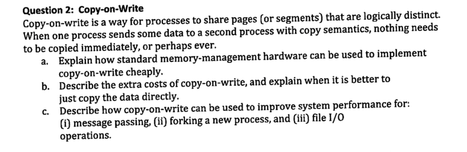

### How standard memory-management hardware can be used to implement copy-on-write cheaply

* Shared Page Tables: When a process is duplicated or when data needs to be shared, the same physical memory page can be mapped to multiple page table entries. This allows multiple processes to point to the same physical memory location.
  * Each process has its own page table. 
* Reference count.
* PTE initially marks the page as Read only for both parent and child.
* Write triggers a page fault.
* Page fault checks reference count, if > 1, the handler allocates a new physical page and copies the content of the shared page into the new page.
* Update Page Table, the PTE is updated with the new physical page, the page is marked writable. Reference count is decremented.

### Extra costs of copy-on-write, explain when it is better to just copy the data directly

* **Page fault overhead**. **Tracking reference count**.
* Complexity: The OS has to manage multiple mappings and keep track of shared pages, which adds complexity to memory management.
* If the system has high write rate, or performance critical application (where handling page fault is not good.), real-time systems, simplicity (If the data size is small and the operational logic is straightforward, then a simple copy might be easier and faster).

### Describe how cow can be used to improve system performance for (i) message passing (ii) forking a new process, and (iii) file I/O operations

* Message passing: Scenario: In systems that use shared memory for message passing, processes often need to share large amounts of data. Copy-on-write can optimize this by minimizing unnecessary data **duplication**.
* Forking a new process: Scenario: When a process creates a new process (e.g., using fork() in UNIX-like systems), the new process inherits the address space of the parent process. Without COW, this would require copying the entire memory space of the parent, which is inefficient.
* File I/O opereation: Scenario: File I/O operations often involve reading and writing data to and from disk. Copy-on-write can be used to optimize file systems and reduce the cost of modifying files.
  * Multiple processes can read a memory-mapped file without needing to create multiple physical copies of the file's content. Modifications would trigger COW, saving memory.
  * Cache Sharing: Read-only data from files can be shared among multiple processes, improving cache utilization and reducing disk reads.
  * Efficient File Modifications: **When a file is modified, COW allows the system to only copy the pages of the file that are being changed, rather than duplicating the entire file. This is especially useful for large files where only a small portion is updated.**
  * Same goes for snapshot. No need to copy entire file content. 
  * Reduced Write Amplification: In systems that use COW, write amplification is minimized because only modified pages are written to new locations. This reduces the overall amount of writing to storage and can extend the lifespan of SSDs by reducing the number of write operations.

## Weak Consistency

* 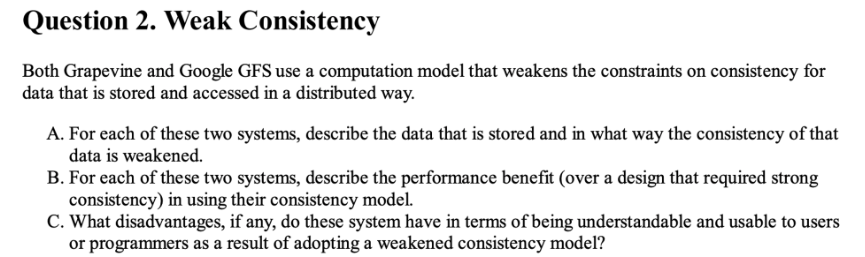
* Weakened consistency 
    * The consistency guarantee for GFS is relaxed 
    * It does not guarantee all the replicas of a chunk are byte-wise identical 
    * What it does guarantee is that every piece of data stored will be written at least once in each replica (i.e. the replica may contain duplicates, and it is up to the application to deal with anomalies)
    * GFS may insert padding or record duplicates in between. GFS assumes that client applications can handle the inconsistent state: i.e. filter out occasional padding and duplicate using checksums (or unique IDs in the records). This also helps improving performance. 
    * Benefit: **simplification** of the file system (but in what ways?)
      * Atomic append can return quickly. 
      * Reducing coordination?
    * My uneducated guess is that this is to increase throughput for concurrent appends. If the primary wanted to be able to move back the pointer in the case of a failure, it would not be able to accept other record appends while one is in progress. If it increases the pointer even for failed mutations, it is then able to accept other appends right away.

## End-to-end Argument

* 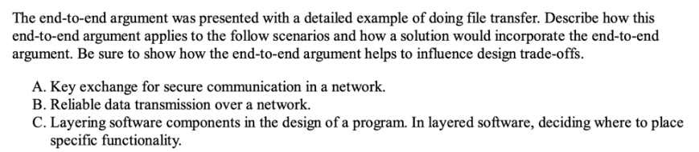
* key exchange: implementing at endpoint, intermediate devices like routers or firewalls should not be responsible V.s. devices equipped with crypto capabilities to manage key exchanges
* reliable data transmission: error-tracking and retransmission should be done at endpoints rather than intermediate nodes 
* Certain functions like data validation and encryption should be carried out in the upper layers closer to application, where exact requirements and constraints are better known

## Question 2: Scheduling

* 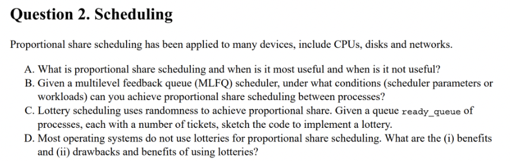

### A. Proportional-share (fair-share):
* Some examples are lottery tickets, and stride scheduling. 
* scheduler try to guarantee that each job obtain a certain percentage of the resources 
* Useful: multi-tenant system (get a fair share of resources), fair allocation between different users and applications, predictable workloads 
* Not useful: bursty workloads, real time system (guarantee time-sensitive operations is more critical than proportional sharing)

### B. MLFQ
* Homogenous CPU burst requirements and behavior (Processes have similar burst lengths and I/O patterns), more likely to be scheduled proportionally 
* Prior knowledge on CPU requirement: static priority assignment.
* CPU-bound, less I/O bound.
* Steady workload behavior. 

### C. Lottery scheduling
* Benefits
   * Simplicity: easy to implement and understand
   * No need for global state. 
   * Support for dynamic adjustment. 
   * Lightweight: randomness, comparison
* Drawback
   * Predictability: lack predictability that applications might need

## BFT

* 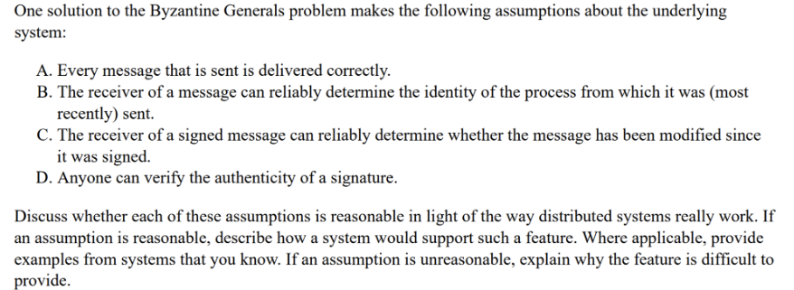

### Assumption A: Every message that is sent is delivered correctly.

* Is it reasonable? Partially. In a well-designed system with sufficient redundancy and fault-tolerance, most messages should be delivered correctly. However, network partitions, packet loss, and latency issues can prevent 100% reliable message delivery.
* How is the feature supported? Reliable message delivery can be supported by **using protocols like TCP**, which ensure that messages are delivered in the correct order and without error. Retransmission mechanisms can also be employed to deal with packet loss.
* Protocols like TCP and libraries like ZeroMQ or RabbitMQ offer reliable message delivery.

### Assumption B: The receiver of a message can reliably determine the identity of the process from which it was (most recently) sent.

* Is it reasonable? Yes, to some extent, but it also depends on how secure the overall system is against spoofing attacks.
* How is this feature supported? Digital signatures, source IP validation, and secure channels (e.g., TLS) can help confirm the identity of a sender.
* Examples? **SSL/TLS certificates in HTTPS connections or SSH keys in secure shell connections**.
  * The web server sends the SSL/TLS certificate that contains a public key as a reply. The browser verifies the SSL/TLS certificate (the browser contains the public keys of all major websites), ensuring that it is valid and matches the website domain.
  * Browser encrypts session secret key with public key
  * The website would have to decrypt that session key with its private key. 

### Assumption C: The receiver of a signed message can reliably determine whether the message has been modified since it was signed.

* Is it reasonable? Yes, this is one of the core benefits of using digital signatures.
* How is the feature supported? **Digital signatures along with hashing algorithms can ensure that a message has not been tampered with since it was signed**. If the message is altered, the signature will not match, alerting the receiver to the discrepancy.
* Examples? Blockchain transactions often use digital signatures to ensure message integrity.
* Modification? using cryptographic hashes.  SHA-256

### Assumption D: Anyone can verify the authenticity of a signature.

* Is it reasonable? Yes, in systems that use **public-key cryptography**, anyone with access to the public key can verify the authenticity of a signature.
* How is the feature supported? **Public keys are used to verify digital signatures**. As long as the public key is genuinely from the claimed sender (which itself is often verified by a trusted third party. In summary, while these assumptions are generally reasonable and achievable to varying extents in real-world systems, they aren't foolproof. Network issues can affect message delivery, and security breaches could compromise identity verification or signature authentication.), anyone can verify the signature.
*   * Key pair generation: public key and private key
  * digital signature: hash of the document encrypted with the private key
  * The recipient then decrypts the digital signature using the sender’s public key to retrieve the original hash value that was encrypted by the sender (with private key).
* Examples? In Blockchain, anyone can verify the authenticity of a transaction by using the public key of the sender. 

## Optimizations for LRPC

* 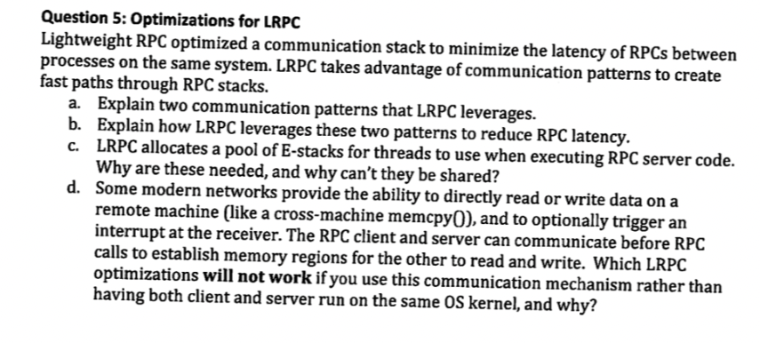

### Two communication patterns that LRPC leverages

* local communication pattern: eliminate the need for network-related overheads, no need for marshaling / unmarshaling, no need for explicit message passing (i.e. memory can use as mean of communication) and going through the network stacks
* **short-lived interactions**: quick, transient interactions than long-lived stateful sessions 

### How LRPC leverages these two patterns
* elimination of network overheads: shared directly without serialization and deserialization or network transmission
* lightweight context managements: shared memory regions, trap to kernel create shared pages, **OS upcall** **to execute procedure in server’s domain**, return to client 

### E-stack (Execution Stack)

* Estack: allow threads to efficiently context switch and perform computations, each e-stack contains contexual info to particular procedure (local variables, return addresses), sharing will corrupt contextual information 
* Each A-stack is associated with a E-stack. 

### E-stack and A-stack

* E-stack (Execution Stack): Stores the execution context for a thread, including function call frames, local variables, return addresses, and intermediate results during the execution of RPC server code.
* A-stack (Argument Stack): Stores the arguments passed to and returned from RPC calls, effectively handling the marshaling and unmarshaling of data between the client and server.

### What doesn't work

* Doens’t work: 
  * intra-machine optimizations: still need to go through the network stacks  
  * RDMA access still involves a network layer
  * LRPC optimized for a share security context, in cross-machine setup this might not be true 

# Design a File System with SSD and HDD

* **Hot-Cold Data Separation**: Store frequently accessed ("hot") data on the SSD and infrequently accessed ("cold") data on the HDD.
* **Metadata on SSD**: To speed up file lookups, store metadata and file system indexes on the SSD.
* **Write Buffering on SSD**: Use the SSD as a write cache. New data is initially written to the SSD and then moved to the HDD during periods of lower activity.
*  To minimize the wear-out of SSD cells, **write-heavy operations should ideally be directed to the HDD**.
*  Automated mechanisms could move data between SSD and HDD based on access patterns.
*  The filesystem's journal could be placed on the SSD for faster metadata operations while bulk data resides on the HDD.
  
## Reconstructing Lost Data in RAID

* 

### a. How to reconstruct the lost information
* Each stripe in the RAID 5 array will have one block dedicated to parity and the rest to data.
The position of the parity block rotates across the disks for each stripe.
* For each stripe that includes a block on the failed disk, read the corresponding data blocks from all the remaining disks in that stripe. Ignore the parity block in each stripe (since we will recalculate it).
* For each stripe, compute the XOR of all the data blocks that you've read from the remaining disks.
The result of this XOR operation gives you the value of the missing data block.
* Write the reconstructed data block to the corresponding position on the new disk.
* After writing the reconstructed data, you can optionally recalculate the parity for each stripe to ensure that the array is consistent.

### b. Assumptions
* Data integrity on the remaining disk.
* No concurrent failures
* Solution
  * Use of Error-Correcting Codes (ECC) on Each Disk
    * Store additional error-correcting codes (ECC) with each block of data on each disk.
  * Periodic Scrubbing
    * Periodically read and verify the data on all disks in the RAID array to detect and correct errors proactively.

### c. How to optimize
* Sequential R/W operations
  * Read all blocks in a stripe sequentially from each disk, then write the reconstructed block sequentially to the new disk. 
*  Read-intensive workload: Prioritize reconstruction of frequently accessed data blocks first to restore normal operations faster for those blocks.
   *  Implementation: Identify the most accessed stripes or blocks and reconstruct those before others.
*  Write-intensive workload: Delay or batch writes during reconstruction, if possible, to minimize interference with the reconstruction process.
  
## Resillience in MR.

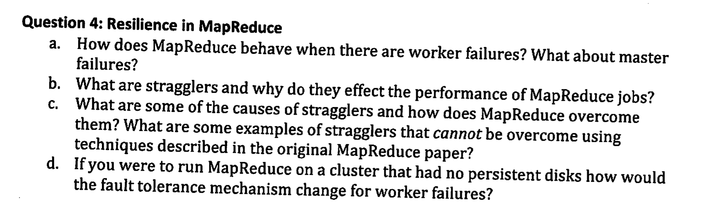

### Failures
* Worker Failures
  * When a worker (either a map or reduce task) fails:
  * Task Reassignment: The master node detects the failure, either through missed heartbeats or task progress reports. The master then reassigns the tasks that were being executed by the failed worker to other available workers.
  * Re-execution of Tasks: Any map or reduce tasks that were in progress or completed by the failed worker are either restarted or re-executed on another worker. This ensures that the job can still be completed, though it might result in some additional delays.
* Master Failures
  * When the master node fails:
  * Job Failure: In traditional implementations of MapReduce (like the original one by Google), the master node is a single point of failure. If the master node fails, the entire MapReduce job fails because the master is responsible for task assignment, progress tracking, and overall job management.
  * Workarounds: Modern distributed systems may implement high-availability solutions like master failover, checkpointing, or having standby masters to mitigate this issue, but these are not part of the basic MapReduce design.

### Stragglers
* Causes: Stragglers can occur due to various reasons, such as a worker machine being slow due to hardware issues, high disk I/O, network latency, or an imbalanced distribution of workload.
* Impact on Performance: Since a MapReduce job can only complete once all map and reduce tasks are finished, stragglers can significantly delay the overall completion time of the job. Even if most tasks finish quickly, the job remains incomplete until the stragglers finish.
* Mitigation: To handle stragglers, many implementations of MapReduce include techniques like speculative execution, where the master node detects slow-running tasks and starts duplicate instances of those tasks on different workers. The first one to complete is used, and the others are discarded. This helps minimize the impact of stragglers on job completion time.

### Stragglers that cannot be mitigated
* Issue: If a worker is slow due to network congestion or limited bandwidth, launching duplicate tasks on the same or nearby workers may not help because the network itself is the bottleneck.
* Issue: If the input data is unevenly distributed, some tasks may receive a significantly larger portion of the data to process. This imbalance can lead to certain tasks taking much longer to complete.

### Without persistent disk

* all the intermediate data it holds in memory is lost. Unlike disk storage, there’s no way to recover the data from the failed worker.
* After a map task generates its output, it could immediately replicate the data to other workers. This way, if a worker fails, another worker can supply the lost data for reduce tasks.
* Re-executing tasks becomes more complex when no persistent storage is available. Typically, if a map task's output is lost, the task is simply re-executed to regenerate the data. However, with no persistent input data (if even input data is stored in memory), re-execution would require fetching the input data from another source.
* Ensure that the input data for the map tasks is stored in a distributed and fault-tolerant manner, such as in a distributed in-memory storage system (e.g., an in-memory distributed file system or an external system like HDFS with in-memory caching).
* Use distributed fault tolerant in-memory store for checkpointing. 

## Kernel Structures

* 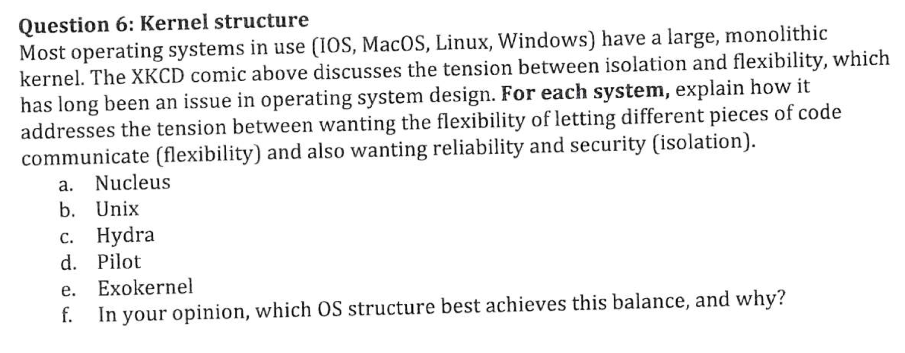
  * Only focus on Unix, microkernel, unikernel, Exokernel.
  * **Unix:**
    * Unix allows different pieces of code (e.g., processes) to communicate via mechanisms such as inter-process communication (IPC) facilities, shared memory, pipes, and network sockets. 
    * Unix achieves isolation primarily through process boundaries. Each process operates in its own address space, preventing direct access to another process's memory, which helps ensure reliability and security. Unix has cgroup and namespace. Bug in device driver code might bring down the whole kernel
  * **Microkernel**:
    * Flexibility: kernel only keeps IPC, scheduling, and virtual memory. Services like (FS and different processes) communicate to the microkernel through IPC. 
    * Bug in device driver might not bring down the whole kernel.
  * **Exokernel**:
    * Exposing hardware resources directly to applications. Applications use libOSes. 
    * Same isolation property as microkernel.
  * **Unikernel**
    * link application with just enough OS functionality to allow it to execute
    * Applications directly call functions in the unikernel -> no context switching. 
    * Isolation. Can directly run on hypervisor. 

