# Wisconsin Prelim Questions

Link: https://www.cs.wisc.edu/operating-systems-quals/

## Fall 2018

## Spring 2016

- 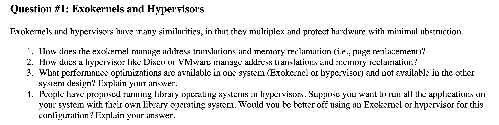

### Exokernel: Memory address translations and reclamation

* Exokernel address translation: 
  * Address translation in an exokernel system is typically handled by the application or a library operating system (LibOS) running on top of the exokernel. The exokernel provides primitives to allow the application to control the hardware’s MMU (Memory Management Unit), meaning that the applications themselves can manage virtual-to-physical address mappings.
* Exokernel memory reclamation:
  * The exokernel will offer mechanisms to allocate and deallocate pages, but the policy for page replacement—such as which pages to evict when memory is scarce—is implemented by the application or LibOS.

### Hypervisor: Memory address translations and reclamation

* Hypervisor address translation: 
  * Shadow Paging: The hypervisor maintains a shadow page table for each VM, translating guest virtual addresses to host physical addresses. The guest OS is unaware of this, believing it is managing its own page tables.
  * The MMU uses a two-level translation: first from guest virtual to guest physical (managed by the guest OS), and then from guest physical to host physical (managed by the hypervisor).
* Hypervisor memory reclamation: 
  * Hypervisors manage memory reclamation through techniques such as ballooning and transparent page sharing.
  * Ballooning: A balloon driver within the guest OS allocates memory that is then reclaimed by the hypervisor, which can be reallocated to other VMs.
    * To implement memory ballooning, the virtual machine's kernel implements a "balloon driver" that allocates unused memory within the VM's address space into a pool of memory (the "balloon"), which makes that memory unavailable to other processes on that VM. The balloon driver doesn't use the pool of memory; instead it tells the host operating system's hypervisor which memory addresses are in that pool (unused). 
  * Transparent Page Sharing: The hypervisor identifies and merges identical pages across different VMs to save memory.

### What performance optimizations are available in one system (Exokernel or hypervisor) and not available in the other system design?

* Exokernel optimizations: custom resource management by LibOS. Minimal abstraction overhead.
* Hypervisor optimization: efficient resource sharing and isolation, load balancing and scheduling, memory overcommitment (with ballooning and transparent page sharing)

### Would you be better off using an Exokernel or hypervisor for running all applications on your system with their own library operating system? Explain your answer.

* If the goal is to run all applications with their own library operating system, an exokernel would likely be the better choice:
  * Customization and Performance: The exokernel model allows each application to run its own LibOS, giving it complete control over resource management and optimization strategies. 
  * Minimal Interference: Since the exokernel provides minimal abstractions, there is less interference between the LibOS and the underlying hardware, enabling more efficient execution of applications.
  * Complexity: Developing and maintaining a LibOS for each application can be complex and resource-intensive.
  * Isolation and Security: Hypervisors offer stronger isolation and security guarantees between different VMs, which might be important if the applications need to be strongly isolated from each other.

* 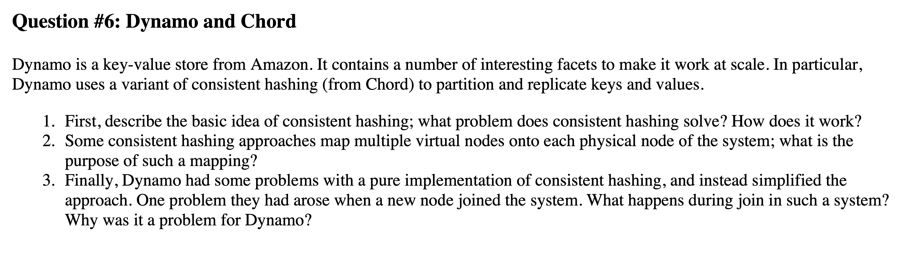

### Basic idea of consistent hashing

* In consistent hashing, both the nodes and the keys are mapped onto the same "hash ring." Here's a basic overview of how it works:
  * Hash Ring: The hash function maps both the keys and the nodes to a circular space (often visualized as a ring).
  * Key Placement: Each key is assigned to the first node encountered when moving clockwise around the ring from the key's position. This node is responsible for storing the key.
  * Adding/Removing Nodes: When a node is added or removed, only the keys that map to the affected node's region of the ring need to be moved, minimizing the amount of data rebalancing required.

### Virtual nodes

* https://stackoverflow.com/questions/69841546/consistent-hashing-why-are-vnodes-a-thing
* **Load Balancing**: By assigning multiple vnodes to each physical node, the distribution of keys becomes more balanced across the system. If each physical node only had one position on the hash ring, the distribution might be uneven, leading to some nodes being overutilized and others underutilized.
* **Flexibility in Scaling**: When new physical nodes are added to the system, they can take over some of the vnodes from existing nodes, which makes the redistribution of keys more even and manageable.
* **Fault Tolerance**: If a physical node fails, its vnodes can be redistributed across the remaining nodes, improving the system's ability to handle failures without significant data loss or imbalance.

### Dynamo and when node joins a system

* Problem with node join:
  * Rebalancing Overhead: The process of transferring a potentially large number of keys from existing nodes to the new node can cause significant network and computational overhead, especially in a large distributed system.
  * Temporary Imbalance: During the join process, the system may experience temporary imbalances, where some nodes become overloaded with the task of transferring data, impacting the overall performance of the system.
* Dynamo uses a combination of techniques
  * Pre-partitioning: The hash space is pre-partitioned into a fixed number of partitions, and each node is responsible for multiple partitions. This allows for easier redistribution of responsibility when nodes join or leave.
    * The idea is that redistribution is over remaining nodes (multiple nodes). 
  * Hinted Handoff: This mechanism ensures that in case of temporary node failures, data can be handed off to a nearby node and later transferred back when the original node recovers, reducing the need for immediate data transfer during node joins.
* How does hinted handoff work
  * Primary Node Unavailability: When a node (let's call it Node A) that is supposed to store a particular key is temporarily unavailable (due to network partition, reboot, etc.), another node (Node B) that receives the write request will take over the responsibility of storing the key.
  * Hinted Handoff: Node B stores the key along with a "hint" that indicates that this data is meant for Node A. This is essentially a note that says, "This data should be on Node A, but I'm holding onto it temporarily."
  * Reconciliation: When Node A comes back online, Node B will "hand off" the data to Node A, ensuring that the key ends up in its correct location. Node B can then delete the hint and the associated data.
  * Consistent Performance: This mechanism allows the system to maintain high availability and consistent performance even in the presence of transient failures. Writes are not blocked, and the system can continue to function smoothly.
* **Minimize distruption**: Pre-partitioning simplifies data redistribution, while hinted handoff ensures that temporary failures don't affect the system's availability or performance.
* **Scalability and Resilience**: Dynamo can efficiently scale and remain resilient to various kinds of failures, making it well-suited for large-scale distributed systems where nodes frequently join, leave, or fail.

## Spring 2017

* 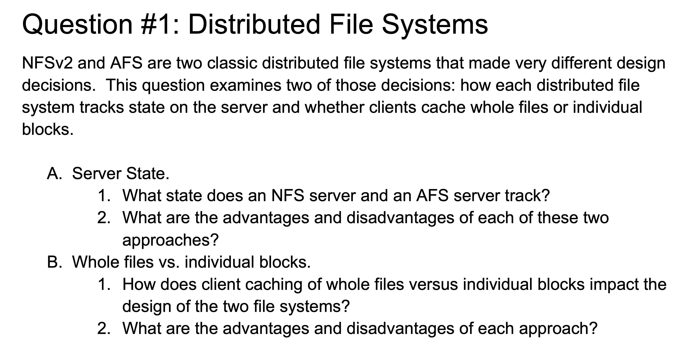

### Server State

* NFSv2
  * Staleless. 
  * Client provides file handles. 
* AFS
  *  It maintains a state about its clients, particularly in terms of caching and callback mechanisms.
  *  When a client accesses a file, the AFS server tracks the fact that the client has a cached copy of the file. It also establishes a callback with the client, meaning that if the file changes, the server will notify the client to invalidate its cache.
* Advantages of stateless design
  * Simplicity and Robustness: Since the server does not maintain any client state, it is simpler and more robust to failures. If an NFS server crashes and restarts, it does not need to recover or maintain any session data, making the system easier to manage.
  * Scalability: Statelessness helps with scalability because the server does not need to keep track of client state or manage sessions, allowing it to handle a large number of clients.
* Disadvantage: 
  * Network communication
  * CPU cycles to process these GetAttribute messages.
* AFS
* Advantages
  * Reduce network traffic. 
  * Better cache coherency
* Disadvantages
  * Complexity: 
    * Maintaining state adds complexity to the server's design and increases the challenges of ensuring reliability. If the server crashes, it needs to recover and reestablish state information with clients, which can complicate recovery procedures.
  * Scalability concerns: need to track many clients. 

* 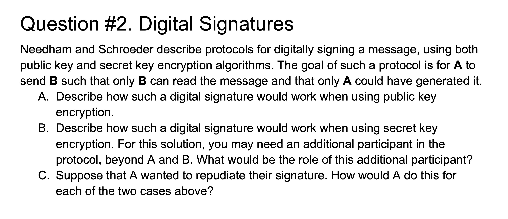
  * Likely out of syllabus.

* 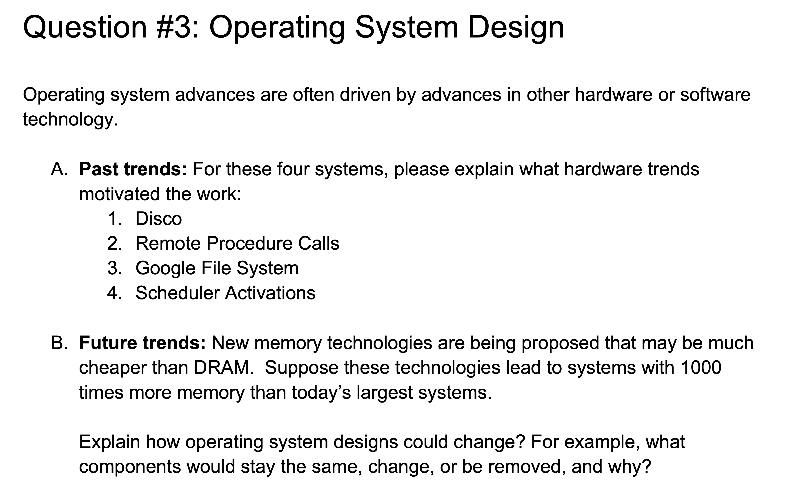

### Past trends

* Past trends:
  * RPC: emergence of networked systems. 
  * GFS: explosion of data, commodity hardware, built-in fault tolerance and high throughput. 
  * Scheduler Activation: Increase in concurrency and multiprocessor systems; the need to efficiently manage concurrency within applications. 
* Future trends: new memory technologies:
  * Virtual memory:
    * Paging to disk might become obsolete, as the entire working set of most applications could fit into physical memory. 
  * Memory Allocation: New memory allocation algorithms would be needed to efficiently manage and allocate such a large address space. Traditional slab or buddy allocators might be enhanced or replaced with algorithms optimized for vast memory spaces, ensuring efficient handling of both small and large memory blocks.
  * Removal of disk-based swapping. 
  * Remove dynamic loading -> process can be loaded entirely into memory at startup, reducing the need for dynamic loading and on-demand paging. 
  * Removal of lazy loading. 
  * I/O management: Caching: I/O operations could be heavily optimized by caching entire datasets in memory. For instance, large databases could reside entirely in memory, leading to near-instantaneous access times.
  * Redundant Memory Regions: The OS could use some of the additional memory to create redundant memory regions for fault tolerance. If one region fails, the system could instantly switch to a backup region, improving system reliability.
    * In-memory backups. Traditional disk-based backup systems might be reduced. 
  * Memory-resident database. 

* 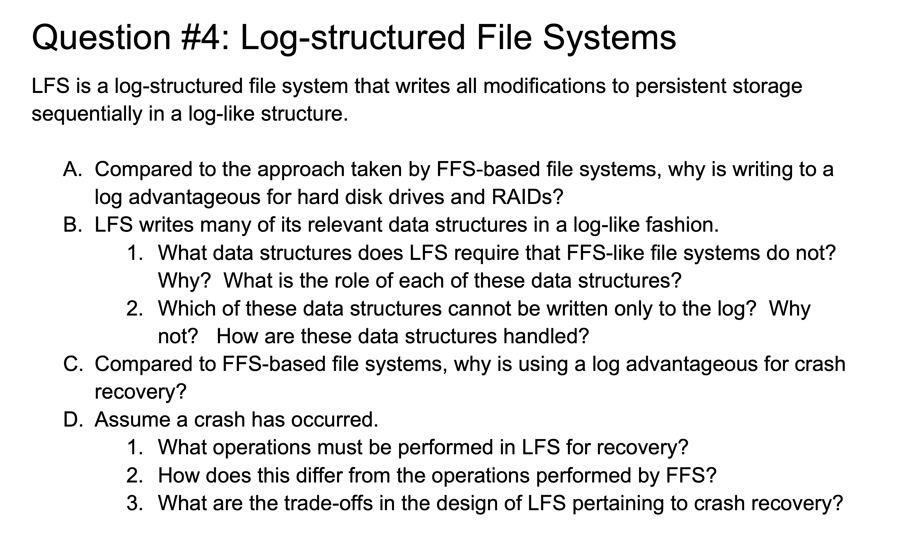
* HDD: Seek time. 
* RAID 5: sequential writes reduce the complexity of parity calculations. Reduces the overhead of writing to multiple disks. 
* Data structures:
  * **Segment Summary Block**:
    * Purpose: Keeps track of the contents of each segment (a fixed-size block of the log). It lists all files, inodes, and blocks stored within that segment.
    * Role: Helps in locating specific data within the log and is crucial for garbage collection, as it identifies live data that needs to be preserved when cleaning old segments.
  * Inode Map (Imap):
    * Purpose: Maps inode numbers to the physical location of the inode within the log.
    * Role: Helps in quickly locating the inodes in the log without having to scan the entire log, facilitating efficient data retrieval.
  * Checkpoint Region:
    * Purpose: Stores pointers to the most recent locations of inode map and other critical metadata.
    * Role: Used during recovery to quickly locate the latest consistent state of the file system, reducing the need to replay the entire log.

### Data structures that cannot be written only to the log
* Checkpoint Region:
  * Reason: The checkpoint region must always point to a consistent and current state of the file system, so it cannot rely solely on being written sequentially in the log. If it were only in the log, recovery would require scanning the entire log to find the latest checkpoint, which is inefficient.
  * Handling: The checkpoint region is typically written to fixed, known locations on the disk. During recovery, the file system reads these locations to find the most recent checkpoint and restore the system to a consistent state.
* Segment Summary Block:
  * Reason: While segment summary blocks are typically written within the log, they must also be accessible to the system to facilitate efficient garbage collection and recovery. They are often written to a specific location or have pointers to their locations stored elsewhere.
  * Handling: These blocks are written within segments, but their locations might be indexed or mapped to facilitate quick access during garbage collection.
* Inode map
  * Cached in-memory for faster lookup. 

### Why is log advantageous for crash recovery

* Consistency:
  * LFS maintains a consistent state by appending all changes to the log. In case of a crash, the system can simply replay the log from the last checkpoint to recover the file system, reducing the risk of inconsistencies that might arise from in-place updates in FFS.
* Faster Recovery:
  * Since LFS can focus on the tail end of the log (where the most recent operations are) and only needs to ensure the log is applied up to the latest checkpoint, recovery can be faster than in FFS-based systems, which may require checking multiple locations on disk to ensure consistency.

* Operations Performed in LFS for Recovery:
  * Log Replay:
  * The log is replayed from the last checkpoint to apply all operations that were not yet committed to the file system state.
* Segment Cleaning:
  * During or after recovery, LFS may need to clean segments by removing obsolete data and compacting live data, although this is not always part of the immediate recovery process.
* Differences from Operations Performed by FFS:
  * FFS Recovery:
  * FFS typically requires a file system check (fsck) to scan the file system's metadata and repair inconsistencies. This can be time-consuming, especially with large disks.
* Log Replay vs. fsck:
  * LFS’s log replay is generally faster and more efficient than running fsck on an FFS system, as it focuses only on the operations that occurred after the last checkpoint.
* Trade-offs in the Design of LFS Pertaining to Crash Recovery:
* Pros:
  * Faster Recovery: As mentioned, LFS can recover more quickly from crashes, making it more suitable for systems where uptime is critical.
  * Consistency: The log-based approach reduces the chances of inconsistency after a crash.
* Cons:
  * Increased Complexity: The need to maintain additional data structures (like the segment summary and checkpoint regions) and handle segment cleaning adds complexity to the file system.
  * Write Amplification: Segment cleaning can introduce write amplification, potentially reducing the lifespan of SSDs (though this is less of an issue with HDDs).

### Crash Recovery: LFS vs. FFS

* LFS: roll forward since the last consistent checkpoint (we have Checkpoint region!)
  * Segment cleaning.
* FFS: runs `fsck`, scan the file system metadata and fix any inconsistencies (fixing partially updated inodes and directories).
  * LFS has faster recovery time compared to FFS due to the log-based approach and the ability to replay operations from the last checkpoint, avoiding full file system scans, which can be time-consuming when disk is large.
* Trade-off:
  * Complexity: garbage collections. 

## Isolation

* 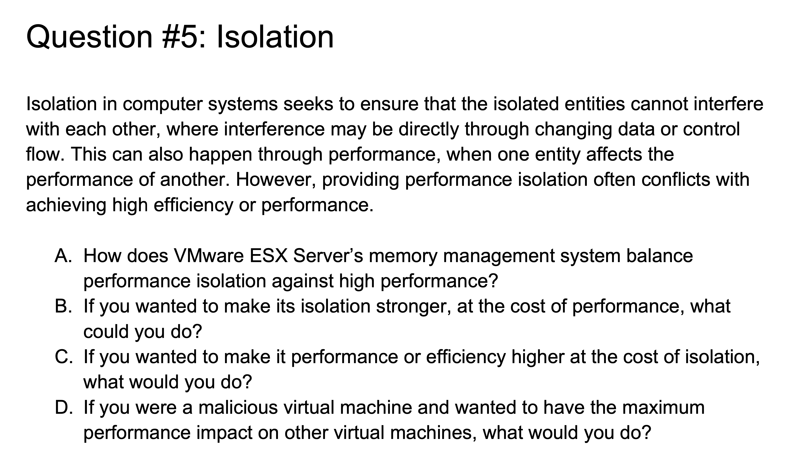

### A. Balancing Performance Isolation Against High Performance in VMware ESX Server’s Memory Management System

VMware ESX Server employs several strategies to balance performance isolation with high performance:

1. **Memory Overcommitment:**
   - VMware ESX allows the allocation of more virtual memory to virtual machines (VMs) than the physical memory available. This enables high resource utilization and performance but risks impacting performance isolation if multiple VMs demand more memory simultaneously.

2. **Transparent Page Sharing (TPS):**
   - TPS identifies identical memory pages across different VMs and consolidates them into a single shared page. This reduces overall memory usage, improving efficiency while maintaining performance isolation. However, if a shared page is modified, a copy-on-write mechanism ensures isolation, albeit with some performance overhead.

3. **Ballooning:**
   - VMware uses a balloon driver within each VM to reclaim memory by inflating (allocating memory) or deflating (releasing memory) it. This allows ESX to manage memory dynamically, redistributing it as needed to maintain performance across VMs.

4. **Memory Compression:**
   - Before swapping memory to disk, ESX compresses it to avoid the high latency of disk I/O, thereby improving performance. While this helps maintain performance isolation by reducing the impact of memory contention, it introduces some CPU overhead.

5. **Swap to Disk:**
   - If memory contention is severe, ESX swaps some VM memory to disk. While this preserves isolation, it significantly impacts performance due to the slower speed of disk access compared to RAM.

### B. Making Isolation Stronger at the Cost of Performance

To enhance isolation at the expense of performance:

1. **Disable Memory Overcommitment:**
   - Prevent memory overcommitment, ensuring that each VM is allocated only as much memory as is physically available. This would eliminate memory contention but could lead to underutilization of resources.

2. **Strict Resource Reservations:**
   - Configure strict reservations for CPU, memory, and other resources. This guarantees that each VM has access to its allocated resources regardless of the demands of other VMs, but it reduces the overall flexibility and efficiency of resource utilization.

3. **Disable Transparent Page Sharing (TPS):**
   - Disable TPS to ensure that no memory is shared between VMs, eliminating the risk of contention or performance degradation due to copy-on-write operations. However, this would increase memory usage.

4. **Avoid Ballooning:**
   - Disable ballooning, forcing the hypervisor to keep memory allocations fixed and preventing it from reclaiming memory from one VM to give to another. This could lead to underutilization or inefficient memory use but would ensure strict isolation.

5. **Use Dedicated Hardware:**
   - Assign dedicated physical hardware resources (e.g., CPU cores, memory banks) to each VM. This provides the strongest possible isolation but may lead to significant underutilization of resources.

### C. Enhancing Performance or Efficiency at the Cost of Isolation

To prioritize performance or efficiency at the expense of isolation:

1. **Aggressive Memory Overcommitment:**
   - Increase the degree of memory overcommitment, allowing more VMs to run on the same physical hardware. This improves resource utilization but increases the likelihood of memory contention and degradation of performance isolation.

2. **Enable Aggressive Transparent Page Sharing:**
   - Maximize the use of TPS to share as much memory as possible across VMs, reducing overall memory usage. While this improves efficiency, it could introduce performance penalties if VMs frequently modify shared pages.

3. **Dynamic Resource Allocation:**
   - Implement more aggressive dynamic resource allocation policies, such as increasing the frequency of ballooning and memory compression, to reclaim resources quickly for high-demand VMs. This improves overall system performance but reduces isolation, as VMs may experience performance degradation when their resources are reclaimed.

4. **Reduce or Eliminate Reservations:**
   - Minimize or eliminate resource reservations, allowing resources to be allocated dynamically based on current demand. This approach optimizes efficiency but can lead to contention and reduced performance isolation.

5. **Overprovisioning of CPU and I/O:**
   - Allow overprovisioning of CPU and I/O resources, increasing the number of VMs on a single host. This improves resource utilization but can cause significant performance degradation for VMs when contention occurs.

### D. Malicious VM Strategies to Impact Performance on Other VMs

If you were a malicious VM aiming to degrade the performance of other VMs:

1. **Memory Hoarding:**
   - Continuously allocate and lock large amounts of memory, forcing the hypervisor to swap memory to disk for other VMs. This would significantly degrade their performance due to increased disk I/O.

2. **High CPU Utilization:**
   - Execute CPU-intensive tasks to consume as much CPU time as possible, leading to reduced CPU availability for other VMs. This could cause performance degradation, especially if the hypervisor is configured with minimal CPU reservations.

3. **Disk I/O Saturation:**
   - Generate large amounts of disk I/O, such as reading/writing large files or accessing disk storage continuously. This can saturate the disk I/O bandwidth, slowing down disk access for other VMs and degrading their performance.

4. **Network Saturation:**
   - Flood the network interface with excessive traffic, either by sending/receiving large amounts of data or performing denial-of-service (DoS) attacks. This would consume network bandwidth and degrade network performance for other VMs.

5. **Triggering Frequent Page Faults:**
   - Deliberately cause frequent page faults by accessing memory pages in a pattern that forces the hypervisor to constantly swap memory in and out. This can lead to high disk I/O and CPU usage, negatively impacting other VMs.

These strategies would exploit the shared nature of resources in a virtualized environment, causing contention and degrading the performance of other VMs on the same host.

## MapReduce

* 

### A. Shuffle in MapReduce

1. **What Shuffle Is and How It Works:**
   - **Shuffle** is a critical phase in the MapReduce framework that occurs between the map and reduce stages. During this phase, the intermediate data produced by the map tasks is redistributed across the reducers. The main steps are:
     1. **Data Transfer**: Intermediate key-value pairs produced by map tasks are transferred to the reducers based on the key.
     2. **Partitioning**: Data is partitioned to ensure that all values for a particular key are sent to the same reducer.
     3. **Sorting**: The data is then sorted by key within each partition before it is sent to the reducer.

2. **Situations Where Shuffle Can Cause Performance Problems:**
   - **Data Skew**: If certain keys are much more frequent than others, it can lead to uneven distribution of data, causing some reducers to become overloaded while others are underutilized.
   - **Network Bottlenecks**: The shuffle phase involves a significant amount of data transfer across the network, which can become a bottleneck, especially in large clusters with high data volume.
   - **Disk I/O**: Intermediate data is often written to disk before being shuffled, leading to increased disk I/O and potential performance degradation.

### B. Applications That Work Well Without Shuffle

- **Stateless Map Operations**: Applications where the map tasks produce independent outputs that do not need to be aggregated or combined. For example, simple transformations or filtering operations on large datasets.
- **Data Transformation**: Operations like format conversion or simple parsing where the results can be independently processed by subsequent stages.
- **Pure Map-Only Jobs**: Applications where only the map phase is required, and no aggregation or reduction of results is needed.

### C. The Straggler Problem

- **Description**: The straggler problem occurs when some tasks (stragglers) take significantly longer to complete than others. This can delay the overall completion of the MapReduce job because the system has to wait for the slowest tasks to finish before proceeding.
- **Negative Impact**: Stragglers can lead to inefficient use of resources and extended job completion times. The overall performance of the MapReduce job can be adversely affected, especially if the number of stragglers is high.

### D. Backup Tasks

1. **What is a Backup Task?**
   - A backup task is a duplicate of a task that is scheduled to run in parallel with the original task. The goal is to mitigate the impact of stragglers by providing a backup that can take over if the original task is running slower than expected.

2. **When Does it Work Well?**
   - **High Variability in Task Duration**: In scenarios where there is a high likelihood of task execution times varying significantly, backup tasks can help by ensuring that if a task is slow, the backup can complete the work in a timely manner.
   - **Large Clusters**: In large clusters where the impact of a single straggler can be more pronounced, backup tasks can help improve overall job completion times.

3. **When Might Backup Tasks Make Things Worse?**
   - **Resource Constraints**: In environments with limited resources, running backup tasks can lead to increased contention for resources, potentially exacerbating performance issues.
   - **Low Variability**: If the task durations are consistent and predictable, backup tasks may not provide significant benefits and could instead add unnecessary overhead.
   - **High Overhead**: In cases where the overhead of managing and scheduling backup tasks outweighs the benefits, their use might be counterproductive.
   - **Network bottleneck**

# Spring 2018

## OS Protection

* 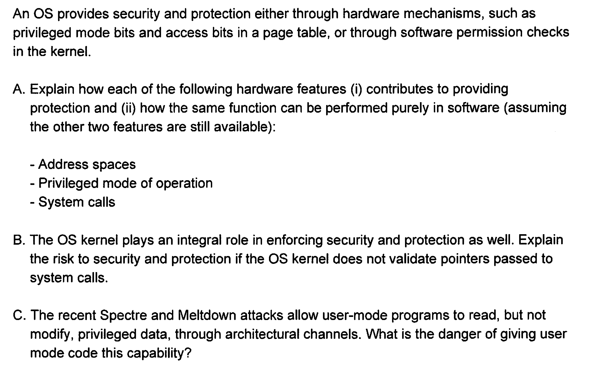

### Address Spaces

**(i) Hardware Protection:**
- **Address Spaces:** The CPU, with the help of a Memory Management Unit (MMU), translates virtual addresses (used by processes) to physical addresses (actual locations in memory). This translation is done in hardware, ensuring that each process operates within its own isolated address space.
- The hardware uses page tables, which map virtual addresses to physical addresses. The operating system manages these tables, but the actual address translation and enforcement are done in hardware by the MMU.
- The hardware ensures that a process cannot access memory outside its own allocated address space. If a process attempts to do so, the hardware triggers an exception, typically leading to a segmentation fault or similar error.

**(ii) Software Implementation:**
- **Simulated Address Spaces:** Implementing address space protection in software involves creating mechanisms to manage virtual memory and ensure processes cannot access each other's memory. This can be achieved by emulating memory management units (MMUs) and translating memory accesses via the operating system. However, this would be inefficient and less secure without hardware support for direct enforcement of isolation.

### Privileged Mode of Operation

**(i) Hardware Protection:**
- **Privileged Mode:** CPUs operate in different modes, such as user mode and privileged (kernel) mode. In privileged mode, the CPU can execute sensitive instructions and access critical system resources, whereas user mode restricts these capabilities. This separation prevents user applications from performing operations that could compromise system stability or security.

- Mode Bits: The CPU contains internal flags or mode bits that indicate the current mode of operation (user or kernel). The CPU checks these bits before executing certain instructions or accessing certain resources, enforcing the separation of privileges.
- Faults and Traps: If an instruction that requires privileged mode is attempted in user mode, the CPU automatically generates a fault or trap, transferring control to the operating system to handle the situation. This hardware-enforced mechanism prevents unauthorized access to critical system resources.

**(ii) Software Implementation:**
- **Emulated Privilege Levels:** Simulating privileged mode in software would involve creating mechanisms to enforce access controls and validate operations that would normally require privileged mode. This would entail managing access and performing context switches manually, adding overhead and complexity. Software-based enforcement might not provide the same level of protection and could be more prone to security issues.

### System Calls

**(i) Hardware Protection:**
- **System Calls:** System calls are a controlled interface for user applications to request services from the operating system. The CPU switches from user mode to kernel mode when a system call is made, allowing the OS to safely and securely handle the request. This ensures that user applications cannot directly perform privileged operations and that system resource interactions are mediated by the OS.

**(ii) Software Implementation:**
- **Software Interface:** Implementing system calls in software would require creating a software interface and manually handling context switches between user space and kernel space. The OS would need to manage these transitions and enforce access controls through software. This approach could be less efficient and introduce significant overhead, as well as potential security risks, due to the lack of hardware-enforced boundaries.

### Validate pointers during system calls

- Dereferencing invalid pointers.
- Arbitrary code execution. Attackers could craft pointers that redirect the kernel to execute arbitrary code. 
- Priviledge escalation (it can allow unpriviledged processes to access or modify kernel memory or other process's memory)
- Memory corruption
- Information leakage.

### Danger of reading priviledged data.

- User-mode programs could gain access to sensitive information stored in privileged memory, such as passwords, encryption keys, personal data, and other confidential information.
- These vulnerabilities can be exploited to read data across process boundaries, and even across virtual machine (VM) boundaries in cloud environments, leading to data leakage between otherwise isolated environments.
- Even if the attacker cannot modify the data, they can still use the information gathered to profile the system or user behavior, which can be used in social engineering attacks or targeted exploits.
- Attackers can extract credentials, such as passwords, tokens, or keys, from the memory of privileged processes, leading to unauthorized access.

## Distributed storage systems

- 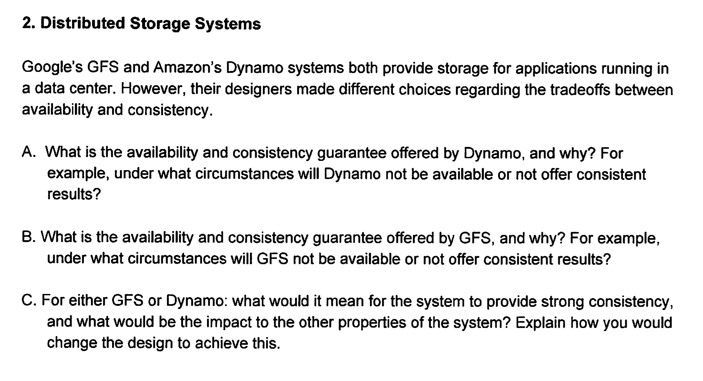

### Availability and consistency guarantee offered by GFS

## Time, Clock and Ordering

* 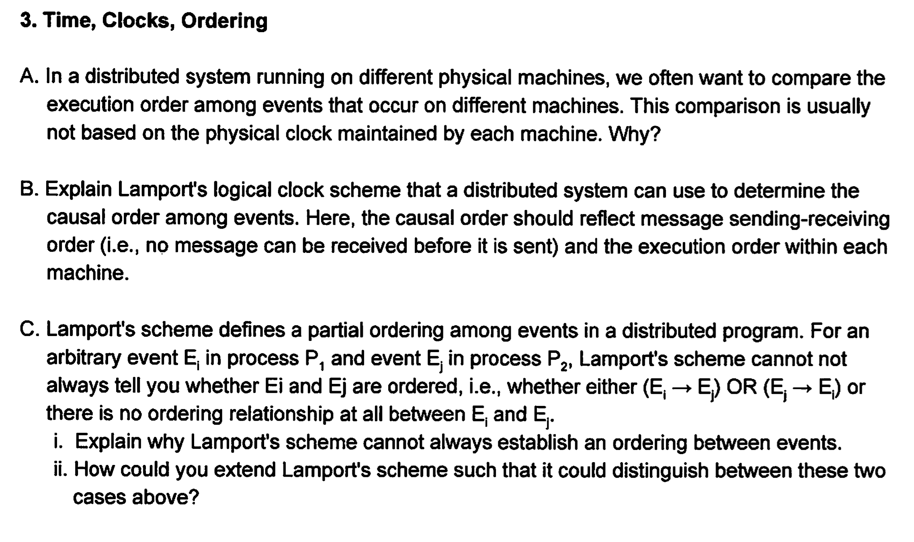

### Why not use physical clocks?
* Clock Synchronization Challenges: Physical clocks on different machines can drift, meaning they may not be perfectly synchronized. Even with synchronization protocols like Network Time Protocol (NTP), there's always some level of inaccuracy due to network latency, clock drift, or other factors. This lack of perfect synchronization can lead to inconsistent ordering of events when relying on physical clocks.
* Network Delays and Non-Determinism: In a distributed system, network delays can cause events to be received out of order. Even if two machines have perfectly synchronized clocks, the actual order in which events are processed or observed may not reflect the real sequence of their occurrence due to these delays.

### Explain Lamport's logical clock.
* ### Lamport's Logical Clock Scheme

Lamport's logical clock scheme is a method used in distributed systems to establish a causal order among events that occur on different machines. This scheme helps determine the "happens-before" relationship between events, ensuring that the order reflects both the message sending-receiving sequence and the execution order within each machine.

#### Key Concepts

1. **Events**: An event can be anything that happens on a machine, such as sending or receiving a message, or any internal action like a computation.
2. **Happens-Before Relation (→)**: This is a partial order that defines the causal relationship between events:
   - If event `a` occurs before event `b` on the same machine, then `a → b`.
   - If event `a` is the sending of a message and event `b` is the receipt of that message, then `a → b`.
   - If `a → b` and `b → c`, then `a → c` (transitivity).

#### Lamport's Logical Clocks

Each machine in the distributed system maintains a logical clock, which is simply a counter (an integer) that is used to timestamp events. Here's how the scheme works:

1. **Initialization**:
   - Each machine `P_i` has a logical clock `L_i`, which is initially set to 0.

2. **Increment on Internal Events**:
   - Whenever a machine `P_i` performs an internal event (e.g., a local computation), it increments its logical clock: `L_i = L_i + 1`.

3. **Message Sending**:
   - When a machine `P_i` sends a message `m` to another machine `P_j`, it increments its clock before sending the message: `L_i = L_i + 1`.
   - The message `m` is sent with the timestamp `T_m = L_i`, where `T_m` is the logical clock value of `P_i` at the time of sending.

4. **Message Receiving**:
   - When machine `P_j` receives a message `m` from `P_i`, it updates its logical clock as follows:
     - `L_j = max(L_j, T_m) + 1`
   - This ensures that the receiving machine's clock is ahead of the sending machine's clock, maintaining the causal order.

#### Determining Causal Order

With Lamport's logical clocks, we can determine the causal relationship between two events `a` and `b`:

- If event `a` has a timestamp `T_a` and event `b` has a timestamp `T_b`, then:
  - **If `T_a < T_b`**, we can say that `a → b` (i.e., event `a` causally happened before event `b`).
  - **If `T_a > T_b`**, then `b` happened before `a`.
  - **If `T_a = T_b`**, the events are considered concurrent, meaning neither happened before the other in the causal sense.

#### Limitations

- **Partial Ordering**: Lamport's logical clocks can establish a partial order of events but not a total order. That is, some events might have the same timestamp and appear concurrent, even if they occur on different machines without any direct causal relationship.
- **Concurrency**: If `T_a = T_b` and `a` and `b` occur on different machines, the scheme cannot determine a causal order; the events are considered concurrent.

#### Example

Consider two machines, `P1` and `P2`, each with its logical clock.

- `P1` performs an event `E1`: `L1 = 1`
- `P1` sends a message `m` to `P2`: `L1 = 2`, and `T_m = 2`
- `P2` receives `m`: `L2 = max(L2, T_m) + 1 = max(0, 2) + 1 = 3`
- `P2` performs another event `E2`: `L2 = 4`

Here, the timestamps are:
- `E1` has `T_E1 = 1`
- The message send event `m` has `T_m = 2`
- The message receive event at `P2` has `T = 3`
- `E2` has `T_E2 = 4`

Thus, `E1 → m → E2`, reflecting the causal relationship.

### Why Lamport's Scheme Cannot Always Establish an Ordering Between Events

Lamport's logical clock scheme provides a partial order of events but cannot always establish a definitive ordering between them. Specifically, Lamport's scheme has limitations in distinguishing between concurrent events, leading to cases where two events are neither causally related nor ordered.

#### Limitations of Lamport's Scheme

1. **Concurrency**: 
   - Two events `a` and `b` on different machines might have the same logical timestamp (`T_a = T_b`). According to Lamport's scheme, this means the events are concurrent, and there's no causal relationship between them. However, the scheme does not provide a way to order these events, leading to ambiguity when trying to determine their relationship.

2. **Partial Ordering**:
   - Lamport's scheme ensures that if `a → b`, then `T_a < T_b`. However, the reverse is not necessarily true: if `T_a < T_b`, it doesn't always imply `a → b`. This can lead to situations where two events are not comparable, i.e., neither `a → b` nor `b → a`.

### Extending Lamport's Scheme: Vector Clocks

To overcome the limitation of Lamport's logical clocks, we can extend the scheme using **vector clocks**. Vector clocks allow us to fully capture the causal relationships between events and establish a total ordering when possible.

#### How Vector Clocks Work

1. **Vector Clock Structure**:
   - Each machine `P_i` maintains a vector clock `V_i`, which is a vector of integers. If there are `N` processes in the system, then `V_i` is of length `N`. The `j`-th element of `V_i`, denoted `V_i[j]`, represents the logical clock value for machine `P_j` as known by `P_i`.

2. **Initialization**:
   - Each vector clock is initially set to `[0, 0, ..., 0]`.

3. **Increment on Internal Events**:
   - Whenever a machine `P_i` performs an internal event, it increments its own component in the vector clock: `V_i[i] = V_i[i] + 1`.

4. **Message Sending**:
   - When machine `P_i` sends a message `m` to machine `P_j`, it increments its own clock in the vector: `V_i[i] = V_i[i] + 1`.
   - The message `m` is sent along with the entire vector clock `V_i`.

5. **Message Receiving**:
   - When machine `P_j` receives a message `m` from `P_i` with the vector clock `V_m`, it updates its own vector clock by taking the element-wise maximum of its current vector clock and the received vector clock:
     - `V_j[k] = max(V_j[k], V_m[k])` for all `k`.
   - Then, it increments its own clock: `V_j[j] = V_j[j] + 1`.

#### Determining Causal Order with Vector Clocks

With vector clocks, we can determine the causal relationship between two events `a` and `b` with vector timestamps `V_a` and `V_b`:

- **Causal Order (`a → b`)**: If `V_a[i] ≤ V_b[i]` for all `i`, and `V_a[j] < V_b[j]` for at least one `j`, then `a → b`.
- **Concurrent Events**: If neither `V_a < V_b` nor `V_b < V_a`, then the events `a` and `b` are concurrent (i.e., `a || b`), meaning there is no causal relationship between them.

### Virtual memory

- 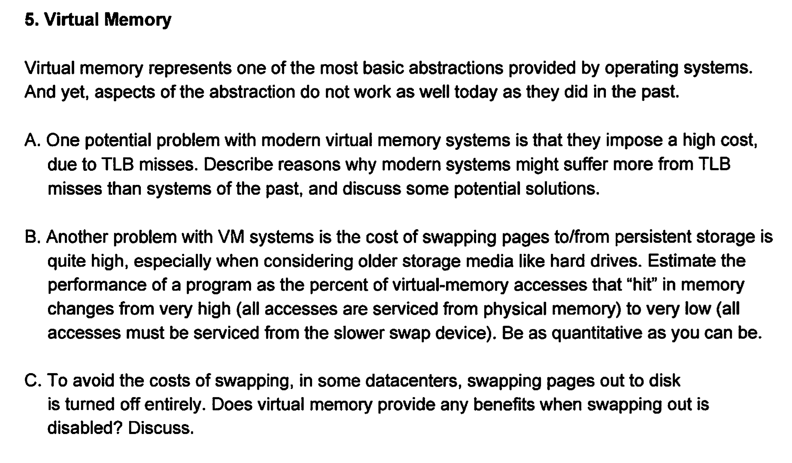

### (1) Reasons Why Modern Systems Might Suffer More from TLB Misses

**1. Larger Memory Sizes:**
   - **Past Systems:** Had smaller physical and virtual memory, leading to fewer page table entries.
   - **Modern Systems:** Utilize significantly larger memory, leading to larger page tables and more Translation Lookaside Buffer (TLB) entries being required.

**2. Increased Use of Virtualization:**
   - **Past Systems:** Virtualization was less common, with simpler address translations.
   - **Modern Systems:** Heavy use of virtualization adds extra layers of address translation (e.g., guest virtual to guest physical, then to host physical), increasing the likelihood of TLB misses.

**3. More Complex Workloads:**
   - **Past Systems:** Simpler and less diverse workloads with predictable memory access patterns.
   - **Modern Systems:** Complex, multi-threaded, and data-intensive workloads lead to less predictable memory access, increasing the chances of TLB misses.

**4. Larger Page Tables:**
   - **Past Systems:** Simpler programs and smaller working sets led to smaller page tables.
   - **Modern Systems:** Larger working sets and more applications running simultaneously result in larger page tables, increasing the chance of TLB misses when switching contexts.

**5. Higher Core Counts:**
   - **Past Systems:** Fewer cores meant fewer concurrent threads.
   - **Modern Systems:** More cores and threads lead to more TLB contention, as different threads may access different parts of the virtual address space.

**Potential Solutions:**
   - **Larger TLBs:** Increase the size of the TLB to hold more entries.
   - **Multi-Level TLBs:** Implement multi-level TLBs to cache more entries at various levels.
   - **Superpages:** Use larger page sizes (superpages) to reduce the number of TLB entries needed.
   - **TLB Prefetching:** Prefetch TLB entries based on predicted access patterns.
   - **Improved Page Replacement Policies:** Use smarter algorithms to manage TLB entries more efficiently.

### (2) Estimating Performance Based on Memory Access Hit Rates

Assuming a system with a hit rate $H$ and miss rate $(1-H)$:

- **Memory Access Time:** $T_{\text{memory}}$
- **TLB Miss Penalty:** $T_{\text{miss}}$
- **Effective Access Time (EAT):** 

$EAT = H \times T_{\text{memory}} + (1-H) \times (T_{\text{memory}} + T_{\text{miss}})$

- If $H$ is very high (e.g., 99%):
  
  $EAT \approx T_{\text{memory}} \times (1 + 0.01 \times \frac{T_{\text{miss}}}{T_{\text{memory}}})$

- If $H$ is very low (e.g., 50%):
  
  $EAT \approx T_{\text{memory}} \times (1 + 0.5 \times \frac{T_{\text{miss}}}{T_{\text{memory}}})$

This demonstrates that as the hit rate decreases, the effective access time increases significantly, leading to reduced performance.

### (3) Benefits of Virtual Memory Without Swapping

Even with swapping disabled, virtual memory still provides several key benefits:

**1. Memory Isolation and Protection:**
   - **Benefit:** Ensures that each process runs in its own address space, preventing them from accessing or corrupting the memory of other processes.

**2. Simplified Memory Management:**
   - **Benefit:** Allows programs to use a simple and contiguous virtual address space, even if the physical memory is fragmented.

**3. Address Space Abstraction:**
   - **Benefit:** Provides processes with the illusion of a large contiguous memory space, simplifying development and execution.

**4. Memory-Mapped Files:**
   - **Benefit:** Enables efficient file I/O by mapping files directly into the virtual address space, avoiding explicit read/write operations.

Without swapping, virtual memory still enhances system stability, security, and efficiency by isolating processes, managing memory dynamically, and providing a uniform address space.

## MapReduce

* 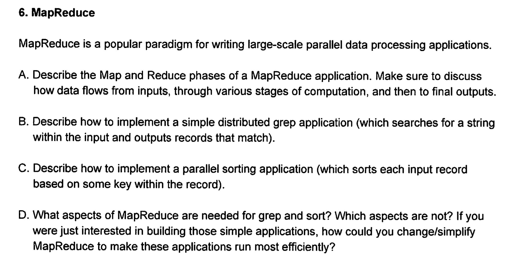

### B: grep

* The Map function is responsible for processing the input data and emitting key-value pairs.
  * Input: The input is a chunk of text (a portion of a file, for example) passed to the Map function.
  * Process: The Map function scans through each line of the input text and checks if the line matches the given pattern (the search term or regular expression).
  * Output: For each matching line, the Map function emits the line itself as the key and null or 1 as the value (the value is often irrelevant in this context).
* Shuffle and sort
  * This phase is automatically handled by the MapReduce framework. The key-value pairs emitted by the Map function are shuffled and sorted based on the keys (the matching lines). Since the keys (lines) are already unique or mostly unique, this phase is trivial for grep.
* Reduce function
  * The Reduce function consolidates the results from the Map phase.
  * Input: The input to the Reduce function is a key (a line that matched the pattern) and a list of values (which are typically ignored in this simple grep implementation).
  * Process: The Reduce function can simply emit the key (the matching line) or do further processing like counting occurrences (if required).
  * Output: The final output consists of the matching lines.
* This is basically a map-only job. 

### C. Parallel sorting.

* Map phase:
  * The goal of the Map phase is to emit key-value pairs where the key is the sorting key from the record, and the value is the entire record.
  * **Input**: The input is a chunk of records.
  * **Process**:
    * For each record, extract the sorting key.
    * Emit the key along with the entire record as the value.
  * **Output**: Key-value pairs where the key is the sorting key, and the value is the record.
* Shuffle and sort:
  * Shuffle the data to ensure that all records with the same key are sent to the same reducer.
  * Sort the records by the key in the shuffle phase.
* Reduce phase:
  * **Input**: Sorted key-value pairs from the Shuffle and Sort phase.
  * **Process**:
    * Simply output the records as the Reduce phase will receive them in sorted order due to the shuffle and sort mechanism.
  * **Output**: The final sorted records, written to the output file or storage.

### D. What aspects of MapReduce are needed for grep and sort? which aspects are not? If you were just interested in building those simple applications, how could you change / simplify MapReduce to make these applications run most efficiently? 

* Not needed:
  * Complex reduce logic.
  * Complex aggregation function
  * Simple partitioning logic is enough.
* For `grep`, simplify MapReduce by configuring it to skip the reduce phase. Configure the MapReduce job to directly write the output of the Map phase to the final output location without further processing.
* `sort`: Implement a combiner to pre-aggregate or process records during the map phase, reducing the volume of traffic across nodes. Use a custom partitioner to ensure an even distribution of keys across reducers to prevent skew and load imbalance. 

# Fall 2013

* 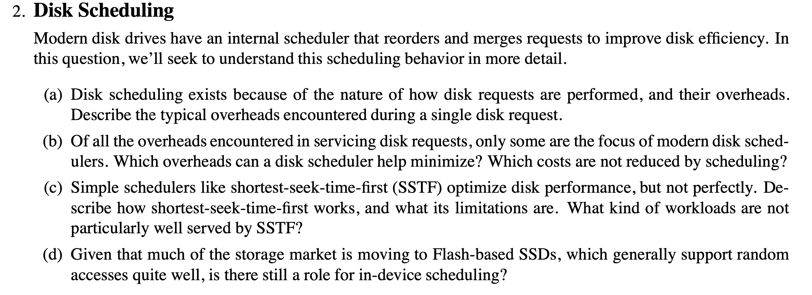

## Understanding Disk Scheduling

### (a) Typical Overheads in a Single Disk Request

1. **Seek Time**: The time it takes for the disk's read/write head to move to the track where the data is located. This overhead depends on the distance the head needs to travel.

2. **Rotational Latency**: The delay caused by the time it takes for the desired disk sector to rotate under the read/write head. It depends on the rotational speed of the disk (e.g., 7200 RPM).

3. **Transfer Time**: The time required to transfer the data once the head is in position and the sector is under the head. This depends on the amount of data being read or written and the disk's data transfer rate.

4. **Queueing Delay**: The delay incurred when multiple requests are waiting in the disk queue. This delay can be affected by the order in which requests are processed.

5. **Command Overhead**: The time required to issue the command and handle the metadata associated with the request (e.g., error checking, command processing).

### (b) Overheads Minimized by Disk Schedulers

Disk schedulers focus on minimizing certain overheads:

1. **Seek Time**: Scheduling algorithms aim to reduce seek time by optimizing the order of requests. Algorithms like Shortest Seek Time First (SSTF) and SCAN (Elevator algorithm) help reduce the amount of movement required by the disk's read/write head.

2. **Rotational Latency**: By scheduling requests in a way that minimizes the time the disk head waits for the correct sector to come under it, schedulers can reduce rotational latency.

**Costs Not Reduced by Scheduling:**

1. **Transfer Time**: The time to transfer data once the read/write head is in position is not significantly impacted by the scheduler; it is mostly dependent on the disk's data transfer rate.

2. **Command Overhead**: The overhead of issuing commands and handling metadata is relatively constant and not significantly affected by the scheduling algorithm.

### (c) Shortest Seek Time First (SSTF)

**How SSTF Works:**
- SSTF chooses the request that is closest to the current position of the disk's read/write head. This minimizes the seek time for each request.

**Limitations of SSTF:**
- **Starvation**: SSTF can lead to the starvation of requests located far from the current head position. If there is a steady stream of requests closer to the head, requests further away might experience long wait times.
- **Inefficiency in High-Load Scenarios**: SSTF can become less effective when the disk queue is highly loaded because it may lead to inefficient disk movement patterns and high overall seek times.

**Workloads Not Well Served by SSTF:**
- **Large, Random Access Patterns**: Workloads with many random accesses or large numbers of requests with no particular locality can result in SSTF performing poorly, as it may not effectively handle the randomness of the requests.
- **Mixed Workloads**: Systems with a mix of read and write requests, especially when write operations are dominant, might suffer from the inefficiencies of SSTF.

### (d) Role of In-Device Scheduling with Flash-based SSDs

Flash-based SSDs have different characteristics compared to traditional spinning disks:

1. **Random Access Efficiency**: SSDs support random access very well, reducing the impact of seek time and rotational latency, which are major concerns in HDDs.

2. **In-Device Scheduling**:
   - **Wear Leveling**: SSDs use in-device scheduling to manage wear leveling, ensuring that write and erase cycles are evenly distributed across the memory cells to prolong the drive's lifespan.
   - **Garbage Collection**: SSDs perform background operations like garbage collection to manage and reclaim space from deleted files. This helps maintain performance by consolidating free space and optimizing write operations.
   - **Read and Write Optimization**: SSDs may use scheduling to optimize read and write operations, taking into account the flash memory architecture and the need to minimize write amplification.

In summary, while the need for traditional disk scheduling algorithms is less critical for SSDs due to their lack of mechanical components, in-device scheduling still plays a crucial role in managing the unique characteristics and performance aspects of SSDs.

# Virtual Memroy

* 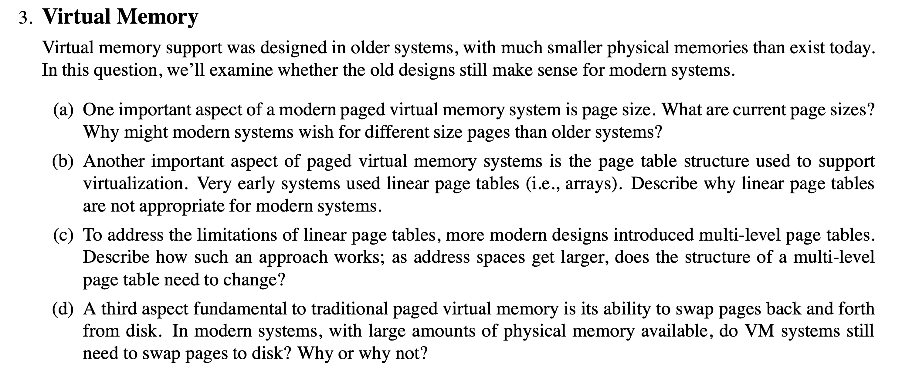

## Virtual Memory Support in Modern Systems

### (a) Current Page Sizes and Their Evolution

**Current Page Sizes:**
- Modern systems typically use several page sizes. The most common sizes are:
  - **4 KB**: The standard page size used in many systems.
  - **2 MB**: Known as "large pages" or "huge pages" in x86 architectures.
  - **1 GB**: Known as "gigantic pages" or "huge pages" in some architectures.

**Why Different Page Sizes?**
- **Memory Efficiency**: Larger page sizes can reduce the overhead of managing page tables by decreasing the number of pages needed for a given address space. This can reduce page table size and lookup time.
- **Performance**: Larger pages can improve performance by **reducing the number of page table entries and the number of TLB (Translation Lookaside Buffer) misses**. This is particularly beneficial for applications with large memory footprints or contiguous memory access patterns.
- **Application Requirements**: Some applications, especially those that handle large datasets or perform large-scale computations, benefit from larger pages due to reduced overhead and improved locality.

### (b) Limitations of Linear Page Tables

**Linear Page Tables:**
- A linear page table uses a single, contiguous array to store page table entries for all possible virtual addresses.

**Limitations:**
- **Memory Consumption**: For large address spaces, linear page tables become impractically large. For instance, with 64-bit addressing and a 4 KB page size, the page table could potentially have billions of entries, consuming enormous amounts of memory.
- **Scalability**: As address spaces grow, the linear table grows linearly, which is inefficient and impractical for systems with large address spaces.
- **Performance**: Large page tables can lead to inefficient memory usage and slow down address translation due to the large size of the table.

### (c) Multi-Level Page Tables

**How Multi-Level Page Tables Work:**
- Multi-level page tables break down the page table into a hierarchy of smaller tables. For example, a two-level page table consists of:
  1. **Top-Level Table**: Contains pointers to second-level tables.
  2. **Second-Level Tables**: Contain pointers to actual page table entries.
- This hierarchical approach reduces the amount of memory required for the page table by only allocating memory for tables that are needed, based on the actual address space used.

**Changes with Larger Address Spaces:**
- As address spaces get larger, the multi-level page table structure may need to increase the number of levels to manage the larger number of addressable pages efficiently. However, the hierarchical nature of the table helps manage this growth more effectively compared to linear page tables.

### (d) Swapping Pages to Disk in Modern Systems

**Swapping Pages:**
- **Need for Swapping**: Despite having large amounts of physical memory, modern systems still use swapping and paging to disk for several reasons:
  - **Memory Overcommitment**: Systems may run more applications or services than can fit into physical memory, necessitating the use of swap space.
  - **Memory Management**: Swapping can be used to free up physical memory for higher-priority processes or to ensure fair resource allocation among processes.
  - **Handling Large Workloads**: Some applications may still require more memory than is physically available, making swapping a necessary part of memory management.

**Why It Matters:**
- Even with large physical memories, swapping allows for better resource management and flexibility in handling varying workloads and memory demands.

# Authentication

* 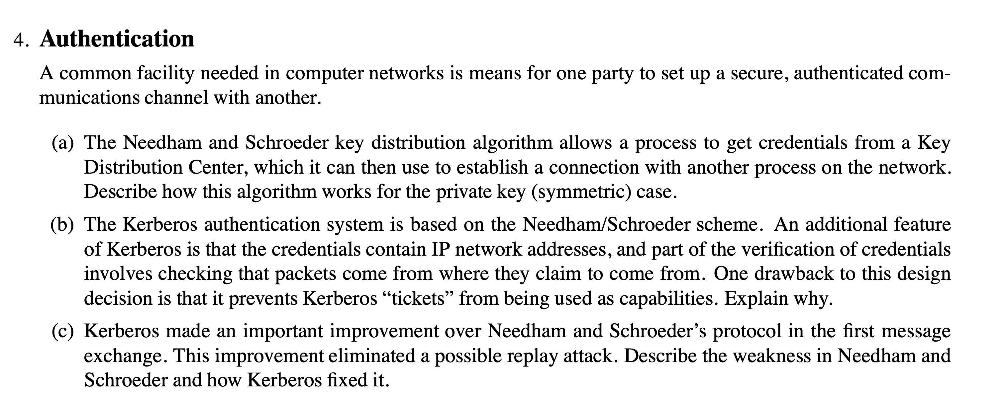
  
### (a) Needham and Schroeder Key Distribution Algorithm

The Needham and Schroeder key distribution algorithm is a method for securely establishing a shared secret key between two parties using a Key Distribution Center (KDC). Here’s how it works in the symmetric key (private key) case:

1. **Initial Request:**
   - **Client → KDC:** The client sends a request to the KDC for a session key to communicate with another party. This request includes the identity of the intended recipient (e.g., server).

2. **Key Distribution:**
   - **KDC → Client:** The KDC generates a session key and sends it to the client in a secure manner. This message is encrypted with the client’s private key, ensuring only the client can decrypt it. The message also includes a ticket for the server, which contains the session key and is encrypted with the server’s private key.

3. **Client to Server Communication:**
   - **Client → Server:** The client then sends the ticket (containing the session key) to the server, along with an authenticator. The authenticator includes a timestamp and is encrypted with the session key.

4. **Server Verification:**
   - **Server:** The server decrypts the ticket with its private key, retrieves the session key, and then decrypts the authenticator using this session key. It verifies the timestamp to ensure the request is valid and fresh.

5. **Response:**
   - **Server → Client:** The server sends a confirmation message to the client, encrypted with the session key, to complete the authentication process.

This process ensures that both parties share a secure, secret session key without exposing it during transmission.

### (b) Kerberos and the Use of Tickets

Kerberos is an authentication system that extends the Needham-Schroeder scheme by including network addresses in tickets and verifying that packets come from the claimed sources. However, this introduces a limitation:

**Limitation:**
- **Tickets as Capabilities:** In Kerberos, tickets contain the client's network address, which restricts their usage to specific contexts. This means that a ticket is bound to the network location of the client. As a result, tickets cannot be easily used as capabilities across different network contexts or locations because their validity is tied to a particular IP address or network.

**Reason:**
- **Context-Specific Validation:** Since Kerberos tickets are checked against network addresses, they cannot be used in situations where the client might move between different network locations or where cross-network capability is needed. This binding of tickets to network addresses limits their flexibility compared to capabilities that can be used independently of network context.

### (c) Kerberos Improvement Over Needham and Schroeder

Kerberos improved upon the Needham and Schroeder protocol by addressing a specific weakness related to replay attacks:

**Weakness in Needham and Schroeder:**
- **Replay Attack Vulnerability:** The original Needham and Schroeder protocol was vulnerable to replay attacks. An attacker could intercept and reuse old messages to impersonate a legitimate user.

**Kerberos Improvement:**
- **Inclusion of Timestamps:** Kerberos introduced the use of timestamps and unique session identifiers in its tickets. Each ticket includes a timestamp that must be within a specific time window. This ensures that even if an attacker intercepts a ticket, it cannot be reused after the timestamp expires, thus mitigating the risk of replay attacks.
- **Authenticator:** Kerberos uses an authenticator containing a timestamp that is encrypted with the session key. This further ensures that each authentication request is fresh and prevents replay attacks.

By incorporating these features, Kerberos enhances security and ensures that each authentication request is unique and timely, preventing unauthorized reuse of credentials.

# Process, LWP's and Threads

* 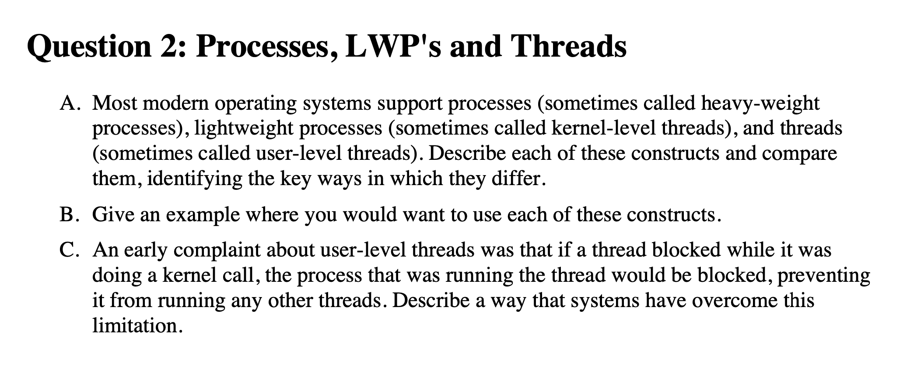

### A. Description and Comparison

1. **Processes (Heavy-Weight Processes)**
   - **Description**: A process is an independent, self-contained unit of execution that has its own memory space, file descriptors, and other resources. Processes are isolated from each other and communicate through inter-process communication (IPC) mechanisms.
   - **Characteristics**:
     - **Memory Isolation**: Each process has its own memory space, which protects it from interference by other processes.
     - **Resource Management**: Processes have their own resources, such as open files and network connections.
     - **Overhead**: Creating and managing processes has higher overhead compared to threads and lightweight processes due to the need to manage separate memory spaces and resources.
   - **Example**: Running separate applications such as a web browser and a text editor on a computer, each in its own process.

2. **Lightweight Processes (Kernel-Level Threads)**
   - **Description**: Kernel-level threads are managed by the operating system's kernel. They share the same address space and resources of the process they belong to but are scheduled independently.
   - **Characteristics**:
     - **Shared Resources**: Threads within the same process share the same memory space and resources.
     - **Lower Overhead**: Threads have lower overhead compared to processes because they share resources with other threads in the same process.
     - **Concurrency**: They enable concurrent execution within a single process.
   - **Example**: Multiple threads in a web server handling different client requests concurrently.

3. **Threads (User-Level Threads)**
   - **Description**: User-level threads are managed by user-level libraries or runtime systems rather than the kernel. They are scheduled and managed in user space.
   - **Characteristics**:
     - **No Kernel Support**: Threads are not directly visible to the kernel; instead, the user-space library handles thread scheduling.
     - **Context Switching**: Switching between user-level threads is faster since it doesn’t involve the kernel.
     - **Blocking**: If one thread blocks on a system call, all threads in the process may be blocked, depending on the implementation.
       - In user-level threads, a system call by a thread may block all other threads of the process. This is because all threads within the process share the same memory space and execution environment. Thus, when a thread performs a system call, the entire process is blocked until the system call completes.
   - **Example**: A GUI application with multiple threads handling user input, background tasks, and rendering.

### B. Examples of Using Each Construct

1. **Processes**:
   - **Example**: Running a word processor and a spreadsheet application simultaneously on a desktop. Each application runs in its own process to ensure isolation and stability.

2. **Lightweight Processes (Kernel-Level Threads)**:
   - **Example**: A web server using kernel-level threads to handle incoming client requests concurrently. Each thread processes a different request, improving the server's responsiveness and throughput.

3. **Threads (User-Level Threads)**:
   - **Example**: A video game application that uses user-level threads to manage different aspects of gameplay, such as rendering, input handling, and background computation. This setup allows fine-grained control over concurrency without involving the kernel.

### C. Overcoming User-Level Thread Limitations

**Problem with User-Level Threads:**
- **Blocking Issue**: In early systems, if a user-level thread made a blocking kernel call (such as I/O operations), the entire process could be blocked, preventing other threads from running.

**Solution:**
- **Hybrid Threading Models**: Modern systems use hybrid threading models that combine user-level and kernel-level threading. The key approaches include:
  - **Kernel-Level Threads**: By using kernel-level threads, blocking system calls made by one thread do not block other threads within the same process. The kernel schedules threads independently, allowing other threads to continue executing.
  - **Thread Libraries with Support for Asynchronous I/O**: Some user-level thread libraries implement mechanisms to perform non-blocking I/O operations or use asynchronous I/O patterns to avoid blocking the entire process.

These solutions allow user-level threads to run concurrently and handle blocking operations more effectively, improving overall system performance and responsiveness.

# RAID

* 

### A. RAID Level 1: Mirroring

**Description:**
- **Mirroring** involves creating an exact copy (or mirror) of the data on two or more disks. Each disk in the RAID 1 array contains the same data.

**Performance:**
- **Read Performance**: Read performance can be improved because the system can read from multiple disks simultaneously. This can lead to faster data retrieval as different disks handle different read requests.
- **Write Performance**: Write performance may be slower compared to RAID 0 because data must be written to all mirrored disks. This can create additional overhead as each write operation involves updating multiple disks.

**Reliability:**
- **High Reliability**: RAID 1 provides high reliability because data is duplicated across multiple disks. If one disk fails, the system can continue operating using the remaining disks without data loss.
- **Fault Tolerance**: RAID 1 can tolerate the failure of one or more disks (as long as there is at least one functioning mirror). The system can reconstruct data from the remaining disks.

**Effective Capacity:**
- **Capacity Utilization**: The effective capacity of a RAID 1 array is equal to the capacity of a single disk. For example, if two 1 TB disks are used, the effective storage capacity is 1 TB, as the data is duplicated.

### B. RAID Level 5: Rotated Parity

**Description:**
- **Rotated Parity** involves striping data across multiple disks and storing parity information. Parity is used to reconstruct data in the event of a disk failure. The parity information is distributed (or rotated) across all disks in the array.

**Performance:**
- **Read Performance**: Read performance is generally good because data is striped across multiple disks, allowing for concurrent read operations.
- **Write Performance**: Write performance can be affected by the need to compute and write parity information for each write operation. This involves reading old data and old parity, computing new parity, and writing the updated data and parity. This can introduce overhead compared to RAID 1.

**Reliability:**
- **High Reliability**: RAID 5 can tolerate the failure of a single disk. If a disk fails, the data can be reconstructed from the remaining disks and the parity information. This makes RAID 5 reliable and fault-tolerant.
- **Rebuild Time**: Rebuilding data after a disk failure can be time-consuming and puts additional stress on the remaining disks, increasing the risk of another disk failure during the rebuild process.

**Effective Capacity:**
- **Capacity Utilization**: The effective capacity of a RAID 5 array is the total capacity of all disks minus the capacity of one disk (used for parity). For example, if a RAID 5 array consists of three 1 TB disks, the effective storage capacity is 2 TB.

### C. RAID-5 vs RAID-1 Preferences

**When to Prefer RAID-5:**
- **Higher Storage Efficiency**: RAID 5 is preferred when higher storage efficiency is desired. It provides more usable storage capacity compared to RAID 1, as only one disk's worth of capacity is used for parity.
- **Cost-Effective**: RAID 5 can be more cost-effective in terms of storage costs because it requires fewer disks to achieve redundancy compared to RAID 1, which requires duplicating all data.

**When to Prefer RAID-1:**
- **High Performance for Reads**: RAID 1 is preferred when read performance is critical, as it can improve read speeds by distributing read requests across multiple disks.
- **Simpler Write Operations**: RAID 1 has simpler write operations compared to RAID 5 because it does not involve parity calculations. This can be beneficial in environments with heavy write loads.
- **Faster Rebuild Times**: RAID 1 generally has faster rebuild times compared to RAID 5 because there is no need to recompute parity. In the event of a disk failure, RAID 1 can quickly restore data from the remaining mirrors.

Choosing between RAID 5 and RAID 1 depends on the specific needs for performance, capacity, and cost. RAID 5 is often chosen for environments where efficient storage utilization is a priority, while RAID 1 is selected for high performance and simplicity in write operations.

How does read work in RAID 5:

2. **Read Operation:**
   - **Determine Stripe Location:** When a read request is made, the system first determines which stripe the requested data is located in.
   - **Read Data from Disks:**
     - **Single Disk Access:** If the requested data is stored in one or more disks within a stripe, the data is read directly from those disks. For example, if a file's data is spread across multiple disks, the system will read the relevant data blocks from the corresponding disks.
     - **Multiple Disks Access:** For reads that span multiple stripes, the system accesses multiple disks to retrieve the necessary data.

# MapReduce

* 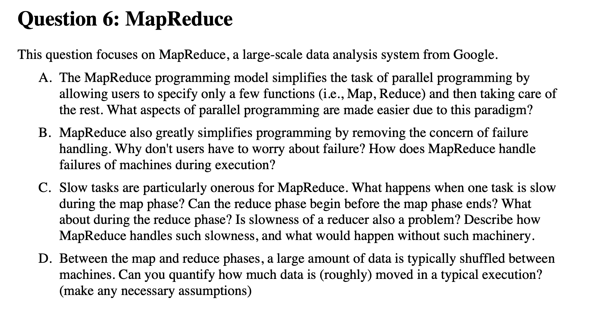

### C. Slow Tasks and Their Impact

1. **Slow Tasks During the Map Phase:**

   - **Impact on Map Phase:**
     - **Task Delays:** If a map task is slow, it can delay the overall completion of the map phase. The MapReduce framework requires all map tasks to complete before proceeding to the reduce phase.
     - **Data Availability:** Slow map tasks can delay the availability of output data for the reduce phase. This can hold up the reduce tasks, as they need all the map outputs to be available before they can start.

   - **Handling Slowness:**
     - **Speculative Execution:** To mitigate the impact of slow tasks, MapReduce frameworks often employ speculative execution. This involves launching duplicate instances of slow-running tasks on different nodes. The task that completes first is used, and the other instances are killed.
     - **Task Monitoring and Reassignment:** The framework monitors task progress and can reassign slow or failed tasks to other nodes if necessary.

2. **Starting the Reduce Phase:**

   - **Before Map Phase Completes:**
     - **Reduce Phase Delay:** The reduce phase cannot begin until the map phase has completed. This is because the reducers need the complete set of map outputs to perform their operations.

   - **During Reduce Phase:**
     - **Data Ingestion:** Once the map phase is complete, reducers start to fetch and process the map outputs. If there are delays in the reduce phase, they are handled similarly through mechanisms like speculative execution and reassigning slow reducers.

   - **Slowness of Reducer:**
     - **Problem:** A slow reducer can impact the overall completion time of the MapReduce job. Since all reducers need to complete for the job to finish, any delay in one reducer can cause delays in the entire job.
     - **Handling Slowness:** Similar to map tasks, the framework may use speculative execution for reducers. It may also reassign slow or failed reducers to other nodes.

3. **Without Handling Mechanisms:**
   - **Increased Job Time:** Without mechanisms like speculative execution and task reassignment, slow tasks could significantly delay job completion. If a task or reducer fails and is not reassigned, it could lead to job failure or excessive delays.

### D. Data Shuffling Between Map and Reduce Phases

1. **Data Shuffling Overview:**
   - **Intermediate Data:** After the map phase, the intermediate data generated by the map tasks needs to be shuffled and sorted before it is sent to the reduce tasks.

2. **Quantifying Data Movement:**

   - **Size Estimate:**
     - **Map Output Size:** The amount of data shuffled is roughly proportional to the size of the map outputs. If each map task produces `M` MB of output and there are `N` map tasks, the total map output size is `M * N` MB.
     - **Reduce Tasks:** The intermediate data is distributed among `R` reduce tasks. If the map outputs are evenly distributed, each reduce task will handle approximately `(M * N) / R` MB of data.

   - **Assumptions:**
     - **Uniform Distribution:** Assume that the data produced by map tasks is uniformly distributed across all reduce tasks.
     - **No Compression:** Assume no compression is applied during data shuffling.

   - **Example Calculation:**
     - **Number of Map Tasks:** 100
     - **Output per Map Task:** 10 MB
     - **Number of Reduce Tasks:** 10
     - **Total Data to Shuffle:** `100 map tasks * 10 MB = 1000 MB`
     - **Data per Reduce Task:** `1000 MB / 10 reduce tasks = 100 MB per reduce task`

   - **Summary:**
     - Typically, the amount of data shuffled can be substantial, often in the range of gigabytes or more, depending on the number of map tasks and the size of their outputs. Efficient shuffling and sorting are critical to maintaining performance and minimizing bottlenecks in the MapReduce process.

This approach ensures that the MapReduce framework can handle slow tasks effectively and manage large amounts of data during the shuffle phase.

# File System Heuristics

* 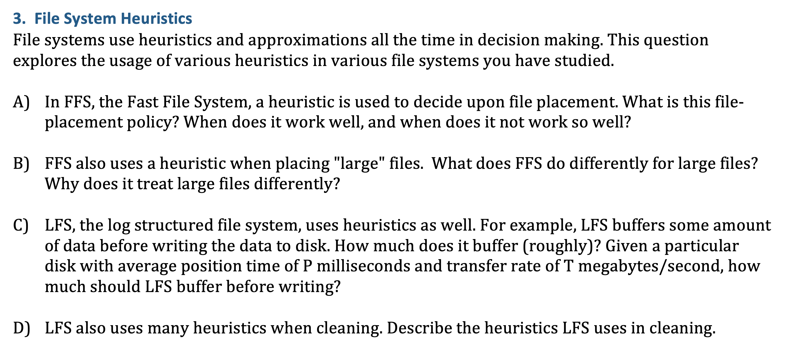

## FFS

* Since data blocks for a file are typically accessed together, the policy routines try to place all data blocks for a file in the same cylinder group, preferably at rotationally optimal positions in the same cylinder. 
* Rules
    * Put directory entries near directory inodes
    * Put inodes near directory entries 
    * Put data blocks near inodes 

## FFS but for large files

* problem: large files, which can fill nearly all of a group, displace data for many small files
    * Assumption: most files are small! Better to do one seek for large file than one seek for each of many files
        * Define large file as requiring an indirect block
    * **Policy**
        * Large file data blocks: after **48KB**, go to new group
        * Move to another group (w/ fewer than average blocks) every subsequent 4MB
        * Effectively, large files are divided into parts and placed in several groups. 

### LFS buffering

**Buffering in LFS:**
- **Buffer Size**: LFS buffers a certain amount of data before writing it to disk. This buffering helps to amortize the cost of disk writes and optimize performance.
- **Rough Buffer Size Calculation**: The amount of data buffered is typically around 10-100 MB, but this can vary based on the specific implementation and workload.

**Buffer Size Calculation:**
- **Disk Position Time (P)**: The average time to move the disk head to the correct position.
- **Transfer Rate (T)**: The average rate at which data is transferred to the disk.

**Calculation:**
- To determine how much LFS should buffer, consider the average seek time (P) and transfer rate (T). The buffer size should be large enough to ensure that the time spent waiting for disk positioning (P) is outweighed by the time spent transferring data (T).
- For example, if P is 10 milliseconds and T is 50 MB/second, buffering enough data to occupy the transfer time would be:
  
  $\text{Buffer Size} = T \times \left(\frac{P}{1000}\right)$

  $\text{Buffer Size} = 50 \, \text{MB/s} \times 0.01 \, \text{s} = 0.5 \, \text{MB}$

  This is a simplified calculation and actual implementations may use larger buffers to account for variability and additional overhead.

### LFS cleaning heuristics.

* Clean hot segments first. 

# File abstraction

* Name three (3) areas where the use of the file abstraction was expanded in later systems from the original Unix (for example, in Plan 9). For each of these areas, describe the advantage to using the file abstraction and how this affected the design of the operating system.

### 1. **Inter-Process Communication (IPC)**

**Description:**
- **Plan 9 Extension:** In Plan 9, inter-process communication is handled using files in the file system. This means that communication channels, such as pipes and message queues, are represented as files.
  
**Advantages:**
- **Uniform Interface:** By using the file abstraction for IPC, Plan 9 provides a consistent interface for communication. Processes interact with IPC mechanisms through standard file operations like reading and writing, simplifying the development process.
- **Flexibility:** This approach allows for flexible and dynamic communication patterns. Since IPC mechanisms are represented as files, they can be manipulated using standard file system tools.

**Impact on OS Design:**
- **Unified Namespace:** The use of file abstraction for IPC integrates communication mechanisms into the file system namespace. This simplifies the OS design by leveraging the existing file system infrastructure for managing IPC.
- **Simplified API:** Developers interact with IPC using familiar file operations, reducing the complexity of the API and making it easier to implement and maintain.

### 2. **Network Communication**

**Description:**
- **Plan 9 Extension:** In Plan 9, network connections are also represented as files. Network sockets and network services are accessible through the file system, allowing standard file operations to interact with network resources.

**Advantages:**
- **Consistency:** By treating network connections as files, Plan 9 extends the file abstraction to include network communication. This provides a consistent way to handle both local and network-based resources.
- **Integration:** Network operations can be managed using the same tools and conventions used for local file operations. This integration streamlines development and system administration tasks.

**Impact on OS Design:**
- **File System Integration:** The network stack is integrated into the file system namespace, allowing for a more cohesive system architecture where network and local resources are treated uniformly.
- **Simplified Networking:** The design reduces the need for separate network management tools and APIs, making network programming more intuitive and consistent with other file operations.

### 3. **Processes and Services**

**Description:**
- **Plan 9 Extension:** In Plan 9, processes and services are also represented as files in the file system. Each process can be accessed through the file system, and system services are exposed as files.

**Advantages:**
- **Process Management:** By representing processes as files, Plan 9 allows for direct manipulation and querying of process state and attributes using file system operations. This includes listing processes, reading process information, and managing process-related data.
- **Service Access:** System services and daemons are exposed through the file system, allowing for a unified approach to interacting with both user applications and system services.

**Impact on OS Design:**
- **File System as System Interface:** The file system becomes a central interface for managing system resources, including processes and services. This approach centralizes resource management and simplifies system administration.
- **Unified Resource Management:** Processes and services are managed using the same mechanisms as file operations, leading to a more uniform and integrated system design.

# Disco and ESX

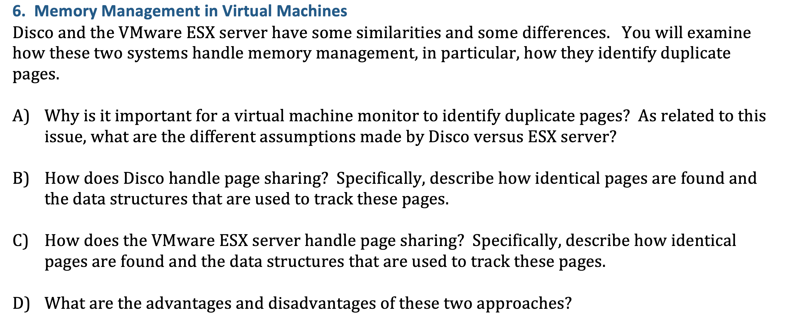

**NOTE: unsure**

### A. Importance of Identifying Duplicate Pages

**Importance:**
- **Memory Efficiency:** Identifying duplicate pages allows a virtual machine monitor (VMM) to optimize memory usage by sharing identical pages among different virtual machines (VMs), reducing the overall memory footprint.
- **Cost Savings:** By consolidating identical pages, a VMM can increase the effective memory available to each VM, potentially reducing the need for physical memory and lowering hardware costs.

**Assumptions:**

- **Disco:**
  - **Assumptions:** Disco assumes that VMs may have many identical pages due to common operating system and application binaries. It leverages this assumption to efficiently share pages across VMs running the same or similar workloads.
  - **VM Isolation:** Disco assumes that page sharing does not compromise the isolation between VMs, as it relies on page-level granularity to ensure that shared pages do not introduce security or privacy issues.

- **VMware ESX Server:**
  - **Assumptions:** ESX Server also assumes that page sharing can be beneficial, but it operates under more stringent constraints to ensure the correctness and security of the VMs. It uses a more sophisticated approach to detect and manage page sharing.
  - **Security and Isolation:** ESX Server emphasizes maintaining strong isolation between VMs while allowing page sharing. It assumes that the benefits of page sharing outweigh the risks and has mechanisms to mitigate potential security issues.

### B. Page Sharing in Disco

**Page Sharing Mechanism:**

- **Identifying Identical Pages:**
  - **Hashing:** Disco uses a hash function to identify identical pages. Each page's content is hashed, and the hash values are compared to detect duplicates.
  - **Hash Table:** A hash table is employed to track the hash values of pages. When a new page is created or loaded, its hash value is computed and checked against the hash table to determine if it matches an existing page.

- **Data Structures:**
  - **Hash Table:** Disco maintains a hash table where the key is the hash value of the page, and the value is a reference to the shared page in memory.
  - **Page Table Entries:** Page table entries (PTEs) are updated to point to the shared page when duplicates are detected.

**Advantages and Disadvantages:**

- **Advantages:**
  - **Efficient Sharing:** Hashing allows for efficient identification of duplicate pages and reduces memory consumption.
  - **Simple Implementation:** The use of a hash table and hashing function provides a straightforward method for page sharing.

- **Disadvantages:**
  - **Hash Collisions:** Hash collisions can occur, leading to potential false positives or additional overhead in handling collisions.
  - **Overhead:** Maintaining and searching the hash table incurs additional overhead.

### C. Page Sharing in VMware ESX Server

**Page Sharing Mechanism:**

- **Identifying Identical Pages:**
  - **Content-Based Hashing:** VMware ESX Server uses content-based hashing to identify identical pages. Each page's content is hashed using a cryptographic hash function.
  - **Content-Based Hash Table:** A global hash table is maintained to store the hash values and corresponding memory addresses of shared pages.

- **Data Structures:**
  - **Global Hash Table:** This table keeps track of page hashes and their corresponding physical memory addresses. The hash values are used to check for page duplication across different VMs.
  - **Shadow Page Tables:** ESX Server uses shadow page tables to map VM memory pages to physical pages, ensuring that VMs can access the shared pages correctly.

**Advantages and Disadvantages:**

- **Advantages:**
  - **Strong Isolation:** ESX Server provides strong isolation between VMs while sharing pages, reducing security risks associated with page sharing.
  - **Efficient Sharing:** Content-based hashing and global hash tables allow for efficient page sharing and reduced memory footprint.

- **Disadvantages:**
  - **Complexity:** The use of cryptographic hashing and global hash tables adds complexity to the system.
  - **Overhead:** The need to maintain and access the global hash table and shadow page tables can introduce overhead.

### Summary

- **Disco** employs a straightforward hashing mechanism for page sharing, using hash tables to track duplicate pages. While it is efficient, it can face issues with hash collisions and overhead.
- **VMware ESX Server** uses a more sophisticated content-based hashing approach with global hash tables and shadow page tables. This method enhances isolation and security but introduces additional complexity and overhead.

# Spring 2015

## Scheduling and Communication

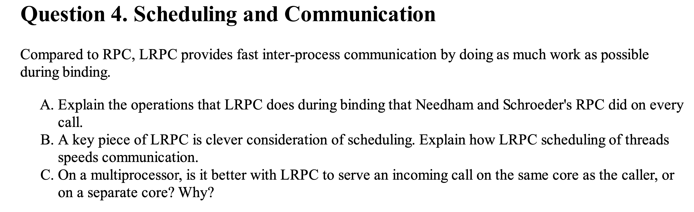

### A. Importance and Value of a Separate Authentication Service

**Importance and Value:**

- **Centralized Authentication:** A separate authentication service centralizes the management of authentication credentials. 
- **Reduced Complexity:** By separating authentication from application services, the complexity of implementing and managing authentication mechanisms is reduced.
- **Improved Security:** A dedicated authentication service can employ specialized security measures to protect credentials and manage authentication sessions. This reduces the risk of vulnerabilities that could arise from having authentication logic scattered across multiple applications.
- **Ease of Integration:** Applications can leverage a common authentication service for user verification, simplifying the integration of new applications and services into the existing authentication framework.

### B. Client-Contacted Authentication Service: Benefits and Drawbacks

**Benefits of Client-Contacted Authentication Service:**

- **Client Control:** The client contacting the authentication service provides the client with control over the authentication process, allowing them to initiate and manage their authentication sessions.
- **Simplified Server Design:** The server does not need to handle complex authentication processes or communicate with the authentication service directly. This simplifies the server’s design and reduces its responsibilities.
- **Scalability:** Clients can independently contact the authentication service, allowing for better scalability and distribution of authentication requests.

**Drawbacks of Client-Contacted Authentication Service:**

- **Client Responsibility:** Clients must handle the process of contacting the authentication service, which can introduce potential security risks if the client’s implementation is not secure.
- **Increased Client Load:** The client may experience additional overhead from managing authentication, especially if multiple authentication requests are required.
- **Vulnerability to Attacks:** If the client’s contact with the authentication service is compromised, attackers might intercept or manipulate authentication data, potentially leading to security breaches.

### C. Cross-Banking Authentication with Kerberos

**Designing a Protocol for Cross-Banking Authentication:**

**Scenario:**
- You want to log in to one bank and use that credential at both banks, while preventing one bank from performing unauthorized operations at the other.

**Protocol Design:**

1. **Shared Kerberos Realm:**
   - **Assumption:** Both banks are part of a shared Kerberos realm, or they trust a common Kerberos realm for authentication.
   - **Authentication Tickets:** When you log in to Bank A, Kerberos issues a ticket-granting ticket (TGT) for Bank A and a service ticket for Bank A’s services.

2. **Cross-Banking Access:**
   - **Request to Bank B:** To access Bank B using the credentials from Bank A, Bank A can request a cross-realm ticket from the Kerberos Key Distribution Center (KDC) for Bank B.
   - **Ticket Exchange:** The KDC issues a ticket for Bank B, allowing you to authenticate with Bank B. This ticket includes specific permissions and is valid for a limited time.

3. **Authorization and Permissions:**
   - **Controlled Access:** The tickets and authentication mechanisms ensure that you can perform operations at Bank B only with your explicit consent and under the predefined permissions.
   - **Authorization Tokens:** To transfer money, Bank A can generate a secure authorization token or request from you to perform the transfer. Bank B will verify this token and perform the transfer only if it’s valid and authorized.

4. **Preventing Unauthorized Operations:**
   - **Limited Permissions:** Ensure that each bank’s ticket includes limited permissions that restrict operations to only what is explicitly authorized by the customer.
   - **Audit and Logging:** Implement logging and auditing mechanisms to track cross-bank transactions and detect any unauthorized activities.

**Summary:**
- By using Kerberos and a shared authentication service, you can securely manage cross-bank operations while maintaining strict control over permissions. The authentication service handles the issuance of cross-realm tickets, ensuring that operations between banks are authorized and secure.

# Fault tolerance and reliability

- 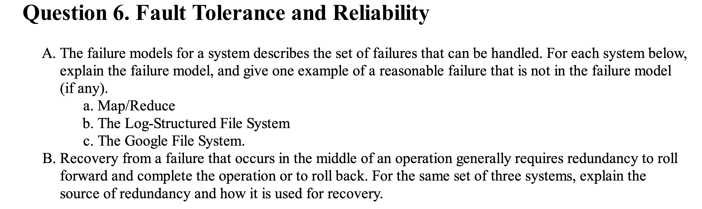

### A. Failure Models

**a. Map/Reduce**

**Failure Model:**
- **Task-Level Failures:** MapReduce primarily handles failures at the level of individual map and reduce tasks. If a task fails, MapReduce retries the task on a different node.
- **Node Failures:** If a node fails, the tasks running on that node are reassigned to other nodes. The system assumes that the nodes can fail, and it can tolerate such failures by redistributing the tasks.
- **Job Tracker Failure:** The Job Tracker (or Resource Manager in YARN) is a critical component. If it fails, recovery mechanisms involve re-running the job from the start or from the last checkpoint if checkpointing is used.

**Example of Failure Not Handled:**
- **Network Partitioning:** MapReduce is not explicitly designed to handle network partitioning where nodes are split into isolated groups. While MapReduce can handle individual node failures, a complete network partition could impact task communication and job coordination.

**b. The Log-Structured File System (LFS)**

**Failure Model:**
- **Disk Failures:** LFS is designed to handle disk failures by maintaining redundancy through its log-structured design. Data is written sequentially in logs, and older data can be discarded or cleaned up as part of garbage collection.
- **Crash Failures:** In case of a crash, LFS can recover using its logs. The system maintains a log of all operations, which allows it to reconstruct the state of the file system up to the point of the last successful operation.

**Example of Failure Not Handled:**
- **Metadata Corruption:** LFS primarily focuses on data recovery and may not handle metadata corruption effectively, especially if the corruption occurs before the log entries are updated.

**c. The Google File System (GFS)**

**Failure Model:**
- **Machine Failures:** GFS handles failures of individual machines by replicating data across multiple servers. If a machine fails, the system can retrieve data from replicas on other machines.
- **Corrupted Data:** GFS includes checksums to detect and handle data corruption. Corrupt data is replaced by a healthy replica.
- **Master Node Failure:** GFS has a single master node that manages metadata. The system recovers by periodically saving metadata checkpoints and logs to secondary storage. In case of a master failure, recovery involves restoring from these checkpoints.

**Example of Failure Not Handled:**
- **Network Infrastructure Failure:** GFS is designed to handle machine and data failures but may have limitations in handling extensive network infrastructure failures that affect multiple machines and disrupt the replication process.

### B. Recovery Mechanisms

**a. Map/Reduce**

**Source of Redundancy:**
- **Task Re-execution:** Redundancy is achieved by re-executing failed tasks on different nodes. This ensures that if a task fails, the system can complete the job by running the task again.
- **Data Replication:** Input data is often replicated across nodes to ensure availability and fault tolerance during task execution.

**Recovery Usage:**
- **Task-Level Redundancy:** Failed tasks are rescheduled and executed on other nodes.
- **Checkpointing:** Intermediate results can be checkpointed to recover from failures and avoid recomputing completed tasks.

**b. Log-Structured File System (LFS)**

**Source of Redundancy:**
- **Write-Ahead Logging:** LFS uses a log to record all changes to the file system. This log acts as redundancy, allowing the system to recover from crashes by replaying or applying log entries.
- **Redundant Storage:** Data is often written redundantly across multiple disks to handle disk failures.

**Recovery Usage:**
- **Log Replay:** The system replays the log to recover the file system state to the last consistent point.
- **Garbage Collection:** Old log entries and data are cleaned up during garbage collection, ensuring that only valid data remains.

**c. Google File System (GFS)**

**Source of Redundancy:**
- **Data Replication:** Data is replicated across multiple chunk servers. Each chunk is stored in multiple replicas to ensure availability and fault tolerance.
- **Checkpointing and Logging:** Metadata is periodically checkpointed and logged to recover from master node failures.

**Recovery Usage:**
- **Replica Replacement:** If a chunk server fails, replicas on other servers are used to recover lost data.
- **Metadata Restoration:** In case of master node failure, metadata is restored from the latest checkpoint and log records.

