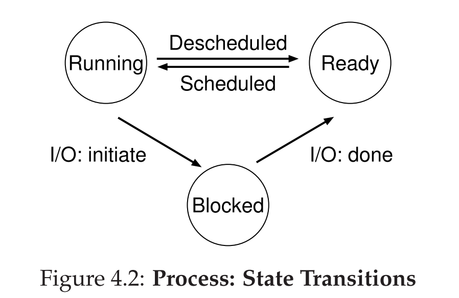

# Process

- Process

  Processor (Von Neumann model of computing):
- Fetch an instruction from memory
- Decode the instruction (Figure out what instruction it is)
- Execute the instruction
- Contents of memory is in its address space.
- Contents of CPU registers (including the program counter and stack pointer).

  - program counter (PC), or instruction pointer (IP): which instruction will execute next
  - stack pointer & frame pointer: manage the stack for function parameters, local variables, and return addresses
  - Stack pointer: tracks the top of the stack in memory
  - Frame pointer: points to a fixed location within the stack frame of the current function. The stack frame contains the function’s local variables, parameters, and return address.
    - Redundant (can just use stack pointer + offset? save one extra register. )
- Information about I/O.

  - persistent storage devices: I/O information for a list of files the process currently has open
- Process API:

  - Calls programs can make related to processes: creation, destruction, etc.
  - Create
  - Destroy
  - Wait
  - Miscellaneous Control (Suspend and resume)
  - Status
- Process states:

  - Running, ready-to-run, blocked
- Process List:

  - Information about all processes that are ready and some additional information to track which process is currently running.
  - Each entry of the list is found in what is sometimes called Process Control block (PCB).
- Process —> a running program

  - **Sits** on a disk (with instructions, static data) in some kind of executable format.
- Operating system —> takes these bytes and gets them running

  - Makes the system easy to use, never concern with whether CPU is available
- Virutualizing CPUs

  - Mechanism: time sharing and context switch

## Process Creation

* 

- In early (or simple) operating systems, the loading process is done eagerly, i.e., all at once before running the program;
- Lazy loading: loading pieces of code or data only as they are needed during program execution (i.e. paging, swapping)
- Before running the process: allocate memory for the program’s run-time stack (C programs use the stack for local variables, function parameters, and return addresses), also for the program’s heap (for explicitly requested dynamically-allocated data; other initialization related to I/O )In Unix systems, each process by default has three open file descriptors, for standard input, output, and error [stored in heap.]
- Start the program at the entry point: main() routine, OS transfers control of CPU to the process, begin execution

# Limited Directed Execution

- The CPU should support at least two modes of execution: a restricted user mode and a privileged (non-restricted) kernel mode.
- Typical user applications run in user mode, and use a system call to trap into the kernel to request operating system services.
- The trap instruction saves register state carefully, changes the hardware status to kernel mode, and jumps into the OS to a pre-specified destination: the **trap table**
- When the OS finishes servicing a system call, it returns to the user program via another special **return-from-trap** instruction.
- The trap tables (with locations of trap handlers) must be set up by the OS at boot time, and make sure that they cannot be readily modified by user programs.

  - The timer interrupt. This approach is a non-cooperative approach to CPU scheduling.
- Sometimes the OS, during a timer interrupt or system call, might wish to switch from running the current process to a different one, a low-level technique known as a context switch.
- Trap Table:

  - Purpose: The trap table is used to map different types of traps (such as interrupts, exceptions, and system calls) to their corresponding handler routines. These handlers are special functions that are executed when a specific trap occurs.
- Direct Execution Protocol (Without Limits)

  - 
- System call:

  - trap: jumps to the kernel and raises privileged level to kernel mode

    - push the program counter, flag, and a few registers onto a per-process kernel stack
    - return-from-trap: returns to user program, reduces privilege level back
  - - pop values off the stack and resume execution
  - system-call number: assigned to each system call

    - **protection**: user code cannot specify an exact address to jump to, but request service via number
  - Switching Between Processes

    - Cooperative Approach: wait for system calls
      - the OS regains control of the CPU by waiting for a system call (e.g. Yield) or an illegal operation of some kind (divide by zero, or tries to access memory that it shouldn't have, generating a trap) to take place
      - These system calls often involve a yield system call.
      - If a process gets stuck in an infinite loop, you can only reboot the machine.
    - Non-Cooperative Approach: the OS takes control
      - Use: timer interrupt and interrupt handler
      - A timer device can be programmed to raise an interrupt every so many milliseconds; when the interrupt is raised, the currently running process is halted, and a pre-configured interrupt handler in the OS runs.
      - During boot time, the OS must inform the hardware of which code to run when the timer interrupt occurs; thus, at boot time, the OS does exactly that. Second, also during the boot sequence, the OS must start the timer, which is of course a privileged operation. Once the timer has begun, the OS can thus feel safe in that control will eventually be returned to it, and thus the OS is free to run user programs.
    - Saving and restoring context
      - Scheduler decision
      - Context switch: save a few register values for current process (onto its kernel stack), and restore a few for the next process
        - To save the context of the currently-running process, the OS will execute some low-level assembly code to save the general purpose registers, PC, and the kernel stack pointer of the currently-running process, and then restore said registers, PC, and switch to the kernel stack for the soon-to-be-executing process.
  - Limited Direct Execution Protocol
  - 
  - Two types of register save / restore
  - - When timer interrupt occurs, user registers of the running process are implicitly saved by the **hardware**, using the kernel stack of that process
    - Switch from A to B, the kernel registers are explicitly saved by the **software** (i.e. the OS), but this time into memory in the process structure of the process
  - system call at the same time of timer interrupt?

    - Topic of concurrency.
    - one simple way: disable interrupt during interrupt processing
    - Virtualizing CPU mechanism: limited direct execution (LDE)
  - Idea: let the program run directly on the hardware, but at certain key points in time (i.e. system calls, timer interrupt), arrange so that OS gets involved and makes “right” thing happens
  - 
  - 
  - 

## Process States

- Running: running on a processor
- Ready: ready to run but OS has chosen not to run it at the moment
- Blocked: the process has performed some kind of operation that makes it not ready to run until some other event takes place (i.e. I/O request)
- Being moved from ready to running means the process has been scheduled; being moved from running to ready means the process has been descheduled.
- Once a process has become blocked (e.g., by initiating an I/O operation), the OS will keep it as such until some event occurs (e.g., I/O completion); at that point, the process moves to the ready state again (and potentially immediately to running again, if the OS so decides).
- These need a OS scheduler.
  - 
- Register context: hold the contents of its registers; when the process is stopped, its registers will be saved to this memory location
- Zombie: when the process has exited but has not yet been cleaned up
- When finished, the parent will make one final call (e.g., `wait()`) to wait for the completion of the child, and to also indicate to the OS that it can clean up any relevant data structures that referred to the now-extinct process.

## What OS tracks about a process

- Register context will hold, for a stopped process, the contents of its registers. When a process is stopped, its registers will be saved to this memory location; by restoring these registers (i.e., placing their values back into the actual physical registers), the OS can resume running the process.

# Process API

* Process ID (PID)
* `fork()`
  * The value it returns to the caller of fork() is different. Specifically, while the parent receives the PID of the newly-created child, the child receives a return code of zero.
* `exec()` family of system calls allows a child to break free from its similarity to its parent and execute an entirely new program.
  * Loads the code (and static data) from that executable and overwrite its current code segment (and current static data) with it; the heap and stack and other parts of the memory space of the program are re-initialized
  * Does not create a new process; transforms the currently running program into a different running program
  * Never returns if success; as if the old program never runs.
* `wait()`
  * Parent can wait for the child to finish executing, thereby finishing before the child.
* The separation of fork() and exec() enables features like input/output redirection, pipes and other cool features.
  * The separation of fork() and exec() is essential in building a UNIX shell, because it lets the shell run code after the call to fork() but before the call to exec(); this code can alter the environment of the about-to-be-run program, and thus enables a variety of interesting features to be readily built.
  * The way the shell accomplishes input/output redirection is quite simple: when the child is created, before calling exec(), the shell (specifi- cally, the code executed in the child process) closes standard output and opens the file newfile.txt. By doing so, any output from the soon- to-be-running program wc is sent to the file instead of the screen
* Shell:
  * It shows you a prompt and then waits for you to type something into it. You then type a command (i.e., the name of an executable program, plus any arguments) into it; in most cases, the shell then figures out where in the file system the executable resides, calls fork() to create a new child process to run the command, calls some variant of exec() to run the command, and then waits for the command to complete by calling wait(). When the child completes, the shell returns from wait() and prints out a prompt again, ready for your next command
* Signals
  * Process control is available in the form of signals, which can cause jobs to stop, continue, or even terminate.
  * a process should use the signal() system call to “catch” various signals; doing so ensures that when a particular signal is delivered to a process, it will suspend its normal execution and run a particular piece of code in response to the signal.
