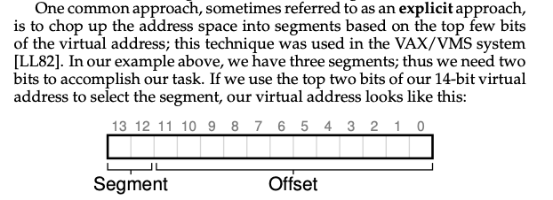
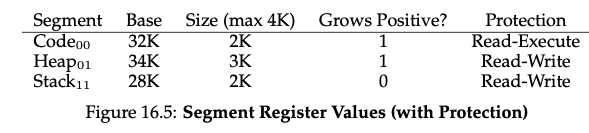

# Segmentation

- Summary
  - Segmentation helps us build a more effective virtualization of memory
    - Fast
    - Enable code sharing
    - Better support sparse address spaces
  - Cons
    - External fragmentation: allocate variable-sized segments chop up free memory into odd-sized pieces
    - Not flexible enough to support fully generalized, sparse address space
      - E.x. sparsely-used heap all in one logical segment, the entire heap must still reside in memory in order to be accessed
      - if our model of how the address space is being used doesn’t match how the segmentation has been designed, segmentation doesn’t work very well
- Instead of having just one base and bounds pair in MMU, have a base-and-bound pair per **logical segment** of the address space
- Three logically-different segments: code, stack, and heap
  - Only used memory is allocated space in physical memory
- The term segmentation fault or violation arises from a memory access on a segmented machine to an illegal address.
- How is it better?
  - Allows OS to place each one of those segments in different parts in physical memory
  - Avoid filling physical memory with unused virtual address space
- Large address spaces with large amounts of unused address space (**sparse address spaces**) can be accommodated

## 1: Explicit approach: chop up addr space into segments based on top few bits of vaddr

- 3 segments —> 2 bits
- (01): which segment, bottom 12 bits: offset into the segment (easier for bound checking)
- Issues
  - One bit unused: some system also put code in the same segment as the heap (one bit)
  - Limits use of address space: each segment is limited to a maximum size
- 
- The next 12 bits will be the offset into the segment.
- If a running program wishes to grow a segment (say the heap, or the stack) beyond that maximum, the program is out of luck.

## #2: Implicit approach: hardware determines the segment by noticing how the address was formed

- addr generated from PC (i.e. instruction fetch), then the addr is within code segment
- addr based off of the stack or base pointer, then it is in stack segment

### What about the stack under segmentation?

- stack grows backward (towards lower addresses)
- hardware support: a bit to know which way it grows
  

### Support for sharing

- Idea: share certain memory segments between address space (i.e. code sharing)
- hardware support: `protection bits`
  - few bits per segment: R/W/Execute permission

### Fine-grained v.s Coarse-grained Segmentation

- Coarse-grained: a few segments like code, stack, heap
- Fine-grained: early systems, large # of smaller segments

  - Need **segment table** of some kind stored in memory
  - OS Support
- Context switch?

  - Segment registers must be saved and restored
- OS interaction when segments grow and shrink?

  - Heap expansion: update segment size
- Managing free space in physical memory?

  - **External fragmentation**
    - Solution: compact physical memory by rearranging existing segments (i.e. stop process, copy data, change register value, etc.)
    - Solution: free-list management algorithm (e.x. best-fit, worst-fit, first-fit, buddy algorithm)
  - Compaction.
    - But this is expensive.
