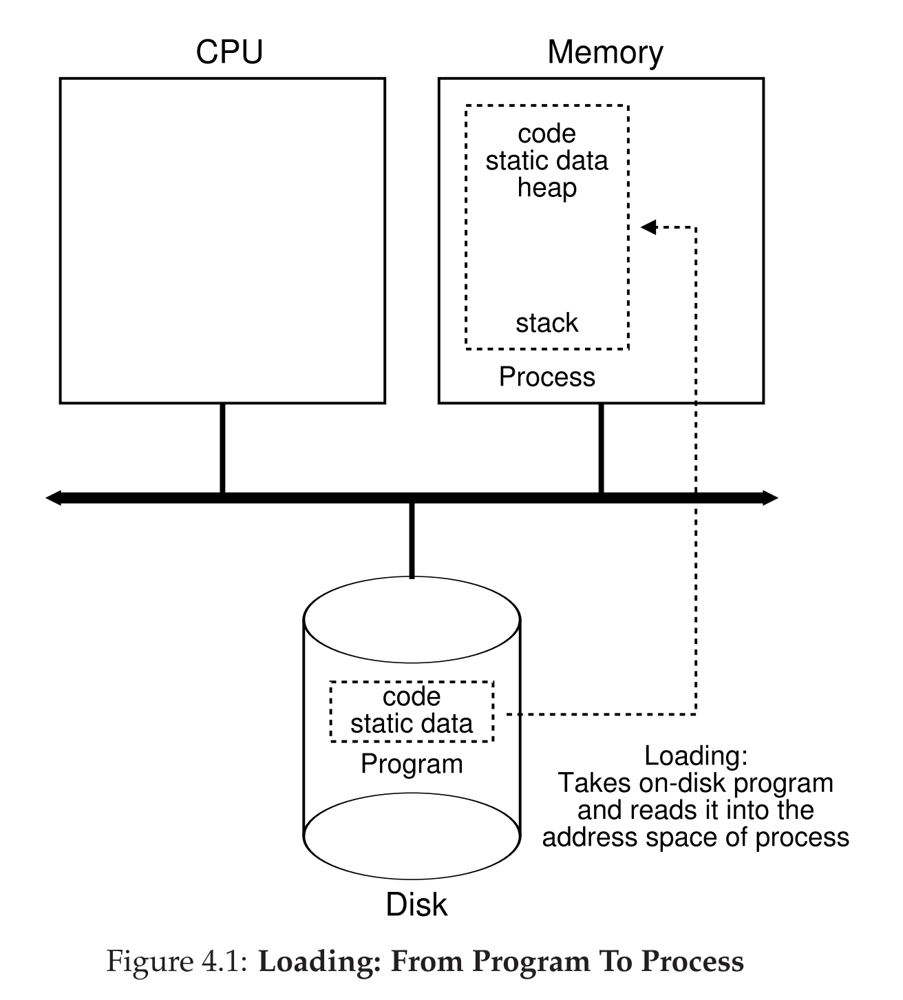

# Process

- Process

  - Contents of memory is in its address space.
  - Contents of CPU registers (including the program counter and stack pointer).
    - program counter (PC), or instruction pointer (IP): which instruction will execute next
    - stack pointer & frame pointer: manage the stack for function parameters, local variables, and return addresses
    - Stack pointer: tracks the top of the stack in memory
    - Frame pointer: points to a fixed location within the stack frame of the current function. The stack frame contains the function’s local variables, parameters, and return address.
      - Redundant (can just use stack pointer + offset? save one extra register. )
  - Information about I/O.
    - persistent storage devices: I/O information for a list of files the process currently has open
- Process API:

  - Calls programs can make related to processes: creation, destruction, etc.
  - Create
  - Destroy
  - Wait
  - Miscellaneous Control (Suspend and resume)
  - Status
- Process states:

  - Running, ready-to-run, blocked
- Process List:

  - Information about all processes that are ready and some additional information to track which process is currently running.
  - Each entry of the list is found in what is sometimes called Process Control block (PCB).
- Process —> a running program

  - **Sits** on a disk (with instructions, static data) in some kind of executable format.
- Operating system —> takes these bytes and gets them running

  - Makes the system easy to use, never concern with whether CPU is available
- Virutualizing CPUs

  - Mechanism: time sharing and context switch

## Process Creation

* 

- In early (or simple) operating systems, the loading process is done eagerly, i.e., all at once before running the program;
- Lazy loading: loading pieces of code or data only as they are needed during program execution (i.e. paging, swapping)
- Before running the process: allocate memory for the program’s run-time stack (C programs use the stack for local variables, function parameters, and return addresses), also for the program’s heap (for explicitly requested dynamically-allocated data; other initialization related to I/O )In Unix systems, each process by default has three open file descriptors, for standard input, output, and error [stored in heap.]
- Start the program at the entry point: main() routine, OS transfers control of CPU to the process, begin execution

## Process States

- Running: running on a processor
- Ready: ready to run but OS has chosen not to run it at the moment
- Blocked: the process has performed some kind of operation that makes it not ready to run until some other event takes place (i.e. I/O request)
- Being moved from ready to running means the process has been scheduled; being moved from running to ready means the process has been descheduled.
- Once a process has become blocked (e.g., by initiating an I/O operation), the OS will keep it as such until some event occurs (e.g., I/O completion); at that point, the process moves to the ready state again (and potentially immediately to running again, if the OS so decides).
- These need a OS scheduler.
- 

- Register context: hold the contents of its registers; when the process is stopped, its registers will be saved to this memory location
- Zombie: when the process has exited but has not yet been cleaned up
- When finished, the parent will make one final call (e.g., `wait()`) to wait for the completion of the child, and to also indicate to the OS that it can clean up any relevant data structures that referred to the now-extinct process.

## What OS tracks about a process

- Register context will hold, for a stopped process, the contents of its registers. When a process is stopped, its registers will be saved to this memory location; by restoring these registers (i.e., placing their values back into the actual physical registers), the OS can resume running the process.
