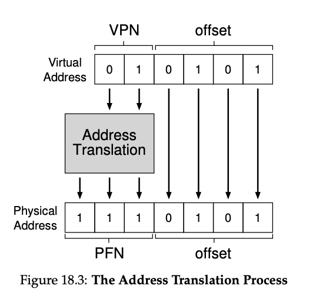

# Paging

- Paging: a new solution to virtualizing memory
  - Correspondingly, we view physical memory as an array of fixed-sized slots called page frames; each of these frames can contain a single virtual-memory page.
- Pros
  - Does not lead to external fragmentation, as it divides memory into fixed-sized units
  - Quite flexible: enable sparse use of virtual addr space
- Cons
  - Slower machine: many extra memory accesses
  - Memory waste: memory filled with page tables instead of useful application data
- OS takes two approaches to deal with space-management
  - Variable-sized pieces: segmentation
    - Cons: space can become fragmented, allocation challenging
  - Fixed-sized pieces: paging
    - Fixed-size unit: **page**
    - Physical memory is an array of fixed-sized slots called **page frames**
- Challenge
  - How can we virtualize memory with pages, so as to avoid the problems of segmentation?
  - What are the basic techniques?
  - How do we make those techniques work well, with minimal space and time overheads?
- **Page table**
  - **Per-process data structure** to record where each virtual page of the address space is placed in physical memory.
  - **VPN:** virtual page number
  - **Offset:** within the page
  - Page table register (PTBR): contain physical address of starting loc of PT
  - Address of page table entry: PTE = PTBR + (VPN * sizeof(PTE))

## Where are page tables stored?

- Page tables can be bigger than small segment tables or base / bounds pairs
- Too large, not store in on-chip hardware in the MMU
- Store in memory instead

MMU: stores the base and bound register; as well as TLB.

- **Linear page table**

  - Array
  - OS indexes the page by VPN, then lookup the page table entry (PTE) at that index to find the PFN
- PTE

  - ***Valid bit:*** indicate whether the particular translation is valid
    - E.x. unused space in-between (code, heap, stack) is invalid, will generate a trap to the OS that likely terminate the process
  - ***Protection bit:*** whether page could be read from, written to, or executed from
    - Accessing a page in a way not allowed will trap
  - ***Present bit:*** whether this page is in physical memory or on disk (i.e. it has been swapped out)
    - E.x. swap parts of addr space to disk to support addr space larger than physical memory
    - Actually no separate valid and present bit, just valid bit
      - P = 0, might be valid or not, then OS use additional structure
  - ***Dirty bit:*** whether the page has been modified since it was brought to memory
  - ***Reference bit:*** track whether a page has been accessed
    - Useful in determine which pages are popular in page replacement
- we can now index our page table and find which physical frame virtual page 1 resides within. In the page table above the physical frame number (PFN) (also sometimes called the physical page number or PPN) is 7 (binary 111).

  - 
- Solution #2: **page + segments**
- - Problem: most of the page table unused, full of invalid entries (e.x. between stack and heap)
  - Approach: one page table per logical segment
    - E.x. code, heap, stack
    - Have base and bound registers in MMU
      - Base: holds physical address of page table
      - Bound: holds the end of page table
- The page directory, in a simple two-level table, contains one entry per page of the page table

  - Page directory entries (PDE)
    - Has a **valid bit** and a **page frame number**
    - Valid bit: if PDE is valid, it means that at least one of the pages of the page table that entry points to (via the PFN) is valid
- Page Fault
-     ***Page fault handler***- **Page fault:** hen the HW looks in the PTE, it may find that page is *not present* in physical memory

  - Upon page fault, **OS is invoked with page-fault handler**
    - Find the page, do I/O from swap space (i.e. reserved space on the disk for moving pages back and forth)
    - Update page table to mark page as present, record in memory location of the new-fetched page, retry

## Advanced

- Trade-off in time and space
- Memory-constrained system: small structures make sense

  - V.s. system with large memory and workloads that use large number of pages, bigger table that speeds up TLB misses might be the right choice
- Array-based (linear) page tables are too big, taking up too much memory on typical systems
- Problem: **internal fragmentation**

  - Bigger page leads to waste within each page
  - Most system use relatively small page size in common case: 4KB (as in x86), 8KB (as in SPARCv9)

### Multi-level Page Tables

- Turns the linear page table to something like a tree
- Many modern systems employ it
- Basic idea
  - Chop up the page table into page-sized units
  - If an entire page of page-table entries (PTEs) is invalid, don’t allocate that page of the page table at all
  - Use **page directory**: track whether a page of the page table is valid
    - Either tell you where a page of the page table is
    - Or that entire page of the page table contains no valid page
- Pros
  - Only allocate page-table space in proportion to the amount of addr space you are using, generally compact
  - If carefully constructed, each portion of the page table fits neatly within a page, making it easier to manage memory
    - V.s. linear page table, page table reside contiguously in physical memory
    - Here
      - Add level of indirection through page directory, which points to pieces of page table
      - Allow us to place page-table pages wherever we like in physical memory
- Cons
  - On TLB miss, two loads from memory will be required to get the right translation info from page table
    - One to page directory, one to PTE
    - V.s. linear page table: one load
    - **Time-space trade-off**
      - I.e. we want smaller tables, but not for free
      - TLB miss suffers from higher cost with smaller table
  - Complexity
    - Page-table lookups more complicated in order to save valuable memory
- 

### Inverted Page Tables

- Instead of having many page tables (one per process), keep a single page table that has an entry for each physical page in the system
  - Tell us which process is using the page, which virtual page of process maps to that physical page
- Finding the correct entry?
  - Linear scan: expensive
  - Hash table lookup

### Linear Page Table vs. Multi-level Page Table

### TLB

***Translation-lookaside buffer (TLB)***- Part of the chip’s  MMU

- Simply a hardware cache of popular virtual-to-physical address translation
- Maintain virtual-to-physical translations that are only valid for the current running process
  - Flush on context switches
- Can be software-managed or hardware-managed
  - Software-managed: HW raises exception on TLB miss, jumps to kernel trap handler

### VAX / VMS second-chance list

Problem addressed:

1) no reference bit
2) memory hogs can happen (i.e. programs use a lot of memory and make it hard for other programs to run)

Key features (approximate LRU):

1. Resident set size (RSS): each process allocated a fixed # of page frames, pages are managed in FIFO
2. Two second-chance list: before completely evicting a page from memory, it is put into two second chance list

- 1) clean-page free list: hold pages that have not been modified since they were last loaded
- 2) dirty-page list: modified

When a process exceeds RSS:

1. the oldest page is taken from process’s FIFO list
2. if clean, placed at clean-page list, if dirty, go to dirty-page list

When a process need to add a new page

1. first look at free page from clean list
2. if process faults on a page that was moved to one of the second-chance list, it can reclaim it, avoid disk access

### NRU

* Approximate LRU with efficient implementation
* Clock algorithm: replace page that is “old enough”
* Hardware
  * Keep use (or reference) bit for each page frame
  * When page is referenced: set use bit
* Operating System (page replacement)
  - Keep pointer to last examined page frame
  - Traverse pages in circular buffer
  - Clear use bits as we search
  - Stop when find page with already cleared use bit, replace this page

### Belady's Anomaly

* FIFO
* Second-chance algorithm.
