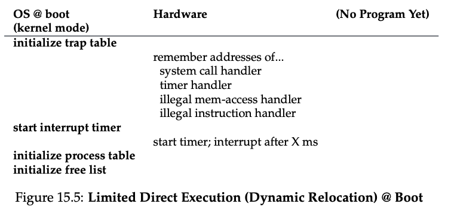
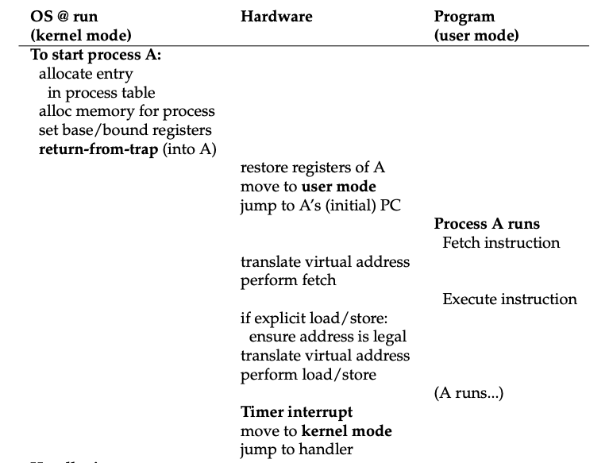
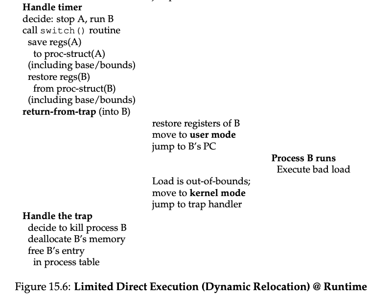

# Address Translation

- Efficiency: hardware support to perform translation quickly for each access, base-and-bounds relocation 
  - Hardware-based address translation (or just address translation)
    - on each and every memory reference, an address translation is performed by the hardware to redirect application memory references to their actual locations in memory.
- Transparent: to process that has been relocated 
- Protection: base-and-bounds, OS + hardware combine to ensure protection 
- Some inefficiency of base-and-bounds
  - Internal fragmentation (space inside the allocated unit is not all used)
    - restricted to placing an address space in a fixed-sized slot and thus internal fragmentation can arise
  - Slight generalization of base and bounds: segmentation (next) 
- Virtualizing CPU mechanism: limited direct execution (LDE) 
  - Idea: let the program run directly on the hardware, but at certain key points in time (i.e. system calls, timer interrupt), arrange so that OS gets involved and makes “right” thing happens 
- Efficiency: need hardware support 
  - TLBs, page-table support 
- *Control*: ensure that no application is allowed to access any memory but its own
- *Flexibility*: able to use their address space in whatever way they would like
- General approach: **hardware-based address translation**
    - Hardware transforms each memory access (e.g. instruction fetch, load, or store), changing the **virtual address** provided by the instruction to a **physical address** where the desired information is actually located
- Assumptions:
  - User’s address space must be placed contiguously in physical memory
  - The size of the address space is less than the size of physical memory
  - Each address space is exactly the same size
- Dynamic (Hardware-based) Relocation 
  - this is called 'Dynamic Relation' or 'Base and Bounds'.
  - relocation of the address happens at runtime, and because we can move address spaces even after the process has started running, the technique is often referred to as dynamic relocation
  - Need two hardware registers within each CPU
    - Hardware structures kept on the chip (one pair per CPU)
        - The part of the processor that helps with address translation: **memory management unit (MMU)**
    - **Base** register
        - Translation
    - **Bounds** (or limit) register
        - Protection: “size” of the address space, and physical address of the end of address space
    - **Base and bounds**
        - Place the address space anywhere we like in physical memory
        - While ensure each process can only access its own address space
  - Memory reference is translated by the processor in this manner: `physical address = virtual address + base`
    - **Virtual address**: memory reference generated by the process
    - **Physical address**: the result of hardware in turn adds the contents of the base register to this address
  - CPU is able to generate exceptions when user program tries to access memory illegally —> arrange for OS exception handler to run 
    - in this case, the CPU should stop executing the user program and arrange for the OS “out-of-bounds” exception handler to run.
    - Similarly, if a user program tries to change the values of the (privileged) base and bounds registers, the CPU should raise an exception and run the “tried to execute a privileged operation while in user mode” handler.
  - Specifically, the processor will first check that the memory reference is within bounds to make sure it is legal; in the simple example above, the bounds register would always be set to 16 KB. If a process generates a virtual address that is greater than (or equal to) the bounds, or one that is negative, the CPU will raise an exception, and the process will likely be terminated. 
  - The hardware should provide special instructions to modify the base and bounds registers, allowing the OS to change them when different processes run. These instructions are privileged; only in kernel (or priv- ileged) mode can the registers be modified. 
  - When a new process is created, the OS will have to search a data structure (often called a free list) to find room for the new address space and then mark it used.
  - Thus, the OS must save and restore the base-and-bounds pair when it switches be- tween processes.
    -  Specifically, when the OS decides to stop running a pro- cess, it must save the values of the base and bounds registers to memory, in some per-process structure such as the process structure or process control block (PCB).
    -  To move a process’s address space, the OS first deschedules the process; then, the OS copies the address space from the current location to the new location; finally, the OS updates the saved base register (in the process structure) to point to the new location.
 -  
 -  A generalization of base-and-bound is segmentation. 
 -  
 -  