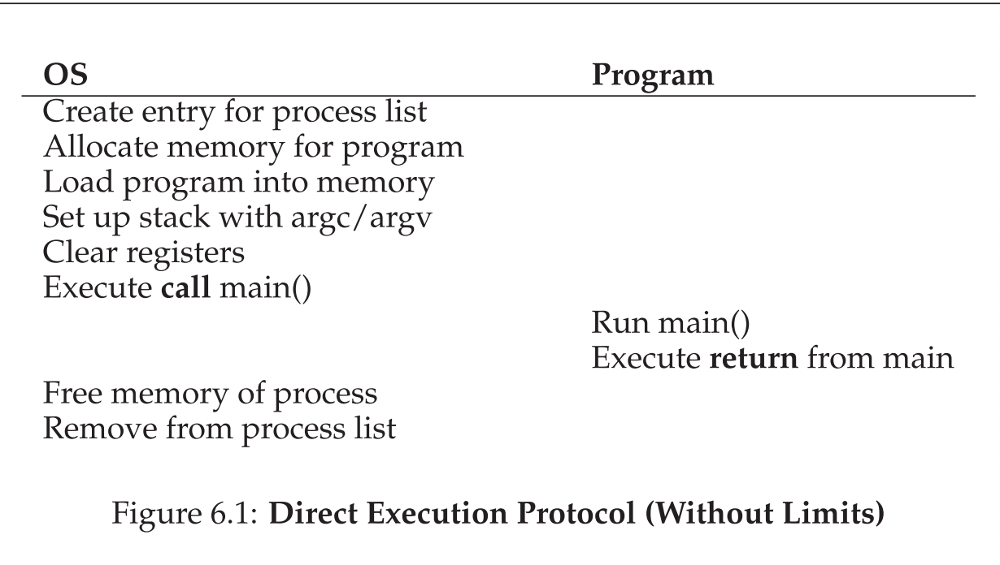

# Limited Directed Execution

- The CPU should support at least two modes of execution: a re-
stricted user mode and a privileged (non-restricted) kernel mode.
- Typical user applications run in user mode, and use a system call to trap into the kernel to request operating system services.
- The trap instruction saves register state carefully,changesthehard- ware status to kernel mode, and jumps into the OS to a pre-specified destination: the trap table
- When the OS finishes servicing a system call, it returns to the user program via another special return-from-trap instruction, which reduces privilege and returns control to the instruction after the trap that jumped into the OS.
- The trap tables must be set up by the OS at boot time, and make sure that they cannot be readily modified by user programs. All of this is part of the limited direct execution protocol which runs programs efficiently but without loss of OS control.
  - The kernel does so by setting up a trap table at boot time. When the machine boots up, it does so in privileged (kernel) mode, and thus is free to configure machine hardware as need be. One of the first things the OS thus does is to tell the hardware what code to run when certain excep- tional events occur. For example, what code should run when a hard- disk interrupt takes place. The OS informs the hardware of the locations of these trap handlers, usually with some kind of special in- struction.
- Once a program is running,theOSmustusehardwaremechanisms to ensure the user program does not run forever, namely the timer interrupt. This approach is a non-cooperative approach to CPU scheduling.
- Sometimes the OS, during a timer interrupt or system call, might wish to switch from running the current process to a different one, a low-level technique known as a context switch.
- Trap Table:
  - Purpose: The trap table is used to map different types of traps (such as interrupts, exceptions, and system calls) to their corresponding handler routines. These handlers are special functions that are executed when a specific trap occurs.
- Direct Execution Protocol (Without Limits)
  - **OS** Create entry for process list
  - **OS** Allocate memory for program 
  - **OS** Load program into memory 
  - **OS** Set up stack with argc/argv 
  - **OS** Clear registers
  - **OS** Execute call main()
  - **Program** Run main()
  - **Program** Execute return from main
  - **OS** Free memory of process
  - **OS** Remove from process list
  - 
- System call:
  - trap: jumps to the kernel and raises privileged level to kernel mode 
    - push the program counter, flag, and a few registers onto a per-process kernel stack 
    - trap table: set up at boot time 
  - return-from-trap: returns to user program, reduces privilege level back 
    - pop values off the stack and resume execution 
  - system-call number: assigned to each system call 
    - protection: user code cannot specify an exact address to jump to, but request service via number 
  - Switching Between Processes 
    - Cooperative Approach: wait for system calls 
      - the OS regains control of the CPU by waiting for a system call (e.g. Yield) or an illegal operation of some kind (divide by zero, or tries to access memory that it shouldn't have, generating a trap) to take place
      - These system calls often involve a yield system call. 
      - If a process gets stuck in an infinite loop, you can only reboot the machine. 
    - Non-Cooperative Approach: the OS takes control 
      - Use: timer interrupt and interrupt handler 
      - A timer device can be programmed to raise an interrupt every so many milliseconds; when the interrupt is raised, the currently running process is halted, and a pre-configured interrupt handler in the OS runs. At this point, the OS has regained control of the CPU, and thus can do what it pleases: stop the current process, and start a different one.
      - During boot time, the OS must inform the hardware of which code to run when the timer interrupt occurs; thus, at boot time, the OS does exactly that. Second, also during the boot sequence, the OS must start the timer, which is of course a privileged operation. Once the timer has begun, the OS can thus feel safe in that control will eventually be returned to it, and thus the OS is free to run user programs. 
    - Saving and restoring context 
      - Scheduler decision 
      - Context switch: save a few register values for current process (onto its kernel stack), and restore a few for the next process 
        - To save the context of the currently-running process, the OS will execute some low-level assembly code to save the general purpose regis- ters, PC, and the kernel stack pointer of the currently-running process, and then restore said registers, PC, and switch to the kernel stack for the soon-to-be-executing process.
  - Limited Direct Execution Protocol
  - 
    - Notice hardware handles saving and restoring registers from the kernel stack; moving to user/kernel model, jump to main or trap handler. 
  - Two types of register save / restore 
    - When timer interrupt occurs, user registers of the running process are implicitly saved by the **hardware**, using the kernel stack of that process 
    - Switch from A to B, the kernel registers are explicitly saved by the **software** (i.e. the OS), but this time into memory in the process structure of the process 
  - system call at the same time of timer interrupt? 
    - Topic of concurrency.
    - What happens if during interrupt or trap handling, another interrupt occurs.
    - one simple way: disable interrupt during interrupt processing 
  - Operating systems also have developed a number of sophisticated locking schemes to protect concurrent access to internal data structures. This enables multiple activities to be on-going within the kernel at the same time, particularly useful on multiprocessors.
  - While this sounds almost philosophical, it is a real problem: there is clearly no way for the OS to take an action if it is not running on the CPU

