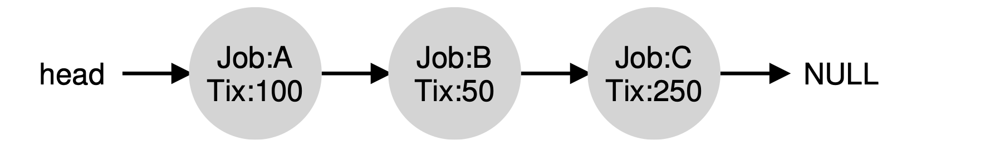
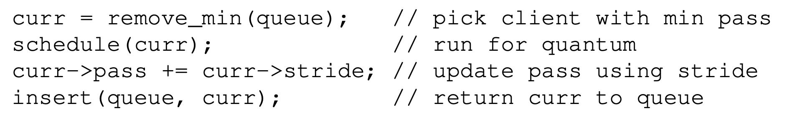

# Lottery Scheduling

- Instead of optimizing for turnaround or response time, scheduler might instead try to guarantee that each job obtain a certain percentage of CPU time 
  - Fairness!
- Lottery scheduling 
  - Every so often, hold a lottery to determine which process should get to run next 
  - Processes that should run more often should be given more chances to win the lottery 
- Basic Concept: Ticket Represent Your Share 
  - E.x. A has 75 tickets, B has only 25 —> 75% and 25% of the CPU 
- Randomness is good:
  - No worst case behavior
  - Lightweight
  - Random can be quite fast. 
- Ticket Mechanisms 
  - Ticket currency 
    - allows user with a set of tickets to allocate tickets among their jobs in whatever currency they would like 
    - system converts per-user currency into correct global value 
  - Ticket transfer 
    - A process can temporarily hand off its tickets to another process
    - E.x. client server setting, a client process sends a message to a server asking it to do some work on the client’s behalf 
  - Ticket inflation 
    - Temporarily raise or lower the # of tickets it owns 
    - Can be applied when group of processes trust one another (doesn't make sense in a non-trusting scenario)
  - Ticket assignment problem remains open 
  - 
    - We first have to pick a random number (the winner) from the total number of tickets (400). Let’s say we pick the number 300.
    - First, counter is incremented to 100 to ac- count for A’s tickets; because 100 is less than 300, the loop continues. Then counter would be updated to 150 (B’s tickets), still less than 300 and thus again we continue. Finally, counter is updated to 400 (clearly greater than 300), and thus we break out of the loop with current point- ing at C (the winner).
- Stride Scheduling
  - Deterministic fair-share scheduler 
  - Get exactly right at the end of each scheduling cycle 
  - Stride = G / # of tickets
  - Example
    - Process: A - 100 tickets, G = 10000, stride value for A = 100.
    - Keep track of each process’ **pass value** (every time process runs). Increment by its stride to track its global process.
    - Scheduler chooses process with **lowest** pass value
    - Increment chosen process’ pass value **by its stride**
    - 
  - Comparing lottery scheduling and stride scheduling, the benefit of lottery scheduling: no global state per process, we simply add a new process with whatever tickets it has, update the single global variable to track how many total tickets we have, and go from there. easier to incorporate new process 
- Linux Completely Fair Scheduler (CFS) 
  - vruntime: virtual runtime
  - As each process runs, it accumulates vruntime. In the most basic case, each process’s vruntime increases at the same rate, in proportion with physical (real) time. When a scheduling decision occurs, CFS will pick the process with the lowest vruntime to run next.
  - if CFS switches too often, fairness is increased, as CFS will ensure that each process receives its share of CPU even over miniscule time win- dows, but at the cost of performance (too much context switching); if CFS switches less often, performance is increased (reduced context switching), but at the cost of near-term fairness.
  - Control parameters
    - `sched_latency`: determine how long one process should run before switch (fair-share), 48 ms
        - Period of time where CFS should be fair
        - CFS divide the `sched_latency` by `n` (number of processes)
        - E.x. `n = 4`, then each process runs 12 ms
    -  `min_granularity`: around 6 ms; ensure that the time slot per proces is not too small.
  - CFS makes scheduling decision based on periodic time interrupts
      - Typically happens every 1 ms
  - CFS allows control over process priority, to give some process a higher share of the CPU; `nice` level of a process: weight, or priority
      - Positive: lower priority (too nice)
      - Negative: higher priority (less nice)
      - CFS maps the nice value (-20 to +19, negative weight implies a higher priority) of each process to a weight
      - Time slices are adjusted based on the weights and `sched_latency`
    - `vruntime` has to be adapted. scale actual runtime inversely by the weight of the process, by dividing the default weight by its weight. 
      - $vruntime_i = vruntime_i + \frac{weight_0}{weight_i} runtime_i$
  - Use red-black trees
    - Keep only running (or runnable) processes in this structure
    - Most operations (e.x. insertion and deletion) are logarithmic in time
    - Quickly find the job with the least `vruntime`.
  - Dealing with I/O and sleeping processes
    - Problem: if a process goes sleeping for long time, then it will monopolize CPU while it catches up.
      - As its `vruntime` will be very far behind
        - Solution: altering the `vruntime` when it wakes up to the minimum value found in the tree; jobs that sleep for short periods of time frequently do not ever get their fair share of CPU
  - Summary
    - Proportional-share scheduling: lottery scheduling, stride scheduling, CFS
        - Lottery: use randomness in clever way
        - Stride: deterministic
        - CFS: weighted round-robin with dynamic time slices, most widely used
    - Problems
        - do not mesh well with I/O
            - E.x. jobs that perform I/O occasionally may not get their fair share of CPU
        - hard problem for ticket or priority assignment