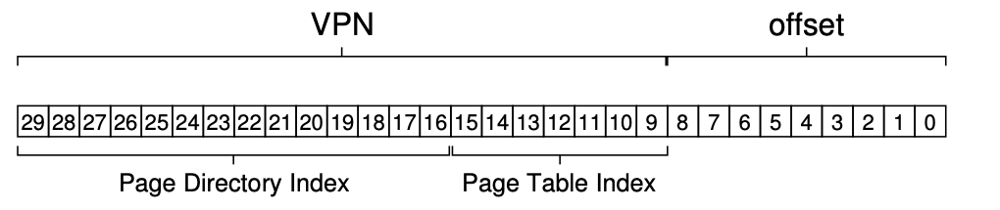

# Paging: Smaller Tables

- Trade-off in time and space
    - Bigger the table, faster a TLB miss can be service
    - Converse
- Memory-constrained system: small structures make sense
    - V.s. system with large memory and workloads that use large number of pages, bigger table that speeds up TLB misses might be the right choice
- Array-based (linear) page tables are too big, taking up too much memory on typical systems
- How can we make page tables smaller?
- What are the key ideas?
- What inefficiencies as a result of these new data structures?
- Problem: **internal fragmentation**
    - Big page leads to waste within each page
    - Most system use relatively small page size in common case: 4KB (as in x86), 8KB (as in SPARCv9)
- Hybrid approach: one page table per logical segment
    - Instead of having a single page table for the entire address space of that process
    - Three page tables: code, heap, stack
        - Have base and bound registers in MMU
        - But base holds the physical address of the page table
        - Bound holds the end of the page tables

### Multi-level Page Tables
- Turns the linear page table to something like a tree
- Many modern systems employ it
- Basic idea
    - Chop up the page table into page-sized units
    - If an entire page of page-table entries (PTEs) is invalid, don’t allocate that page of the page table at all
    - Use **page directory**: track whether a page of the page table is valid
        - Either tell you where a page of the page table is
        - Or that entire page of the page table contains no valid page
- Pros
    - Only allocate page-table space in proportion to the amount of addr space you are using, generally compact
    - If carefully constructed, each portion of the page table fits neatly within a page, making it easier to manage memory
        - V.s. linear page table, page table reside contiguously in physical memory
        - Here
            - Add level of indirection through page directory, which points to pieces of page table
            - Allow us to place page-table pages wherever we like in physical memory
- Cons
    - On TLB miss, two loads from memory will be required to get the right translation info from page table
        - One to page directory, one to PTE
        - V.s. linear page table: one load
        - **Time-space trade-off**
            - I.e. we want smaller tables, but not for free
            - TLB miss suffers from higher cost with smaller table
  - Complexity
      - Page-table lookups more complicated in order to save valuable memory
- 

### Inverted Page Tables

- Instead of having many page tables (one per process), keep a single page table that has an entry for each physical page in the system
    - Tell us which process is using the page, which virtual page of process maps to that physical page
- Finding the correct entry?
    - Linear scan: expensive
    - Hash table lookup